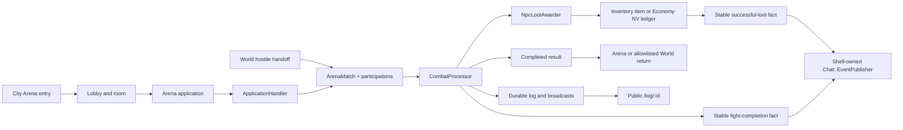

# frozen_string_literal: true
---
title: Arena Combat Runtime Feature
description: Implementation handbook for arena applications, shared player and NPC turn combat, combat presentation, completion, and public fight logs.
status: Fully Implemented
updated: 2026-09-08
owners: Arena and Combat
template: feature-v1
---

# Arena Combat Runtime

This document is the shipped implementation contract for the bounded Arena and
shared Fight runtime. It covers city-gated Arena entry, fight applications,
player/NPC match creation, server-authoritative turn resolution, the active
fight surface, explicit completion, and the shell-free public fight log.
Measurable desktop UI/UX parity and overall delivery completion are tracked in
the Combat Completion Matrix under Pillar 3 of
`doc/design/launch_mvp_plan.md`; this handbook's `Fully Implemented` status is
limited to its declared bounded runtime contract.

## 1. Design authority and related documents

Domain navigation: `doc/domains/combat.md`.

Neverlands is the sole game-design and presentation authority. The normalized
Arena contract lives in `doc/design/areas/arena.md`; turn rules live in
`doc/design/features/combat.md`; the measured active-fight and public-log
captures live in `doc/design/reference/shell/observations/2026-07-28_game_shell_and_mvp_surfaces.md`.
The current authenticated shield-profile flow lives in
`doc/design/reference/combat/observations/2026-08-26_wilderness_shield_npc_fight.md`.
The adjacent current `1x2` and passive `1x1` wilderness flows live in
`doc/design/reference/combat/observations/2026-08-26_wilderness_two_orc_group_fight.md`
and
`doc/design/reference/combat/observations/2026-08-26_wilderness_passive_goblin_fight.md`.
The current same-return-context variable-group and magic flow lives in
`doc/design/reference/combat/observations/2026-09-01_wilderness_bandit_group_variation_and_magic.md`.
The current swamp large-roster/search/timeout flow lives in
`doc/design/reference/combat/observations/2026-09-02_swamp_passive_rosters_search_and_timeout.md`.
The supplied mixed-chat fight/item/NV evidence lives in
`doc/design/reference/social/observations/2026-08-23_chat_game_event_timeline.md`.
The official ten-member NPC capacity and distinct Arena-room chat/presence
evidence live in
`doc/design/reference/social/observations/2026-09-07_cell_chat_and_presence_boundaries.md`.
The Combat Completion Matrix in `doc/design/launch_mvp_plan.md` is the
delivery-status authority; its bounded physical MVP is `DONE`, while full
Neverlands Combat is `EVIDENCE_NEEDED`. Physical `1x1` PvP, bounded physical
PvE `1x1`/`1xN`, `3x3` team synchronization, the captured fight-state UI, and
the public fight log have completed their local seeded/synthetic browser gates.

### 1.1 Cross-feature relationships

| Related feature | Relationship | Ownership and handoff |
|---|---|---|
| `doc/features/city.md` | Central Square exposes the current level-zero Arena hotspot and validates the building handoff. | City owns node availability and entry capability; Arena Combat owns lobby, applications, matches, and return after handoff. |
| `doc/features/game_shell.md` | Authenticated Arena and active fights render in the persistent game frame; the public log deliberately does not. Completed fights and successful NPC item/NV loot also supply player-facing facts to the shell timeline. | Arena Combat owns match/reward facts and stable producer identities. Game Shell owns shared framing, chat/event persistence and presentation, presence, and the public log's shell exclusion. |
| `doc/features/world.md` | A source-backed wilderness interruption creates a shared Arena match and supplies an allowlisted return context. | World owns encounter eligibility, creation handoff, and return destination; Arena Combat owns the match after creation and its finish result. |
| `doc/features/player_inventory.md` | Equipped items supply combat presentation/profile inputs, and successful NPC item loot can add a carried item. | Player Inventory owns equipment/item state, capacity, and item-award validation; Arena Combat owns combat wear/resolution, typed loot rolls, and publication of an item-found fact only after the inventory award succeeds. |
| `doc/features/character_progression.md` | Combat reads effective values and a completed eligible solo NPC fight may award capped XP. | Character Progression owns saved stats, formulas, experience, and level grants; Arena Combat owns match finalization, the idempotent award call, and publication of the actual awarded amount as a shell feedback fact. |
| `doc/features/shop_economy.md` | Successful NPC currency loot credits the same persisted NV wallet used by Shop transactions. | Shop and Economy own `CurrencyWallet`, `CurrencyTransaction`, and adjustment invariants; Arena Combat owns typed loot eligibility, a per-NPC resolution marker, and source metadata passed to the wallet credit. |

## 2. Feature summary

The player enters Arena through the City-owned arena hotspot, selects a room,
creates or accepts a compact fight application, and enters the shared match
runtime. Player-versus-player applications use a short start countdown; an
eligible NPC training application starts immediately. Wilderness NPC fights
use the same match, participation, turn, result, and log records. A persisted
same-cell hostile can also interrupt the outdoor surface through World's
server-authoritative passive check. World persists the coordinate/NPC-
fingerprinted due time and returns only the remaining delay; the browser never
submits an NPC id, coordinate, timer, roster, group size, or encounter roll. An
evidenced variable cell can select one complete persisted roster sample and
captured delay window; fixed cells retain their explicit composition.

During a live fight the authenticated player sees two equipment-style fighter
rails and a fluid center composer. The center shows the AP budget and the
profile's `5..N` per-magical-hit mana ceiling, five action slots, attack and
block selectors, Turn/reset controls, the selected opponent, and the
chronological combat log. The server separately validates both the ceiling and
current MP, plus participant, target, action catalog, AP, body parts, current
match state, posted round, and timeout. In a multi-opponent fight, Switch
opponent cycles through living enemy participations; an accepted pending turn
retains that target through waiting-state reload. Completion
requires the participant to finish the result before the stored Arena or World
destination is restored. Match finalization publishes one recipient-only fight
completion row per player participation, including actual awarded NPC XP where
applicable. Each defeated NPC resolves its typed loot table once: consumables,
weapons, armor, and other item templates persist through Inventory, NV awards
persist through the Economy wallet ledger, and each success publishes the
matching item- or money-found row. All appear in the persistent shell chat
timeline.

Every fight also has `/log/:id`: a public, shell-free, paginated chronological
log with team-colored names, participant totals, and an optional statistics or
JSON representation.

## 3. MVP goals and non-goals

### Goals

- Keep Arena entry and applications server-gated and room-aware.
- Use one turn processor for player, team, Arena NPC, and wilderness NPC fights.
- Preserve captured AP, attack, block, target, timeout, surrender, and result
  semantics without trusting the browser preview.
- Render the captured desktop fight hierarchy and adapt it at tablet/mobile
  widths without introducing horizontal page overflow.
- Keep durable public logs readable outside the authenticated game shell.
- Project completed-fight and successfully awarded item/NV facts into the
  shell-owned mixed chat timeline without replacing the canonical fight log.
- Preload participant, NPC, inventory, item, and template records required by
  the active fight renderer.

### Non-goals

- Copying Neverlands equipment art, icons, logos, crests, ornamental frames,
  branding, administration text, or project/service prose into runtime UI.
- Claiming uncaptured active-fight variants or public-log behavior beyond the
  bounded states verified with project-owned presentation primitives.
- Inventing uncaptured spells, items, arena rooms, fight kinds, group rules,
  rewards, or AI behavior.
- Assigning the observed `24 NV` result to a production NPC or inventing its
  drop probability before Neverlands evidence identifies those facts.
- Treating CSS geometry, selected options, displayed AP, or Stimulus state as
  permission to mutate combat.
- Replacing server-rendered Rails/Hotwire surfaces with a client game engine.
- Declaring unobserved combat variants or source artwork 1:1 from the bounded
  waiting, timeout, multi-target, completed, and public-log acceptance set.

## 4. Player experience

### 4.1 Entry conditions

Arena lobby, room, application, and participant actions require Devise
authentication and a current playable character. The Arena entry gate accepts
a City-established entry marker for the current city zone or a valid persisted
selected room, after rechecking the active Arena hotspot and character access.
An already active Arena match retains its existing gate bypass and redirect.
Creating or accepting an application also rechecks room access, capacity,
level/alignment rules, HP threshold, active application, and combat state.

`CityHotspotService` calls `ResumeContext#remember_arena_entry!` within the
accepted building action's character/target transaction. That method validates
current Arena availability, stores the integer `arena_entry_zone_id` in the
existing Character metadata, and returns the zone id or nil when unavailable.
Repeated entry preserves an unchanged marker; a rolled-back city action leaves
none. `arena_entered?` checks this marker against fresh position and authored
building access. An older background response restoring a previous cookie
cannot undo a completed entry, and a cookie never grants Arena entry. This
marker does not select a room or change the initial lobby's World/chat context.

An authorized HTML room visit persists Character gameplay context
`arena_room` with the actual integer `room_id`. `ResumeContext#arena_room`
resolves that saved id against current city access, room activity, level and
alignment, and the room's optional city `zone_id`; existing unbound rooms remain
available through authorized city Arena entry. `remember_arena_room!(room:)`
reloads and validates the target under the character lock, rejects an active
fight, then saves the context and local-chat audience together. It returns the
fresh room or nil without changing context. Repeating the same visit preserves
the audience entry time. Room JSON previews never select a location.
Lobby room lists include only current-city and existing unbound rooms.
`ArenaRoom#accessible_by?` owns that optional region boundary for room pages,
application lists, creation, and player/NPC acceptance, so submitting a known
room or application id cannot bypass it.

Fresh login restores a valid selected room without requiring the old city
entry cookie; stale, missing, malformed, inaccessible, or foreign-city bound
room contexts fall back to World. The generic lobby retains an accessible
selected room and does not invent an initial or level-derived room selection.
Actual world-coordinate or city-node transitions atomically clear the previous
room context before committing the new position, including for unbound rooms.
Actual room changes drive the shared room-specific presence and local-chat
partition; the lobby and room views refresh presence after saving context.
Both summary-table and Room Map Enter links target the full shell with
`data-turbo-frame="_top"`, so the surrounding room label, count, and player
list update immediately even when automatic presence refresh is disabled.
Room names are presentation labels; the saved room id and persisted city/cell
define the audience. Shell limits presence to recent open sessions and each
user's playable character, with a bounded list and full room count. Its
technical liveness window does not claim a captured Neverlands expiry.

The public fight log requires only a valid match ID and always uses the minimal
application layout, including when an authenticated session exists.

### 4.2 Primary surface

At desktop widths the active fight is a full-width three-zone composition:
fixed equipment-style participant rails on the left and right, and a flexible
center composer/log. Name, level, HP/MP, equipment silhouette, and visible
opponent stats stay attached to the owning rail. The center orders the budget,
five quick slots, two selector columns, Turn/reset controls, target/HP line,
and chronological log as observed in the clearer Neverlands capture.

At `721..940px`, participant rails compact while the center remains fluid. At
`<=720px`, both rails share the first row and the center occupies the full row
below them. At `<=420px`, paper dolls scale further. Controls keep native
semantics, text remains readable, and the page itself does not overflow.

The public log uses a flat light field, source-like decorative header band,
gray time column, continuous messages, team-colored names, participant divider,
and plain pagination. It reflows at tablet and mobile widths.

### 4.3 Player actions and feedback

Attack and block selectors initially point to their first empty option and
show zero used AP. Reset restores that same state. Turn stays enabled, but the
browser performs only one of the four captured shapes: attack+block,
attack+action, block+action, or multiple attacks. A lone attack (including a
mana attack), block, or action and an over-budget package are local no-ops;
the composer displays the exact multi-attack penalty and an over-limit warning
without disabling Turn. Forged requests are rejected by the same server
validator. The rendered composer submits a normal CSRF-protected Rails form;
the controller normalizes both browser-indexed fields and JSON arrays into the
same processor input. HTTP and Action Cable accept only complete `turn` or
`surrender` player intents; direct `attack` and `defend` calls remain internal
resolution primitives and cannot bypass turn-shape validation. PvP participants
may wait for the opposing submitted turn; eligible
waiting participants can claim a timeout victory or an explicit draw after
expiry; accepting a draw never falls back to an HP-based winner. A live
participant may surrender. Every accepted action appends durable log entries.
The resulting redirect renders authoritative waiting, next-round, or result
state; Action Cable and bounded polling accelerate reconciliation without
becoming mutation authority.

For player/team fights, every living player participation must have one pending
turn for the authoritative current round before resolution starts. The match
lock rechecks live state, participant life, and the posted round before storing
the package. The first participants therefore wait, the final required package
releases exactly one shared resolution, and a stale replay cannot become a turn
for the next round. Allied, foreign-match, and defeated targets are rejected;
opponent switching uses only living enemy participation IDs.

Successful NPC item and NV awards create recipient-only item- or money-found
rows only after Inventory or wallet-ledger persistence. Finalization
creates one recipient-only fight-completion row for every player participation;
the eligible NPC winner receives the authoritative awarded XP amount and other
participants receive zero. These rows are durable feedback projections and do
not affect match resolution or reward authority.

Validation failures preserve authoritative state and return alert feedback or
an unprocessable HTML/Turbo/JSON response. The client AP counter is preview
only; the processor calculates and rechecks the submitted package.

In a solo-PvE match, one complete player package resolves immediately with all
living opposing NPC responses. If an opponent survives, the locked processor
opens exactly one next round, clears round-local block state, restores the
player's full snapshotted AP budget, and rejects a replay carrying the resolved
round number. Defeated targets cannot remain selected: an omitted or stale
target falls back to a living opponent. Raw overkill remains in the log while
participation/result damage counts only HP actually removed.

A World-created fight snapshots the source-displayed `300`-second global fight
deadline. Match views, timeout jobs, turn submissions, and timeout claims
recheck that deadline; at or after it the match finalizes as a draw by timeout
before another intent can advance the round or claim a victory. Other match
types retain their existing per-turn timeout and stale-recovery rules.

### 4.4 Exit and integration behavior

Live participants remain in combat. When the match completes, idempotent
Finish records that the participant viewed the result, clears the character
combat flag, and performs a full-page return through the Arena entry gate so a
Turbo frame cannot retain stale fight content. A World-created match resolves
only the World-authored allowlisted Character, Inventory, or World destination;
invalid metadata falls back to World. Public-log navigation never changes match
state.

## 5. Feature topology and authored content

The shipped topology is:

- Arena lobby and source-backed room ladder;
- room-local applications in `open`, `matched`, `started`, `expired`, or
  `cancelled` states;
- matches in `pending`, `matching`, `live`, `completed`, or `cancelled` states;
- player and NPC participations assigned to named teams;
- ordered durable combat-log entries;
- shell-owned immutable gameplay-event projections for successful item/NV loot and
  player fight completion;
- configured Arena and wilderness NPC templates;
- public log/statistics projection over the durable match.

### 5.1 Coordinate, key, or identity terminology

- **Arena room ID** — persisted room and access boundary.
- **Application ID** — persisted offer identity, never a client capability.
- **Match ID** — shared combat and public-log identity.
- **Participation ID** — player or NPC membership in one match.
- **Team** — persisted side key such as `a` or `b`.
- **Action key** — allowlisted `combat_actions.yml` catalog identity.
- **Return context** — World-authored logical destination metadata, never a URL.

## 6. Feature surfaces and contained behavior

### 6.1 Implementation status

| Surface or behavior | Entry point | Runtime status | Owning implementation |
|---|---|---|---|
| Arena lobby and rooms | `GET /arena`, `/arena/lobby`, `/arena_rooms/:id` | Interactive | Arena controllers, room/application views |
| Application create/accept/cancel | Nested and member application routes | Interactive | `Arena::ApplicationHandler` plus models/controllers |
| Active shared fight | `GET /arena_matches/:id` | Interactive | Match controller, processor, fight views/Stimulus/CSS |
| Turn/timeout/finish | Match member POST routes | Interactive | Policy, controller, combat processor, return context |
| Passive wilderness handoff | `POST /world/encounter_check` | Interactive on outdoor World only | World-owned authority/check; shared Arena match after creation |
| Incremental match log | `GET /arena_matches/:id/log` | Authenticated HTML/JSON | Presenter and match controller |
| Public durable log | `GET /log/:id` | Public HTML/JSON | Public controller/helper/view and statistics service |
| Recipient chat feedback | Successful NPC item/NV loot and match finalization | Durable/streamed projection | Arena producer facts through injected `Chat::EventPublisher`; Game Shell owns storage/rendering |
| Captured bounded fight UI states | Launch parity matrix | Browser-verified | Fight views/Stimulus/CSS plus request/system acceptance matrix |

### 6.2 Arena applications and match start

`Arena::ApplicationHandler` owns player application creation, acceptance,
cancellation, transactionally-created matches/participations, countdown jobs,
and broadcasts. NPC applications use the same visible list and validation but
enter the shared fight immediately after an accepted open side.

Creation locks the room and applicant; player acceptance locks the room,
application, and both characters in stable order, then rechecks access,
capacity, active application, active match, and combat state. Duplicate or
competing acceptance cannot create another match. Cancellation locks and
reloads the application before checking owner/open state, so a stale cancel
cannot overwrite a competing acceptance; its room event is published only
after commit. Both application rows stay
linked to the match, transition from `matched` to `started` through the shared
match-start path, and stop blocking replay as soon as their match is complete.
The normal PvP start delay is ten seconds. The delayed start is enqueued after
commit, and a participant loading a due pending match recovers the same start
transition if the worker was unavailable.

NPC acceptance locks its room, application, and accepting character in that
order inside the existing transaction. It reloads access, application status,
and combat state there before creating the immediate fight, so a moved
character, changed room, or duplicate stale acceptance cannot bypass the
region check or create another match. Player acceptance retains its existing
stable ordering for both character locks.

The PvP `match_created` live update is room-scoped and includes both persisted
participant character IDs. A participant still viewing that Arena room starts
the countdown and redirects; there is no parallel per-user toast/notification
stream. An applicant waiting on the Arena index or another page reconciles from
the persisted active match on the next Arena navigation. The HTTP acceptor
redirect and persisted match remain authoritative even if Action Cable is
disconnected. Player and NPC room broadcasts register through
`ActiveRecord.after_all_transactions_commit`, so rolled-back match creation is
never announced. `Arena::RealtimePublisher` contains broadcast failures,
records a bounded secret-safe warning, and never converts an already-valid
database transition into an HTTP failure.

### 6.3 Turn combat and completion

World-created combat reaches the shared runtime through
`Game::World::EncounterRosterSelector` and `StartNpcFight`. The selector either
repeats a fixed anchor template or chooses one complete captured roster sample
through injected/server RNG, failing closed when a referenced persisted NPC
template or combat parameter is unavailable. Start persists the selected sample
and member identities, creates ordered mixed/repeated NPC participations with
per-member level/HP overrides, and carries explicit encounter XP/risk plus the
repeatable-source flag and five-minute fight deadline into the match. On final
NPC defeat, the processor preserves a sampled anchor for a later same-cell
schedule while fixed anchors retain their defeated/respawn lifecycle.

`Arena::CombatProcessor` owns profile preparation, AP/MP validation, attacks,
blocks, skills, seeded resolution, NPC responses, surrender, timeout claim,
match completion, participation results, equipment wear, reward finalization,
log recording, and delegation of each defeated NPC's loot table to
`Arena::NpcLootAwarder`. The awarder accepts typed `item` and `currency`
entries, requires an explicit validated probability through `Game::LootEntry`,
rolls with the injected RNG, locks the recipient character before NPC/player
participations and Inventory/wallet rows, and records
one `loot_resolution` marker per NPC participation. It persists item awards
through the Inventory manager's locked savepoint or NV through
`CurrencyWallet#adjust!` and publishes the corresponding event inside the same
outer transaction. Failed capacity or invalid-entry outcomes publish no success
row and cannot retain a partially filled item stack. Fight-completion
events are emitted under finalization before
the reward marker is committed; the surrounding transaction and stable keys
make retry safe. `finish` is a later presentation/result acknowledgement and
does not rerun rewards or publish another completion row.

The recipient-first reward lock order also matches the outdoor travel/Look
request guard. It prevents an Inventory request and a physical killing turn
from taking Character/Inventory locks in opposite order. It does not change
the loot table, probabilities, formulas, or reward amounts.

The HTTP controller and Action Cable channel call
`CombatProcessor#process_player_intent`, whose allowlist is `turn` and
`surrender`. The lower-level `process_action` attack/defend branches support
round and NPC resolution only. Both transports resolve an NPC target by its
match-local participation ID, so repeated templates in a 1×N fight remain
distinct. An omitted winner asks finalization to determine the surviving side;
an explicit `nil` is a draw. This distinction protects timeout-draw results
even when the two sides have unequal HP.

The shared start transition opens authoritative round `1`. Each later shared
resolution or empty-turn timeout advances once and enqueues one next timeout
check plus, when applicable, one warning. Queue failure is logged and cannot
roll back an already-persisted round transition. Timeout victory/draw still
requires the waiting participant's persisted turn and a server-expired timer.
Before that per-turn path, World-created matches enforce their explicit global
`300`-second deadline and finalize once rather than extending the fight.

Solo-NPC turns use the same processor under the match lock but resolve
immediately: one accepted player package, every living NPC response, and then
either finalization or exactly one fresh round with full player AP. The posted
round number is an optimistic stale-intent guard for both solo-NPC and
player/team turns; it is never authority for advancing the match.

`Arena::CombatProfile` snapshots each participant at fight start. Derived AP
is `80`, plus `10` at level `5`, another `10` at level `10`, and effective
Extra Action Points one-for-one; explicit captured match/participation values
override derivation. Physical attack seed remains profile-owned. The profile
also owns the displayed per-magical-hit mana ceiling and allowlists
source-injected Spirit Arrow/Mind Blast and magic block keys. Current MP is a
separate affordability constraint and is not substituted for that ceiling.

`Game::Combat::ActionCatalog` owns the exact normal and shield `40`, `70`, and
`90` selector tables. A shield item must author its table identity; family
alone does not infer a tier. `CombatProcessor` rechecks that every posted
attack/block key is present in the participant's profile and that posted block
coverage equals the canonical catalog coverage, so client-authored zones or a
different shield tier cannot change AP or protection.

`NpcExperienceAwarder` uses one configured NPC reward or an explicit
encounter-level total. The captured paired Plague Rat encounter stores `35` XP
for the whole fight and is not summed to `70`; uncaptured multi-NPC totals and
multi-player distribution fail closed. `EquipmentWearResolver` rolls each
equipped durable item at basis-point precision and applies Careful Fighter's
half chance, including `0.5%` after an arena defeat.

Solo NPC finalization increments the winning character's persisted `npc_wins`
metadata once per encounter inside the existing idempotent reward boundary.
It does not increment per defeated NPC and deliberately does not infer a
multi-player ownership/distribution rule. The completed fight surface renders
source-shaped Physical, Total, and awarded-XP columns from authoritative
participation and reward metadata. Physical and Total are currently the same
bounded physical bucket; uncaptured damage families are not invented.

### 6.4 Deferred behavior boundary

Unobserved fight variants, quest/reputation loot effects, the full Neverlands
spell/item action catalog, complete group/sacrifice rules, fatigue/mastery
coefficients, ordinary injury outcomes, the repair workshop transaction, and
uncaptured Arena-room presentation states
remain outside this bounded runtime contract. They must be observed before
implementation. Source artwork is documentation evidence and must not be
copied into runtime assets. The typed awarder is intentionally small: add a new
kind only when its authoritative owner and source behavior are captured. No
production NPC receives an invented NV entry from the supplied standalone row.
Neverlands now also confirms variable same-context groups (`1x3`, `1x1`,
`1x1`, then `1x2`), mixed bot identities/levels, two bounded exact-cell passive
idle intervals, and a later no-coordinate `1x7 -> 1x3`/`4..64`-second chain.
It still does not expose the complete eligible pool, selection weights,
encounter probability/cooldown/delay distribution, or its internal bot-storage
model. The local captured-sample replay must not be presented as those unknown
source rules.

The official NPC article establishes capacity for groups up to ten. The shared
`TileNpc`/config/selector limit is therefore `1..10`; the fight-start boundary
creates ten distinct opponent slots and rejects eleven without a partial
match. This does not enlarge any captured seeded roster or determine its
members, levels, rewards, probabilities, or selection formula.

## 7. Authoritative data and presentation model

| Record/component | Responsibility | Important contract |
|---|---|---|
| `ArenaRoom` | Access, level/alignment boundary, capacity | City-gated room authority |
| `ArenaApplication` | Offer parameters and lifecycle | Only eligible open applications can be accepted |
| `ArenaMatch` | Match state, per-turn/global timers, teams, return and selected-encounter metadata | Active state and the explicit World-fight deadline gate actions and completion |
| `ArenaParticipation` | Player/NPC side, result, combat metadata | Exactly one player character or NPC template; NPC level/HP may be snapshotted per captured roster member |
| `CombatLogEntry` | Ordered durable event | Source for active and public logs |
| `Arena::CombatProfile` | Persisted AP/cost/selector snapshot | Explicit captured values override exact AP derivation; reload cannot drift an active fight |
| `Game::Combat::ActionCatalog` | Attack and exact normal/shield/magic selector identities | Server owns costs, row placement, coverage, and profile availability |
| `Arena::NpcExperienceAwarder` | Bounded solo encounter XP | Explicit encounter total prevents guessed multi-NPC sums; level cap still applies |
| `Arena::EquipmentWearResolver` | Independent post-fight item wear | Exact result chances, one point maximum, Careful Fighter half chance, once-only finalization |
| `Arena::NpcLootAwarder` | One defeated NPC's typed loot resolution | Participation locks and `loot_resolution` marker make reward persistence retry-safe |
| `Game::LootEntry` | Shared typed-loot probability normalization | Chance is explicit and valid as `0..1` fraction or `0..100` percent |
| `Game::World::EncounterRosterSelector` | Fixed or captured-sample wilderness side selection | Server RNG selects one complete validated sample; unknown templates/parameters fail before match creation |
| `Game::Inventory::Manager` | Atomic item stack/mass addition | Inventory lock plus nested savepoint rolls back every unit when the complete quantity cannot fit |
| `GameEvent` / `Chat::EventPublisher` | Player-facing completion/item/NV projection | Owned by Game Shell; never combat or reward authority |
| `Character`/`InventoryItem` | Vitals, combat flag, equipment/wear/item ownership | Owned outside Arena; mutated only by server services |
| `CurrencyWallet` / `CurrencyTransaction` | Persisted NV balance and adjustment ledger | Owned by Shop and Economy; credited through its public wallet boundary |
| Stimulus/CSS | Composer preview and responsive presentation | Never authoritative |

### 7.1 Source of truth

Database records, the combat action catalog, configured NPCs, and server
services are authoritative. Rendered costs, select values, target IDs, timers,
equipment slots, and body geometry are untrusted intent/presentation.

### 7.2 Validation and state lifecycle

Applications validate room/access/rule values and expire on server time.
Acceptance creates the match and participations inside a transaction. Starting
persists combat profiles and marks player characters in combat. Turn processing
revalidates live state, participant, target, body parts, exact selector-table
availability and canonical block coverage, legal turn shape, AP, MP, and
defeat state. World start also validates complete roster size, member templates,
level/HP, encounter XP/risk, and delay bounds; its action boundary expires the
match at the global fight deadline before accepting intent. Transport
boundaries reject direct attack/defend player calls
and reject missing, allied, foreign-match, or defeated attack targets before
AP/MP consumption or pending-turn persistence. Match finalization locks the match so rewards/results are
written once. The same boundary publishes deterministic per-participation
completion keys; successful per-NPC loot awards use deterministic drop keys.
The per-NPC `loot_resolution` marker prevents a retry from rerolling or granting
again. Loot catalogs and persisted entries must declare a valid chance; missing
chance is a recorded no-award configuration failure, never an implicit 100%
drop. Finish records per-participant acknowledgement afterward.

### 7.3 Presentation versus authority

The browser can select options, preview AP, reset fields, subscribe to updates,
and reflow the UI. It cannot start a match, resolve a hit, choose NPC output,
advance a timeout, grant rewards, damage equipment, or choose a return URL.

## 8. Runtime architecture



### 8.1 Load and render

Lobby/room controllers enforce current City entry under the character lock and
persist actual HTML room selection before refreshing presence. JSON room reads
preserve saved location. The
match controller authorizes viewing, auto-ends a stale/defeated live match when
needed, starts a due pending match through the shared processor as worker
recovery, and preloads participations, NPC templates, character inventories,
inventory items, and item templates before rendering the fight.

### 8.2 Accept or execute action

Application commands delegate to `ApplicationHandler`. Match commands resolve
only targets inside the loaded match and delegate submitted intent to
`CombatProcessor#process_player_intent`. The processor allowlists complete
player intents, then normalizes and validates turn packages before any
persisted combat effect.

### 8.3 Complete, redirect, or hand off

Completion persists winner/draw results, reward markers, wear, durable log
entries, and stable per-player completion projections under the match
finalization boundary. Per-NPC item/NV resolution persists the authoritative
inventory/wallet mutation, event projection, and processing marker atomically.
Item additions use an Inventory-row lock and nested transaction/savepoint so a
capacity exception rescued by the per-entry awarder rolls back any earlier
stack and mass increments.
Finish stores its participant marker once, clears the current participant's
combat flag, and redirects with a full-page `303` to Arena or
`CombatReturnContext`. Public log reads the same ordered
combat-log entries without mutation; chat events are a separate shell-owned
feedback projection.

### 8.4 Concurrency behavior

Application match creation is transactional. Combat finalization locks the
match and returns false if another worker already completed it. Pending PvP
turns are stored per participation and resolve only when the required live
players have submitted. Timeout jobs recheck current match/turn state instead
of trusting their scheduled time. Reward markers prevent duplicate XP.
Per-NPC loot-resolution markers prevent a reroll/regrant, while database-unique
deterministic game-event keys prevent duplicate player-facing completion or
loot rows if a producer is retried. Arena room broadcasts are presentation
signals emitted only after every surrounding transaction commits; participants
outside the room recover from the persisted active match on a later Arena
request. Realtime publication is post-commit and failure-contained; persisted
state plus HTML/JSON reload is the recovery authority.

## 9. HTTP and Turbo contract

| Route | Purpose | Response |
|---|---|---|
| `GET /arena` and `/arena/lobby` | Arena entry/list | Authenticated HTML/JSON where supported |
| `GET /arena_rooms/:id` | Room and applications | Authenticated HTML/JSON |
| `GET/POST /arena_rooms/:arena_room_id/arena_applications` | List/create room applications | HTML partial/redirect or JSON |
| `POST /arena_rooms/:arena_room_id/arena_applications/:id/accept` | Accept nested application | Match redirect or JSON payload |
| `POST /arena_applications/:id/accept` | Accept direct application | Match redirect or JSON payload |
| `DELETE /arena_applications/:id/cancel` | Cancel own open application | Redirect or JSON |
| `GET /arena_matches/:id` | Active/waiting/result fight | Authenticated HTML/JSON |
| `POST /arena_matches/:id/action` | Submit turn or surrender intent | Redirect, Turbo status, or JSON |
| `POST /arena_matches/:id/claim_timeout` | Claim eligible timeout result | Redirect or JSON |
| `POST /arena_matches/:id/finish` | Acknowledge completed result | Redirect only |
| `GET /arena_matches/:id/log` | Authenticated incremental log | HTML partial or JSON |
| `GET /log/:id` | Public durable log/statistics | Minimal-layout HTML or JSON |

All mutation forms retain CSRF protection. No versioned public combat API is
introduced, so Swagger/rswag and serializer coverage do not apply.

## 10. Client-side and CSS ownership

`arena_controller.js` owns room/application live updates and participant
redirect presentation. Its match-created subscription is deliberately scoped
to the viewed room; it does not subscribe every gameplay page to an Arena
notification stream. `arena_match_controller.js` owns select interactions,
AP preview, reset, living-opponent cycling, selected-card/target-line
presentation, subscriptions, timer display, and reload of server-rendered
match state. Neither controller resolves combat.

An AP or match-state response for the same authoritative round preserves
unsubmitted attack, block, and magic choices and the selected opponent. This
includes a delayed initial subscription snapshot and the fight's Refresh
control; full AP alone does not clear the draft. Reset explicitly clears the
selected actions. A changed server round, match status, or waiting state still
reloads the authoritative page. Draft selections remain browser state, and
Turn submission remains subject to server validation.

`arena.css` owns Arena rows and the active fight composition. It fixes source
geometry at desktop, compacts the rails for tablet, and moves the center below
two fighter rails on mobile. `fight_logs.css` owns only the public log. Shared
paper-doll markup remains in `_equipment_paperdoll.html.erb`; Inventory owns the
actual equipped state. The flat SRP-by-domain stylesheet structure has no
Tailwind dependency and no nested `nl/` folder.

Keyboard-native selects, buttons, links, and forms retain labels. Name, HP/MP,
budget, timer, target, and log text remain available without color alone. The
responsive layouts avoid whole-page horizontal overflow; the World map is the
separate intentional internal-pan exception.

## 11. Persistence and login resume

Applications, matches, participations, profiles, turn metadata, results, and
combat logs persist in the database. Item loot persists as `InventoryItem`, NV
loot persists as a wallet balance plus `CurrencyTransaction`, and the NPC
participation persists its loot-resolution marker. Shell-owned fight/item/NV
`GameEvent` rows also persist for recent chat-history reloads. A character's `in_combat` flag allows the
authenticated resume flow to return to an active or unfinished match. Arena
matches return to Arena after Finish. Wilderness matches retain only a
server-authored logical return context and fall back to World if it is invalid.

Character metadata separately persists the selected `arena_room` id. Entry and
fresh-login recovery revalidate it against the current City hotspot and the
room's active/level/alignment/optional-city rules. Lobby navigation preserves a
valid selection; JSON room previews and active-fight redirects preserve it
without selecting another room. Actual relocation clears it with position and
local-chat context, including for an unbound room.

Public logs remain readable after match completion and do not require or alter
resume state. Browser AP previews, reset state, selected options, and viewport
layout do not persist as gameplay state. Once a turn is accepted, its target is
part of the authoritative pending package and is rendered after a waiting-state
reload.

## 12. Authorization, trust boundaries, and concurrency

- Devise protects Arena and participant match actions.
- `ArenaEntryGate` requires current City access plus its saved same-zone entry
  or a valid saved room; an already active match retains its existing bypass.
- `ArenaMatchPolicy` permits authenticated viewing but restricts live actions
  and completed Finish to actual participants in the correct match state.
- Controllers resolve the current user's participation and targets only within
  the requested match.
- HTTP and Action Cable expose only complete turn/surrender intents;
  direct attack/defend resolution primitives are not transport actions.
- Application identity, room, level gates, HP, target, body parts, action keys,
  AP, MP, posted round, timeout, and match state are all rechecked on the server.
- Public log is intentionally read-only and escapes log content while safely
  coloring known participant names.
- Match finalization and idempotent reward markers protect valuable outcomes;
  browser disabling and Action Cable delivery are never concurrency controls.
- NPC/player participation locks plus the per-NPC loot-resolution marker
  prevent retry rerolls and duplicate item/NV grants.
- Event audience is derived from the persisted participation/user, and stable
  producer keys are built from match/participation/NPC-drop identity rather
  than submitted browser values.

## 13. Failure and boundary behavior

| Condition | Required behavior |
|---|---|
| Arena opened without City entry | Redirect to World or return JSON forbidden |
| Missing current character | Redirect without creating an application/match |
| Closed, foreign, own, inaccessible, level-invalid, or low-HP application | Reject without match creation |
| Character already in combat | Reject NPC acceptance without partial records |
| Missing roster template or invalid member/XP/risk/delay data | Reject config/model state or roll back World match creation; do not substitute a generic NPC |
| Missing/foreign target, action key, selector injection, or shield table | Reject the turn without combat mutation |
| Stale posted round | Reject before storing or resolving a pending turn; preserve the current round and participant metadata |
| Posted block coverage differs from its catalog key | Reject it; never trust client-authored protection zones or AP |
| Insufficient AP/MP or illegal selector combination | Reject and preserve current authoritative turn |
| Non-participant action/timeout/finish | Policy/controller denial |
| Action after completion or at/after a World fight deadline | Finalize the due timeout once, then reject/redirect without advancing the round |
| Finish before completion | Redirect back with `The fight is still active.` |
| Stale live match | Auto-end once from current authoritative state |
| Duplicate finalization/job | Match lock/state and reward markers prevent duplicate outcome |
| Duplicate NPC-loot resolution | Return the processed result without rerolling, re-adding an item, re-crediting NV, or publishing again |
| Missing/invalid explicit loot chance | Reject production config at load or record a persisted-entry failure; never convert it to a guaranteed drop |
| Inventory capacity or invalid typed loot entry | Roll back the complete requested item quantity and mass change, record the per-entry failure, publish no successful loot row, and leave prior Inventory state unchanged |
| Wallet/event persistence error during NV award | Roll back the credit, ledger row, event, and per-NPC processing marker together |
| Duplicate event publication | Stable database-unique producer key returns the existing matching row; conflicting reuse fails |
| Invalid World return metadata | Clear combat through normal Finish and fall back to World |
| Applicant is not viewing the accepted Arena room | Send no page-global toast; redirect from the authoritative persisted match on the participant's next Arena navigation |
| Missing public match | Return `404` text/JSON without exposing another record |
| Malicious log text | Escape content; only known participant-name fragments receive color spans |
| Narrow viewport | Reflow rails/center/log without whole-page horizontal overflow |

## 14. Acceptance criteria

- Arena entry is rejected unless current City access and the saved same-zone entry
  or saved room validate, or the character already has an active match.
- Replayed pre-entry cookies cannot revoke a completed city entry; a direct
  room URL without persisted entry or a valid saved room remains forbidden.
- HTML room entry persists only an accessible authoritative room. JSON previews,
  stale/foreign-city room requests, and active-fight redirects preserve the
  saved room; fresh login restores a still-valid selection.
- Both lobby Enter paths update the full shell's room presence immediately,
  preserve coordinates, and retain a single chat timeline without requiring
  automatic presence refresh.
- Eligible applications create the expected player/NPC participations and
  enter the shared combat lifecycle.
- A participant viewing the accepted room can consume its room-scoped
  match-created update; an applicant elsewhere is recovered by persisted
  active-match routing on the next Arena navigation.
- Turn submission validates target, body parts, action catalog, AP, MP, state,
  and participant on the server.
- A new fight snapshots exact level/Extra-AP values, injected actions, and one
  physical block table; reset is empty and only the four captured turn shapes
  can submit.
- PvP pending turns, NPC responses, surrender, timeout, defeat, wear, logs, and
  final rewards use the shared processor and persist once.
- Solo PvE resolves one player package and all living NPC responses under one
  match lock, restores full AP for a surviving next round, rejects stale-round
  replay, and switches away from defeated targets.
- Browser-indexed turn fields preserve exact attack/block values, the first
  committed player sees a server-rendered waiting state, and the second
  committed player receives the shared round result.
- In a `3x3` player fight, allied targets are rejected, a switched living enemy
  remains selected after a pending-turn reload, the first five submissions
  wait, and the sixth resolves the shared round exactly once.
- Team surrender completes only when the last living member of that side
  surrenders; all six authoritative results render and Finish remains
  participant-local and idempotent.
- Timeout victory and timeout draw remain distinct terminal results; draw
  renders `Draw` for every participant regardless of remaining HP.
- The paired-rat authored encounter awards `35` total XP, uncaptured multi-NPC
  sums fail closed, and Careful Fighter halves each exact wear chance.
- A sampled wilderness encounter creates exactly the selected captured side,
  including mixed/repeated identities and per-member level/HP, while persisting
  the sample, encounter XP, and risk; the browser cannot select those values.
- Completing and explicitly finishing a sampled roster leaves its cell source
  eligible for a separately scheduled selection; fixed anchors remain defeated
  until their existing respawn lifecycle makes them available.
- World-created fights finalize at the exact persisted `300`-second global
  deadline before another action can extend the fight.
- Raw overkill remains in the detailed log while result damage is capped at HP
  removed; solo NPC victory increments once per finalized encounter and is not
  duplicated by Finish/reload.
- Every player participation receives one durable recipient-only completion
  row, with authoritative awarded NPC XP where applicable; each successful NPC
  item award receives one item-found row and each successful NV award receives
  one money-found row.
- Item loot—including consumables, weapons, and armor—is present in the winning
  character's Inventory before feedback;
  NV loot is present in the user's wallet and immutable adjustment ledger before
  feedback. A multi-unit item award either persists every unit or none;
  retrying the same NPC resolution grants neither item nor NV twice.
- Chat feedback does not replace `CombatLogEntry`, rerun on Finish, or become
  authority for match/reward state.
- The active fight renders two equipment-style rails, five quick slots, the
  compact two-column composer, target line, and chronological log.
- Desktop uses source-derived fixed rails with a fluid center; tablet/mobile
  reflow preserves controls and prevents page overflow.
- Finish clears participant combat state and resolves only Arena or a
  World-authored allowlisted return destination.
- `/log/:id` is public, shell-free, ordered, paginated, escaped, team-colored,
  responsive, and exposes explicit Fight log/Statistics navigation plus empty
  and bounded missing-fight states.
- Unobserved variants beyond the captured bounded acceptance set remain
  evidence gaps rather than being presented as 1:1; source fight/log artwork is
  not runtime completion work.

## 15. Test strategy and required coverage

Model, service, request, policy, job, helper, and system specs protect the
runtime boundary. Combat tests inject seeded RNG or deterministic stubs where
outcomes matter. Public-log request coverage verifies shell removal, ordering,
safe coloring/escaping, pagination/empty/error states, and responsive system
behavior. The synthetic team suite uses six isolated users and characters so
it does not depend on or mutate the two development seed accounts.

| Coverage category | Representative guarantees |
|---|---|
| Success | Application lifecycle, exact profile/selector preparation, `3x3` synchronized turn resolution, fixed/sampled NPC response, captured-window scheduling, paired/explicit encounter XP, Careful Fighter wear, consumable/equipment/NV persistence plus event handoff, completion, finish return, public log/statistics, and responsive surface |
| Failure | Entry gate, invalid/uninjected action, wrong shield table, tampered block coverage, illegal turn shape, insufficient AP/MP, missing sampled template/parameters, uncaptured multi-NPC XP, partial item capacity, missing/invalid loot chance, malformed loot, wallet/event rollback, premature finish, missing log, and escaped content |
| Edge/null/boundary | Empty/reset selectors, AP level `4/5/10`, `0.5%` wear, zero HP, authored `1..10`-NPC capacity and rejected eleven-member groups, fixed/mixed and multi-player sides, captured delay bounds, exact five-minute fight deadline, stale posted round/match, empty and 50-entry page boundaries, 940/720/420 layouts |
| Authorization | Anonymous Arena, non-participant mutation, participant-only finish, public read-only log |
| Retry/concurrency | Duplicate finalization/reward/event key, duplicate per-NPC item/NV resolution, rolled-back room broadcast suppression, stale timeout job/posted turn, synchronized team submissions, competing PvP turns, transactional match creation |

### Physical 1x1 PvP acceptance-to-spec matrix

`DONE` here means the declared local runtime slice has deterministic automated
coverage and the two-seeded-player browser gate. It does not promote the
separate Neverlands evidence gaps in the launch matrix.

| Lifecycle slice | Model/unit and edge traits | Service/job/channel | Request/policy | Browser/system | Status |
|---|---|---|---|---|---|
| Create, cancel, and replay | `arena_application_lifecycle_spec`; `open`, `matched`, `started`, `expired`, and `cancelled` traits | `application_handler_spec` covers locked stale cancel, retry, rollback, capacity, and active-state gates | `arena_applications_spec` covers create success, invalid timeout, duplicate, authentication, accept, and owner-only cancel | `arena_match_notification_spec`; seeded browser create/cancel/replay | `DONE` |
| Accept, countdown, start, and recovery | `arena_match_lifecycle_spec`; `countdown` and `countdown_due` traits, exact due boundary, malformed/null schedule | handler, `match_starter_job_spec`, `realtime_publisher_spec`, and channel snapshot coverage | application accept plus due-start recovery in `arena_matches_spec` | lifecycle/notification specs; seeded ten-second countdown and reload | `DONE` |
| Complete turn, waiting, and shared resolution | catalog/profile/resolver unit specs; `waiting_for_opponent` trait | deterministic seeded `combat_processor_spec`; exact reconnect target in `arena_match_channel_spec` | indexed and JSON turn shapes, forged/allied/foreign rejection, and full two-user `arena_pvp_lifecycle_spec` | composer/reset/over-budget system specs; seeded both-player round | `DONE` |
| Timeout victory and draw | `arena_match_timeout_spec`; `timeout_claimable` and `drawn` traits | processor claim rules and timeout job's one-advance/one-schedule checks | participant/non-participant, pre-boundary, victory, and explicit-draw request/policy cases | draw/result system presentation; seeded victory/draw browser paths | `DONE` |
| Surrender, result, finish, reload | participation `surrendered`, `victory`, `defeat`, `draw`, and `finished` traits | processor finalization, event, reward, wear, and retry specs | surrender plus participant-only, premature, anonymous, outsider, repeated Finish, and end-to-end lifecycle requests | lifecycle/layout result specs; seeded winner/draw, both Finish/reload paths | `DONE` |
| Authority, retry, and delivery failure | active-scope and match-state model cases | duplicate accept/finalize, stale cancel, enqueue outage, post-commit broadcast containment, and reconnect channel cases | exact `403` outsider mutation with unchanged HP/turn/log; policy action/timeout/finish matrix | reconnect/reload system coverage and seeded replay | `DONE` |

Local browser acceptance on 2026-08-26 used the two `db/seeds.rb` players and
verified application creation/cancellation, accept and ten-second start,
active-state resume, both physical turn submissions and one shared resolution,
timeout victory, timeout draw, surrender, winner/draw presentation, both
participants' idempotent Finish/reload, and post-completion replay. The final
database check had no active match/application and both seeded characters were
out of combat with full HP/MP.

### Physical 3x3 team, fight-UI, and public-log acceptance matrix

This matrix closes the bounded local gates represented by
`COMBAT-TEAM-TURNS`, `COMBAT-FIGHT-UI-001`, and `COMBAT-LOG-001`. It does not
infer general player-group XP or any other full-combat formula.

| Acceptance slice | Service/authority coverage | Request coverage | Browser/system coverage | Status |
|---|---|---|---|---|
| Six participants and target legality | Match-local living-enemy lookup; stale/allied/foreign/defeated rejection in the shared processor | `arena_team_combat_lifecycle_spec` creates three players on each side and proves an allied target leaves state unchanged | `arena_team_combat_spec` renders six cards, cycles B1 to B2, and retains B2 after waiting-state reload | `DONE` |
| Synchronized shared round | Match lock rechecks live participant and posted round; one resolution clears all pending packages and advances once | First five valid packages remain pending; the sixth advances to round `2`; duplicate and stale round `1` packages are rejected | Six isolated browser-authenticated submissions run in sequence; only the sixth removes waiting and exposes the next composer, with six submitted-turn log rows | `DONE` |
| Team completion and participant Finish | Side completion waits for the last living member; finalization and Finish remain idempotent | B1/B2 surrender keep the match live, B3 completes it, all A/B results are victory/defeat, and all six Finish calls are retry-safe | Browser verifies live partial surrender, terminal three-versus-three result, six result rows, Victory/Defeat, Finish, and completed reload | `DONE` |
| Captured fight-state presentation | Server-rendered active/waiting/timeout/result state remains authoritative | Existing timeout/draw/surrender/result requests plus the six-participant lifecycle cover each mutation | Active composer, target switching, waiting, timeout controls, surrender, victory/defeat, six-row result, and Finish fit at desktop, `820px`, and `390px` without page overflow | `DONE` |
| Public log parity boundary | `CombatLogEntry` remains the one event source and statistics are derived from it | Six participants, chronological ordering, 50-entry pagination, statistics, empty state, bounded HTML/JSON `404`, shell exclusion, and escaping are covered | Browser verifies `51` events over two pages, six participant rows, four statistics rows, mode navigation, empty state, mobile fit, and no authenticated shell | `DONE` |

Local browser acceptance on 2026-09-01 used six disposable synthetic users and
characters, three on side `a` and three on side `b`, with deterministic high HP.
It exercised the real Rails UI through one shared round, side surrender,
results, Finish, and public-log states. The disposable six users and two
synthetic matches (one populated and one empty-log fixture) were removed after
verification; no development seed account was changed.

### Physical PvE acceptance-to-spec matrix

This table owns the local implementation gate for the bounded physical PvE
slice. It does not close the separate evidence rows for random timing,
eligible-group pools/weights, universal formulas, group XP,
Observation/drop curves, magic/statuses, injuries, or repairs.

| Lifecycle slice | Model/unit and edge traits | Service/processor | Request/policy | Browser/system | Status |
|---|---|---|---|---|---|
| Source-backed passive start | `tile_npc_spec`; `single_npc_encounter`, `multi_npc_encounter`, and defeated traits | `passive_encounter_check_spec`, `interrupt_action_spec`, and `start_npc_fight_spec` cover persisted random due, exact-cell/NPC fingerprint invalidation, locks, active-match reuse, fixed and sampled source-authored sides | `world_encounter_checks_spec` covers schedule/start success, forged roster/size rejection by omission, retry, city/defeated no-op, startup rollback, and authentication | `world_npc_encounter_spec` executes the Stimulus fetch; seeded Chrome exited City, traversed to `[7,7]`, waited through a persisted approximately 20-second due time, and entered the shared two-NPC surface | `DONE` |
| Captured roster/delay and global deadline | `tile_npc_spec`, `arena_participation_spec`, `open_world_seed_spec`, `arena_match_auto_end_spec`, and `encounter_roster_selector_spec` cover complete samples within the `1..10` authored capacity, per-member level/HP, selected XP/risk, fixed-versus-sampled lifecycle, malformed persisted data, delay bounds, and exact before/at timeout | `outdoor_npc_config_spec`, `passive_encounter_check_spec`, `start_npc_fight_spec`, `combat_processor_spec`, and `arena_turn_timeout_job_spec` cover config references, injected RNG, DB-only selection, mixed participations, sampled-anchor retention, and one terminal deadline | `world_encounter_checks_spec` verifies selected mixed metadata/roster with no client controls; `world_npc_combat_lifecycle_spec` defeats/finishes one sampled roster and schedules a second on the same anchor; `arena_matches_auto_end_spec` ends on view/action/timeout claim at `300s` | On 2026-09-02 a seeded Chrome account exited City; controlled `[8,7]` setup rendered Bandit `[8]` `185 HP` plus Robber `[9]` `310 HP`, switched target, resolved one real round with both NPCs acting, restored full AP, rendered timeout Draw at `300s`, finished, and returned to `[8,7]`. The real World page then persisted a `137s` due inside the captured `127..187` window and automatically entered another `1x2` sampled fight without a click | `DONE` |
| Solo NPC round and stale replay | catalog/profile/resolver unit specs | deterministic `combat_processor_spec` plus locked immediate NPC response, AP reset, living-target fallback, and capped statistics | `world_npc_combat_lifecycle_spec` proves round `1` resolution, round `2` AP, and immutable stale-round rejection | `arena_npc_immediate_start_spec` covers zero-delay handoff; seeded Chrome completed one Arena NPC `1x1` and the wilderness flow showed full AP on round two | `DONE` |
| Multi-NPC handoff and per-NPC search | repeated-participation model/factory coverage | processor target fallback and one retry-safe loot resolution per defeated participation | lifecycle spec proves first defeat keeps match/anchor live, target handoff, two search rows, and final completion | Seeded Chrome defeated the first of two rats, retained the fight, switched to the surviving rat, and resolved one search per NPC | `DONE` |
| Result XP, damage, victory, Finish, and reload | participation/reward metadata unit coverage | capped actual-HP statistics, explicit encounter XP, one idempotent solo `npc_wins`, and wear/reward finalization | lifecycle spec proves raw overkill log, credited `10`, one XP `35`, one win, result table, repeated Finish, return, and reload | Seeded Chrome verified `10(2)` credited damage, one `35` XP award, one NPC win, Finish to `[7,7]`, reload on `[7,7]`, and no duplicate fight/reward | `DONE` |
| Authority, failure, and retry | active/defeated/encounter-count traits | character/anchor/match locking and reward markers | no client target/coordinate, anonymous rejection, duplicate start/turn/Finish, and rollback assertions | Passive check recovers through persisted match navigation | `DONE` |

The bounded physical PvE contract is complete. Local browser acceptance on
2026-08-26 used the seeded player to complete an immediate Arena NPC `1x1`,
then exit City and make seven authoritative south moves to the authored
wilderness cell `[7,7]`. The server persisted a due time approximately twenty
seconds after arrival; without another browser action it entered a `1x2` Plague
Rat fight. Two physical rounds verified AP reset, living-target handoff,
per-NPC searches, capped damage/hit counts, one encounter XP/win result,
explicit Finish, same-cell return, reload, and no duplicate reward. The seed
character/NPC were restored afterward and no active match remained. The
2026-09-02 browser gate adds the captured mixed-roster, delay-window, and
global-fight-deadline path detailed in the matrix. Exact Neverlands
timing/probability distribution and complete eligible-roster pool/selection
weights remain separate `EVIDENCE_NEEDED` rows, not hidden PvE implementation
gates.

`spec/system/arena_room_presence_spec.rb` exercises the summary and Room Map
Enter links with automatic presence refresh disabled. It checks persisted
room/local-chat context, the new label/count/list with old neighbors excluded,
unchanged position, a single chat timeline, and stable reload.

`spec/system/arena_team_combat_spec.rb` also waits for a real Action Cable
Refresh response after selecting an 80-AP attack/block package and another
living opponent. It verifies that the same-round response preserves the
choices, displayed cost, and target, then submits Turn and checks the persisted
pending target. The response assertion observes the received AP update rather
than treating the Refresh click alone as proof of delivery.

Focused verification command:

```bash
bundle exec rspec \
  spec/models/arena_application_lifecycle_spec.rb \
  spec/models/arena_participation_spec.rb \
  spec/models/arena_match_lifecycle_spec.rb \
  spec/models/arena_match_timeout_spec.rb \
  spec/policies/arena_match_policy_spec.rb \
  spec/services/arena/application_handler_spec.rb \
  spec/services/arena/combat_processor_spec.rb \
  spec/services/arena/realtime_publisher_spec.rb \
  spec/services/arena/npc_loot_awarder_spec.rb \
  spec/services/game/world/passive_encounter_check_spec.rb \
  spec/services/game/loot_entry_spec.rb \
  spec/services/game/inventory/manager_spec.rb \
  spec/services/chat/event_publisher_spec.rb \
  spec/requests/arena_applications_spec.rb \
  spec/requests/arena_matches_spec.rb \
  spec/requests/arena_pvp_lifecycle_spec.rb \
  spec/requests/arena_team_combat_lifecycle_spec.rb \
  spec/requests/world_encounter_checks_spec.rb \
  spec/requests/world_npc_combat_lifecycle_spec.rb \
  spec/requests/public_fight_logs_spec.rb \
  spec/jobs/arena/match_starter_job_spec.rb \
  spec/jobs/arena_turn_timeout_job_spec.rb \
  spec/channels/arena_match_channel_spec.rb \
  spec/system/arena_match_ui_layout_spec.rb \
  spec/system/arena_match_notification_spec.rb \
  spec/system/arena_room_presence_spec.rb \
  spec/system/arena_team_combat_spec.rb \
  spec/system/arena_npc_immediate_start_spec.rb \
  spec/system/world_npc_encounter_spec.rb \
  spec/system/responsive_neverlands_ui_spec.rb
```

The full profile is required after broad UI changes because Arena integrates
World, Inventory, Progression, the game shell, jobs, and Action Cable.

## 16. Responsible for Implementation Files

### Requirements and design evidence

- `doc/features/arena_combat.md`
- `doc/design/areas/arena.md`
- `doc/design/features/combat.md`
- `doc/design/features/economy_trading_shops.md`
- `doc/design/reference/shell/observations/2026-07-28_game_shell_and_mvp_surfaces.md`
- `doc/design/reference/social/observations/2026-08-23_chat_game_event_timeline.md`
- `doc/design/reference/combat/observations/2026-08-26_wilderness_two_orc_group_fight.md`
- `doc/design/reference/combat/observations/2026-08-26_wilderness_passive_goblin_fight.md`
- `doc/design/reference/combat/observations/2026-08-26_wilderness_shield_npc_fight.md`
- `doc/design/reference/combat/observations/2026-09-01_wilderness_bandit_group_variation_and_magic.md`
- `doc/design/reference/combat/observations/2026-09-02_swamp_passive_rosters_search_and_timeout.md`
- `doc/design/launch_mvp_plan.md`

### Routes and controllers

- `config/routes.rb`
- `app/controllers/arena_controller.rb`
- `app/controllers/arena_rooms_controller.rb`
- `app/controllers/arena_applications_controller.rb`
- `app/controllers/arena_matches_controller.rb`
- `app/controllers/public_fight_logs_controller.rb`
- `app/controllers/concerns/arena_entry_gate.rb`

### Models and policies

- `app/models/arena_room.rb`
- `app/models/arena_application.rb`
- `app/models/arena_match.rb`
- `app/models/arena_participation.rb`
- `app/models/combat_log_entry.rb`
- `app/models/npc_template.rb`
- `app/policies/arena_match_policy.rb`

### Services

- `app/lib/game/combat/action_catalog.rb`
- `app/services/arena/application_handler.rb`
- `app/services/arena/combat_broadcaster.rb`
- `app/services/arena/realtime_publisher.rb`
- `app/services/arena/combat_log_presenter.rb`
- `app/services/arena/combat_log_recorder.rb`
- `app/services/arena/combat_processor.rb`
- `app/services/arena/combat_profile.rb`
- `app/services/arena/combat_resolver.rb`
- `app/services/arena/equipment_wear_resolver.rb`
- `app/services/arena/matchmaker.rb`
- `app/services/arena/npc_application_service.rb`
- `app/services/arena/npc_combat_ai.rb`
- `app/services/arena/npc_experience_awarder.rb`
- `app/services/arena/npc_loot_awarder.rb`
- `app/services/game/loot_entry.rb`
- `app/services/combat/fight_log_statistics.rb`
- `app/services/game/combat/log_writer.rb`

### Views, helpers, client behavior, styling, and assets

- `app/views/arena/index.html.erb`
- `app/views/arena_rooms/show.html.erb`
- `app/views/arena_applications/_application.html.erb`
- `app/views/arena_applications/_list.html.erb`
- `app/views/arena_matches/show.html.erb`
- `app/views/arena_matches/_combat_log.html.erb`
- `app/views/arena_matches/_fighter_card.html.erb`
- `app/views/arena_matches/_opponent_stats.html.erb`
- `app/views/arena_matches/_participant.html.erb`
- `app/views/public_fight_logs/show.html.erb`
- `app/views/shared/_equipment_paperdoll.html.erb`
- `app/helpers/arena_helper.rb`
- `app/helpers/public_fight_logs_helper.rb`
- `app/javascript/controllers/arena_controller.js`
- `app/javascript/controllers/arena_match_controller.js`
- `app/assets/stylesheets/arena.css`
- `app/assets/stylesheets/fight_logs.css`
- `app/assets/images/arena.png`
- `app/assets/images/npc`

### Content, configuration, seeds, and schema

- `config/gameplay/arena_npcs.yml`
- `config/gameplay/outdoor_npcs.yml`
- `config/gameplay/combat_actions.yml`
- `db/seeds.rb`
- `db/structure.sql`
- `db/migrate/20260823220000_add_money_found_to_game_event_types.rb`

### Integrated feature entry points

- `app/services/game/world/start_npc_fight.rb`
- `app/services/game/world/passive_encounter_check.rb`
- `app/services/game/world/encounter_roster_selector.rb`
- `app/services/game/world/combat_return_context.rb`
- `app/controllers/world_context_actions_controller.rb`
- `app/controllers/world_encounter_checks_controller.rb`
- `app/services/game/inventory/manager.rb`
- `app/models/currency_wallet.rb`
- `app/models/currency_transaction.rb`
- `app/services/economy/wallet_service.rb`
- `app/services/characters/vitals_service.rb`
- `app/services/chat/event_publisher.rb`
- `app/services/chat/timeline_broadcaster.rb`
- `app/models/game_event.rb`
- `doc/features/game_shell.md`

World owns encounter creation eligibility and return context. Inventory owns
equipment and item persistence. Character Progression owns effective values and
grants. Shop and Economy own the NV wallet and adjustment ledger. Arena Combat
owns the match and typed loot-resolution marker after those handoffs. Game Shell
owns `GameEvent` storage, audience, history, streaming, and rendering; Arena
supplies only authoritative completion/loot facts and stable source keys.

### Factories

- `spec/factories/arena_rooms.rb`
- `spec/factories/arena_applications.rb`
- `spec/factories/arena_matches.rb`
- `spec/factories/arena_participations.rb`
- `spec/factories/combat_log_entries.rb`
- `spec/factories/npc_templates.rb`
- `spec/factories/tile_npcs.rb`

### Specs

- `spec/models/arena_application_hp_gate_spec.rb`
- `spec/models/arena_room_spec.rb`
- `spec/models/arena_application_lifecycle_spec.rb`
- `spec/models/arena_participation_spec.rb`
- `spec/models/arena_match_auto_end_spec.rb`
- `spec/models/arena_match_lifecycle_spec.rb`
- `spec/models/arena_match_timeout_spec.rb`
- `spec/models/combat_log_entry_spec.rb`
- `spec/policies/arena_match_policy_spec.rb`
- `spec/services/arena`
- `spec/services/arena/npc_loot_awarder_spec.rb`
- `spec/services/arena/room_region_access_spec.rb`
- `spec/services/game/loot_entry_spec.rb`
- `spec/services/game/inventory/manager_spec.rb`
- `spec/services/game/world/arena_npc_config_spec.rb`
- `spec/services/game/world/outdoor_npc_config_spec.rb`
- `spec/services/game/world/passive_encounter_check_spec.rb`
- `spec/services/game/world/encounter_roster_selector_spec.rb`
- `spec/services/chat/event_publisher_spec.rb`
- `spec/jobs/arena`
- `spec/requests/arena_spec.rb`
- `spec/requests/arena_rooms_spec.rb`
- `spec/requests/arena_room_context_spec.rb`
- `spec/system/arena_room_presence_spec.rb`
- `spec/services/game/world/resume_context_spec.rb`
- `spec/requests/arena_applications_spec.rb`
- `spec/requests/arena_matches_spec.rb`
- `spec/requests/arena_matches_auto_end_spec.rb`
- `spec/requests/arena_pvp_lifecycle_spec.rb`
- `spec/requests/arena_team_combat_lifecycle_spec.rb`
- `spec/requests/arena_npc_combat_spec.rb`
- `spec/requests/world_encounter_checks_spec.rb`
- `spec/requests/world_npc_combat_lifecycle_spec.rb`
- `spec/requests/public_fight_logs_spec.rb`
- `spec/helpers/arena_helper_spec.rb`
- `spec/channels/arena_match_channel_spec.rb`
- `spec/system/arena_match_lifecycle_ui_spec.rb`
- `spec/system/arena_match_notification_spec.rb`
- `spec/system/arena_match_ui_layout_spec.rb`
- `spec/system/arena_team_combat_spec.rb`
- `spec/system/arena_npc_combat_spec.rb`
- `spec/system/arena_npc_immediate_start_spec.rb`
- `spec/system/world_npc_encounter_spec.rb`
- `spec/system/responsive_neverlands_ui_spec.rb`

## 17. Safe extension checklist

1. Capture the exact Neverlands Arena/fight/log state before changing design.
2. Add stable action/NPC/content keys at the server catalog boundary.
3. Keep target, AP/MP, body parts, timeout, match state, rewards, and return
   context server-authoritative.
4. Preserve match locks, transaction boundaries, deterministic RNG tests, and
   idempotent reward markers.
5. Give each new player-facing combat event a deterministic source key and
   publish only facts already persisted by the authoritative match/reward path.
6. Preload every association used by fighter/equipment rendering.
7. Keep Arena, active fight, and public log CSS in their domain owners; do not
   add Tailwind or a nested stylesheet subsystem.
8. Verify desktop parity and 820px/390px adaptation independently.
9. Add success, failure, boundary, authorization, and retry coverage.
10. Update source evidence, launch matrix, reciprocal handbooks, and this
   contract only after implementation verification.

## 18. Version history

| Date | Change |
|---|---|
| 2026-09-13 | Localized remaining hard-coded arena character-required alerts (`game.flashes.arena_character_required` / `arena_character_required_participate`). |
| 2026-09-13 | CombatProcessor player-facing reject flashes use `game.fight.errors.*` (turn/AP/target/ally/state). |
| 2026-09-13 | Arena countdown/timeout broadcast copy uses `game.fight.starts_in*` / `timeout_finish_available` / `turn_timeout_claim` / `turn_ended_by_timeout`. |
| 2026-09-13 | Combat-log narrative (server broadcaster + Stimulus NPC fallback) uses `game.fight.log.*`. |
| 2026-09-13 | Arena timer/result overlay Stimulus fallbacks use `game.fight.result_*` / `rewards_title` via `data-arena-match-copy`. |
| 2026-09-13 | Arena application create/accept/cancel rejects use `game.fight.app_*` (room access, capacity, HP, alignment, ownership). |
| 2026-09-13 | Turn validation rejects (shape/AP/MP/zones/profile) use `game.fight.turn_*`. |
| 2026-09-13 | Arena room access hint copy uses `game.fight.room_*` (level/city/alignment/unavailable). |
| 2026-09-13 | Arena lobby exposes live HP/MP vitals and open-application markers (`data-arena-hp`/`mp`/`apps`/`has-application`) for smoke and HUD clarity. Application cards localize unavailable copy and mark accept readiness (`data-arena-app-acceptable`). Room grid and summary rows expose accessibility (`data-arena-room-accessible`). |
| 2026-09-13 | Application card expiry/remaining/level-range chrome uses `game.fight.expires_title` / `remaining` / `level_range`. |
| 2026-09-14 | Arena room alignment restriction and match participant result badges use `game.buildings.law_alignment.*` / `arena.results.*`. |
| 2026-09-14 | Application create failures surface validation messages without English attribute prefixes. |
| 2026-09-14 | Fight result table XP column uses `game.sheet.experience`; alignment icon helper uses `game.buildings.law_alignment.*`. |
| 2026-09-14 | Fight topline trauma uses `trauma_percent` via `game.fight.trauma_value`; VS badge and mana block costs use arena/fight i18n. |
| 2026-09-14 | Arena Bot/Unknown participant fallbacks and fight action name fallbacks use `arena.bot_fallback` / `arena.unknown` / `game.combat.*`. |
| 2026-09-14 | Arena recover-HP reject uses ОЗ in RU (`arena.recover_hp`). |
| 2026-09-14 | Arena NPC application spawn rejects use `game.fight.app_no_npc_for_room` / `app_npc_not_arena_bot` / `app_npc_already_open`. |
| 2026-09-14 | Arena/fight closed-failure request specs assert via `game.fight.errors.*` / `game.flashes.fight_*` i18n (RU-safe). |
| 2026-09-14 | Public fight-log and team-lifecycle request specs assert chrome via `game.fight.log` / `no_events` / `participants` / `wait_opponent_turn` (RU-safe). |
| 2026-09-14 | Public fight-log page title uses `game.fight.log_page_title`; result/finish request specs assert via fight/arena i18n (RU-safe). |
| 2026-09-14 | Arena live-status request specs assert via `arena.match_status.live` (RU-safe). |
| 2026-09-14 | Arena lobby application chrome request specs assert via `arena.your_application` / `cancel_application` (RU-safe). |
| 2026-09-14 | Arena application timeout/trauma inclusion rejects use `game.fight.app_timeout_invalid` / `app_trauma_invalid`. |
| 2026-09-14 | Arena lobby room-map and fight-type tab request specs assert via `arena.room_map` / `arena.tabs.*` (RU-safe). |
| 2026-09-14 | Arena application timeout/trauma allowlist rejects add base i18n errors without English attribute prefixes. |
| 2026-09-14 | Fight match-bar timeout unit uses `game.fight.min`; arena form select system specs assert via `arena.form.*` (RU-safe). |
| 2026-09-14 | Fight result duration formatting uses `game.fight.duration_*` units (RU-safe). |
| 2026-09-14 | Fight AP/HP/MP chrome and shell player-sort links use fight/social i18n. |
| 2026-09-14 | Empty Arena application lists recover to City (`data-arena-apps-empty`); locked rooms show level-gate hint and City recovery (`data-arena-room-locked`). |
| 2026-09-14 | Smoke asserts Arena apps-empty / locked-room recoveries when those markers render. |
| 2026-09-14 | Arena room form shows combat-trauma scroll shortage with Infirmary/City recovery (`data-arena-need-scroll`). |
| 2026-09-14 | Short-landscape Arena match compresses paperdoll/log so fight controls stay reachable (`max-height: 430px`). |
| 2026-09-14 | ≤360px Arena match further compresses paperdoll and fight selector/result tables. |
| 2026-09-14 | Coarse-pointer Arena tabs/buttons and fight selects target ~44×44 CSS px (`UI-ADAPT-005`). |
| 2026-09-14 | Coarse-pointer public fight-log pagination/mode links also target ~44×44 CSS px. |
| 2026-09-14 | Arena statistics tab and empty recent-fights recover to Duels/City; empty public fight logs link Arena/City. |
| 2026-09-14 | Arena chrome Character/Inventory/City links and recent-empty Duels CTA expose `data-arena-recovery`. |
| 2026-09-14 | Arena room topline Character/Inventory/Lobby/City links expose `data-arena-recovery`. |
| 2026-09-15 | Missing arena application accept/cancel redirects to the lobby with `arena_denied=1` recovery chrome. |
| 2026-09-15 | Creating an application against a missing arena room also recovers with `arena_denied=1` chrome. |
| 2026-09-15 | Missing arena room ids redirect to the lobby with `arena_denied=1` recovery chrome. |
| 2026-09-15 | Missing arena match ids redirect to the lobby with `arena_denied=1` recovery chrome. |
| 2026-09-15 | Level-gated Arena room GETs redirect to lobby with `arena_denied=1` recovery chrome (`data-arena-denied`). |
| 2026-09-15 | Missing public fight log renders HTML recovery to Arena/City (`data-fight-log-missing`) instead of bare plain text. |
| 2026-09-14 | Empty public fight log recovers via Arena/City with `data-fight-log-recovery`. |
| 2026-09-13 | Arena lobby Stimulus client errors/confirm/countdown use `arena.client.*` via `data-arena-copy-value`. |
| 2026-07-28 | Created the canonical bounded Arena Combat runtime handbook after implementing the full-width source fight hierarchy, shared player/NPC equipment rails, public shell-free fight log, eager-loaded equipment rendering, and responsive tablet/mobile adaptation. |
| 2026-08-23 | Added the injected handoff of successful NPC loot and final participant results to the Game Shell-owned durable chat event timeline, with deterministic keys and retry coverage while preserving `CombatLogEntry` as the canonical fight log. |
| 2026-08-23 | Extracted per-NPC typed loot resolution into `Arena::NpcLootAwarder`: item awards persist through Inventory, NV awards through the Economy wallet ledger, one participation marker prevents retry regrants, and only committed successes publish item/money timeline rows. No production NPC money probability was invented from the standalone source row. |
| 2026-08-25 | Hardened reviewed boundaries: explicit validated loot chances prevent silent guaranteed drops, multi-stack Inventory grants roll back atomically on partial capacity, and PvP match-start delivery is documented/tested as a room-scoped presentation signal with persisted active-match reconciliation for an applicant on another page. |
| 2026-08-26 | Added exact AP/Extra-AP snapshots, the displayed per-hit mana ceiling, profile-injected attacks/blocks, normal plus shield `40/70/90` selector tables, empty/no-op composer semantics, canonical server block/target validation, transport-level complete-turn enforcement, exact repeated-NPC participation targeting, paired-rat `35` encounter XP, Careful Fighter half-probability wear, and removal of unsupported flee/parallel-end logic plus unused generic combat defaults. |
| 2026-08-26 | Closed the bounded physical `1x1` PvP lifecycle: locked/revalidated application acceptance, shared recoverable start, started/replay-safe applications, failure-contained post-commit realtime delivery, browser-indexed Rails turn submission, authoritative waiting/round/result reloads, explicit timeout draws, idempotent full-page Finish, and two-seeded-player browser verification across normal, timeout, draw, surrender, reload, and replay paths. |
| 2026-08-26 | Hardened the completed PvP loop with a canonical acceptance-to-spec matrix, reusable lifecycle/timeout/waiting/finish factory traits, deterministic create-to-replay request integration, exact policy and immutable-failure assertions, locked cancellation, round-one start, queue-outage containment, and single timeout/warning scheduling. |
| 2026-08-26 | Closed the automated physical PvE lifecycle: passive source-backed same-cell delivery, locked immediate solo-NPC rounds with full next-round AP and stale-turn rejection, living-target handoff, raw-overkill/capped-result statistics, one idempotent solo NPC-victory increment, source-shaped result columns, and deterministic `1xN` start-to-Finish/reload coverage. |
| 2026-08-26 | Closed the bounded physical PvE browser gate with a seeded immediate Arena NPC `1x1` and City-exit-to-`[7,7]` wilderness `1x2`: persisted random due, passive entry, AP reset, target handoff, per-NPC search, capped result, one XP/win, Finish/same-cell reload, and no duplicate reward. Added exact-cell schedule service coverage and retained timing/probability/roster selection as explicit evidence gaps. |
| 2026-09-01 | Closed the bounded physical MVP's remaining local gates with a disposable `3x3` player browser run and deterministic request/system coverage: living-opponent switching and pending-target reload, first-five-wait/sixth-submit shared resolution, locked stale-round rejection, side surrender and six results, responsive active/waiting/timeout/result states, and shell-free public log/statistics/pagination/empty/error states. |
| 2026-09-02 | Added source-sample wilderness selection through the existing shared combat path: validated complete roster/delay samples, server RNG, mixed/repeated per-member level/HP, persisted sample/XP/risk/repeatability, DB-only template resolution, sampled-anchor eligibility after full victory/Finish, and an explicit `300`-second World-fight deadline checked by views, jobs, and action requests. The generic typed item pipeline is now explicitly covered for consumables, weapons, and armor; exact NPC pools/probabilities remain evidence-gated. |
