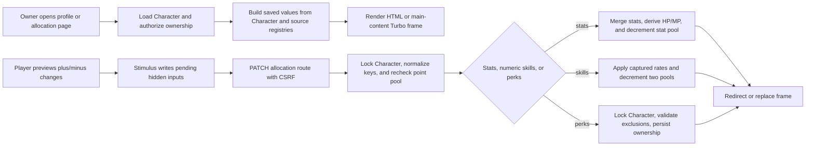

# frozen_string_literal: true
---
title: Character Progression Feature
description: Implementation handbook for Neverlands-based primary stats, numeric skills, boolean perks, point allocation, current license permissions, and public progression display.
status: Fully Implemented
updated: 2026-09-11
owners: Character Progression
template: feature-v1
---

# Character Progression

This document is the implementation contract for the current Character Progression feature. It explains the player profile, primary-stat allocation, numeric `Умения`, boolean `Навыки`, point pools, tiered skill gains, public progression display, UI ownership, persistence, authorization, known implementation limits, and test coverage.

It describes what exists now. It does not treat the complete observed Neverlands perk/profession catalog, unknown effect formulas, or familiar RPG progression conventions as shipped behavior.

## 1. Design authority and related documents

Domain navigation: `doc/domains/character.md`.

Neverlands is the sole game-design and visual reference for this feature. The local implementation adapts its dense player profile and explicit plus/minus/save allocation flow to Rails, HTML/Turbo, Stimulus, and the current English client.

When behavior is uncertain or conflicts with this document:

1. Re-observe Neverlands and record the evidence under `doc/design/reference/`.
2. Update the relevant progression design record.
3. Change implementation and coverage together.
4. Update this feature contract last.

Supporting documents:

- `doc/design/reference/character/observations/2026-05-11_player_profile_and_development.md` records the starter and returning-character profile, stat, `Умения`, and `Навыки` observations.
- `doc/design/reference/character/observations/legacy_skills_and_arena_analysis.md` records the wiki character-development audit, complete level rows, exact derived formulas, and unresolved evidence boundaries.
- `doc/design/reference/world/observations/2026-09-09_starter_routes.md` records the public pond profile's separate zone and current-cell labels without raw coordinates.
- `doc/design/reference/world/observations/2026-09-09_wiki_skills_and_cell_actions.md` records published Nature Child effects and distinguishes allocated skills, binary perks and profession counters.
- `doc/design/reference/economy/observations/2026-09-09_licenses_and_shop_selling.md` records Merchant/Healer license prerequisites and the live Abilities → Your licenses empty state; purchase-time activation was not exercised.
- `doc/design/reference/social/observations/2026-08-23_chat_game_event_timeline.md` records recipient-visible fight completion with awarded combat XP in the persistent chat history.
- `doc/design/reference/neverlands.md` defines the Neverlands evidence-to-implementation rule.
- `doc/design/features/progression_stats_skills.md` normalizes the five primary stats, 29 numeric skills, captured tier rates, point pools, and launch-safe perk subset.
- `doc/design/features/professions.md` owns profession activity/counter behavior beyond the bounded Merchant/Healer perk and Shop-license handoff.
- `doc/design/features/items_inventory_equipment.md` defines equipment modifiers consumed by effective stats and skills.
- `doc/design/features/combat.md` owns combat effects after progression values are handed off.
- `doc/design/launch_mvp_plan.md` defines the launch progression boundary.
- `doc/features/game_shell.md` owns the persistent shell in which profile and allocation pages are shown.
- `doc/features/world.md` consumes effective Wanderer when authoring a timed adjacent movement offer.
- `doc/features/shop_economy.md` consumes progression-backed requirement values for Shop item presentation without granting purchase or equip authority.
- `doc/features/player_inventory.md` displays effective values and enforces equip/use requirements.
- `doc/features/arena_combat.md` consumes combat values and calls the bounded idempotent solo-NPC XP award on eligible finalization.

### 1.1 Cross-feature relationships

| Related feature | Relationship | Ownership and handoff |
|---|---|---|
| `doc/features/game_shell.md` | The shell links to the player profile and renders profile/allocation surfaces in its main content context. | Character Progression owns saved allocations and profile values; Game Shell owns only shared navigation, framing, and header presentation. |
| `doc/features/world.md` | World consumes effective Wanderer for adjacent travel and supplies the profile's current cell/room/flight label. | Character Progression owns saved skill values and profile formatting; World owns the configurable `24..30` second local fallback, exact authored durations, movement lifecycle, and `Presence#label` resolution from persisted location. |
| `doc/features/shop_economy.md` | Shop rows read character requirements and Merchant/Healer prerequisites; Your licenses displays purchased permissions. | Character Progression owns allocations and permission display; Shop owns license grants, catalog, eligibility and atomic settlement, while Inventory owns later equipment enforcement. |
| `doc/features/player_inventory.md` | The shared character sheet and item rows consume effective stats/skills. | Character Progression owns saved/effective values; Player Inventory owns equipment state, capacity display, and requirement enforcement. |
| `doc/features/arena_combat.md` | Fight profiles consume effective character values and eligible completed solo NPC fights may award capped XP, whose actual amount is passed onward for concise shell feedback. | Character Progression owns values, thresholds, and grants; Arena Combat owns match resolution, the idempotent award handoff, and the persisted fact supplied to Game Shell. |

## 2. Feature summary

An authenticated player begins at level `0`, gains configured combat experience from solo PvE victories, receives exact table-authored level grants, and can allocate saved points on three distinct Neverlands-shaped surfaces: five primary stats, 29 numeric skills, and binary perks. Each page shows current values and remaining points, lets the browser preview reversible pending additions, and submits one explicit save. Saved additions cannot be removed through the normal allocation UI.

The `Character` record is authoritative for saved allocations and point balances. `allocated_stats`, `passive_skills`, and `perks` are JSONB maps; `stat_points_available`, `combat_skill_points`, `peace_skill_points`, and `perk_points` are separate non-negative counters. The browser never grants points or finalizes an allocation.

Numeric skill identities and four-band progression rates come from the captured Neverlands registry. Effective Extra Action Points now contributes one-for-one to the shared fight AP profile. The selectable perk subset contains source ID `7`, `Больше силы`/`More Strength`, adding `floor(level / 2)` effective Strength; source ID `15`, `Аккуратный боец`/`Careful Fighter`, halving post-fight equipment-wear probability; source ID `34`, Merchant; and source ID `35`, Healer. Merchant and Healer satisfy explicit Shop license prerequisites; selecting either does not grant a license, quest completion, or medical treatment.

The MVP currently contains:

- five primary stats with base value `1` and additive saved allocations;
- a finite table of complete source rows `0..27` for thresholds, stat/skill/perk/NV grants, per-fight XP caps, and source NPC-group limits;
- exact `Health × 5` base HP, `Knowledge × 7` base MP, and `Strength × 5 + Health × 10 + level × 10` mass formulas;
- 29 source-backed numeric skills from `0` to `100` with combat and peace point pools;
- four selectable binary perks with a separate point pool and captured exclusion infrastructure;
- an owner-only Your licenses surface showing current purchased permissions and their server-owned expiry;
- solo configured-NPC XP award through idempotent fight finalization, capped by the current level row;
- public HTML and JSON display of numeric skills and owned perks;
- owner-only allocation enforced by Devise, current-character resolution, and `CharacterPolicy`.

## 3. MVP goals and non-goals

### Goals

- Reproduce the captured profile-to-stats/skills/perks navigation and explicit save model.
- Keep primary stats, numeric skills, and binary perks as separate persisted concepts and point pools.
- Apply captured 25-level numeric-skill tier rates exactly and cap each skill at `100`.
- Keep browser previews reversible while making the server authoritative for every save.
- Keep XP/grant data finite and catalog-authored; do not extrapolate incomplete level rows or invent group distribution.
- Expose only safe public progression facts and reserve mutation controls for the owning player.

### Non-goals

- Applying numeric-skill effects beyond the explicitly implemented Wanderer
  movement and Extra Action Points combat-profile formulas, or inventing
  profession or prerequisite formulas.
- Rendering or selecting the remaining observed `Навыки` merely because their source labels are known.
- Free respec, saved progression builds, skill trees, classes, specializations, or generic ability unlock graphs.
- Owning equipment, combat, movement, recovery, inventory, or profession mechanics that consume progression values.
- Group PvE XP distribution, XP loss, fame/valor awards, or levels beyond the complete row `27`.
- Recreating Neverlands CGI routes, frames, Russian player-facing copy, or token formats.

## 4. Player experience

### 4.1 Entry conditions

The public profile is available at `/player/:name` by case-insensitive active character name in the minimal public layout. A signed-in owner sees the same profile inside the persistent game shell and reaches Stats, Skills, Perks, and Your licenses from the profile's internal subnavigation. Allocation routes require an authenticated user, an active playable character, and ownership of the requested `Character`.

The owner's HTML profile and every Stats/Skills/Perks request also honor
persisted outdoor travel/Look availability. `OutdoorActionAvailability`
reconciles due work and returns active work to World with `303 See Other`;
direct URLs or PATCH requests cannot bypass the navigation lock or spend
points while busy. The character row remains locked through the accepted
request. Visitor profiles and the read-only public JSON profile remain
available. World owns the captured lock and timer behavior recorded in
`doc/design/reference/world/observations/2026-09-07_forpost_grid_and_action_audit.md`.

The profile is not an account dashboard. It shows the gameplay character, equipment summary, vitals, progress, record, numeric skill summary, and owned perks. Only the owner sees primary-stat detail and progression mutation links.

Both owner and public profiles place the current location below the equipment
paper doll. The first line is the zone's display name; a distinct authored
cell, entrance, validated room, or flight label appears on the second line.
When both labels match, one line is sufficient. HTML shows no raw coordinates,
and a missing position displays `Unknown`. This follows the captured public
pond profile's separate zone/cell lines; it does not claim that an already-open
profile updates live without another request.

### 4.2 Primary surface

Each allocation page uses the compact Neverlands player-subpage language:

- character name and level;
- the same equipment paper doll, location, and money summary as the profile left column;
- a visible remaining-point counter;
- dense rows grouped by stat or captured skill category;
- plus and minus controls for pending changes;
- an explicit Reset button;
- one disabled-until-changed Save button;
- profile, Stats, Skills, Perks, and Your licenses navigation.

Numeric skills render as `[NNN/100]` and show the gain for the next spend. Perks render as `Yes` or `No`. Existing owned perks remain `Yes` and do not expose a normal removal control.

The desktop owner profile retains the 463/5/467 composition and shared
258/5/200 sheet. At `<=800px` its columns stack; at `<=520px` the CSS paper
doll is centered above full-width parameters and the dense internal navigation
scrolls within its own strip. Public profile semantics remain intact at the
same breakpoints.

### 4.3 Player actions and feedback

On Stats, the player distributes pending additions among Strength, Dexterity, Luck, Health, and Knowledge. On Skills, each click spends a preview point from the correct combat or peace pool and applies the captured rate for the current 25-level band. On Perks, the player can preview an unowned captured perk if a new-perk point exists.

Save submits only pending additions. HTML success redirects back with `Stats saved`, `Skills saved`, or `Perks saved`. Turbo success replaces the affected allocation frame and updates the shared flash. Invalid, empty, over-budget, unknown, conflicting, or duplicate perk selections show an error and preserve valid persisted state.

### 4.4 Exit and integration behavior

Profile and allocation pages return to one another through player-context buttons and can return to the World map. Effective stats and skills are read by inventory requirements, vitals, combat, and other game systems, but those systems own their downstream behavior and must not infer missing progression formulas.

No progression-specific gameplay resume context is stored. Leaving a page preserves saved character state, while unsaved browser previews are discarded.

## 5. Feature topology and authored content

The feature is an authored catalog and state graph rather than spatial topology.

| Runtime key or group | Player-facing name | Connections or actions | Implemented content |
|---|---|---|---|
| `primary_stats` | Stats | Preview, reset, save | Strength, Dexterity, Luck, Health, Knowledge; base `1` each |
| `combat` | Combat skills | Spend combat points | Source IDs `0` through `11` |
| `magic` | Magic skills | Spend combat points | Source IDs `12` through `15` |
| `resistance` | Resistance skills | Spend combat points | Source IDs `16` through `20` |
| `peace_world` | Peace/world skills | Spend peace points | Source IDs `22`, `23`, `24`, `26`, `27`, `30`, `33`, `34` |
| `more_strength` | More Strength | Spend one perk point; persist `Yes` | Boolean perk source ID `7`; adds `floor(level / 2)` effective Strength |
| `careful_fighter` | Careful Fighter | Spend one perk point; persist `Yes` | Boolean perk source ID `15`; halves each post-fight equipment-wear chance |
| `merchant` | Merchant | Spend one perk point; persist `Yes` | Boolean perk source ID `34`; prerequisite for Trading licenses, alongside Merchant qualification |
| `healer` | Healer | Spend one perk point; persist `Yes` | Boolean perk source ID `35`; prerequisite for Doctor licenses, with Traumatologist qualification additionally required for tiers II/III |

Numeric skills use captured four-value rate strings. The rate selected for a spend is based on the saved/current value before that spend:

| Band | Current numeric skill | Rate position |
|---|---:|---:|
| 1 | `0..24` | first value |
| 2 | `25..49` | second value |
| 3 | `50..74` | third value |
| 4 | `75..99` | fourth value |

### 5.1 Coordinate, key, or identity terminology

- **Primary-stat key** — normalized local identity such as `strength`, `dexterity`, `luck`, `vitality`, or `intelligence`; player labels map Health to `vitality` and Knowledge to `intelligence`.
- **Numeric-skill source ID** — stable Neverlands `Умения` identity retained in `PassiveSkillRegistry`; local symbolic keys are used in persisted JSONB.
- **Perk source ID** — stable Neverlands `Навыки` identity retained in `PerkRegistry`; source IDs `7`, `15`, `34`, and `35` have launch-selectable local keys.
- **Base value** — saved character allocation before equipment modifiers.
- **Effective value** — base character value plus supported equipment modifiers, capped where the implementation defines a cap.

Relationships must come from the source-backed registries. Categories, display order, translated names, or CSS grouping never create prerequisites, exclusions, effects, or point-pool ownership.

## 6. Feature surfaces and contained behavior

### 6.1 Implementation status

| Surface or behavior | Entry point | MVP status | Owning implementation |
|---|---|---|---|
| Public player profile | `GET /player/:name` | Interactive/read-only by viewer | `PlayersController` and profile view |
| XP and level grants | Shared solo-PvE fight finalization | Interactive downstream entry | `NpcExperienceAwarder`, `LevelUpService`, and progression catalog |
| Primary-stat allocation | `GET/PATCH /characters/:id/stats` | Interactive | `CharactersController` and `Character` |
| Numeric-skill allocation | `GET/PATCH /characters/:id/skills` | Interactive | `CharactersController`, registry, and formula |
| Boolean perk allocation | `GET/PATCH /characters/:id/perks` | Interactive subset | `PerkAllocation` and `PerkRegistry` |
| Current license permissions | `GET /character/licenses` | Read-only owner surface | `CharacterLicensesController`, `CharacterLicense`; Shop owns acquisition |
| Remaining observed perks/profession operations | No local route/control | Deferred outside this handbook boundary | Evidence and design documents only |
| Wanderer movement effect | World movement-offer creation | Interactive downstream consumer | `Game::Movement::TravelTime` |
| Extra Action Points effect | Shared combat-profile preparation | Interactive downstream consumer | `Character#max_action_points` and `Arena::CombatProfile` |
| Careful Fighter effect | Shared fight finalization | Interactive downstream consumer | `Arena::EquipmentWearResolver` |
| Other skill/perk gameplay effects without captured formulas | No mutation | Deferred | Downstream owning feature after evidence |

### 6.2 Primary stats

The five primary stats begin at base value `1`. Saved additions are merged into `allocated_stats`, and the submitted total is deducted from `stat_points_available`. Each submitted field is normalized through the allowlisted aliases and clamped to `0..100` for one request. Unknown keys are ignored. A request must spend at least one point and cannot exceed the point pool reloaded under the character row lock.

`Character#stats` adds `floor(level / 2)` Strength for owned `more_strength`, then supported equipment modifiers, and returns a `Game::Systems::StatBlock`. Saved Health and Knowledge recalculate base HP/MP at `5` and `7` per point without healing; effective Strength, Health, and level derive inventory mass. Saved additions are permanent through the normal UI; minus removes only an unsaved preview.

### 6.3 Numeric skills

The numeric registry contains 29 captured `Умения`, each with a source ID, local key, English/source labels, category, combat-or-peace pool, maximum `100`, and exact four-band rate. One spend consumes one point from the assigned pool and may add more than one numeric level according to the current band.

Multiple pending spends are applied sequentially so crossing `25`, `50`, or `75` changes the rate used by later spends. The final value is capped at `100`; requested spends after the cap do not consume points. Unknown skill keys do not consume points. Equipment bonuses contribute to `passive_skill_level`.

Two numeric skills have bounded downstream effects. World snapshots an exact
authored cell duration when present; otherwise its configurable fallback uses
effective Wanderer. Current defaults compute `30 - floor(wanderer * 6 / 100)`
seconds with Wanderer clamped to `0..100` and duration bounded to `24..30`.
These values come from `config/gameplay/world_rules.yml`; the linear fallback
is a local projection of observed samples, not the complete Neverlands formula.
Combat builds AP as base `80`, plus `10` at level `5`, another `10` at level
`10`, and one point per effective Extra Action Points value. Persisted
per-fight profile overrides remain authoritative for captured fights. Every
other downstream numeric-skill effect remains unimplemented until separately
captured.

### 6.4 Boolean perks and deferred behavior boundary

`more_strength`, `careful_fighter`, `merchant`, and `healer` are the rendered
selectable perks. Saving any new selection consumes one `perk_points`, stores
its key as `true`, and makes it
non-removable through the normal UI. `PerkAllocation` rejects empty/duplicate
ownership, unknown keys, insufficient points, and any captured mutually
exclusive combination under a character row lock.

The complete observed `Навыки` labels and saved yes/no rows are evidence, not
local capabilities. Source ID `7` adds one effective Strength per two levels,
rounded down. Source ID `15` halves the independent per-item wear chance at
fight finalization, including the `1%` arena-defeat chance as an exact `0.5%`
roll. Source IDs `34` and `35` provide Merchant/Healer ownership to Shop
license prerequisite checks. Selecting a profession perk grants neither quest
completion nor a timed license. Shop implements the bounded Merchant
qualification path; Doctor quests and medical treatment remain unimplemented.
Reset behavior and other uncaptured prerequisite/effect rules remain deferred.

### 6.5 World-related skill and perk gaps

This is the progression owner for the remaining World skill/perk handoffs.
The source catalog records Nature Child as auxiliary perk ID `22`; it is
absent from the local selectable registry. The user's
[Nature Child wiki link](http://wiki.neverlands.ru/wiki/Дитя_природы) resolves
to the auxiliary section of the Perk article, preserved in the September 9
wiki observation.

| Gap | Known boundary and remaining work |
|---|---|
| `[IMPL]` Nature Child acquisition and drinking effect | The published sip removes four fatigue points instead of two. `world_rules.yml` preserves that value, but `PerformLocalAction` currently requests ordinary two-point recovery and no supported owned-perk selection exists. Add the validated progression-to-World handoff and applicable allocation, persistence, atomic effect and retry coverage when this perk is scoped. A configured number alone does not enable the perk. |
| `[EVIDENCE]` Nature Child variants | Capture its applicable prerequisites/selection and actual perk-dependent sip. The exact Wanderer enhancement, outdoor HP-recovery coefficient and zero-fatigue source behavior are not established by the article. Do not classify the already published four-point amount as unknown. |
| `[EVIDENCE]` Broader movement skill/effect combinations | Effective Wanderer is already supplied to World. Terrain, equipment and effect composition beyond the current authored duration/configurable fallback need isolated inputs; the formula owner is [Movement](../design/features/movement.md#travel-time), with runtime limits in [World](world.md#19-open-world-parity-audit-updated-2026-09-09). |
| Deferred profession progression | Successful fishing grows its profession counter per the user's confirmation; there is no initial fishing skill gate. Successful fishing/gathering/mining counters and their activity lifecycle belong to [Professions](professions.md), not ordinary allocatable peace skills. |

Known-but-unimplemented effects and unresolved source coefficients are tracked
separately. These entries do not expand the currently bounded perk contract
or automatically assign every gap to after MVP.

### 6.6 Purchased licenses and Abilities

The bottom-right `A` / Abilities link and the owner profile's Your licenses tab
open `GET /character/licenses`. The controller resolves only the signed-in
current character, authorizes ownership, and reads active `CharacterLicense`
rows at one server timestamp. It shows at most 100 current grants, ordered by
expiry and id, with snapshot name, kind, tier, and expiry. An empty collection
shows `You have no licenses.` Query-supplied character or license ids cannot
select another owner.

Shop owns atomic purchase, funds, stock, prerequisites, and grant creation. The
local grant stores a separate permission beginning at successful payment and
lasting the described number of days. It creates no `InventoryItem` and adds no
carried mass or occupied slot. This is a bounded local adaptation: the source
shows a separate ownership section, but activation timing and carried-mass
effects were not exercised. `[EVIDENCE]` Renewal, stacking, activation and
expiry-cleanup parity remain open.

At `starts_at <= now < expires_at`, a grant is current. At expiry it stops
authorizing licensed actions, and the next server request omits it from this
read-only list; its persisted purchase record remains. No cron/background job
deletes grants, and this page does not poll or remove an already-rendered row
at the deadline. Reload and login rebuild the list from persisted permissions
without extending deadlines. Turbo snapshots are disabled on this surface,
and the browser never decides license validity. Shop implements the
published Merchant license-unlock path through Market acceptance, a 1,000-NV
Shop receipt and Market completion. Its garment reward and the Doctor quest
flows remain `[IMPL]` gaps; exact source dialogue and temporary garment details
remain `[EVIDENCE]` gaps. Selecting either perk does not set the server-owned
qualification flags.

Four separate facts govern this handoff: a boolean Merchant/Healer perk,
numeric profession proficiency, completed quest qualification, and an active
timed license. Profession proficiency is not an ordinary allocatable skill or
another name for the perk. Shop reads saved Trading proficiency for resale
rates but does not grow it after sales. Doctor II/III purchase checks the
Traumatologist completion flag; it does not independently check Doctor
proficiency. The published `100` Doctor proficiency requirement belongs to
entering that still-unimplemented quest, with equipment allowed to contribute.
The Doctor wiki does not state an additional license-purchase quest gate for
tier I; this does not implement or bypass the separate initial medical quest
needed for the described treatment/crafting progression. See the
[source prerequisite clarification](../design/reference/economy/observations/2026-09-09_licenses_and_shop_selling.md#profession-prerequisites-wiki-clarification-2026-09-10)
and the [Shop runtime contract](shop_economy.md) for the license-specific rules
and remaining gaps.

## 7. Authoritative data and presentation model

| Record or component | Responsibility | Important contract |
|---|---|---|
| `Character` | Saved point pools, allocations, level, experience, and effective accessors | Point pools are non-negative; saved JSONB maps default to empty objects |
| `Game::Progression::Catalog` | Complete source rows `0..27` | Thresholds and all grants are validated, contiguous, and never extrapolated |
| `LevelUpService` | Award XP and table-authored level grants | Locks/reloads Character; grants pools and NV without refilling vitals |
| `StatAllocationService` | Spend primary-stat points and recalculate base vitals | Locks/reloads Character and preserves current HP/MP except max clamp |
| `SkillAllocationService` | Spend combat/peace points using tier rates | Locks/reloads Character and charges only actual pre-cap spends |
| `PassiveSkillRegistry` | Numeric-skill identities, categories, pools, caps, and captured rates | Only captured IDs/rates are present; no invented effects/prerequisites |
| `SkillProgressionFormula` | Apply and reverse one preview spend | Four numeric rates, 25-level bands, and `0..100` boundary |
| `PerkRegistry` | Launch perk identity and captured exclusion table | Only named/captured launch entries are selectable |
| `PerkAllocation` | Validate and persist new perk ownership | Locks the character, spends only new selections, and rejects conflicts |
| `CharacterPolicy` | Owner-only progression and license-page authorization | Signed-in user must own the requested character |
| `CharacterLicense` | Purchased permission snapshots and interval | Separate from permanent perks and inventory; Shop owns grant creation |
| `CharacterLicensesController` | Current-character license display | One active-at query, limit 100, no permission mutation |
| `PlayerProfileHelper#profile_location` | HTML location and public fight-link formatting | Escapes zone/current-location labels, uses World `Presence#label`, and displays no raw coordinates |
| Stimulus allocation controllers | Pending browser preview | May alter hidden inputs and display only; never saved authority |

### 7.1 Source of truth

The `characters` table is authoritative for character state. Point counters and JSONB maps determine saved allocation; `config/gameplay/character_progression.yml` is authoritative for complete level thresholds/grants; the NV wallet/ledger is authoritative for level currency grants. Registries define valid content identity; they do not grant ownership or points. Profile values are rebuilt from the saved character, registries, exact derived formulas, and supported equipment modifiers on every request.

Missing JSON keys mean zero numeric skill, no stat addition, or unowned perk. An absent/unknown perk key is not rendered through the registry-backed profile payload.

### 7.2 Validation and state lifecycle

- Stats move from available points to additive `allocated_stats` entries.
- Numeric skill spends move points from exactly one pool to saved levels capped at `100`.
- Perks move points from `perk_points` to permanent boolean ownership.
- Negative point pools are rejected by `Character` validation.
- Level-up walks each crossed catalog row, grants that row's stat/combat/peace/perk/NV values, records one wallet transaction, and stops before incomplete level `28`.
- A new database-created character starts at level `0` with `15/10/2/1` allocation pools and `5/7` HP/MP maxima.
- The public profile exposes effective numeric skill levels and owned launch-registry perks, but not private account data.

### 7.3 Presentation versus authority

Plus/minus state, displayed counters, hidden inputs, category grouping, translated names, source IDs rendered in the DOM, and disabled-button CSS are presentation/input only. The server reparses allowlisted keys and checks point balances on save.

Stat, numeric-skill, perk, and XP/level transitions lock and reload the character row before checking or changing point pools. Stale competing allocation requests therefore see the current balance; a losing over-budget request leaves state unchanged.

## 8. Runtime architecture



### 8.1 Load and render

`CharactersController` loads the requested `Character`, resolves the signed-in active character, and calls `CharacterPolicy#manage_progression?`. Stats are composed from base, saved additions, and equipment. Skills are composed from `PassiveSkillRegistry` and `SkillProgressionFormula`. Perks are composed from `PerkRegistry` and the saved perk map.

`PlayersController` separately loads a public character by case-insensitive name with equipment and position. It renders safe HTML or JSON. Owner-only controls are decided from the authenticated viewer character.

### 8.2 Accept or execute action

Stats and skills accept allowlisted hashes, convert values to integers, clamp each pending spend to `0..100`, and delegate to locked allocation services. Each service reloads the row, rejects an empty or over-budget total, and writes one atomic update. Stats merge additions and derive base HP/MP without a refill. Skills apply each actual spend sequentially and do not charge requests beyond a skill's `100` cap.

Perks convert truthy selection fields to keys, then `PerkAllocation` normalizes and deduplicates them. Under `Character#with_lock`, it removes already-owned choices, checks the current perk pool and exclusions, merges new ownership, and decrements the pool.

### 8.3 Complete, redirect, or hand off

HTML success redirects to the same allocation page with a notice. Turbo success replaces only `stat-allocation`, `skill-allocation`, or `perk-allocation` and updates `flash`. Allocation errors update the flash for Turbo or redirect through the configured fallback for HTML.

After save, inventory requirements, vitals, profile, combat, and World may read the new values. World applies a new Wanderer value only when it authors the next movement offer; an already-offered or active command retains its persisted duration. Each downstream feature owns its own validation and formula behavior.

### 8.4 Concurrency behavior

Stat, numeric-skill, and perk allocation use a character row lock, so duplicate or concurrent requests re-evaluate current ownership, cap, and point balances. Level-up uses the same boundary before applying XP and grants, then records a single NV ledger adjustment inside the transaction.

The shared controller guard holds that character lock from the outdoor
availability check through the page or allocation action. Movement therefore
cannot start between the busy check and point spending. When due movement is
completed on entry, owner pages render the reconciled character state,
including the newly persisted travel fatigue.

The client disables Save until a preview exists, but that is usability only and cannot prevent replay. Server locks and stale-competing-request service specs protect the balance. XP is awarded only from the match's separately idempotent finalization marker.

## 9. HTTP and Turbo contract

| Method and path | Purpose | Success | Failure |
|---|---|---|---|
| `GET /player/:name` | Public profile by character name | HTML profile or JSON public payload | `404` for unknown character |
| `GET /characters/:id/stats` | Render owner stat allocation | Stats page/frame | Authentication redirect, owner denial, or `404` |
| `PATCH /characters/:id/stats` | Save pending stat additions | Redirect or Turbo frame/flash replacement | Error redirect/flash; no intended mutation |
| `GET /characters/:id/skills` | Render captured numeric skills | Skills page/frame | Authentication redirect, owner denial, or `404` |
| `PATCH /characters/:id/skills` | Save numeric skill spends | Redirect or Turbo frame/flash replacement | Error redirect/flash; no intended mutation |
| `GET /characters/:id/perks` | Render launch-safe binary perks | Perks page/frame | Authentication redirect, owner denial, or `404` |
| `PATCH /characters/:id/perks` | Save new perk ownership | Redirect or Turbo frame/flash replacement | Allocation error redirect/flash; state preserved |
| `GET /character/licenses` | Show current owned license grants | Read-only shell HTML | Authentication/owner denial; query ids cannot change owner |

The allocation feature is authenticated HTML/Turbo. The public profile also offers an unversioned read-only JSON representation for internal/public consumption. There is no separately versioned progression API, so Swagger/rswag and blueprint coverage are not applicable.

`PlayersController#location_payload` retains the existing JSON `zone`, `x`,
and `y` fields. Its human-readable `label` comes from the same
`Game::World::Presence#label` used by HTML and the map/presence surfaces.
Resolving that label reads only the viewed character's cell/entrance, valid
saved room, or aboard journey; it does not load or count nearby players.

An unfinished fight keeps its public log link. A real Arena room supplies the
room name; an outdoor NPC fight retains the authored outdoor cell label
instead of inventing an Arena location. JSON adds its existing combat label,
`sublocation`, and `active_fight` identity/path/status fields. Location rendering
does not change the character's position or saved room context.

For the owner's HTML profile and authenticated allocation routes, accepted
outdoor travel/Look overrides the ordinary page/action response with a `303`
World redirect. Progression fields and point balances remain unchanged. This
availability check applies to both HTML and Turbo allocation submissions.

## 10. Client-side and CSS ownership

`stat_allocation_controller.js`, `skill_allocation_controller.js`, and `perk_allocation_controller.js` own only:

- pending plus/minus previews;
- remaining-point display during the current page visit;
- hidden form values submitted to Rails;
- Reset and Save enabled/disabled presentation;
- numeric-skill tier preview using server-rendered captured rate strings.

They must not:

- grant points, persist values, or decide ownership;
- introduce a skill/perk key absent from the server registry;
- apply gameplay effects or prerequisites;
- authorize another character or bypass the final server check.

`app/assets/stylesheets/character_sheet.css` owns the live-measured 463/5/fluid
page composition and the shared 258/5/200 character sheet, including the
115 × 255 CSS character silhouette, the dense stat/experience/record tables,
the increases banner, and the combat chips. `app/assets/stylesheets/player.css`
owns the profile tab band, the allocation panels, and the stat/skill/perk rows.
The reusable markup lives in
`app/views/shared/_neverlands_character_sheet.html.erb`, which Profile and
Inventory consume without sharing their domain actions. Shared controls and
shell styling remain owned by the ordered `tokens.css`, `primitives.css`, and
`shell.css` modules; no Tailwind layer is introduced. `character_sheet.css`
owns the explicit 780/520px adaptations so the desktop measurements and
responsive behavior cannot drift into separate CSS systems.

The combat chip rows follow the captured profile order and set: fatigue, AP per
strike, armor class, dodge, accuracy, crushing, fortitude, and armor pierce.
The source's artifact-coefficient row is deliberately absent because its
mechanic is not captured. `[EVIDENCE]`

Accessibility behavior:

- plus, minus, Reset, Save, and navigation use semantic buttons/links;
- disabled Save and maximum-skill controls use actual `disabled` state;
- text counters and `Yes`/`No` labels expose status without relying only on color;
- Turbo replaces the named allocation frame and updates a visible flash message.

## 11. Persistence and login resume

Saved allocations and point pools live on `Character`; purchased permissions live separately on `CharacterLicense`. Both survive reload, navigation, logout, and login. The feature stores no pending allocation draft and no feature-specific resume URL. Unsaved Stimulus preview state disappears on reload or when leaving the page.

On login or return:

- World/City resume restores the last safe gameplay surface;
- opening Profile rebuilds saved stats, skills, perks, and remaining pools;
- returning to an allocation page starts with no pending additions;
- unknown or removed registry entries are not made interactive by stale browser state.

Arbitrary saved browser fields, translated labels, or profile URLs do not grant progression ownership. The requested character ID is authorized on every allocation request.

## 12. Authorization, trust boundaries, and concurrency

- Devise protects Stats, Skills, Perks, and Your licenses routes.
- `CurrentCharacterContext` resolves the signed-in user's playable character.
- `CharacterPolicy#manage_progression?` requires ownership of the requested character.
- `CharactersController` allowlists/normalizes stat and skill inputs; locked services recheck separate point pools.
- `PerkAllocation` validates launch-registry membership, points, duplicate ownership, and exclusions under a row lock.
- CSRF-backed forms protect HTML/Turbo mutations.
- Public profile JSON omits account email, private session state, formula detail, and private owner-only stat panels.
- DOM counters, hidden inputs, disabled states, source labels, and Stimulus state never confer authority.
- Concurrent Stats/Skills saves serialize on the Character row; client-side button disabling is not part of that guarantee.

## 13. Failure and boundary behavior

| Condition | Required behavior |
|---|---|
| Anonymous allocation request | Redirect to sign-in; no allocation mutation |
| Foreign character | Redirect to root with ownership error; no mutation |
| Owner request during accepted outdoor travel or Look | Redirect to World with 303; preserve allocations and available points |
| Missing character | Return `404` |
| Empty, nil, zero, or all-negative allocation | Show `No stats selected`, `No skills selected`, or perk allocation error |
| Submitted amount above available pool | Reject with the matching insufficient-points message |
| Negative or extreme field value | Convert/clamp per request; reject if the resulting total is empty or over budget |
| Unknown stat/skill mixed with valid keys | Ignore unknown key; valid known allocation may proceed |
| Unknown perk | Reject the entire perk save |
| Already-owned perk only | Reject as `No new perks selected`; do not spend another point |
| Conflicting captured perks | Reject the entire perk save under lock |
| Numeric skill reaches `100` | Cap at `100`; no further visible spend is enabled |
| Equipment changes effective Wanderer | Rebuild effective display; World uses it only for the next authored offer, never to rewrite an active command |
| Equipment changes effective Extra Action Points | Rebuild effective display; Combat snapshots it only into a new fight profile, never an active profile |
| Equipment changes another effective skill | Rebuild effective display; no uncaptured formula is applied |
| Missing public character name | Return `404`, not an account-profile fallback |
| Simultaneous/stale Stats or Skills saves | Serialize under the Character row lock; recheck current pools and reject an over-budget request without a lost update |
| XP below next threshold | Add XP with no grant or level change |
| XP crosses several rows | Apply every complete row once and aggregate one NV ledger adjustment |
| XP at level `27` | Persist XP but do not invent a level `28` threshold or grant |
| Multi-player PvE winning side | Award no XP until the Neverlands group distribution formula is captured |
| Deferred profession/perk action | Render no control and create no inferred effect |

## 14. Acceptance criteria

- The owner can allocate and permanently save additions to all five primary stats.
- The owner can spend the correct combat or peace pool across all 29 captured numeric skills.
- Numeric skill spends use the captured four-band rate and never exceed `100`.
- The owner can spend perk points on `more_strength`, `careful_fighter`,
  `merchant`, or `healer`; another save cannot reacquire an owned perk. Strength
  gains `floor(level / 2)`, shared fight wear chances are halved for Careful
  Fighter, and profession perks feed explicit Shop license prerequisites.
- Your licenses displays only current owned permissions, preserves grant
  snapshots across catalog changes/login, and hides them exactly at expiry.
- A level-0 starter receives exact catalog grants when configured solo-PvE XP crosses one or more complete thresholds.
- Health/Knowledge allocation recalculates base maxima at `5/7` per point without healing, and mass uses the exact `5/10/10` formula.
- Stat, skill, perk, and level transitions recheck the character under a row lock.
- Another user and an anonymous user cannot mutate a character's progression.
- Profile HTML and JSON expose numeric skills and owned launch-registry perks without private account data.
- Browser preview/reset behavior never mutates saved state before PATCH succeeds.
- Saved progression survives logout/login; pending browser preview does not.
- Effective Wanderer is available to World, which owns and tests exact authored cell durations and the configurable local movement fallback, currently bounded to `24..30` seconds.
- Effective Extra Action Points contributes one AP per point to a new shared
  combat profile after the captured level-threshold base.
- Owner and public profile surfaces preserve their desktop source geometry and
  reflow without whole-page overflow at 820px and 390px.
- Uncaptured perks, professions, prerequisites, respec, and effects remain unavailable.

## 15. Test strategy and required coverage

Tests are part of the feature contract. Progression changes require applicable model, request, policy, service/formula, factory, view/system, and integration coverage. There is no separately versioned public API requiring Swagger/rswag or blueprint specs.

| Coverage category | Representative guarantees |
|---|---|
| Success | Stat merge/vital derivation, dual-pool tiered skill spend, More Strength, Extra AP and Careful Fighter effects, profile rendering/JSON, XP thresholds, complete level grants, and NV ledger award |
| Failure | Empty/over-budget allocation, unknown perk, insufficient perk points, conflict, maximum skill, invalid XP, and safe flash response |
| Edge/null/boundary | Level `0/27/28`, nil/negative/zero XP, nil hashes, negative/extreme inputs, exact pool exhaustion, `24/25/49/50/74/75/99/100` bands, duplicate perk ownership, and stale competing spends |
| Authorization | Anonymous request, foreign character, policy owner, public read-only profile, and current-character scoping |

`spec/factories/characters.rb` must retain starter, fatigue, point-pool, saved stat/skill, perk ownership, maximum/boundary, and foreign-ownership traits when exercised.

`spec/requests/outdoor_action_availability_spec.rb` covers busy own-profile and
allocation URLs, rejected point spending, public read access, and fresh fatigue
rendering after due travel completes at page entry.

Focused verification command:

```bash
bundle exec rspec \
  spec/models/character_spec.rb \
  spec/models/inventory_spec.rb \
  spec/policies/character_policy_spec.rb \
  spec/lib/game/progression/catalog_spec.rb \
  spec/lib/game/formulas/skill_progression_formula_spec.rb \
  spec/lib/game/skills/passive_skill_registry_spec.rb \
  spec/lib/game/skills/passive_skill_calculator_spec.rb \
  spec/lib/game/skills/perk_registry_spec.rb \
  spec/services/game/skills/perk_allocation_spec.rb \
  spec/services/characters/stat_allocation_service_spec.rb \
  spec/services/characters/skill_allocation_service_spec.rb \
  spec/services/game/movement/travel_time_spec.rb \
  spec/services/players/progression/level_up_service_spec.rb \
  spec/requests/characters_spec.rb \
  spec/requests/character_licenses_spec.rb \
  spec/requests/characters/skills_spec.rb \
  spec/requests/players_spec.rb \
  spec/system/skill_allocation_spec.rb \
  spec/system/perk_allocation_spec.rb
```

There is no dedicated view spec for each allocation partial; request and system specs cover rendered behavior. Service coverage includes stale competing request regression for Stats and Skills. Shared fight-finalization coverage protects the sole current XP caller and its idempotent reward marker. `spec/system/responsive_neverlands_ui_spec.rb` protects the owner profile's single-column mobile composition and page-overflow boundary.

## 16. Responsible for Implementation Files

### Requirements and design evidence

- `doc/features/character_progression.md`
- `doc/design/features/progression_stats_skills.md`
- `doc/design/features/professions.md`
- `doc/design/reference/character/observations/2026-05-11_player_profile_and_development.md`
- `doc/design/reference/character/observations/legacy_skills_and_arena_analysis.md`
- `doc/design/reference/neverlands.md`
- `doc/design/launch_mvp_plan.md`

### Routes and controllers

- `config/routes.rb`
- `app/controllers/characters_controller.rb`
- `app/controllers/character_licenses_controller.rb`
- `app/controllers/players_controller.rb`
- `app/controllers/concerns/current_character_context.rb`

### Models and policies

- `app/models/character.rb`
- `app/models/character_license.rb`
- `app/policies/character_policy.rb`

### Services, registries, and formulas

- `app/lib/game/formulas/skill_progression_formula.rb`
- `app/lib/game/progression/catalog.rb`
- `app/lib/game/skills/passive_skill_registry.rb`
- `app/lib/game/skills/passive_skill_calculator.rb`
- `app/lib/game/skills/perk_registry.rb`
- `app/services/game/skills/perk_allocation.rb`
- `app/services/characters/stat_allocation_service.rb`
- `app/services/characters/skill_allocation_service.rb`
- `app/services/players/progression/level_up_service.rb`

### Views, helpers, client behavior, styling, and assets

- `app/views/players/show.html.erb`
- `app/views/shared/_equipment_paperdoll.html.erb`
- `app/views/shared/_equipment_paperdoll_slot.html.erb`
- `app/views/shared/_neverlands_character_sheet.html.erb`
- `app/views/shared/_neverlands_profile_navigation.html.erb`
- `app/views/characters/stats.html.erb`
- `app/views/characters/_stat_allocation.html.erb`
- `app/views/characters/skills.html.erb`
- `app/views/characters/_skill_allocation.html.erb`
- `app/views/characters/perks.html.erb`
- `app/views/character_licenses/index.html.erb`
- `app/views/characters/_perk_allocation.html.erb`
- `app/javascript/controllers/stat_allocation_controller.js`
- `app/javascript/controllers/skill_allocation_controller.js`
- `app/javascript/controllers/perk_allocation_controller.js`
- `app/assets/stylesheets/application.css`
- `app/assets/stylesheets/character_sheet.css`
- `app/assets/stylesheets/player.css`
- `app/helpers/player_profile_helper.rb`
- `app/models/equipment_slots.rb`

### Content, configuration, seeds, and schema

- `db/structure.sql`
- `config/gameplay/character_progression.yml`
- `db/migrate/20251121150000_create_characters_and_privacy_settings.rb`
- `db/migrate/20260720090000_add_perks_to_characters.rb`
- `db/migrate/20260909160000_create_character_licenses.rb`

### Integrated feature entry points

- `app/services/game/inventory/requirement_checker.rb`
- `app/services/characters/vitals_service.rb`
- `app/services/game/movement/travel_time.rb`
- `app/services/arena/npc_experience_awarder.rb`
- `app/controllers/concerns/outdoor_action_availability.rb`

Character Progression owns saved stats, numeric skills, perks, and their allocation. Inventory owns equipment and item requirements; Vitals/Combat own their downstream formulas; World owns the bounded Wanderer movement formula. Those features may consume only implemented progression values and must capture Neverlands evidence before adding another effect.

### Factories

- `spec/factories/characters.rb`
- `spec/factories/users.rb`

### Specs

- `spec/models/character_spec.rb`
- `spec/models/inventory_spec.rb`
- `spec/policies/character_policy_spec.rb`
- `spec/lib/game/formulas/skill_progression_formula_spec.rb`
- `spec/lib/game/skills/passive_skill_registry_spec.rb`
- `spec/lib/game/skills/passive_skill_calculator_spec.rb`
- `spec/lib/game/skills/perk_registry_spec.rb`
- `spec/lib/game/progression/catalog_spec.rb`
- `spec/services/characters/stat_allocation_service_spec.rb`
- `spec/services/characters/skill_allocation_service_spec.rb`
- `spec/services/game/skills/perk_allocation_spec.rb`
- `spec/services/game/movement/travel_time_spec.rb`
- `spec/services/players/progression/level_up_service_spec.rb`
- `spec/requests/characters_spec.rb`
- `spec/requests/character_licenses_spec.rb`
- `spec/models/character_license_spec.rb`
- `spec/requests/characters/skills_spec.rb`
- `spec/requests/players_spec.rb`
- `spec/requests/outdoor_action_availability_spec.rb`
- `spec/system/skill_allocation_spec.rb`
- `spec/system/perk_allocation_spec.rb`
- `spec/system/responsive_neverlands_ui_spec.rb`

## 17. Safe extension checklist

Before extending Character Progression:

1. Capture the corresponding Neverlands profile/allocation behavior and formula.
2. Add source IDs, labels, rates, prerequisites, exclusions, and effects only when directly evidenced.
3. Keep primary stats, numeric skills, boolean perks, and profession counters separate.
4. Keep the server authoritative for current points, valid keys, maximum values, and ownership.
5. Preserve row locking and stale competing-request regression coverage for Stats/Skills saves.
6. Do not fold equipment bonuses into saved base numeric-skill levels.
7. Keep uncaptured effects at zero/unavailable rather than inventing a plausible RPG formula.
8. Add success, failure, edge/null/boundary, and authorization coverage where applicable.
9. Update status, non-goals, acceptance criteria, responsible files, focused checks, and version history here.

## 18. Version history

| Date | Change |
|---|---|
| 2026-07-21 | Created the canonical implementation handbook for primary stats, numeric skills, the launch-safe binary perk subset, point allocation, profile exposure, and known concurrency/effect boundaries. |
| 2026-07-21 | Documented World as the sole current numeric-skill effect consumer through the bounded effective-Wanderer travel formula and added reciprocal ownership/coverage references. |
| 2026-07-27 | Promoted the bounded feature to Fully Implemented: added level-0 defaults, complete source rows `0..27`, catalog XP/grants/NV, locked stat/skill mutations, exact HP/MP/mass and More Strength formulas, solo capped NPC XP integration, and boundary coverage. |
| 2026-07-28 | Aligned owner profile and all allocation pages to the live Neverlands two-column paper-doll/table composition, separated shell context actions from internal profile navigation, and retained the minimal public profile layout. |
| 2026-07-28 | Re-measured the authenticated owner profile in Chrome and fixed the implementation contract at 463/5/467 columns with a shared 258/5/200 character sheet and 115 × 255 character region. |
| 2026-07-28 | Added the local-only responsive profile contract: stack below 800px, center the CSS paper doll below 520px, and keep dense navigation internally scrollable. |
| 2026-07-28 | Removed source-owned portrait and source-specific project/service copy while preserving profile hierarchy and geometry with CSS and local gameplay copy. |
| 2026-07-29 | Reordered the parameter column to the captured profile sequence, dropped the uncaptured Attack/Defense/Critical rows, gave the visitor profile its own identity line, and split the presentation into `character_sheet.css` and `player.css`. |
| 2026-08-23 | Documented that Arena supplies the actual persisted solo-NPC XP award for recipient fight-completion feedback while Character Progression remains the XP/level authority. |
| 2026-09-13 | Owner sheet shows private Veil Marks balance (`data-sheet-vm`) with Infirmary link when colocated; NV wallet also exposes `data-sheet-nv`. |
| 2026-08-26 | Added the exact `80 + level thresholds + Extra Action Points` combat-profile effect and source perk `15` Careful Fighter with half-probability equipment wear. |
