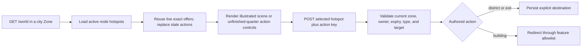

# frozen_string_literal: true
---
title: City Feature
description: Implementation handbook for the observed five-district Forpost graph, illustrated navigation, buildings, gate handoff, responsive scene scaling, and persisted context.
status: Fully Implemented
updated: 2026-09-11
owners: City world context and city UI
template: feature-v1
---

# City

This document is the implementation contract for the current Forpost City. It covers the five-node graph observed on 2026-07-28, its authored 1250 × 600 scene, building hovers, district arrows, server-authored actions, outdoor handoff, persistence, responsive behavior, and Shop integration.

A visible landmark is not automatically an implemented service. The City navigation surface may expose presentation-only buildings without inventing their economy, transport, treatment, legal, profession, or quest behavior.

The city's outdoor footprint and its entered districts are different surfaces.
Outdoors, World renders the city illustration across ordinary 100px map cells,
with the same viewport fitting and incremental cell updates as surrounding
terrain. Enter is offered only at the two authored gate cells. Accepting it
opens the district graph documented here; the 1250 × 600 district scenes are
not outdoor tiles and have no walking grid. World owns that exterior rendering
and its separate raster-density contract.

## 1. Design authority and related documents

Domain navigation: `doc/domains/city.md`.

Neverlands is the sole game-design and visual/interaction reference for City. Local code recreates that contract using project-owned artwork, CSS, semantic HTML, and suitable ASCII/plain-text controls. Neverlands runtime images, logos, identity text, administration copy, and decorative assets are evidence only and must not be shipped. Source controls retain their meaning and accessible names through locally authored presentation.

The user explicitly authorizes generated original City route-arrow decorations
inside semantic buttons. Their images are decorative and non-interactive; the
button keeps its destination label, keyboard behavior and server-offer action.
This exception permits separate project-owned decorations, not source image
copying or arrows baked into scene backgrounds. Exact production records are
in ARTWORK.md; section 15 owns the actual runtime acceptance results.

When live behavior and this handbook disagree, re-observe once in the existing session, record the evidence, then update catalog, seeds, presentation, tests, and this handbook as one change.

Related documents:

- `doc/design/reference/city/observations/2026-09-10_quarter_artwork_and_navigation.md` — fresh quarter compositions, arrow directions and eight-route survey.
- `doc/design/reference/city/observations/2026-07-28_city_movement_and_services.md` — current five-district observation plus historical captures.
- `doc/design/reference/world/observations/2026-09-09_starter_routes.md` — both Forpost gates, the Residential-to-Law route, and reciprocal outdoor entry.
- `doc/design/reference/economy/observations/2026-05-21_lavka_shop.md` — Shop hierarchy and controls.
- `doc/design/reference/shell/observations/2026-07-28_game_shell_and_mvp_surfaces.md` — persistent shell and responsive acceptance.
- `doc/design/reference/social/observations/2026-09-07_cell_chat_and_presence_boundaries.md` — separate City, Shop, and Arena-room audiences.
- `doc/design/areas/cities_and_buildings.md` — design-area summary.
- `doc/design/launch_mvp_plan.md` — 1:1 UI/UX parity matrix.
- `doc/features/world.md` — outdoor cells, movement, offers, and gate entry.
- `doc/features/shop_economy.md` — Shop catalog and transactions after entry.

### 1.1 Cross-feature relationships

| Related feature | Relationship | Ownership and handoff |
|---|---|---|
| `doc/features/world.md` | Central Square round-trips through `[6,8]`; Law Quarter round-trips through `[11,9]`. | World owns outdoor coordinates and shared offer acceptance. City owns the exact node and exit control. |
| `doc/features/game_shell.md` | City replaces the outdoor center while retaining the same character, presence, chat, and navigation frame. | Shell owns persistent framing; City owns the illustrated or explicitly unfinished navigation surface. |
| `doc/features/shop_economy.md` | Central Square exposes the active Shop hotspot and validates entry/return. | City owns availability and location. Shop owns catalog, buy/sell, wallet, and saved Shop filters. |
| `doc/features/arena_combat.md` | Central Square exposes the active Arena hotspot without the stale level-23 gate. | City owns entry availability. Arena owns lobby, matchmaking, and combat. |

## 2. Feature summary

Forpost is a graph of five city `Zone` records. Each node uses sentinel coordinate `[0,0]`; `CharacterPosition.zone` is the authoritative district. A district click accepts a fresh character-owned `WorldActionOffer`, persists the destination zone immediately, and renders the next scene without a movement timer.

Each of the five districts has its own original 1250 × 600 scene at offset
`[0,0]`, scaled uniformly to its display footprint. Central Square retains
`city/central-square.png`; Residential, Knowledge, Business and Law use their
own `city/<name>-quarter.png` assets. Each named building fits inside its
complete composition and has locally authored geometry. The four quarter
scenes replace their prior explicit unfinished notices; missing-art fallback
remains a safe rendering state for unconfigured content. The existing
five-node graph, eight directed routes and service/gate action contract remain
unchanged. `CityCatalog` supplies the baseline seed declaration;
persisted `Zone.metadata.city_presentation` supplies each runtime image asset,
size, offset, focal point and presentation-only landmark, while `CityHotspot`
supplies action bounds, optional percentage polygon and arrow direction. The
same selected image and CSS polygon render the scene and clipped brightened
hover/focus crop; no Neverlands city image is bundled.

The current slice contains:

- five districts and eight explicit directed links;
- 15 actionable hotspots in the catalog/seed contract: eight routes, five
  buildings and two verified outdoor exits; the bounded development-data
  repair and its outcome are recorded in section 5.2;
- active Arena, Shop, Hospital, Market, and Airship Station entry points;
- original generated route-arrow decorations, hover/focus highlighting and
  pointer-following tooltips inside accessible semantic controls;
- responsive pane-relative image/mask scaling, with the same route controls
  reflowing below the image on narrow screens or coarse pointers;
- exact district and safe interior context persistence.

## 3. MVP goals and non-goals

### Goals

- Reproduce the current five-district Forpost graph and 1250 × 600 city-image navigation language.
- Make the illustration and its overlaid hit regions the primary city UI.
- Match building hover, tooltip, and district-arrow behavior with project-owned primitives.
- Use fresh server offers for every route, feature, and verified exit.
- Preserve native authored geometry while scaling the complete scene into desktop and narrow containers.
- Preserve the exact current district across reload, building return, and login resume.
- Render observed unavailable landmarks honestly without inventing actions.

### Non-goals

- A generic town grid, city movement timer, pathfinding avatar, or inferred reverse routes.
- Copying Neverlands city/Shop images, tooltips as bitmaps, logos, or identity prose.
- Treating presentation geometry, arrow visibility, or labels as authorization.
- Inventing Auction lot trading or Neverlands repair formulas without authenticated evidence.
- Assigning an unobserved outdoor destination to another city exit.
- Preserving the superseded nine-node `city2_*` topology as current Forpost behavior.

## 4. Player experience

### 4.1 Entering City

The verified `outpost_gate` outdoor building enters `main` / Central Square at `[0,0]`. A new playable character with no position also starts there. Existing characters on one of the five retained nodes keep that exact district and coordinate.

The matching Central Square `west_gate` action exits to Outpost Surroundings
`[6,8]`, whose source coordinate is `[1000,1000]`. The second outdoor building,
`outpost_east_gate` at `[11,9]` (source `[1005,1001]`), enters `forpost4` / Law
Quarter `[0,0]`; its `east_gate` hotspot returns to that exact outdoor cell.
The verified district route is Central Square → Residential Quarter → Law
Quarter. Business Quarter is not the intermediate district. Seeds retain both
verified gates and remove superseded gate declarations.

An existing database must synchronize affected City presentation after a catalog
change, through the existing seed workflow or an exact-target managed update
that preserves gameplay fields and cancels stale action offers. The normal
`bin/rails db:seed` path is an idempotent authored-content sync: it updates retained
zone metadata, replaces legacy hotspots, removes retired City tile/spawn rows,
cancels live capabilities for retired actions, and moves a character stranded
on a removed `city2_*`-only node to Central Square `[0,0]`. Do not use
`db:seed:replant` for this upgrade because it destroys unrelated development
data.

### 4.2 City scene

The illustrated scene contract shared by all five districts is:

- image frame: centered 25:12 footprint, capped to available width on a white
  page; the outer viewport also contains reflowed route controls when needed;
- canvas: authored 1250 × 600 at every breakpoint, with one display transform;
- project image: node-selected asset and native dimensions, positioned by the
  node's pixel offset; all five current assets are 1250 × 600 at `[0,0]`;
- action geometry: native-pixel bounding boxes, with optional percentage
  vertices inside each box; the image, boxes, polygons and highlights share the
  same uniform scale without modifying stored geometry;
- routes: original raster arrows with a pale silver CSS treatment inside semantic buttons,
  overlaid at authored coordinates on desktop or reflowed below the image for
  narrow/coarse input;
- tooltip: 12px Arial, white background, 1px gray border, pointer/focus relative
  and clamped inside the visible viewport, outside the transformed canvas.

The shared `nl-scene-size` controller calculates desired height as
`clamp(300px, 75% × (main pane height + top-bar height), 600px)`. Display width
is the smaller of that height × 25/12 and the available container width;
image height follows the same ratio. The native scene's scale is display
width ÷ 1250. Its absolute positioning and sized image frame avoid retaining an
unscaled layout footprint. A reflowed route row adds its own normal-flow height
below that frame without changing the illustration's ratio. Desktop, `820px`
and `390px` clients see the full
scene without page overflow or manual map panning.

The September 10 size correction applies the user's agreed Shop display size to
illustrated City scenes. It is an explicit
local adaptation, not newly captured Neverlands City behavior. Sizing alone
does not change native image offsets or stored geometry and requires no reseed
or migration. A separate authored silhouette change must reach the persisted
records through the seed/content workflow below. Stored focal points remain
authored data but are not used to pan a fully visible scene.

The subsequent user-requested Central Square artwork replacement removes the
old composition's clipped Workshop and foreground buildings. It uses a new
original 1250 × 600 scene, with all Central action bounds, route positions and
landmark silhouettes authored against that image. This is a local artwork
replacement preserving the captured building identities and navigation graph,
not new Neverlands evidence. The new asset selection and geometry require
the existing persisted-content sync; changing only the PNG would leave old
targets attached to the previous composition. ARTWORK.md owns its exact image
generation prompt and delivery specifications.

The September 10 quarter survey supplies Residential, Knowledge, Business and
Law's building identities and broad composition. Four distinct original scenes
now follow that evidence, with a generated original route-arrow decoration
shared across all districts. Incidental background houses, walls and vegetation
are not extra actions. Building illustrations do not expand service mechanics;
Gallows remains a landmark until its linked source flow is captured.

If a zone has no explicit image asset, the retained fallback renders an
unfinished notice and readable reflowing action buttons instead of borrowed
art or phantom landmarks. Names/reasons are visible, building controls wrap
with a 44px minimum height and route controls with a 48px minimum height;
neither scene-sizing nor tooltip controller is loaded.
This is a missing-content boundary, not the intended presentation of the five
authored districts. The prior placeholder verification remains historical.

The Shop retains its decorative `shared/building_entrance` partial and shares
the same sizing controller. Entrance and
[interactive City technical specifications](../ARTWORK.md#interactive-city-image-specifications)
are declared in ARTWORK.md. Village and other linked-location canvases retain
their separate presentation contracts.

### 4.3 Hover, pointer, touch, and keyboard

The illustrated interactions below apply to all five authored districts.
Missing-art content uses the fallback described in section 4.2.

- Pointer enter/focus reveals a brightened crop of the project city image for
  buildings and landmarks. Authored building silhouettes exclude the
  surrounding street from both hit testing and highlighting; there is no
  decorative rectangular inset border.
- Route arrows retain their original silhouette with a pale silver palette and
  dark edge shadows; hover/focus further brightens the decoration. Keyboard
  focus remains visible on the semantic control.
- Desktop district arrows stack above the image plane. Their authored boxes
  must avoid intercepting a neighboring building or exit. At viewport widths
  of 700px or less, or with a coarse primary pointer, the same controls reflow
  below the image with visible names instead of enlarging targets over buildings.
  The missing-art fallback also places actions in normal flow.
- Pointer movement repositions the unscaled tooltip with a 15px offset and
  clamps it inside the visible viewport. Keyboard focus anchors to the
  building's displayed bounds. Long labels wrap within available width, and
  resizing hides the previous tooltip so its coordinates cannot become stale.
- Every actionable region is a real form button with an accessible name.
- Presentation-only landmarks and blocked actions are focusable semantic regions with text tooltips and no form.
- Narrow/coarse layouts retain the same server-rendered route buttons and
  offers, with 48px minimum height, 40px arrow images and wrapped 12px names.
  Building masks remain aligned with the scaled image; no second map or
  duplicate route form is introduced.

The named coarse-pointer alternative currently covers district routes only.
Building and exit masks still shrink with the scene. At `(max-width: 700px)` or
`(pointer: coarse)`, named building controls also reflow below the illustrated
scene with a 48px minimum height (`nl-city-building-controls`), closing the
`UI-ADAPT-005` gap for small building targets. Scene masks remain for fine-pointer
desktop use. Phone-width pointer checks and the coarse-route system coverage
remain the acceptance baseline for route taps.

#### 4.3.1 Hotspot geometry and highlight algorithm

The same shape owns the pointer target and its visible highlight. A building's
roof, walls, towers and visible annexes must be covered together; empty street
corners and neighboring buildings must remain outside its mask. Central
Square and the four quarter images keep each named target inside the frame;
incidental background architecture is not a hotspot. Missing-art controls do
not use illustrated masks. Source building
layers establish the interaction, but their coordinates cannot be copied onto
the differently composed project illustration.

Runtime geometry resolves in this order:

| Property | Runtime owner and fallback |
|---|---|
| Image selection, size, offset and presentation-only landmarks | Nonempty `Zone.metadata.city_presentation`; otherwise the node's `CityCatalog.presentation`. This is a whole presentation selection, not a recursive merge. An illustrated scene requires an explicitly selected image; missing artwork renders the unfinished-quarter controls instead of a legacy image fallback. |
| Action bounding box | `CityHotspot`'s `position_x`, `position_y`, positive `width` and `height`; otherwise the node/key catalog box. |
| Action silhouette | Valid `CityHotspot.action_params.polygon`; otherwise the node/key catalog polygon. |
| Route direction | Present `CityHotspot.action_params.direction`; otherwise the node/key catalog direction. |
| Unfinished quarter | Existing action records and offers render as readable reflowing controls; no image-derived geometry or presentation landmark is emitted. |

`Zone.metadata.city_presentation.hotspots` is not the action override used by
the view: action records own those fields. `CityCatalog` is the authored seed
baseline; changing it alone does not replace existing persisted boxes or valid
polygons. See [authoring and QA](#433-authoring-and-qa) before updating a mask.

The rendering steps are:

1. Render the node's `image_asset` at `image_size` and `image_offset` inside the
   native 1250 × 600 scene. Central Square selects `city/central-square.png`,
   `[1250, 600]`, `[0,0]`, so its image and scene coordinates are identical and
   the full image is visible. The four quarter assets use the same size/offset;
   only a missing-art fallback skips this image/mask path.
2. Position the action or landmark's box `[left, top, width, height]` in native
   scene pixels. Polygon vertices are percentages of that box, not of the
   image or viewport: `(u, v)` becomes
   `(left + width × u/100, top + height × v/100)`.
3. `WorldHelper#city_hotspot_polygon_style` formats validated vertices into
   `--nl-city-hotspot-clip: polygon(...)`. The hotspot's CSS `clip-path`
   clips both the element's pointer hit region and its painted contents.
   Without an authored polygon, the box remains rectangular.
4. The hotspot's `::before` draws that same selected asset, using its native
   width and height as `background-size`, positioned at
   `(image_x - left, image_y - top)` relative to that box. This subtraction
   reproduces precisely the image beneath the target. The parent's clip clips
   this crop too; there is no separate highlight mask to drift out of alignment.
   On hover or visible keyboard focus, the crop uses
   `brightness(1.22) contrast(1.04) saturate(1.18)` and opacity `0.88`.
5. Apply the common scene scale `s = displayed_width / 1250`. A native point
   `(x, y)` displays at `(viewport_left + s × x, viewport_top + s × y)`.
   The browser transforms building painting and hit testing together. Do not
   separately resize the image or recompute polygon percentages for mobile.
   Route controls use this same scale for desktop overlay coordinates, then
   leave the image plane in narrow/coarse layouts as described below.

The native canvas, image frame and displayed viewport use `overflow: clip`. This
preserves the crop when keyboard/assistive navigation calls `scrollIntoView`
on a transformed hotspot. `overflow: hidden` allowed the larger original
image to pan internally during manual route-focus checks.

`Game::World::CityCatalog.valid_polygon?` requires 3–32 points, each exactly
two finite numeric percentages in `0..100`, with nonzero signed area.
`CityHotspot` validates submitted action polygons and `Zone` validates supplied
presentation hotspot/landmark polygons before persistence. The view helper
validates again before emitting CSS. Invalid legacy action polygons fall back
to the catalog; an invalid landmark polygon emits no clipping CSS. These checks
do not establish that a polygon follows a building or is free of self-crossings;
the authoring review and visual/hit-test checks must establish that. Polygon
data never authorizes entry: current server offers, position and feature
permissions still decide the action.

#### 4.3.2 Layers, controls and tooltip

The native scene isolates its stacking context. The base image is at
`z-index: 0`, presentation landmarks at `2` and building action hotspots at `4`.
Within the ordinary action layer, the `for_zone` scope orders records by their
persisted `z_index`. District forms render once in a sibling `.nl-city-routes`
navigation region outside the transformed canvas, with controls at layer `5`.
`world/_city_action` renders both offered and blocked actions; no second mobile
form, capability key or route state is created. The route navigation wrapper
ignores pointer events while its controls accept them. Highlight crops and
arrow images cannot intercept the control's click.

On desktop, each route's left/top/width/height is its authored box multiplied
by the same `--nl-scene-scale` used by the canvas. The
256 × 256 RGBA `city/route-arrow.png` fills the route box with
`object-fit: contain`; its retained 64px HTML attributes are not the CSS display
size. Idle decoration uses `grayscale(1) brightness(2.2) contrast(1.15)` and
dark silhouette-following drop-shadows to distinguish it from scenery.
Hover/focus brightens the same silhouette. The user requires the original
arrow shape: no round badge, enclosing ring or added backplate is rendered.
The east-pointing PNG rotates in 45-degree steps for stored direction.

At `(max-width: 700px)` or `(pointer: coarse)`, that same route navigation
becomes a wrapping row below `.nl-city-image-frame`. Controls have a 48px
minimum height, 40px arrow images and visible wrapped 12px destination labels.
The named controls retain their ordinary dark rectangular background and
inset keyboard-focus outline. Stored route boxes remain unchanged and no enlarged
invisible hit region covers a building. This is the local adaptive affordance
required by `UI-ADAPT-005`, not a newly observed source layout.

The arrow has empty alt text, `aria-hidden`, disabled dragging and no pointer
events. Its semantic control retains destination naming, focus and submission.
No PNG or generation prompt changed for this visibility correction.

An offered action is an accessible submit button in a POST form containing
the hotspot id and opaque action key. A blocked action or presentation landmark
is a focusable `role="img"` region with a label, no form and no invented action.
Illustrated controls share pointer/focus tooltip events; route geometry follows
the desktop/reflow rules above, while building and landmark masks stay native.

The tooltip is a sibling of the image frame and route navigation inside the
outer viewport, so its 12px text and 15px pointer offset remain display pixels.
It falls back to the
visible hotspot's bounds for keyboard focus, wraps to at most 260px, and stays
4px inside the viewport. Pointer leave, blur or a scene resize hides it. The
size controller observes the viewport, gameplay pane and top bar, then
disconnects its observer when the element leaves the document.

#### 4.3.3 Authoring and QA

For a baseline building-mask correction:

1. Inspect the actual project image with the node's current crop at native
   scale. Start with a tight scene-pixel box enclosing the complete visible
   building, then trace its silhouette in box-relative percentage vertices.
   Include narrow roofs/towers and visible walls; exclude streets, unrelated
   shadows and adjacent architecture. Avoid self-crossings and overlapping
   masks unless the illustrated depth order requires them.
2. Update the matching stable key in `CityCatalog::PRESENTATIONS`. For an action,
   sync its box and polygon into `CityHotspot`; for a landmark, sync the zone's
   `city_presentation`. Use the existing idempotent seed workflow described in
   section 4.1 or the corresponding managed content owner. Do not introduce a
   second browser-only geometry catalog. A changed source asset/crop also
   requires reviewing every affected mask and its background alignment.
3. Check roof, wall, annex and edge points across every changed building, plus
   nearby street points that must not hit it. A successful center click alone
   does not prove coverage. Inspect the hover crop for missed walls, lit street
   corners, and pixels displaced from the underlying image.
4. Repeat at desktop, 820px and 390px widths, plus the minimum and maximum
   requested heights. Check real browser hit testing at polygon interiors and
   exterior corners, keyboard focus and scroll-into-view without changing the
   crop, tooltip bounds, overlap priority, a real
   building entry/return, and route navigation. Keep these regressions in the
   City view, catalog/seed and browser specs listed in section 15. Check route
   silhouette contrast at rest, visible narrow/coarse labels and focus, minimum
   control height, and exactly one form/key per route across layout changes.

The image's encoded resolution, crop and display formulas are the
[interactive City image specifications](../ARTWORK.md#interactive-city-image-specifications).
Geometry-only corrections do not require a generated image or a new image
prompt; record a new prompt in ARTWORK.md only if an image is actually generated
or edited.

**Remaining evidence boundary:** distinct quarter art does not implement
uncaptured building services. The source Gallows link is observed but its flow
is unexercised; it remains presentation-only locally. Final local geometry and
browser acceptance for this artwork batch are recorded separately in section
15 and must not be inferred from successful image generation.

### 4.4 District movement

1. The current render reuses live exact-action City offers at the same persisted position, preserving their keys and expiry deadlines.
2. The player activates a route button and submits hotspot ID plus opaque action key.
3. The server resolves the hotspot only from the current zone and validates the exact offer.
4. `CharacterPosition` moves to the explicit destination zone at `[0,0]`.
5. The offer completes and World renders the destination scene with new offers.

There is no interpolation, pending movement command, browser-authored destination, or geometry-derived adjacency.

A repeated or second-tab read does not invalidate a still-visible live action.
Expired, consumed, changed, or obsolete offers are never reactivated; a newly
available action receives a new key. Acceptance still revalidates the current
position, hotspot, ownership, status, and expiry.

### 4.5 Building entry and return

An `open_feature` action leaves `CharacterPosition` unchanged and redirects only through `CityHotspot::FEATURE_ROUTES`. Shop is on Central Square in the current graph. City/building pages return through `/world`, which renders the same persisted district. Direct URL entry is revalidated against the current active hotspot.

Arena HTML room entry additionally persists the selected accessible room id.
The room's optional `zone_id` must match the current city; existing unbound
rooms still require valid City Arena entry. A fresh login can restore that
saved room without the old entry cookie. JSON previews do not select a room,
and a generic lobby does not invent a default selection. Arena owns these
access checks and the active-fight redirect.

The shared presence/local-chat partition distinguishes the city node from
validated Shop, read-only building, and selected Arena-room contexts. Presence
includes only recent open sessions and the playable character; its bounded
list, full count, and refresh lifecycle belong to `doc/features/game_shell.md`.
Shop, Arena, and read-only City interiors rebuild presence after saving entry
context. `CityBuildingsController#show` renders the new building's label,
count, and player list in its first authorized response. Arena room Enter
links refresh the full shell so the presence panel changes with the room.
City-building entry holds the character lock across fresh access validation, position
reload, context persistence, presence preparation, and rendering. A city
transition that wins the lock first prevents entry through the old building
URL and preserves the newer position and room/chat context.

## 5. Feature topology and authored content

| Runtime node | Player-facing title | Directed links | Actionable buildings / exit |
|---|---|---|---|
| `main` | Central Square | Business Quarter, Residential Quarter | Arena, Shop, Hospital, City Exit |
| `forpost1` | Residential Quarter | Central Square, Knowledge Quarter, Law Quarter | Airship Station, Market |
| `forpost2` | Knowledge Quarter | Residential Quarter | None |
| `forpost3` | Business Quarter | Central Square | None |
| `forpost4` | Law Quarter | Residential Quarter | City Exit |

The directionality is explicit. Code must not infer a reverse link, shortest path, or adjacency from scene geometry.

### 5.1 Presentation-only landmarks

| District | Observed landmark identities | Current local presentation |
|---|---|---|
| Central | Tavern (rest/fatigue), Workshop (craft), Guard Tower (live routes), Hospital/Shop/Arena hotspots | Entered service interiors |
| Residential | Clan Hall (presence/Assault meetup), Post, City Hall treasury/quest links | Entered interiors |
| Knowledge | Library handbook; Magic/General/Military schools show live skill snapshots (allocation still on the character sheet) | Entered interiors |
| Business | Auction treasury snapshot + Shop/Buyer links; Souvenir Shop; Dealer House → Buyer; Obelisk; Bank; Temple | Mixed: services + orientation |
| Law | Law Abode (alignment), Prison/Gallows handbooks, east gate outdoor handoff | Entered interiors |

These labels preserve RPG-domain meaning but do not copy source-platform identity text. No mutation or interior is implied.

### 5.2 Gate handoff

| City action | Outdoor destination | Captured source coordinate | Status |
|---|---:|---:|---|
| Central City Exit | Outpost Surroundings `[6,8]` | `[1000,1000]` | Catalog/seed and repaired development data; reciprocal entry restores Central Square |
| Law City Exit | Outpost Surroundings `[11,9]` | `[1005,1001]` | Catalog/seed and repaired development data; reciprocal entry restores Law Quarter |

The quarter-artwork audit previously found 14 active actions: Law's exit,
reciprocal entrance and `[11,9]` cell were missing, while Central's west gate
still targeted `[7,0]`. The artwork-only reconciliation deliberately left
that gameplay/data mismatch unchanged. The later explicit gate-repair task
resolved it through `Seeds::ForpostGateRepair`, without running a full seed.
Current development data has **15 active actions and eight unique district
routes**, with both reciprocal pairings above. Five old `city2_*` zone rows
remain empty of actions and character positions; they are not duplicate routes.

The development repair changed **26 cell rows, two City exits, two outdoor
entrances and one retired gate marker**. Read-back comparisons preserved
player, economy, zone, NPC and movement snapshots. A second call returned zero
for all change counts. These are scoped data-reconciliation results; the
separate automated/manual acceptance record in section 15 owns gameplay proof.

#### 5.2.1 Bounded repair owner

`db/seeds/forpost_gate_repair.rb` defines
`Seeds::ForpostGateRepair.new(cell_catalog: Game::World::StarterCellCatalog.default).call`.
The injectable catalog supplies `zone_name` and `at(x, y)`; `call` takes no
arguments and returns changed-record counts for `cells`, `city_exits`,
`outdoor_entrances` and `retired_markers`. It is an explicit operator repair,
not a request-time service or a replacement seed pipeline. The repeatable
development command and failure handling are in
[Managing Game Content](../guides/managing_game_content.md#bounded-forpost-gate-repair).

One transaction locks the three exact existing zones: Central, Law and their
captured outdoor region. It reconciles both gate pairs and the 26-cell union
of their immediate neighbors plus the eastern `[11,9] → [12,10] → [13,10]`
path. Importing neighboring passability prevents sparse missing cells from
inventing exits through source-blocked terrain. Atlas-backed and independently
managed cells are retained; a required managed path cell that is blocked
rejects the whole repair. Missing/duplicate zone identities, out-of-catalog
coordinates, incompatible gate identities or an independently occupied gate
cell also raise `Seeds::ForpostGateRepair::Conflict` and roll back every write.

The repair preserves unrelated metadata, retires only a matching superseded
`city_gate` marker, and cancels changed targets' live offers in the same
transaction. It does not relocate characters or change accounts, inventory,
economy or NPCs. `Seeds::WorldContentSupport` owns the shared cell-art/content
and gate attribute builders used by this repair and the normal `world_cells`,
`world_locations` and `city_hotspots` seed phases, so both paths retain the
same authored content contract.

## 6. Feature surfaces and contained behavior

### 6.1 Interaction status

| Destination | District | Status | Owner |
|---|---|---|---|
| Arena | Central | Interactive, required level `0` | Arena controllers/services/UI |
| Shop | Central | Interactive | Shop catalog, transactions, wallet/inventory, and Shop UI |
| Hospital | Central | Read-only interior | City building catalog |
| Market | Residential | Stall information and Merchant license qualification | City building catalog; Shop-owned qualification service |
| Airship Station | Residential | Origin-specific route table; configured journey handoff, default routes unavailable | `doc/features/airship_travel.md` |
| All presentation-only landmarks in section 5.1 | Their authored quarter | Hover/focus only; no new service actions | City presentation |

### 6.2 Deferred building behavior

The completed September 8 Forpost-to-Oktal capture now supports the separate
Airship lifecycle in `doc/features/airship_travel.md`. Station access preserves
the district until boarding. While aboard, ground City links and direct
building URLs are rejected; explicit arrival landing saves the destination
station. The normal Forpost table has the captured 350/150/150 NV fares, but
paid offers require complete destination, dated schedule, and path content.
No additional populated region is seeded.

Building names, visible tabs, prices, routes, or “entry forbidden” states captured historically are evidence, not active offers. Do not add a transaction, schedule, treatment, rent, processing recipe, legal action, or profession rule until its complete current flow is captured and scoped in its owning feature.

## 7. Authoritative data and presentation model

| Component | Responsibility | Contract |
|---|---|---|
| `Zone` | Durable district and runtime scene presentation | Stable city/node keys, title, image asset/size/offset, focus, and presentation-only landmarks live in metadata. |
| `CharacterPosition` | Exact current district | Zone and `[0,0]` survive reload/login. |
| `CityCatalog` | Baseline declaration used by seeds | Five source-backed nodes, links, features, two gates, dimensions, offsets, boxes, arrows, focus, and landmarks; runtime does not require a second action lookup here. |
| `CityHotspot` | Persisted action and presentation definition | Zone-scoped type, destination/feature, active state, required level, native pixel box, direction, and z-order. |
| `WorldActionOffer` | Short-lived per-character capability | Exact node/position/target, opaque key, expiry, and status. |
| `ResumeContext` | Safe last-surface routing | Stores allowlisted context; never replaces authoritative position. |

### 7.1 Graph versus presentation

City zones are not local grids. Seeds remove city `MapTileTemplate` rows and
materialize catalog declarations into `Zone` plus `CityHotspot`. Runtime graph
navigation comes from active hotspot records. Pixel boxes, image offsets, and
directions are persisted presentation metadata and never decide availability
or destination.

### 7.2 Hotspot types

| Hotspot/action | World action | Result |
|---|---|---|
| `district` / `enter_zone` | `city_transition` | Move to explicit city zone. |
| `exit` / `enter_zone` | `exit_city` | Move to explicit outdoor cell. |
| `building` / `open_feature` | `enter_city_building` | Redirect through the feature allowlist without moving. |

All current Forpost actions use required level `0`, including Arena as observed
with a level-16 account. `CityHotspot.for_zone` omits inactive records from the
rendered surface. Active records unavailable to a missing or under-level
character receive no offer and expose their block reason without a form.

### 7.3 Persisted graph reconciliation

`CityCatalog` is the baseline authored declaration and `db/seeds.rb` is its one
persisted materialization pipeline. `Zone` and `CityHotspot` are runtime truth.
A graph replacement must reconcile both declarations and already-stored state;
adding a second runtime catalog or presentation-only compatibility graph is not
allowed.

The current sync performs these changes together:

- retained zone names receive their canonical `main` / `forpost1..4` metadata;
- current hotspots are upserted and every stale hotspot across old Forpost
  zones is retired;
- open or accepted offers tied to retired zones/actions are cancelled;
- characters on removed-only nodes are recovered to Central Square `[0,0]`;
- obsolete City spawn/tile rows and retired outdoor gate buildings are
  removed; the verified west/east gate rows are reconciled to their exact
  destinations;
- a second seed run makes no further state change.

### 7.4 Admin management surface

For task-oriented City node/hotspot examples and the safe extension pattern for
additional management resources, use `doc/guides/managing_game_content.md`.
This handbook remains authoritative for City runtime and content lifecycle.

The admin-only `/manage/cities` CRUD edits city `Zone` records and JSON scene
metadata. `/manage/city_hotspots` edits the same routes, building entries,
exits, destinations, feature keys, required levels, active state, pixel boxes,
directions, and z-order consumed by `WorldController` and
`CityActionOfferBuilder`. `/manage/audit_events` exposes their immutable
mutation history.

Changes are visible on the next City render. Editing or deleting a hotspot
cancels its offered/accepted capabilities in the same transaction as the
content change and audit event. A city node referenced by positions, hotspots,
incoming routes, or gates cannot be deleted until those dependencies are moved
or removed. JSON must parse as an object, and feature navigation remains
restricted by `CityHotspot::FEATURE_ROUTES`. Successful writes redirect with
`303 See Other`; audit actor, record identity, and action vocabulary also have
database constraints.

`/manage` changes the database only. Running `bin/rails db:seed` later restores
the source-backed Forpost baseline from `CityCatalog`; promote an intentional
baseline edit into the catalog/seeds and coverage rather than relying on one
environment's managed override.

## 8. Runtime architecture



### 8.1 Render

`WorldController#prepare_city_view` supplies the current position and scoped
hotspots to `CityActionOfferBuilder`. Under the character lock, the builder
reloads the persisted position and available hotspots. A stale requested
zone/cell returns no offers without cancelling those issued at the newer
position.

The builder returns live offers matching the exact character, zone/cell,
hotspot, action type, and authored context (city node key, hotspot key,
feature, and hotspot revision). Reuse preserves the original key and deadline.
Expired, consumed, or changed actions receive replacements; other offered
capabilities for that character are cancelled. Serialized repeated reads
converge on the same live keys.

`world/_city_view` partitions active persisted hotspots into building and route
regions; each is rendered once through `world/_city_action`. Only offered hotspots
become form buttons. With an explicitly selected image, persisted scene
metadata supplies its geometry and separate presentation-only landmarks, which
never create offers. Without artwork, the same offered actions become readable
controls in an unfinished-quarter layout; old image/landmark metadata does not
create an implicit illustrated fallback.

### 8.2 Accept

`CityHotspotService` accepts only a current-zone hotspot and a matching character-owned offer. Zone transitions require an explicit destination. Building actions require an allowlisted route. Success completes the offer; failure preserves position and fails the capability.

Relocation holds the character and hotspot locks, writes the new position,
clears the previous saved interior/room, and synchronizes local-chat entry in
the same transaction. A failed transition preserves all three. Even an
unbound Arena room is cleared when the character leaves its current node.

### 8.3 Responsive initialization

For illustrated scenes, `nl_scene_size_controller.js` observes the scene
container, main pane and top bar, calculates the common display size/scale,
and disconnects its observer when removed. `nl_city_map_controller.js` only
owns tooltip text, pointer/focus placement, clamping and hiding; a size change
hides stale tooltip coordinates. Neither controller scrolls or recenters the
scene on its stored focal point. Unfinished quarters load neither controller:
their visible labels and normal CSS flow need no image scaling or tooltip.
Graph decisions and authorization remain server-owned.

## 9. HTTP and Turbo contract

| Method/path | Purpose | State change |
|---|---|---|
| `GET /world` | Render exact current City node and live offers | Reuses exact live keys/deadlines, replaces stale actions, and cancels obsolete offers; does not move. |
| `POST /world/interact_hotspot` | Accept route/building/exit capability | May move position or redirect to a feature. |
| `GET /city/buildings/:building_key` | Render an allowlisted interior or origin-specific airship station | Saves context; the station prepares/reuses server-owned boarding offers without charging or boarding. |
| `GET /shop` | Render Shop from Central Square | Shop owns later mutations. |
| `GET /arena` | Render Arena from Central Square | Arena owns later behavior. |
| `GET/POST/PATCH/DELETE /manage/cities` | Admin-only city-node CRUD | Atomically changes persisted City data and writes an audit event. |
| `GET/POST/PATCH/DELETE /manage/city_hotspots` | Admin-only route/building/exit CRUD | Atomically changes the existing action owner and cancels stale targeted offers. |
| `GET /manage/audit_events` and `GET /manage/audit_events/:id` | Review immutable content changes | Read-only bounded HTML. |

City has no public JSON API; blueprint and Swagger/rswag coverage do not apply.

## 10. Client-side and CSS ownership

`app/assets/stylesheets/world.css` owns City viewport/canvas dimensions, the common scene transform, project-image positioning, CSS hover crops, route arrows, tooltips and focus states. It must not introduce source runtime image URLs or brand-specific copy.

`app/javascript/controllers/nl_scene_size_controller.js` owns the shared display
calculation for decorative entrances and City. It observes the main pane,
player/navigation top bar and its container, updates `--nl-scene-height`, and
scales an optional native canvas target. Observers disconnect on removal.
`app/javascript/controllers/nl_city_map_controller.js` owns only tooltip
presentation. Forms, IDs, action keys, labels, blocked reasons and routes
remain server-rendered; browser scaling grants no gameplay authority.

`app/assets/stylesheets/manage.css` and the server-rendered `manage` layout own
the separate admin interface. It composes shared control tokens, uses local
table/nav overflow on narrow screens, and never joins the persistent gameplay
shell or turns browser geometry into game authority.

## 11. Persistence and login resume

District changes persist immediately in `CharacterPosition`. Returning from Shop/Arena/buildings shows the same node. Saved interior context is resumed only while its current-node hotspot remains active and accessible; otherwise login falls back to World without relocating the character.

An Arena room also revalidates its saved integer id, active state,
level/alignment, and optional city binding. Invalid or foreign-city rooms
cannot be recovered through an old session marker. Position changes reset
interior context atomically; building entry itself does not move coordinates.

## 12. Authorization, trust boundaries, and concurrency

- Authentication and the current playable character are required.
- Hotspots are loaded only from the authoritative current zone.
- Offers are character-owned, expiring, status-tracked capabilities for one exact target and position.
- Browser geometry, labels, hidden IDs, arrow direction, and tooltip content grant no authority.
- Destination zones/coordinates and feature routes come from server-authored records/allowlists.
- Accepted actions complete atomically at the service boundary; stale/replayed keys fail.
- Read-only building entry revalidates current-node access under the same
  character lock used by city movement, then saves context and renders the
  corresponding presence without a relocation window between those steps.
- `ManagePolicy` requires the explicit admin role; moderator, GM, player, and
  anonymous sessions cannot read or mutate management records.
- Management controllers allowlist fields and parse JSON server-side.
  `Manage::ContentMutation` commits the content change, stale-offer
  cancellation, and immutable audit event atomically.

## 13. Failure and boundary behavior

| Condition | Required behavior |
|---|---|
| Missing district artwork | Render the explicit unfinished-quarter notice and existing authoritative action controls; no replacement image, phantom landmarks or inferred routes. |
| No offer / blocked hotspot | Show an accessible reason without a submit action: an illustrated tooltip/label, or visible text in an unfinished quarter. |
| Missing, expired, foreign, mismatched, or wrong-node offer | Reject and preserve position. |
| Repeated or second-tab City read | Preserve exact live keys and deadlines so an already-visible action remains usable. |
| Builder's requested position is stale after relocation | Return no offers without cancelling newer-position offers. |
| Missing destination/unknown feature | Fail without movement or arbitrary redirect. |
| City relocation wins before building entry | Reject the old-node building and preserve the newer position, gameplay context, and local-chat context. |
| Narrow viewport/coarse pointer | Scale the illustrated image and building masks; reflow the same named route controls below it with a 48px minimum height. Unfinished content uses ordinary controls. No page-level horizontal clipping or duplicated route forms. |
| Law Quarter City Exit | Accept the current offer to `[11,9]`; the reciprocal outdoor entrance restores `forpost4`, not Central Square. |
| No selected project image | Render the missing-art controls described above. A selected asset whose file is missing is an asset-delivery defect, not this fallback; the view does not probe or repair missing image files. Never fall back to a Neverlands URL. |
| Existing `city2_*` persisted graph | Run the convergent seed sync; retained nodes keep their identity, removed-only positions recover to Central Square, and obsolete actions cannot remain interactive. |
| Invalid management JSON or hotspot/zone value | Render HTTP 422 with errors; write no content or audit event. |
| City node still has positions/routes/buildings | Refuse deletion and preserve the complete graph. |
| Managed hotspot changes while an offer exists | Cancel the stale targeted offer in the same transaction; render a fresh offer from the new record. |

## 14. Acceptance criteria

- Five districts and eight directed links match the 2026-07-28 observation.
- Shop, Arena, and Hospital are on Central Square; Market and Airship Station are Residential.
- Each district's authored scene remains 1250 × 600; its visible size follows the shared pane-relative formula and container width cap.
- Illustrated buildings/landmarks highlight on hover/focus and show compact pointer-following tooltips.
- Illustrated district routes use the original generated arrow silhouette with
  observed direction, pale silver treatment and dark edge shadows; narrow/coarse layouts
  expose the same buttons below the image with readable names and 48px minimum
  height. Each route has exactly one form and current capability key.
- Missing-art fallback identifies that state, reflows controls and renders no substitute image or presentation landmarks; it is not the configured state of the five authored districts.
- Desktop, `820px` and `390px` clients preserve image/hotspot/highlight alignment under a common scale without body overflow.
- Illustrated pointer and keyboard labels retain readable 12px text outside the transform, remain within display bounds and clear on resize; unfinished quarters expose names/reasons directly without tooltip controllers.
- Only current server offers create form actions; presentation-only landmarks cannot mutate.
- Central and Law exits round-trip through their respective `[6,8]` and `[11,9]` outdoor cells; retired gate declarations are removed.
- An existing nine-node database converges to the five-node graph without stranding a character or leaving a live obsolete exit capability.
- No Neverlands city/Shop image, logo, signature, administration copy, or asset URL is shipped.
- `/manage` edits the same `Zone` and `CityHotspot` records rendered by City;
  actions are audited, responsive, dependency-safe, and do not create a
  parallel graph.

## 15. Test strategy and required coverage

Coverage includes catalog graph/geometry, polygon validation and seed persistence,
seed convergence/idempotency, rendered action capability fields, blocked and
landmark semantics, building pointer/keyboard highlight and tooltip bounds,
district/building/gate navigation, wrong/foreign/stale offers, login context,
and desktop/mobile geometry.

`spec/services/game/world/city_hotspot_service_spec.rb`,
`spec/services/chat/local_context_transition_spec.rb`, and
`spec/requests/arena_room_context_spec.rb` cover atomic position/context changes, room-preview
non-mutation, foreign-city denial, and fresh-login room restoration.
`spec/requests/city_buildings_spec.rb` covers first-response label/count/list
and chat scope for Hospital, Market, Airship, Junk Dealer, and Numismatics,
plus denied-entry context preservation and a real city relocation that wins
before the entry lock.
`spec/system/arena_room_presence_spec.rb` verifies immediate
room-audience replacement through both Arena Enter links without automatic
presence refresh.
`spec/services/game/world/city_action_offer_builder_spec.rb` covers live-key
reuse, unchanged deadlines, expiry boundaries, consumed/changed actions,
competing reads, and stale-position preservation.
`spec/system/city_navigation_spec.rb` exercises the district-to-Shop flow with
an additional same-session World read before clicking the still-visible Shop
action, then returns through City to the exact outdoor gate.
`spec/system/city_building_hover_spec.rb` owns building pointer/focus
presentation and visible tooltip bounds. Responsive acceptance also checks
the shared size calculation, transformed pointer regions and native authored
coordinates. September 10 size-correction verification passed the seven affected
view/system files (27 examples, zero failures), including scale checks at
`1500 × 640`, `820 × 900`, `390 × 844`, `1500 × 1200`, and `1500 × 901`.
They verify polygon interior/exterior hits, shared City/Shop dimensions,
resize, readable tooltips, and real Shop entry/City return. Manual local
browser verification also passed Central → Residential → Central and Shop
entry/return at desktop and mobile sizes. At `1119 × 890`, City and Shop
both measured `954.6875 × 458.25`; at `390 × 844`, City measured
`390 × 187.1953125` without page overflow. These are local display checks,
not additional Neverlands observations.

Before the complete-image replacement, the Central Square silhouette audit
retraced Arena, Shop, Hospital,
Tavern, Workshop, Guard Tower and West Gate against the project crop. It fixed
missed roof/spire/lower-wall pixels and neighboring tower, shrine and street
spill. The Guard outline excluded the foreground Shop spire. The browser spec
then checked 21 independent roof/facade/opening points and nine excluded street
points at `1500 × 901`, `820 × 900` and `390 × 844`, plus all nine targets'
keyboard traversal and scroll-into-view without crop movement. Catalog coverage
checks the foreground overlap; seed coverage checks every Central action mask
and landmark against the authored baseline. The final seven-file focused run
passed **44 examples, zero failures**.

Manual local browser checks confirmed all six building/landmark highlights,
stable lower-route focus, and a real mobile Shop-roof click followed by City
return. Four existing Central action masks and three landmark masks were
synchronized in the development database and read back against the catalog.
Only authored geometry was updated; changed action offers were cancelled by
the existing seed cleanup helper. The normal idempotent seed path consumes
these catalog changes on other existing databases; no migration is needed.
This local geometry audit adds no Neverlands gameplay evidence or new image
prompt. Final `bin/verify fast` passed:
553 files linted without offenses, 2,499 non-system examples with zero
failures, and feature/architecture documentation audits. Existing Rack status
deprecation warnings and documented partial-feature notices remain non-failing.
These results concern the previous crop and mask correction.

The subsequent complete-image replacement passed a fresh **46-example** run
covering CityCatalog, seed persistence, the City view, building hover,
navigation, pointer priority and responsive shell specs. The updated browser
checks use 35 independently selected roof/wall/annex/gate pixels across all
seven named targets, including the full right Workshop annex and lower
Hospital, and 12 excluded street pixels at desktop/tablet/mobile widths.
They also verify the image's encoded 1250 × 600 dimensions, zero offset,
image/scene edge alignment, matching hover background, keyboard traversal,
tooltip bounds and actual Shop activation through five viewport sizes.

Manual local Chrome verification confirmed the complete image at
812.5 × 390px and at 390 × 187.2px on mobile, without a crop or page overflow.
Workshop pointer/focus and Hospital focus revealed their matching highlights;
mobile labels stayed readable. Clicking Shop opened the existing catalog,
and City returned to the new scene. The temporary viewport override was reset.

The development sync changed exactly Central Square's presentation and its
six existing action boxes/masks, using the existing offer-cancellation helper.
All other zones, action identities/meanings, characters, positions, wallets,
shop accounts/stock and inventories were checked unchanged during the sync.
A second run performed zero writes. Normal content seeds already derive this
presentation from CityCatalog; no migration or new seed pipeline was needed.

Fresh `bin/verify fast` passed **2,509 non-system examples, zero failures**,
**555 files without RuboCop offenses**, and both documentation audits. These
are local verification results, not a claim about CI or new source evidence.

### Unfinished-quarter correction: September 10

The final `bin/verify fast` run passed **2,512 non-system examples**, **555
RuboCop files without offenses**, and both documentation audits. One older
login-resume expectation was updated: an unillustrated custom city now resumes
the explicit unfinished state, not the retired fallback picture. Its nine
focused request examples passed. The final City navigation, pointer-navigation
and World-map system run passed **24 examples**. Earlier focused City
view/catalog/asset/request checks passed 36 examples; the City/seed/hover/
responsive group passed 41 examples during implementation.

After automated checks passed, agent-operated Chrome verified the local app at
`http://127.0.0.1:3000/world`. The continuous walk was Central → Business →
Central → Residential → Knowledge → Residential → Law → Residential → Central,
covering all eight directed routes at **1728 × 833** and **390 × 844**. Every
arrival was reloaded and retained its correct district. Each route appeared
once; pending quarters contained no illustration or landmark regions. Central
restored its single complete image and existing building targets. Pointer
activation and keyboard Enter returns passed; focused pending controls had a
visible outline and no stale tooltip.

The Residential placeholder was also inspected at **320 × 740**, **820 × 900**,
**1366 × 768**, **1920 × 1080**, and **844 × 390**. Its controls reflowed with
44px minimum height and no page-level horizontal overflow. A real Law round
trip at the short-landscape size confirmed navigation remained reachable.
Screenshots were inspected in the browser task. The viewport override was
reset and the player returned to Central Square. These checks used pointer
input at phone widths, not touch-device emulation; 200% browser zoom and the
broader shared-shell adaptive audit remain unverified. No Neverlands source
observation, economic mutation, content reseed, or district implementation is
claimed by this acceptance pass. The separate development-data gate drift is
recorded in section 5.

### Four-quarter artwork and generated arrows: September 10

The fresh source survey and exact production prompts are recorded in the City
observation and ARTWORK.md. Four native 1250 × 600 scenes and a transparent
256 × 256 arrow are packaged; the catalog now selects each explicit asset,
zero offset, native box and box-relative polygon. The new scenes contain 19
named building subjects (5 Residential, 4 Knowledge, 6 Business, 4 Law), with
background architecture excluded from the interactive inventory.

`spec/system/city_quarter_hover_spec.rb` checks independent building and street
points for all 19 subjects at `1500px`, `820px` and `390px` widths. The final
verification for this batch is:

- Focused non-system checks: **38 examples, zero failures**.
- Five affected system files: **24 distinct passing examples**. The initial
  run failed only an obsolete ASCII-font assertion. After replacing it with
  loaded 64px PNG and proportional transform/rotation checks, the entire
  responsive file passed **11 examples**; the other **13 City examples** were
  already green. This covers the new quarter masks, Central regression,
  district navigation and pointer behavior.
- `bin/verify fast`: **2,514 examples, zero failures**, **556 Ruby files**
  without lint offenses, **11 feature documents** and **81 architecture
  documents** passing their audits. These are local checks, not CI results.

The scoped development-data reconciliation changed presentation on four
existing zones and eight existing actions. Read-back comparison preserved all
19 existing gameplay identities and showed no changes across 14 protected
model/unrelated-data snapshots. Repeating the reconciliation produced zero
changes. At the end of that batch, the database had 14 active actions and eight unique routes;
the gate/cell drift in section 5.2 was deliberately preserved. This was bounded
artwork-data reconciliation, not a new runtime service or a full seed.

After automated checks were green, final manual acceptance used the active
local Chrome session. At **1500 × 900** and **390 × 844**, pointer activation
and keyboard Enter returns traversed all eight directed routes. Each of the
four quarters was reloaded; five distinct decoded 1250 × 600 images retained
zero offsets and full scene alignment, route action keys were unique, and the
256px arrow assets loaded. The page fit its viewport at both sizes.

Desktop focus exercised all **16 new presentation landmarks** (6 Business,
3 Residential, 4 Knowledge, 3 Law), plus the existing Airship Station and
Market actions. Labels/tooltips appeared with the matching `0.88` highlight.
Actual pointer hover was exercised on Dealer House, Magic School and Prison
through non-mutating landmark clicks. Screenshots of all four quarters at
desktop and phone widths were visually inspected. Phone arrow tooltips stayed
12px and inside the scene bounds. Both local and Neverlands sessions were left
at Central Square, and the temporary viewport override was reset.

This acceptance did not perform economic mutations, service/gate flows, touch
device interaction or browser zoom testing. Phone-width pointer checks do not
establish touch-specific acceptance; the broader adaptive input/zoom audit
remains open. The artwork/navigation results add no new service behavior and
do not resolve the pre-existing development gate data drift.

### Gate and arrow correction: September 10 final automated checks

The final integrated City/World correction passed `bin/verify fast` with
**2,545 non-system examples, zero failures**, **559 lint-clean Ruby files**,
and documentation audits covering **11 handbooks and 82 architecture
documents**. The combined **eight system files passed 66 examples, zero
failures**, including City routes/masks, narrow/coarse controls, the eastern
gate handoff and the related World presentation/walking regressions.

This checks the final original-shaped silver arrow treatment and single
reflowing route controls; the rejected round backplate is not the final
presentation. Section 5.2 records the exact bounded gate-data repair and
zero-change repeat. The
[World acceptance record](world.md#158-gate-repair-continuous-sharp-landscape-and-directional-walker-2026-09-10)
owns the shared run's detailed coverage and logs. These are local automated
results, not CI or final browser acceptance.

After those checks passed, agent-operated native Chrome at the existing
desktop dimensions verified Central → Residential → Law, Law City Exit to
`[11,9]`, and Enter back to Law. The pass also walked the real 30-second
Southeast/Northwest steps between `[11,9]` and `[12,10]`, then returned through
Law → Residential → Central. Central City Exit reached `[6,8]`, whose Enter
restored Central. Both exterior views showed the continuous sharper landscape;
walking used the corresponding directional GIF and arrival restored the idle
compass. Inventory was restored with the character at Central; money/mass
were unchanged and normal walking fatigue was 4% at the end.

This final pass used desktop native Chrome after the extension debugger
disconnected. Phone dimensions were not established and a successful final
viewport reset is not claimed. Earlier phone checks remain historical;
they are not post-check manual proof of the newest assets. Final manual
phone/touch, reduced-motion and zoom coverage remains outside this pass.
The linked World record owns the detailed final route and restoration evidence.

### Later exterior-art acceptance: September 10

The later [World section 15.10 acceptance](world.md#1510-city-raster-detail-and-walking-frame-stability-2026-09-10)
supersedes the exterior raster and walking artwork in the preceding run. After
its final automated checks, Chrome verified Enter into Law at 390 × 844, then
the visible Law gate polygon back to `[11,9]` after restoring desktop mode;
reload retained that location. City scene assets, masks and route styling did
not change in that later correction. This is a scoped handoff check, not a new
all-quarter, phone-exit, touch or zoom acceptance pass. World owns the final
artwork checks, actual travel directions and their limitations.

Focused verification:

```bash
bundle exec rspec \
  spec/services/game/world/city_catalog_spec.rb \
  spec/services/game/world/city_action_offer_builder_spec.rb \
  spec/models/open_world_seed_spec.rb \
  spec/views/world/_city_view_spec.rb \
  spec/requests/city_navigation_spec.rb \
  spec/requests/city_buildings_spec.rb \
  spec/requests/manage/content_management_spec.rb \
  spec/policies/manage_policy_spec.rb \
  spec/services/manage/content_mutation_spec.rb \
  spec/system/city_navigation_spec.rb \
  spec/system/city_building_hover_spec.rb \
  spec/system/city_quarter_hover_spec.rb \
  spec/system/arena_room_presence_spec.rb \
  spec/system/manage_content_spec.rb \
  spec/system/responsive_neverlands_ui_spec.rb
```

Run `bin/feature-doc-audit doc/features/city.md doc/features/shop_economy.md` and `bin/verify full` for broad City/Shop changes.

### Post-merge local verification follow-up: September 11

During the stale-World-offer CI correction, the local full suite passed 2,602
non-system examples but failed one of 293 system examples: the scaled-mobile
Shop tooltip was empty at its pointer assertion. Scene readiness is set before
initial ResizeObserver callbacks finish, and those callbacks clear city
tooltips. The mobile example now waits two animation frames after readiness
before its pointer event, matching the adjacent resize examples. Pointer and
keyboard visibility, 12px text, viewport bounds and resize dismissal remain
asserted. This changes test synchronization only, not UI code or artwork;
earlier manual acceptance remains historical evidence for that unchanged UI.
Final rerun results are in the
[session changelog](../../changelogs/2026-09-11-city-shop-world-art-session.md#post-push-ci-recovery).

## 16. Responsible for Implementation Files

### Requirements and evidence

- `doc/features/city.md`
- `doc/features/shop_economy.md`
- `doc/design/reference/city/observations/2026-07-28_city_movement_and_services.md`
- `doc/design/reference/economy/observations/2026-05-21_lavka_shop.md`
- `doc/design/areas/cities_and_buildings.md`
- `doc/design/launch_mvp_plan.md`

### Runtime and persistence

- `app/services/game/world/city_catalog.rb`
- `app/services/game/world/city_hotspot_service.rb`
- `app/services/game/world/city_action_offer_builder.rb`
- `app/models/city_hotspot.rb`
- `app/models/zone.rb`
- `app/models/character_position.rb`
- `app/models/world_action_offer.rb`
- `app/controllers/world_controller.rb`
- `app/controllers/city_buildings_controller.rb`
- `app/controllers/concerns/arena_entry_gate.rb`
- `app/services/game/world/resume_context.rb`
- `app/services/chat/local_context.rb`
- `app/queries/game/world/presence.rb`
- `db/seeds.rb`
- `db/seeds/forpost_gate_repair.rb`
- `db/seeds/world_content_support.rb`

### Admin authoring and audit

- `config/routes.rb`
- `app/controllers/manage/application_controller.rb`
- `app/controllers/manage/dashboard_controller.rb`
- `app/controllers/manage/cities_controller.rb`
- `app/controllers/manage/city_hotspots_controller.rb`
- `app/controllers/manage/audit_events_controller.rb`
- `app/policies/manage_policy.rb`
- `app/models/management_audit_event.rb`
- `app/services/manage/content_mutation.rb`
- `app/queries/manage/paginated_relation.rb`
- `app/helpers/manage_helper.rb`
- `app/views/layouts/manage.html.erb`
- `app/views/manage/`
- `app/assets/stylesheets/manage.css`
- `db/migrate/20260729120000_create_management_audit_events.rb`

### Presentation

- `app/views/world/_city_view.html.erb`
- `app/views/world/_city_action.html.erb`
- `app/helpers/world_helper.rb`
- `app/javascript/controllers/nl_city_map_controller.js`
- `app/javascript/controllers/nl_scene_size_controller.js`
- `app/assets/stylesheets/world.css`
- `app/assets/images/city/central-square.png` — complete original Central Square scene
- `app/assets/images/city/residential-quarter.png`
- `app/assets/images/city/knowledge-quarter.png`
- `app/assets/images/city/business-quarter.png`
- `app/assets/images/city/law-quarter.png`
- `app/assets/images/city/route-arrow.png` — original transparent route decoration
- `app/views/shop/show.html.erb`
- `app/assets/stylesheets/shop.css`

### Coverage

- `spec/services/game/world/city_catalog_spec.rb`
- `spec/models/open_world_seed_spec.rb`
- `spec/models/forpost_gate_repair_spec.rb`
- `spec/services/game/world/city_hotspot_service_spec.rb`
- `spec/services/chat/local_context_transition_spec.rb`
- `spec/requests/arena_room_context_spec.rb`
- `spec/views/world/_city_view_spec.rb`
- `spec/requests/city_navigation_spec.rb`
- `spec/requests/city_buildings_spec.rb`
- `spec/system/arena_room_presence_spec.rb`
- `spec/system/city_navigation_spec.rb`
- `spec/system/city_building_hover_spec.rb`
- `spec/system/city_quarter_hover_spec.rb`
- `spec/system/responsive_neverlands_ui_spec.rb`
- `spec/factories/management_audit_events.rb`
- `spec/models/management_audit_event_spec.rb`
- `spec/policies/manage_policy_spec.rb`
- `spec/queries/manage/paginated_relation_spec.rb`
- `spec/services/manage/content_mutation_spec.rb`
- `spec/requests/manage/content_management_spec.rb`
- `spec/routing/manage_routing_spec.rb`
- `spec/system/manage_content_spec.rb`

## 17. Safe extension checklist

1. Capture the complete current state in the existing authenticated session.
2. Record route/building names, exact geometry, hover/focus behavior, and state variants.
3. Separate actionable services from presentation-only landmarks.
4. Add server-authored graph/feature data and convergent seeds.
5. Use project-owned CSS/HTML/text/assets only.
6. Preserve native authored geometry and verify the common display scale at responsive widths.
7. Add success, failure, authorization, stale-capability, and boundary coverage.
8. Update evidence, parity matrix, and feature contracts in the same change.
9. Use `/manage` for a scoped persisted override or inspection; promote
   baseline changes into `CityCatalog`, seeds, and this contract. Add future
   management resources through explicit namespaced controllers and allowlisted
   forms rather than arbitrary model reflection.

## 18. Version history

- 2026-09-13: Coal Tide Tavern table rest restores HP/MP without clearing injuries; rumor board is localized (`data-tavern-rumors`).
- 2026-09-13: Black Bell Temple light rite clears light injuries for 5 NV; desk separates wallet affordability (`data-temple-can-afford`) from rite readiness (`data-temple-rite-ready`).
- 2026-09-13: Pitch Bank NV vault deposit/withdraw on character metadata.
- 2026-09-13: Ashen Post personal note (single metadata memo).
- 2026-09-13: Relic stall sells bait/chips/herbs for NV without a license.
- 2026-09-13: Salt Market building notice is localized (`data-market-notice`); stall rent/player lots remain view-only.
- 2026-09-13: Veil Obelisk bind/recall (`POST .../obelisk`): stores coordinates in character metadata and recalls for 15 NV; desk exposes `data-obelisk-can-bind` / `data-obelisk-can-recall` / unbound marker.
- 2026-09-13: Outdoor Obelisk recall chip plus Tavern table fatigue clear alongside HP/MP.
- 2026-09-14: Manage index titles/empty rows/pagination and NPC state labels use `manage.*` i18n.
- 2026-09-14: Manage building/hotspot show+form destination labels and NPC template key fallback use `manage.views.*` i18n.
- 2026-09-14: Narrow/coarse city building controls reflow below the scene (`nl-city-building-controls`, `UI-ADAPT-005`).
- 2026-09-14: Coarse-pointer city desk buttons/tabs and handbook CTAs target ~44×44 CSS px.
- 2026-09-14: Manage world-cell resource groups, local-action toggles, and NPC encounter roster form chrome use `manage.views.*` i18n.
- 2026-09-14: Manage NPC template detail Attack/Dialogue/Metadata labels use `manage.views.*` i18n.
- 2026-09-14: Manage world-cell/NPC/audit show detail rows use `manage.views.*` i18n.
- 2026-09-14: Manage boolean cells use `manage.yes` / `manage.no`.
- 2026-09-14: Manage form help blurbs use `manage.views.help_*` i18n.
- 2026-09-14: Manage form field labels use `manage.views.attr_*` / shared `col_*` i18n.
- 2026-09-14: Manage city location type and tile NPC key fallbacks use `manage.views.location_types.*` / `npc_key_fallback`.
- 2026-09-14: Manage enum selects/tables use `manage.views.enums.*` via `management_enum_label`.
- 2026-09-14: Manage form error banner uses `manage.views.errors_prevented`.
- 2026-09-14: Manage audit action/record/source labels use `manage.views.audit_*`; offer cancel copy uses `game.world.managed_content_changed`.
- 2026-09-14: Manage JSON parse and destroy failures use `manage.json_invalid` / `manage.cannot_destroy`.
- 2026-09-14: NPC template reference guards use `manage.npc_key_referenced` / `npc_template_roster_referenced`; UI humanize fallbacks use underscore spacing.
- 2026-09-14: Manage content validations for equipment slots, shop catalog/stock, arena level range, hotspot polygons, presence labels, zone name, and cell coordinates use `manage.*` i18n.
- 2026-09-14: World-cell metadata validations (cell_art, local_actions, resource_groups) use `manage.cell_art_*` / `local_action_*` / `resource_group_*` i18n.
- 2026-09-14: Tile-building location configuration validations use `manage.location_*` i18n.
- 2026-09-14: Character/offer coordinate bounds reuse `manage.coord_outside_zone`; character limit, ignore-self, and local-action offer metadata use `errors.*` i18n.
- 2026-09-14: Arena application/participation model validations use `arena.validations.*` i18n.
- 2026-09-14: Airship journey model validations use `game.airship.validations.*` i18n.
- 2026-09-14: Game event, shop account, and license validations use `errors.*` i18n.
- 2026-09-14: Tile NPC encounter/roster/passive-delay validations use `manage.encounter_*` / related `manage.*` i18n.
- 2026-09-14: Zone city polygon, airship station title, and populated-name guards use `manage.city_polygon_invalid` / `airship_station_title_invalid` / `zone_name_populated`.
- 2026-09-14: Resume/stat/movement ArgumentErrors use `game.flashes.*` i18n (`building_not_found`, `location_gone`, `alloc_*`, `unknown_direction`, `airship_journey_required`).
- 2026-09-14: Loot entry and fatigue service errors use `manage.loot_*` / `errors.fatigue_*` i18n.
- 2026-09-14: Gameplay context, fight-return, and chat-scope ArgumentErrors use `errors.unsupported_*` / `unknown_chat_scope` i18n.
- 2026-09-14: EN Infirmary building title uses `game.buildings.hospital_title` ("Infirmary") instead of leftover observation copy.
- 2026-09-14: Arena NPC loot awarder errors use `arena.validations.loot_*` i18n.
- 2026-09-14: Injury severity, money currency, and manage mutation ArgumentErrors use `errors.*` / `manage.unsupported_operation` i18n.
- 2026-09-14: Chat event publisher / whisper channel / immutable game-event errors use `errors.item_name_required` and related keys.
- 2026-09-14: Wallet insufficient-funds / zero-amount and quest delivery shortages use `game.shop.not_enough_nv` / `errors.insufficient_veil_marks` / `game.quests.missing_delivery_items`.
- 2026-09-14: Encounter roster selector closed failures use `manage.roster_*` i18n.
- 2026-09-13: Infirmary healer craft exposes recipe readiness (`data-hospital-craft-any-ready` / `data-hospital-recipe` / `data-hospital-craft-ready`).
- 2026-09-13: Law Abode alignment pledge/change (first free, later 25 NV); desk exposes `data-law-can-afford` and per-choice `data-law-choice-ready`.
- 2026-09-13: Fatigue HUD chip; Prison/Gallows handbooks link to Law Abode (`data-prison` / `data-gallows` / `data-gallows-east`). HUD trauma/heal/fatigue chips expose counts (`data-trauma-scrolls` / `data-heal-scrolls` / `data-fatigue-pct`); wear chip exposes `data-wear-worn` / `data-wear-broken` when present; injury chip uses `data-injury-chip` / `data-injury-blocks`; alignment prompt uses `data-alignment-chip`. Landmark/read-only intros are localized (`landmark_open_lead` / `landmark_readonly_lead` / `landmark_inspect_lead`). Numismatics empty commodity book exposes `data-numismatics` / `data-numismatics-listings="0"` when the district hotspot is present (otherwise city access gate redirects to `/world`). Presence panel exposes cell count / total online (`data-presence-count` / `data-online-total`). Captured shop-shell modes expose `data-shop-shell-modes` when that kind renders. Market stall table exposes rent affordability (`data-market-stalls` / `data-market-any-stall-affordable`). Active quest HUD chip exposes `data-quest-chip` beside ready flag.
- 2026-09-13: Watchtower directory posts live district offers from the current node; square overview board is localized (`data-guard-square`) and rendered from the guard desk.
- 2026-09-13: Pitch Forge landmark showcase/repair cards are localized (`data-workshop-landmark`) and rendered under the craft desk.
- 2026-09-13: Watchtower shows current district (“you are here”); west-gate outdoor Enter round-trip covered in smoke.
- 2026-09-13: Relic stall shows owned bag counts per offer; inventory mass row shows equipped wear.
- 2026-09-13: Temple shows live injury status (Hospital link for heavy/combat); Dealer House shows junk buyback estimate; Inventory junk CTA mirrors count + estimated NV (`data-inventory-junk-total`); Ash Buyer desk shows live wallet NV (`data-junk-wallet`) and sell readiness (`data-junk-can-sell`).
- 2026-09-13: Salt Auction shows wallet/vault/VM treasury snapshot with Shop/Buyer/Bank links (lots still deferred; `data-auction-wallet`/`vault`/`vm` / `data-auction-lots="deferred"` / `data-auction-can-list="0"` / `data-auction-can-bid="0"`); smoke also asserts landmark-inside. Library repair card corrected to deferred `[EVIDENCE]`.
- 2026-09-13: Dealer House mirrors Ash Buyer wallet NV beside buyback estimate (`data-dealer-wallet`); sell readiness via `data-dealer-can-sell`; offer line count via `data-dealer-offer-lines`; smoke also asserts landmark-inside.
- 2026-09-13: Clan Hall embeds the colocated Presence/Assault list for meetup PvP; shows live Assault/Heal scroll bag totals (`data-clan-hall-assault`/`heal`); presence count via `data-clan-hall-presence-count`.
- 2026-09-13: Knowledge Quarter schools show a live skill/profession snapshot board (no invented training formulas); unspent points link to allocate stats/skills (`data-school-unspent`); allocate readiness exposed as `data-school-can-allocate` / `data-school-can-allocate-stats` / `data-school-can-allocate-skills`.
- 2026-09-13: Law Abode notes Cistern east-gate outdoor handoff; smoke covers east exit and Enter back.
- 2026-09-13: Law Abode shows wallet NV and greys out paid alignment changes when short on NV; explicit first-free vs paid mode markers (`data-law-first-pledge`).
- 2026-09-13: Temple rite greys out without light injuries or NV; shows wallet + injury markers; `data-temple-rite-ready` mirrors the gate.
- 2026-09-13: Coal Tide Tavern shows live HP/MP/fatigue and disables rest when already full; vitals expose `data-tavern-hp`/`mp` markers.
- 2026-09-13: Veil Obelisk shows wallet NV and greys out recall when unbound or short on fare; `data-obelisk-can-recall` mirrors the gate.
- 2026-09-13: Relic stall shows wallet NV and greys out unaffordable buys (`data-souvenir-affordable`); also `data-souvenir-any-affordable`.
- 2026-09-13: Shared landmark chrome exposes `data-landmark-inside`; Captured shop-shell desks also render landmark exit notes; smoke checks hospital, Coal Tide Tavern, City Hall, Market, Post, Clan Hall, Airship Station, Library, schools, Law Abode, Prison, Gallows, Guard Tower, Workshop, Salt Auction, Dealer House, Temple, Bank, Relic stall, and Obelisk for the marker.
- 2026-09-13: Market, Ash Buyer, Airship Station, and Numismatics desks also render shared landmark chrome; Market keeps a single landmark after stalls (embedded junk desk does not duplicate it).
- 2026-09-13: City building access/not-found flashes are localized (`game.flashes.building_not_found` / `building_district_required`).
- 2026-09-14: Soft-release recovery CTAs across city desks: school spent→World, Clan Hall trauma-scroll→Infirmary, Auction/Market/Numismatics deferred honesty, library/post/fallback landmark next steps, tavern-full/airship-unavailable/mine-lobby loops, hospital rest-full→World, temple/quest-lock/bank-vault empty recovery.
- 2026-09-14: Airship Station blank route list recovers to City (`data-airship-routes-empty`).
- 2026-09-14: Infirmary premium short of Veil Marks recovers via topup anchor, Bank, or City.
- 2026-09-14: Market stall-rent deferred note and village shop-shell stock note recover via Shop/Junk/City.
- 2026-09-14: Infirmary “no injuries” note recovers to City.
- 2026-09-14: Infirmary Traumatologist need-healer state recovers via Perks and City.
- 2026-09-14: Infirmary Traumatologist completed state recovers via Licenses and City.
- 2026-09-14: Bank empty item-locker note recovers to Inventory (`data-bank-recovery="inventory"`).
- 2026-09-14: Law Abode current-alignment state recovers to City.
- 2026-09-14: Gallows east-gate note recovers to City.
- 2026-09-14: Prison/Gallows Law desk links fall back to City when Law Abode is out of district.
- 2026-09-14: Post landmark chrome recovers via City/Hall.
- 2026-09-14: Guard Tower, Pitch Forge landmark, and Tavern rumors recover via City/Market/Shop/Inventory/Hall CTAs.
- 2026-09-14: Numismatics deferred desk recovers via Shop/Junk with `data-numismatics-recovery`; exchange buy-deferred lobby also offers Bank/Junk when accessible.
- 2026-09-13: Infirmary, Pitch Bank, Law Abode, and Veil Obelisk desks also render the shared landmark chrome (inside lead + exit notes) for consistent exit affordances.
- 2026-09-13: Infirmary premium desk shows live Assault/Heal scroll bag totals matching HUD chips; greys out VM buys when short (`data-hospital-premium-affordable`); also `data-hospital-premium-any-affordable` and sandbox top-up readiness (`data-hospital-topup-ready` / `data-hospital-topup-wait`); rest desk lists live injury summary (`data-hospital-injuries`); healer craft shows bag mass/slots (`data-hospital-mass`); rest readiness exposed as `data-hospital-rest-ready`.
- 2026-09-13: Pitch Bank adds deposit-all / withdraw-all CTAs plus locker/wallet/vault data markers; shows VM with Infirmary link (`data-bank-vm`); deposit/withdraw readiness via `data-bank-can-deposit` / `data-bank-can-withdraw`; item locker readiness via `data-bank-can-store` / `data-bank-can-retrieve` / `data-bank-item-options`.
- 2026-09-13: Ashen Post shows used/max character count (`data-post-remaining` / `data-post-max`) and prefills the editor with the saved note; empty/clear readiness marked (`data-post-empty` / `data-post-can-clear`).
- 2026-09-13: Library equipment card documents Inventory wear/broken badges and deferred forge repair; Ashen handbook chrome/cards are localized (`data-library-handbook` / `landmark_inside_lead`).
- 2026-09-13: Airship Station greys out board when wallet cannot cover fare (`data-airship-affordable`); station also exposes `data-airship-any-affordable` / `data-airship-routes` / `data-airship-can-board`.
- 2026-09-13: Owner character sheet shows Pitch Bank vault NV and item-locker occupancy (private; Bank link when colocated); also private Veil Marks with Infirmary link (`data-sheet-vm`).
- 2026-09-13: City Hall treasury exposes wallet/vault/VM data markers; quest board shows ready-to-turn-in count plus status counts (`data-city-hall-quest-active` / `available` / `locked` / `completed`); smoke also asserts landmark-inside chrome.
- 2026-09-13: Bank item locker (one unequipped stack) plus alignment on the character sheet.
- 2026-07-29: fixed existing-database City Exit interaction by making the one seed pipeline reconcile the complete historical `city2_*` graph, retire stale hotspots/offers/gates, preserve retained-node positions, recover removed-node positions to Central Square, and prove convergence plus idempotency.
- 2026-07-29: added admin-only responsive City node/action CRUD, dependency-safe atomic audit records, stale-offer cancellation, runtime precedence for managed `Zone` scene metadata plus `CityHotspot` geometry/direction, and the task-oriented cross-feature management-guide link. `CityCatalog` remains the source-backed seed declaration, not a parallel runtime graph.
- 2026-07-28: replaced the stale nine-node/760 × 255 model with the freshly observed five-district/1250 × 600 Forpost graph; moved Shop/Hospital to Central and Market/Airship to Residential; removed stale Arena and South/East gate assumptions; added exact pixel hotspots, presentation landmarks, CSS hover crops, large route arrows, centered responsive panning, Shop scene/control alignment, seed cleanup, tests, and updated evidence.
- 2026-07-27: documented the earlier nine-node implementation before fresh live verification superseded it.
