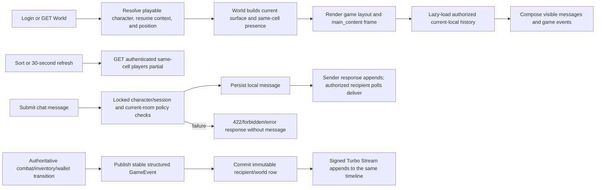

# frozen_string_literal: true
---
title: Game Shell Feature
description: Implementation handbook for the Neverlands-based persistent game frame, compact vitals, location presence, mixed chat/game-event timeline, and shell preferences.
status: Partially Implemented
updated: 2026-09-11
owners: Game Shell and Social Presence
template: feature-v1
---

# Game Shell

This document is the implementation contract for the current Game Shell feature. It explains the persistent top status bar, main Turbo frame, floating same-location player list, bottom mixed chat/game-event timeline, layout preferences, authentication, login resume integration, client ownership, known limits, and test coverage.

It describes what exists now. It does not turn every visible Neverlands toolbar control, chat mode, presence action, or familiar browser-game shell convention into shipped behavior.

## 1. Design authority and related documents

Domain navigation: `doc/domains/shell.md` and `doc/domains/social.md`.

Neverlands is the sole game-design and visual reference for this feature. The local implementation adapts its compact framed game client, bracketed character/vitals state, text-link toolbar, floating nearby-player panel, and bottom chat strip to Rails, Turbo, Stimulus, and the current English client.

When behavior is uncertain or conflicts with this document:

1. Re-observe Neverlands and record the evidence under `doc/design/reference/`.
2. Update the relevant shell/social design record.
3. Change implementation and coverage together.
4. Update this feature contract last.

Supporting documents:

- `doc/design/reference/shell/observations/2026-07-28_game_shell_and_mvp_surfaces.md` records the live frame layout, toolbar, location/presence block, and chat strip.
- `doc/design/reference/world/observations/2026-09-07_forpost_grid_and_action_audit.md` records outdoor movement locks and separate village entrance, square, and Shop presence labels/audiences.
- `doc/design/reference/world/observations/2026-09-09_starter_routes.md` confirms both gate labels, pond labeling, and separate zone/cell lines on the public profile.
- `doc/design/reference/social/observations/2026-08-23_chat_game_event_timeline.md` records current supplied-image/text evidence for player chat, personal fight, item, and NV search results, and game-wide announcements in one history.
- `doc/design/reference/social/observations/2026-09-07_cell_chat_and_presence_boundaries.md` confirms ordinary cell/room chat, distinct Arena rooms, and the browser-login history boundary.
- `doc/design/reference/world/observations/2026-09-08_forpost_oktal_airship_journey.md` records separate station/route roster labels, waiting-state Inventory/reload recovery, and explicit arrival disembarkation; chat delivery aboard was not exercised.
- `doc/design/reference/social/observations/legacy_chat_system_analysis.md` records earlier chat observations and explicitly separated unknowns.
- `doc/design/reference/character/observations/2026-05-11_player_profile_and_development.md` records the player/vitals presentation linked from the shell.
- `doc/design/reference/economy/observations/2026-09-09_licenses_and_shop_selling.md` records Abilities → Your licenses and its empty ownership state.
- `doc/design/areas/game_client_layout.md` defines shared client-layout ownership.
- `doc/design/features/social_chat_presence.md` defines chat, membership, ignore, and presence behavior.
- `doc/design/features/character_vitals.md` defines authoritative vitals consumed by the header.
- `doc/design/launch_mvp_plan.md` defines the shell/social MVP boundary.
- `doc/features/world.md` owns outdoor/city world content and the same-cell presence query.
- `doc/features/city.md` owns city-node content rendered in the main frame.
- `doc/features/character_progression.md` owns the linked player profile.
- `doc/features/player_inventory.md` owns the linked carried/equipment surface.
- `doc/features/shop_economy.md` owns the Shop surface loaded from City.
- `doc/features/arena_combat.md` owns Arena and active-fight content rendered in the shell, plus the intentionally shell-free public fight log.

### 1.1 Cross-feature relationships

| Related feature | Relationship | Ownership and handoff |
|---|---|---|
| `doc/features/world.md` | World bootstraps the layout, supplies exact-cell presence, and resolves Character/Inventory shell actions against a possible wilderness NPC interruption. | Game Shell owns the visible controls/frame; World owns position, the allowlisted destination action, hostile handoff, and post-fight return context. |
| `doc/features/city.md` | City renders its illustrated node surface in the shell's central frame. | City owns node content, navigation, and hotspot mutations; Game Shell owns only surrounding shared controls. |
| `doc/features/character_progression.md` | Character navigation opens profile/allocation surfaces; Abilities opens Your licenses. | Character Progression owns allocations, profile values and current-license display; Game Shell owns links, frame placement and compact header presentation. |
| `doc/features/player_inventory.md` | Inventory navigation opens the carried/equipment surface in the main frame and reports request failures through the shell's stable flash target. | Player Inventory owns stacks, equipment, capacity, mutations, and error copy; Game Shell owns surrounding navigation, vitals, chat, presence, and flash presentation. |
| `doc/features/shop_economy.md` | The Shop occupies the central gameplay surface after a City or linked-village handoff. | Shop owns catalog and economic mutations; Game Shell owns shared navigation, presence, chat, and flash presentation. |
| `doc/features/arena_combat.md` | Arena and active fights occupy the authenticated main surface, while `/log/:id` explicitly uses the public layout; authoritative completion and item/NV loot transitions also publish player-facing facts. | Arena Combat owns fight state, typed loot resolution, rewards, and the public log. Game Shell owns the authenticated frame and durable recipient event projection in the shared chat timeline. |

## 2. Feature summary

After login, the player opens the persisted allowlisted gameplay surface through a persistent Neverlands-shaped game frame, with World as the bootstrap/fallback. The live-measured `955 × 817` composition uses a 29px top strip, flexible scrolling main frame, 8px resize band, 240px chat/presence row with a 300px right presence column, 1px separator, and 30px CSS/text chat controls. The header shows name, level, stacked server-rendered HP/MP strips, Character and Inventory actions, contextual Return/Look around, and a CSS/text exit control. Character and Inventory submit the allowlisted World context-action route so a
source-backed same-cell hostile encounter can replace those shell navigations
with combat when Ashen Bait is present, then return to the requested destination
afterward. Without bait those navigations proceed. Offered wilderness movement
away from the cell is not interrupted (escape). Passive outdoor ambushes still
fire about once every five minutes without bait. The outdoor HUD bait chip shows
quantity; when empty it links back to City (`data-bait-recovery="city"`) so
“buy in town” is not dead text. In-district empty bait still opens Relics/Shop.
While an Arena match page is open, Character/Inventory/Q/A chrome stays locked
until the player finishes the fight.

The server owns identity, character state, location presence, social verification, channel visibility, message and game-event persistence, event audience, ignore filtering, and authorization. The browser owns only main-frame navigation, presence sort/refresh preferences, and chat focus/scroll/reset presentation.

Shop uses that same shared Inventory form with `main_content` as its target.
This Shop-specific frame handoff retains the Shop parent URL while Inventory
is displayed; reloading restores Shop, and the saved accessible Shop remains
the login destination. It replaces the removed duplicate Inventory link in
the Shop body. Other shared navigation contexts retain their existing
behavior; the controller still validates the allowlisted Inventory action.

Desktop source parity and responsive adaptation are separate contracts. The
`955 × 817` measurement remains exact at desktop. Tablet and mobile widths
reflow the same semantic regions without creating a second feature layout or
moving any authority into CSS/JavaScript.

`ApplicationController` selects the full game layout for every authenticated HTML gameplay surface, while anonymous authentication and public-profile requests use the minimal public layout. World remains the shell bootstrap and owns Character/Inventory context actions that may hand navigation to combat before the allowlisted destination. Full-page redirects therefore preserve the same top/main/presence/chat composition instead of falling back to a separate account-dashboard layout.

Devise registration and account updates remain available, but account deletion
is explicitly unavailable in the current MVP. Neverlands evidence does not
define this platform retention operation, and the local runtime must not purge
or falsely report deletion of immutable gameplay/audit history without a
separate retention or anonymization policy.

The MVP currently contains:

- a source-shaped authenticated top/main/presence/chat frame around World and City;
- exact-cell presence with separate validated village, Shop, city-building, Arena-room, and aboard-flight audiences, the selected playable character, four server allowlisted sorts, recent-session membership/total, and optional 30-second browser refresh;
- lazy local-chat history, reauthorized polling, sender responses, durable game-event streams, location policies, and mute/ignore handling;
- a latest-200 mixed timeline combining current-login/visit ordinary messages with durable recipient-only fight/item/NV results and server-owned world announcements, with no separate toast-notification surface;
- local browser persistence for presence sorting/refresh plus server persistence for character location and gameplay resume;
- English player-facing copy while Neverlands remains the design authority.

## 3. MVP goals and non-goals

### Goals

- Keep the primary game surface compact and continuously oriented around character, place, nearby players, and chat.
- Load owned feature pages inside a stable main Turbo frame where their response supports it.
- Keep presence and chat data authenticated, server-scoped, and policy-authorized.
- Keep personal gameplay results and world announcements durable, audience-scoped, idempotent at their producer boundary, and interleaved with chat.
- Preserve browser-only presentation preferences without treating them as account/game state.
- Resume the player's authoritative World, City, or supported building/shop context after login.

### Non-goals

- Recreating Neverlands framesets, CGI URLs, browser quirks, or Russian copy.
- Copying Neverlands images, sprites, logos, decorative artwork, branding,
  signatures, administration text, or project/service prose into runtime UI.
- Claiming the currently inert smile palettes, chat mode/speed cycles, transliteration, or player-action popup are complete before their live states are captured and implemented. Soft release disables those tools (`aria-disabled` + `social.tool_deferred`) so they no longer look actionable.
- Making presence into movement authority, a precise global-online system, or a remote-player locator.
- Treating client-side HP/MP interpolation as authoritative regeneration.
- Owning World, City, Inventory, Profile, Shop, Arena, or Combat domain mutations rendered in the main frame.
- Purging or anonymizing accounts and immutable gameplay/management history
  before a deliberate retention policy is designed and covered.

## 4. Player experience

### 4.1 Entry conditions

Every game request requires Devise authentication. On sign-in, the application ensures a playable character and resolves an allowlisted resume path. World is the default entry and ensures the character has an authoritative position before rendering; `ApplicationController` selects the persistent game layout for authenticated gameplay pages.

The Devise edit-registration page supports normal account updates but offers no
account-cancellation control. A direct `DELETE /users` request is intercepted by
`UserRegistrationsController`, leaves the account/session unchanged, and
redirects back with an explicit unavailable message.

Ordinary local chat additionally requires a user verified for social features,
an open login record, and an active persisted character location. The shell uses the current
local-chat endpoint; no global player channel is required.

### 4.2 Primary surface

The top bar shows `name[level]`, stacked 160 × 6px red HP and blue MP strips, `[current/max | current/max]` text, Your character and Inventory controls, contextual Return/Look around, and a 15px CSS/text logout control. The main content fills the flexible central row.

The 240px social row shows chronological chat on the left and the current zone, same-cell count, recent-session total, `a-z`, `z-a`, `0-33`, `33-0`, and refresh controls in a 300px right column. The 30px bottom strip uses project-owned text/glyph controls in the captured order around one text input and server-rendered `HH:MM:SS` time.

At `<=940px` the shell removes its desktop minimum width, compacts presence to
260px, and keeps the bottom control strip usable. At `<=720px` the header uses
two rows with horizontally scrollable context navigation, chat and presence
stack in the social region, and the bottom controls use two rows. The flexible
main region remains the owning feature's scroll container. At `<=420px` only
the compact vitals geometry changes further.

World fits odd numbers of complete 100px cells inside the frame, up to the
server-rendered buffer's thirteen visible columns and seven rows: eleven columns
at 1150px and thirteen at 1326px. The source gameplay frame includes its status
header; the local shell adds the adjacent header and main client heights before
sizing rows. At the default `1150 × 799` layout, `491 + 29 = 520px` gives five
rows (`1102 × 502`), while a sufficiently tall frame gives seven. An observer
of both rows recenters the same cursor and buffered cells when
the window or chat allocation changes, without replacing movement offers or
changing position. It disconnects with the map. Narrow screens retain touch
panning and the same odd-cell dimensions: the `390 × 844` layout centers a
`302 × 502` map with three columns and five rows. Fitting the map does not
change shell/chat row heights. World-scoped CSS suppresses native scrollbar
tracks on the outdoor map viewport, wrapper, and containing main pane so
classic gutters do not shrink or offset the whole-cell surface. Native
touch/wheel panning remains available; other feature scrollers are unaffected.

### 4.3 Player actions and feedback

The player can request Character or Inventory from World, sort nearby players, enable/disable automatic presence refresh, press Say to focus chat, submit a nonblank message with Enter, follow profile links, and exit after confirmation. World either redirects the context action to its allowlisted destination or starts the current hostile encounter and saves that destination for the fight's explicit finish step.

Chat success clears/refocuses the inline input and appends the sender's row in
the authorized Turbo response. Other players receive it through a fresh local
poll. HTML success redirects; JSON returns created status. Validation, mute,
private-address, or authorization failures return `422`, an error surface, or
the shared forbidden response without publishing a message.

Fight completion and successfully awarded NPC item or NV loot appear as recipient-only
system rows in the same chronology. Personal rows show exact `HH:MM:SS`, a bold
system label, and event-specific XP/item/money emphasis. Server-published world rows
use an unbranded orange `World` marker and no visible timestamp. Both initial
history and after-commit Turbo delivery enforce recipient scope on the server;
ordinary request errors continue to use the stable flash surface.

#### Flash message lifecycle

`#flash` is the stable response target outside `main_content`. Rails session
flash expiry alone cannot remove its already-rendered messages when a Shop
filter or other navigation replaces only that frame. The shared
`shared/flash` partial supplies the same per-message lifecycle for initial
public/game/manage pages and existing Turbo Stream producers, including local
chat errors:

- `notice`/`success` messages use `role="status"` and disappear after five
  seconds; `alert`/`error` messages use `role="alert"` and remain readable
  until dismissed or navigation clears them.
- Only those four message types render. Internal flash values such as Devise's
  boolean `timedout` flag or World result-offer identifiers are not player-facing
  messages and never appear as `true` or a raw identifier beside an alert.
- Each message has a keyboard-accessible `X` button labelled
  `Dismiss notification`. Removing a message leaves `#flash` available for
  subsequent responses.
- A `turbo:before-frame-render` event for `main_content` clears previous
  messages immediately before replacement content renders. Starting a request
  alone does not clear them. Chat/presence frame refreshes do not clear them.
- Messages are `data-turbo-temporary` and removed before Turbo snapshot
  caching, preventing browser Back from restoring stale notices.
- `flash_controller.js` owns only this DOM lifecycle. Each message owns its
  timeout and clears it on disconnect, so an old timer cannot dismiss a newer
  streamed result. Rendered message text remains escaped.

The five-second success lifetime is a local UI correction, not a measured
Neverlands timing rule. This changes presentation of messages already delivered
to the shell; it adds no new Shop result delivery or gameplay notification
pipeline. Durable game-event history and World action-result offer transport
retain their existing owners and persistence.

The bottom-right `A` control is the Abilities link. It opens the current
character's read-only Your licenses surface at `GET /character/licenses`,
matching the September 9 source navigation. Character Progression owns that
page and its active-license query; Shop owns purchasing and permission rules.
This link does not activate a license, grant a perk, or implement the remaining
Abilities actions. The page disables Turbo snapshots so returning requests
refresh server-owned expiry.

### 4.4 Exit and integration behavior

Logout ends the authenticated game view. Login returns through `Game::World::ResumeContext`, which prioritizes an active owned airship journey, then selects World, a supported City building, village interior, Shop, or validated Arena room from server-sanitized context; exact cell/node position remains owned by World/City.

When central navigation hands off, the destination feature owns its content and mutation rules. Game Shell continues to own only the frame, shared navigation, current vitals presentation, presence presentation, local chat and mixed gameplay events, flashes, and client preferences.

## 5. Feature topology and authored content

The feature is a fixed shell region graph plus social channel types.

| Region or key | Player-facing name | Connections or actions | Implemented content |
|---|---|---|---|
| `top_bar` | Character status/navigation | Profile, Inventory, City state, logout | Name, level, HP/MP, compact text controls |
| `main_content` | Current feature surface | Turbo-frame navigation/handoff | World/City bootstrap and compatible feature pages |
| `players_panel` | Nearby players | Four sorts, refresh toggle, profile links | Exact cell/room or aboard flight, plus recent session and playable-character scope; maximum 10 rows with full count |
| `bottom_bar` | Chat/status | Say, Enter submit, mixed history | Current local messages plus personal/world events, input, time |
| `local` | Ordinary cell/room chat | Current-location reads/posts | Server-derived key and current login/visit bounds |
| `global`, `system` | System audiences | Read-only to players | Global ordinary history is suppressed |
| `whisper` | Membership channel | Member read/post with privacy checks | Participant metadata and membership |
| `arena` | Legacy membership channel | Member-only access/post | Selected Arena room ordinary chat uses the local pipeline |

### 5.1 Coordinate, key, or identity terminology

- **Main content frame** — DOM identity `main_content`; a navigation target, not domain authority.
- **Exact location** — authoritative `zone_id`, `x`, and `y` on `CharacterPosition`, plus validated village, city-building, Shop, or Arena room context. An aboard `AirshipJourney` supplies the flight audience instead of the ground cell beneath it.
- **Recent session** — an unsigned-out `UserSession` seen within five minutes;
  used for presence eligibility and the displayed total. Only the user's
  playable first-created character participates, not every owned alternate.
- **Channel ID/type** — server record identity and enum controlling scope/membership rules.
- **Game-event key/audience** — stable producer identity plus either one persisted recipient or the world audience; neither is selected by the browser.
- **Layout preference** — browser-local `playersSort` and `autoRefresh`, stored under `browser_rpg_layout`.

DOM placement, displayed location text, a player-list row, local storage, or a submitted channel ID never grants location, identity, membership, or posting authority.

## 6. Feature surfaces and contained behavior

### 6.1 Implementation status

| Surface or behavior | Entry point | MVP status | Owning implementation |
|---|---|---|---|
| Persistent game layout | `GET /world` | Interactive | `layouts/game` through `WorldController` |
| Main feature frame | `turbo-frame#main_content` | Interactive integration | Game layout and destination controller/view |
| Current-location presence | `GET /world/players` | Interactive/read-only | World query and shared list partial |
| Compact local chat | lazy `GET /chat/local` | Interactive | Chat controllers/views/services |
| Mixed game-event history/live delivery | Compact and full local timeline; read-only global event history | Interactive/read-only | `GameEvent`, `Chat::Timeline`, `Chat::EventPublisher`, Turbo Streams |
| Chat creation | `POST /chat/local`; authorized explicit channel POST | Interactive | Policy and `MessageDispatcher` |
| Inline HP/MP | Every shell render | Interactive presentation over authoritative values | Shared vitals partial and Stimulus controller |
| Send, clear input, refresh chat, clear visible chat | Bottom controls | Interactive | `game-layout` presentation actions plus chat form/frame |
| Smile palettes, chat mode/speed, transliteration, player actions | Bottom controls | Partially Done — controls render disabled with `social.tool_deferred` titles and `data-chat-tools-deferred`; live smile/mode/speed/transliteration remain evidence gaps | Measured CSS/text controls rendered; transition states remain evidence/implementation gaps |

### 6.2 Header, main frame, and vitals

World renders outdoor or city content into the layout's single main Turbo frame. Character and Inventory controls submit `POST /world/context`; City displays as disabled context rather than a generic exit, and city movement remains inside the City surface. The logout `X` submits Devise sign-out after confirmation.

World supplies the initial Character/Inventory disabled state during movement
or timed Look Around work. Map reconnection restores the lock from the latest
server state, including after a rejected movement offer. A failed movement
request restores retry controls without changing the server-owned deadline or
location. Closing the World-owned Look result does not unlock those controls.

The vitals partial calculates clamped display percentages from authoritative character values and renders current/max HP and MP. It supplies the same values to `nl-vitals`, whose targets update both strips and the compact text between server renders. This interpolation remains presentation only and never persists vitals.

### 6.3 Presence and layout preferences

`Game::World::Presence` selects active-position characters with the same zone,
x, and y whose user has at least one recent open session. It also separates
authored village exterior/square/Shop contexts and validated city Shop,
City-building, and Arena-room contexts. World, village, Shop, City-building,
and Arena entry refresh presence after saving context; subsequent presence requests derive the
same scope from persisted state. Submitted labels or keys cannot select a different room.
Removed or malformed contexts fall back to the cell. Multiple devices do not
duplicate a character; another open device keeps that user eligible.
Only the user's currently playable, first-created character participates;
inactive alternate character rows are not made online by that user's session.

An aboard `AirshipJourney` overrides ground cell/room grouping. Presence reads
the persisted route key and exact departure time, then selects only online
playable passengers on that same flight. Waiting, in-flight, and arrived-aboard
phases share its key and authored route label, even as the authoritative path
changes region/cell. Other departures/routes and ended reservations do not
join it. Ground lists exclude all aboard characters, and aboard presence does
not query ground NPC, tile, entrance, or room content. The same ten-row limit,
full count, sorts, and technical session expiry apply. Presence remains a
read-only projection; the travel owner reconciles position and disembarkation.

The source pass observed station/route roster changes with one passenger;
same-flight grouping and ordinary-chat authorization apply the established
one-room rule locally. They do not claim source chat-delivery or internal
flight-storage evidence.

`CityBuildingsController#show` rebuilds presence after saving the authorized
building context, so the first Hospital/Market/Airship response shows the
current room's label, count, and players. City owns the character lock spanning
fresh access validation, context persistence, and that response; a concurrent
relocation cannot save the old building as the new room. The Arena summary and
Room Map Enter links target the full shell with `data-turbo-frame="_top"`; the selected room's
presence replaces the previous audience immediately, even with automatic
presence refresh disabled. Local chat uses the same saved room identity.

The seeded labels distinguish Outpost, West Gate and Outpost, East Gate,
Frontier Village outside the village, Village Square inside, Shop in its
trading feature, and Outpost Surroundings, Pond at the pond. Entrance and room
labels come from validated building/context metadata; other outdoor cells use
their exact cell's `presence_label`, falling back to the zone's display name.
`Game::World::Presence#label` supplies this same text to the map description
and owner/public profile without querying or counting the nearby audience.
Character Progression owns the profile's zone/current-location lines and
public combat link; World owns the authored label and location resolution.
The current character belongs to the
audience, which uses four server allowlisted sorts and returns at most ten rows.
Unknown sorts fall back to alphabetical ascending. At a busy location the
viewer can sort beyond those first ten rows; the header still counts the full
scoped audience. The separate online total uses distinct users with a session
seen in the last five minutes and is broader than the current cell.

Count and list use the same server scope in separate read-only queries. A
concurrent arrival or departure can briefly change membership between those
reads; the next refresh recovers. This presentation does not lock players or
provide an atomic gameplay snapshot.

`game-layout` stores sort and automatic-refresh preferences in local storage.
When enabled, it fetches the same authenticated partial every 30 seconds. The
partial includes the full room count, location label, and online total with its bounded list;
the client updates the list and header from that same response. A failed
refresh logs a warning and preserves both. A newer request or controller
disconnect aborts the previous presence fetch, and stale responses cannot
replace the current panel.

Both membership and total use the existing `UserSession.recent` definition:
unsigned-out and last seen strictly within five minutes. This is a local
technical liveness window, not a captured Neverlands timeout. Authenticated
shell, presence, and local-chat requests refresh their existing open session before projection;
a heartbeat never creates a missing session or reopens a signed-out one.

### 6.4 Compact chat, game events, and deferred behavior boundary

The lazy `GET /chat/local` frame and the full local channel page use `Chat::Timeline` to compose authorized
ordinary messages after ignore filtering with world and current-recipient
`GameEvent` rows. It loads at most 200 candidates per record type and displays
the latest 200 combined entries chronologically. Explicit private channel
histories contain only their own messages; the legacy global channel exposes
game events without its historical ordinary player rows.
All message/event bodies are escaped; chat additionally replaces
case-insensitive `script` text with `[removed]` before display.

Ordinary chat belongs to the exact persisted zone/cell and validated room,
or to the authoritative aboard flight.
`Chat::LocalContext` uses `Game::World::Presence#context_key` and persists
`local_chat_context` key/entry time on the existing Character.
`Chat::LocalContext.new(character:, clock: ...).synchronize!` returns a key and
entry timestamp or no context when location is unavailable. Position and room
transitions synchronize that metadata in their character transaction. A reload
or same-context retry preserves the timestamp; an actual cell/room transition
changes it, and a failed transition rolls it back with position. Reads
repair missing/stale context. No visit-history table is introduced. `ChannelRouter` derives the local channel from
that key; submitted local keys, labels, coordinates, or channel ids cannot
select a remote audience. HTTP history reads do not create channels; the first
permitted local post creates the canonical channel when it is absent.

For an aboard reservation the key is `airship:<route_key>:<UTC departure>`.
Boarding and disembarkation synchronize the audience inside their character
transaction. Intermediate path/phase changes preserve the same key and visit
timestamp, including arrived-aboard waiting for explicit disembarkation.
Gameplay metadata alone cannot forge a flight audience without its persisted
aboard reservation. Polling, current-session checks, Clear, and browser-buffer
rules below are unchanged; a flight is not a new shared ordinary-chat stream.

Local reads require the current open `UserSession` and select rows no earlier
than both its fresh `signed_in_at` and the current context entry time. The
browser polls this authenticated current-location endpoint every ten seconds,
merges server-rendered rows by stable id, and retains up to 200 combined rows.
Already-delivered ordinary rows survive navigation in per-tab session storage;
a new login generation clears them. Unpolled former-cell messages and previous
visits/logins are not replayed. Personal gameplay events remain durable under
the user's log-system requirement, independently of the source browser buffer.

If the location changes while a local timeline read is in progress, denied
`GET /chat/local` responses return `403` without redirecting to their former
page. A passive poll therefore cannot reopen an old village or overwrite the
saved resume context. The next poll resolves the current authoritative room.
Background chat fetches refuse redirects. A login redirect therefore cannot
fetch a second sign-in form or replace its anonymous CSRF cookie while a
visible form is awaiting submission. Failed polling retains the current
timeline; it does not authenticate or navigate the player.

Local/global ordinary messages never publish to shared channel streams, so an
old signed local token receives no new ordinary messages. The shell retains
signed global and recipient-specific game-event streams. Committed event rows
and the sender's authorized message response append to one stable
`chat_timeline` target. When the first live row arrives, the client removes
the prior empty placeholder. Chat and personal system timestamps use exact
`HH:MM:SS`; captured world rows intentionally have no visible timestamp.
The full channel page suppresses the shell's lazy duplicate history frame, so
one document never contains competing timeline targets/subscriptions.
Clearing visible chat removes rendered rows while retaining that timeline,
poller, and event subscriptions. Up to 200 cleared ordinary-message ids remain
in the same per-login browser buffer so polling does not immediately replay
them; this presentation control never deletes stored messages or game events.
The timeline observes actual appended rows to scroll or show the new-message
indicator, including sender responses and live personal/world events.
Polling also refreshes the displayed-context precondition in both the shell
composer and the full local-page form. Both submit to `/chat/local`, so a
successful refresh after another tab moves cannot leave a form tied to its old
channel. Until that refresh, the stale form safely rejects without a message.

Message creation strips whitespace, rejects blank bodies and local `%<name>` private-address prefixes,
ensures social verification, and blocks system/global player posting and active
mutes. Policies and `MessageDispatcher` revalidate current-channel access;
local sends hold the character lock through context checking and persistence.
A stale form is rejected. The existing unshipped whisper/arena paths retain
membership/privacy checks; their broader source parity is not claimed. Send and
clear-input controls use the same form; refresh reloads the compact frame.

`Chat::EventPublisher` accepts allowlisted server-owned facts and stable keys.
The first integrated producers are Arena/World shared combat completion and
successful NPC item/NV loot awards. Item rows are published only after
`InventoryItem` persistence; NV rows are published only after the Economy-owned
wallet and ledger transaction are persisted. `system_information` and
`world_announcement` are
narrow server-side extension points; no player/admin endpoint, schedule, link
model, or invented global content is shipped. There is no separate toast
notification path, command execution, transliteration, smile picker, formatting
palette, chat-mode cycle, or refresh-speed cycle. Existing username helpers do
not constitute a completed source-matched player-action menu or private-message flow.

`Chat::TimelineBroadcaster` owns game-event and non-local legacy channel
presentation after commit, and explicitly refuses local/global ordinary
broadcasts. It owns event stream names, the stable DOM
target, and partial selection; persistence models do not know view identities.

#### Adding a gameplay-event producer or type

Gameplay code never creates `GameEvent` directly. A domain service first
persists its authoritative transition, then calls the appropriate public method
on an injected `Chat::EventPublisher` inside the same database transaction.
The publisher receives a server-derived recipient, structured payload, and a
deterministic source key such as
`quest:<quest-id>:character:<character-id>:completed`. A matching retry returns
the existing event; using that key for different content raises a conflict.
After commit, the model callback delegates delivery to
`Chat::TimelineBroadcaster`, and `Chat::Timeline` recovers the same row on
reload.

Use `system_information!` only when a verified producer needs the existing
generic personal-system semantics and rendering. Use `world_announcement!`
only for a server-owned global transition; it accepts no recipient. Existing
fight, item, and NV producers use their typed publisher methods so validation
and payload shape stay explicit. There is no browser/admin create endpoint.

A genuinely new semantic/rendering family requires one coordinated change:

1. add the type to `GameEvent::EVENT_TYPES` and the database check constraint
   through a new migration;
2. add a narrow publisher method that validates its server-owned facts;
3. render the type explicitly in `_game_event.html.erb` and its domain CSS;
4. add factory, model, publisher, renderer, timeline/delivery, producer retry,
   failure/rollback, and audience-isolation coverage as applicable;
5. update the Neverlands observation/design chain, this handbook's responsible
   files and acceptance contract, the launch matrix, and the session changelog.

Do not add a generic event endpoint, command bus, unrestricted type string,
random event key, or Pub/Sub layer merely to avoid this allowlisted boundary.
When a new reward also changes gameplay value, its domain owner must commit
that value before the event projection, as Inventory and Economy do for item
and NV loot.

## 7. Authoritative data and presentation model

| Record or component | Responsibility | Important contract |
|---|---|---|
| `Character` and `CharacterPosition` | Header identity/vitals and exact presence location | Current signed-in character is authoritative |
| `Game::World::Presence` | Bounded online playable-character list/full count through `#call`; shared current-location text through `#label` | Exact cell/entrance plus validated village/city/Arena room, or persisted aboard flight; label-only reads load no audience, and neither entry point changes location, resume context, sessions, or chat |
| `UserSession` | Online-total and presence liveness signal | Unsigned-out and seen strictly within five minutes; explicit login owns reopening |
| `ChatChannel` and `ChatChannelMembership` | Channel identity, audience, membership | Local key from authoritative context; whisper/legacy arena require membership; global ordinary posts rejected |
| `ChatMessage` | Persisted sender/body/visibility/metadata | Body present; broadcasts only after commit |
| `GameEvent` | Immutable recipient/world gameplay-information projection | Allowlisted fight/item/money/system/world type, stable unique key, structured payload, occurrence time, and audience constraints |
| `Chat::Timeline` | Bounded authorized history read | Current-login/visit local rows plus optional world/personal events; maximum 200 combined rows |
| `Chat::LocalContext` | Exact ordinary-chat context and visit start | Existing Character metadata; synchronized atomically with position/room/boarding/disembarkation transitions; one visit spans a flight's phases |
| `Chat::EventPublisher` | Normalize and persist server-owned event facts | Stable keys are idempotent and conflicting reuse fails |
| `Chat::TimelineBroadcaster` | After-commit Turbo presentation | Owns stream names, stable DOM target, and record partial selection |
| `IgnoreListEntry` and `Chat::IgnoreFilter` | Initial-history visibility and whisper privacy | System/self messages retain explicit behavior |
| `ChatChannelPolicy` and `ChatMessagePolicy` | Read/post authorization | Verified user plus current local key or explicit membership; no global ordinary posting |
| `Game::World::ResumeContext` | Allowlisted login destination | Never follows arbitrary persisted URLs |
| Stimulus/local storage | Shell interaction preferences | Presentation only; never character/session authority |

### 7.1 Source of truth

Database character, position, session, channel, membership, message, event, and ignore records are authoritative for their own state. Gameplay records remain authoritative for combat/reward outcomes; `GameEvent` is a durable player-facing projection and audit aid, not event-sourcing state. `ApplicationController#prepare_presence_context` shares the World-owned presence query across authenticated shell surfaces; World, village, and Shop call it after remembering their current context. Chat policy scope selects visible channels, `IgnoreFilter` removes blocked historical messages, and `GameEvent.visible_to` admits only world plus current-recipient rows.

The compact shell does not depend on a global channel row. A player alone at an
active location with a recent open session sees their own row and count one;
missing active position/session produces no local audience. Missing layout
preferences fall back to alphabetical sort and automatic refresh enabled.

### 7.2 Validation and state lifecycle

- Channel names/slugs are required and slug is unique; missing slugs are generated on create.
- Channel types are `global`, `local`, `whisper`, `system`, and `arena`.
- Local reads/posts require the current key; whisper/legacy arena require
  membership. Global/system are readable, but ordinary global/system posting
  is rejected.
- Chat bodies are stripped and must be nonblank; no maximum length is currently enforced.
- Game events require an allowlisted type, nonblank stable key/body, object payload,
  occurrence time, and a database-valid recipient/world audience. Persisted
  events cannot be updated or destroyed through the model.
- Event keys are database-unique. Identical retries return the existing row;
  reuse for a different recipient/type/body/payload raises a conflict.
- Compact and full local history load at most 200 candidates per record type
  and show the latest 200 combined entries. The legacy global page shows only
  game events; explicit private channels load at most 200 messages. Presence
  loads at most 10 online playable characters from the same cell/room or flight.
- Presence and heartbeat timers are 30 seconds; local chat polls every ten
  seconds. Presence/online total use the technical five-minute session window.

### 7.3 Presentation versus authority

Turbo-frame targets, sort links, refresh checkbox state, local-storage values, displayed counts, DOM channel/event data, and client clock rendering are presentation/input only. Server endpoints and services apply sort allowlists, current-position queries, policy scope, message authorization, event audience, and domain validation.

Client-side vitals values are a display snapshot. Server character/vitals services remain authoritative for regeneration, damage, healing, maximums, and persistence.

## 8. Runtime architecture



### 8.1 Load and render

`ApplicationController#after_sign_in_path_for` resolves a safe gameplay path.
World restores current position/context and renders the game layout. Its lazy
`/chat/local` frame derives the audience from persisted state, validates the
open login, and requests the bounded mixed timeline. Subsequent ten-second
polls contain only currently authorized ordinary rows.

### 8.2 Accept or execute action

Presence refresh submits only a sort key; World applies its allowlist and
location/session scope. Local chat submits body and the last displayed context
key. The dispatcher locks Character then the owned open UserSession, revalidates
the current audience and stale-form key, and creates the message in that
transaction. Browser keys express a precondition and never choose a location.

### 8.3 Complete, redirect, or hand off

Presence returns an HTML partial carrying the list and its location/count
metadata; the client applies them together to the owned panel and header.
Local-chat Turbo success appends the committed sender row directly; HTML
redirects and JSON returns `201`. Recipients poll current authorization.
Game-event creation has no browser endpoint and broadcasts after commit.
Local validation errors update the stable flash without clearing the input;
authorization uses the shared forbidden handler.

Feature navigation hands central ownership to the target controller/view. The Character/Inventory World-shell boundary first hands intent to `WorldContextActionsController`, which owns hostile interruption and allowlisted return metadata. Login resume hands destination selection to Resume Context and exact position rendering to World/City.

### 8.4 Concurrency behavior

Local sends serialize against movement/room changes with the Character lock
and against logout with the session row lock. Repeated valid sends remain
separate ordinary messages; game-event producers retain unique stable-key
idempotency. Canonical local channel creation reuses the same slug, including
concurrent database/model uniqueness conflicts. Presence rows/counts are reads;
their request may touch only its existing open session's liveness timestamp.
Cancelled/disconnected browser requests cannot replace newer state.

## 9. HTTP and Turbo contract

| Method and path | Purpose | Success | Failure |
|---|---|---|---|
| `GET /world` | Bootstrap authenticated shell and current World/City surface | Full game-layout HTML; bounded map/location/action/result streams for timer-frame reads; full HTML for location redirect recovery | Login/closed-session/active-character failure path |
| `GET /chat/local` | Initial mixed timeline or `poll=1` ordinary update | Authorized bounded HTML; stale-location denial returns `403` without navigation | Login/location/session denial |
| `POST /chat/local` | Send to current room | Committed sender Turbo append, HTML redirect, or JSON `201` | Stale/foreign/private/global intent rejected without message |
| `POST /session_ping` | Refresh this open login's activity | CSRF-protected `204`; missing/closed session unchanged | Authentication/CSRF denial |
| `GET /world/players` | Refresh exact-cell presence | Shared players-list HTML partial | Authentication/active-position failure |
| `GET /character/licenses` | Follow the Abilities link to current owned licenses | Read-only game-layout HTML | Authentication/owner denial; expired permissions omitted |
| `POST /world/context` | Request Character or Inventory from the World shell | Full redirect to the allowlisted destination or the shared hostile fight | Unsupported context falls back to World; anonymous request redirects to login. |
| `GET /chat_channels/:id` | Render full or compact authorized channel history | HTML page or `chat_messages` frame without layout | Redirect/forbidden/not found |
| `POST /chat_channels/:chat_channel_id/chat_messages` | Persist an authorized message | Turbo `200`, HTML redirect, or JSON `201` | Turbo/HTML/JSON `422`, or authorization failure |
| `DELETE /users` | Request account deletion | Rejected with `303` to account edit; user and session remain intact | Deletion is unavailable until a retention/anonymization policy exists |
| `DELETE /users/sign_out` | Exit authenticated shell | Devise sign-out redirect | Shared authentication behavior |

The shell is HTML/Turbo-first. Chat exposes a small internal JSON response but no separately versioned public API or serializer contract. Game-event publication has no HTTP endpoint, so blueprint and Swagger/rswag coverage are not applicable.

## 10. Client-side and CSS ownership

Shared product requirements now live in
[Game Client Layout](../design/areas/game_client_layout.md#adaptive-ui-requirements),
including fluid sizing, readable controls, touch/keyboard access, short panes
and zoom. City and Shop image production/display rules share
[`ART-SCENE-001`](../ARTWORK.md#shared-scene-image-standard). These are design
targets, not a claim that the runtime has passed every new acceptance case.
The existing verification records below cover their named sizes and flows;
the broader 320px, short-landscape, coarse-pointer and zoom audit remains open
under `RESPONSIVE-001`.

`app/javascript/controllers/game_layout_controller.js` owns only:

- presence sort selection and 30-second list/header refresh;
- Character/Inventory presentation locks through the map's bubbling
  `nl-world-map:movement-state` event and the shell's `worldNavigation` targets;
- passive World encounter checks using the server-returned retry delay and
  redirect, without choosing NPCs, encounter timing, or outcomes;
- browser persistence of sort/refresh preferences;
- Say-to-chat focus;
- chat refresh, local clear, and form submission affordances.

The navigation event carries only `{locked}` presentation state. World services
revalidate gameplay actions regardless of the button state. Presence and
passive-check fetches are aborted on disconnect. Passive checks also guard
request identity, so a late response cannot redirect a different surface,
clear a reconnected controller's request, or restart the old polling loop.
Aborting a fetch does not reverse a server action already accepted; World
remains responsible for authoritative recovery.

`app/javascript/controllers/chat_controller.js` owns authenticated local polling,
same-login buffer restoration/deduplication, Clear, current-context form
updates, and scroll/new-message presentation. It aborts pending polls and
disconnects its timer and timeline observer on disconnect. It and
`app/javascript/controllers/chat_input_controller.js` provide Enter submission,
successful reset/focus, and presentation-only username helpers. Username menu
links use DOM text/data properties rather than interpolating player names into
HTML. `app/javascript/controllers/nl_vitals_controller.js` receives display
values and updates the stacked source strips and text without persisting game state.

They must not:

- decide authoritative location, channel access, mute/privacy, or identity;
- persist messages, vitals, presence, or gameplay resume state directly;
- invent channel capabilities or trust local-storage sort values;
- treat an interpolated vital as a server mutation.

`app/assets/stylesheets/application.css` is only a small reset. `controls.css` imports ordered flat modules: `tokens.css` and `primitives.css` own shared typography/colors/flat controls; `shell.css` owns the `29 / flexible / 8 / 240 / 1 / 30px` frame, stacked vitals, contextual header, and CSS/ASCII bottom controls; `chat_presence.css` owns message, game-event, and nearby-player rows. This is SRP by UI domain, with no Tailwind dependency and no nested `nl/` stylesheet folder.

The header strip reproduces the captured `#FCFAF3` band closed by the source's
1px white / 1px gold / 2px cream accent rows, and the vitals readout carries the
source `.hpfont` treatment with the HP pair in the combat color and the MP pair
in the link color. Control chrome is never redefined in `shell.css`: the top
navigation composes the `.lbut` primitive and only overrides padding plus the
current-page label color, because the source's disabled pill hides its text and
this shell navigates by text rather than by images.

Domain-SRP is the maintainability rule for all central surfaces. World/City,
Profile/Inventory, Shop, Arena/Fight, and public logs own their selectors,
composition, responsive behavior, and local Stimulus presentation. A domain
must not reuse an unrelated domain class as a styling shortcut; shared rules
move to `tokens.css` or `primitives.css` only when they express the same stable
semantic primitive in multiple domains. Similar appearance alone is not enough
to create shared ownership.

`shell.css` also owns the explicit tablet/mobile row reflow; destination feature
stylesheets own only their main-surface adaptation. This keeps responsive rules
next to the desktop component they modify instead of adding a global mobile
override layer.

Accessibility behavior:

- navigation uses links or authoritative action forms, message sending uses a form, and presence refresh uses a labeled checkbox;
- the City state uses `aria-current="page"` rather than a false action;
- Say moves keyboard focus to the chat input;
- the mixed timeline is a polite live log with semantic event times; labels and
  copy preserve meaning without color alone;
- textual names, levels, counts, vitals, flashes, and empty states do not rely on color alone.

## 11. Persistence and login resume

Character identity/vitals, exact position, gameplay context, sessions, channels, memberships, messages, immutable gameplay-event projections, and ignore relationships persist in the database. Awarded items and NV remain authoritative in Inventory and the Economy wallet/ledger respectively; the event row is only their durable timeline projection. Sort/refresh preferences persist only in browser local storage under `browser_rpg_layout`; they are not synchronized across devices or accounts.

`game_events` and management audit rows intentionally retain their user
references. The custom Devise registrations controller rejects account destroy
before Active Record deletion, so Devise cannot sign the player out and display
a false destroyed-account message. The `money_found` event-type expansion is a
forward-only migration: immutable money rows cannot be transformed or deleted
safely merely to restore the previous check constraint.

On login or return:

- explicit login reopens its device record and sets a fresh `signed_in_at`;
  browser ordinary-chat history uses that generation and is cleared on change;
- an active owned airship journey resumes `/airship` ahead of other saved
  surfaces; server timestamps recover its current phase, with arrival remaining
  aboard until explicit disembarkation. This local recovery contract extends
  beyond the source's exercised waiting-state reload; offline flight recovery
  was not observed in Neverlands;
- a valid Shop context resumes Shop after access revalidation;
- a valid supported City-building context resumes that building;
- a valid village-interior context resumes the authored location without changing its outdoor cell;
- a valid saved Arena room resumes that authorized room;
- invalid/removed context falls back to World;
- World renders the character's persisted exact outdoor cell or city node;
- shell preferences load independently from local storage and cannot redirect the player.

The per-tab `local_chat_buffer` stores delivered ordinary rows and bounded
cleared ids, keyed by user id, session-row id, and precise `signed_in_at`.
It is a presentation projection, never permission to fetch another room or
login's stored messages. New login generations replace that buffer. The shell
does not store unsent chat input, current central-frame scroll state,
a separate toast history, or client-interpolated vitals. Recent gameplay-event
history is intentionally stored in `game_events` and reloaded with chat.

The signed-in shell sends a CSRF token with its heartbeat using Beacon or the
fetch fallback. `UserSession#mark_seen!` performs an atomic conditional update
on an existing open row; older requests cannot move `last_seen_at` backward and
a request loaded before logout cannot reopen the closed row. Only the login
manager reopens it. Missing rows are not synthesized by heartbeats.

`ApplicationController#reject_closed_game_session` also checks an existing
current-device session before gameplay access. If a late background response
restores a pre-logout authenticated cookie, a closed DB row still rejects the
next gameplay request: top-level HTML redirects to sign-in; background HTML
XHR/frame reads and Turbo Stream/JSON requests return `401` and clear
authentication without following a sign-in form. Missing tracking rows do not
become a new authentication prerequisite. `UserSessionsController` performs the
same current-device closed-session check before Devise's already-authenticated
shortcut on sign-in GET/POST. It discards stale authentication so the login
form renders and the first password submission follows normal Devise credential
validation. This does not reopen the session or bypass an incorrect password;
only successful login reopens it. Existing open sessions keep Devise's usual
already-authenticated redirect. The heartbeat retains its harmless `204`
behavior for a missing or closed row. This is a local authentication guarantee,
not a newly inferred Neverlands gameplay rule.

CSRF verification remains enabled on sign-in. If a late response replaces the
anonymous session that issued the displayed form token, an HTML sign-in POST
is rejected and redirects with `303` to a fresh form and an expired-form
message. No password is retained or replayed, and the session remains closed
until the player explicitly resubmits valid credentials with the fresh token.
This recovery applies only to sign-in creation; other CSRF failures retain
their normal rejection behavior.

Arena building entry likewise uses server-persisted state: the accepted city
action records the current zone in Character metadata through `ResumeContext`.
The Arena gate rechecks that marker against the current city and active building,
so a late shell/chat response restoring an older cookie cannot send a player
back to World while entering a room. Initial lobby entry keeps the existing
World/chat context; selecting a room still owns its separate persisted audience.

World timer refreshes submit through their own `game-map` frame, so they do not
replace Turbo's top-level logout submission after a confirmation held open past
a deadline. Frame responses that require a different full page recover through
normal navigation; `401`/`403` timer responses leave the retry loop for sign-in.
Pending action results render into the stable `world-action-result` container
in both full HTML and incremental responses. A map-only refresh therefore cannot
consume a Look/Drink/Fish result without displaying its dialog, and no forced
page reload discards the already-consumed result. Only a new pending message
emits a result stream; an ordinary deadline refresh leaves an open modal intact
until the player closes it.
The heartbeat runs on connect and every 30 seconds, independently of the
presence auto-refresh checkbox. A missing CSRF token suppresses the client
request; Rails rejects a tokenless POST. An accepted heartbeat updates the
existing device record, and may update the user's activity timestamp, without
creating another login row.

## 12. Authorization, trust boundaries, and concurrency

- Devise authentication protects shell, World presence, channels, messages, and sign-out.
- The custom registration destroy action rejects account deletion explicitly;
  association restrictions are a persistence backstop, not user-facing flow
  control.
- `CurrentCharacterContext` scopes World/header/presence behavior to `User#character`, the first-created character with id as the deterministic tie-breaker; it is not a browser-selectable alternate.
- `ChatChannelPolicy` scopes local reads to the current exact audience and
  non-local private reads to explicit membership.
- `ChatMessagePolicy` and `MessageDispatcher` reject ordinary global/system
  posts and mutes. Local sends also reject foreign/stale targets, closed login
  sessions, and unimplemented private-address prefixes before persistence.
- `GameEvent.visible_to` and signed Turbo stream names enforce world/current-recipient reads; the browser cannot select an event recipient.
- Exact location and presence come from server positions, never submitted labels or DOM rows.
- Sort keys, resume contexts, and central destinations use server routes/allowlists.
- Character/Inventory controls submit logical context names only; World owns hostile interruption and never follows a submitted URL.
- After-commit broadcasts prevent uncommitted messages or events from appearing as persisted.
- Database type/audience/payload constraints and unique event keys preserve the
  immutable projection boundary under retries.
- Local storage, Turbo targets, displayed counts, and client vitals never confer authority.
- Destination features reauthenticate and revalidate their own domain access after main-frame handoff.

## 13. Failure and boundary behavior

| Condition | Required behavior |
|---|---|
| Anonymous shell/presence/chat request | Redirect to login; expose no private game state or mutation. |
| Missing playable character/position | Shared bootstrap/failure path; do not invent a displayed location. |
| No local channel yet | Read an empty local history plus visible game events; create its canonical channel only on a permitted first post. |
| Unknown presence sort | Fall back to alphabetical ascending. |
| Playable character alone at an active location with an open recent session | Render that character and count one. |
| No eligible online playable characters | Render stable empty list and count zero. |
| Presence refresh network/server failure | Keep prior list/header and log a warning; no gameplay mutation. |
| Presence request superseded or shell disconnected | Abort the old fetch and ignore its response. |
| Passive encounter response arrives after navigation | Ignore the late response; do not redirect or rearm the disconnected controller. |
| Blank/whitespace chat body | Return `422`; create no message. |
| Unverified, unauthorized, muted, system-channel, or privacy-blocked post | Reject without message/broadcast. |
| More than 200 history rows | Show only latest 200 in chronological display order. |
| Another user's personal event | Exclude it from history and never subscribe the viewer to that recipient's signed stream. |
| Retried matching game-event key | Return the existing row and broadcast no duplicate. |
| Reused event key with conflicting identity | Raise a publisher conflict and preserve the original immutable row. |
| Item or NV award persistence fails | Roll back that authoritative loot resolution and publish no success row. |
| Direct account-deletion request | Keep the user and authenticated session, redirect to account edit with an unavailable alert, and never report successful destruction. |
| First live row after empty history | Append to `chat_timeline` and hide the empty placeholder. |
| More than 10 co-located players | Show only first 10 under selected server sort. |
| Ignored relationship | Filter each local poll/history; whisper privacy is rejected. The legacy non-local ignore/broadcast limitation is not claimed resolved. |
| Repeated valid chat submission | Creates another message; chat requests are not idempotent. |
| Fresh login or return to a previously left room | Do not fetch ordinary rows from the prior login/visit; retain only already-delivered same-login buffer rows. |
| Clear chat | Remove visible rows, retain timeline/poller/event subscriptions, and suppress replay of bounded cleared ordinary ids; delete no records. |
| Malformed layout-preference JSON | Warn and use default presentation preferences. |
| Malformed or different-login ordinary buffer | Discard the buffer and use the authorized server-rendered timeline. |
| First read-only City-building entry | Save the authorized room, then render its label/count/list and local-chat audience in the first response. |
| Arena summary or Room Map Enter | Refresh the full shell with the selected room's presence immediately; automatic presence refresh is not required. |
| Vitals client/controller failure | Server-rendered values remain visible and authoritative. |
| Unsupported captured shell control | Do not render a working-looking generic substitute. |
| Unsupported World context name | Return to World; do not start combat or follow it as a URL. |
| Tablet/mobile viewport | Reflow shell rows and contain tool strips without whole-page horizontal overflow. |

## 14. Acceptance criteria

- World and City render inside the compact top/main/presence/chat game layout after authentication.
- The header shows current character identity, level, server-rendered vitals, implemented navigation, city state, and logout.
- Presence uses exact zone/x/y, validated village/city/Arena room, and recent
  open-session scope; it supports four sorts, returns at most ten rows, and
  counts the full scoped audience.
- Aboard presence and ordinary-chat keys use one persisted route/departure
  audience through waiting, flight, and arrived-aboard states. Ground players,
  other flights, offline sessions, and inactive alternate characters are excluded.
- Automatic presence refresh runs at 30 seconds only when enabled and remembers browser-local preference.
- Presence refresh updates the bounded list, its location/count, and total online together;
  navigation or newer requests cannot be overwritten by stale responses.
- Authorized City-building and Arena-room entry renders the new room's
  presence immediately, including when automatic presence refresh is disabled.
- Timed World actions lock Character/Inventory through server-rendered state
  and the explicit map event; rejected movement restores usable controls.
- Compact local chat shows at most 200 combined authorized/filtered messages
  and visible gameplay events. Local polling rechecks current login/visit;
  existing local stream tokens receive no new ordinary message broadcasts.
- Already-delivered ordinary rows survive movement and are deduplicated by id;
  a fresh login clears ordinary rows while durable personal events reload.
- Clear retains subsequent ordinary/event delivery, and a full local-page
  composer follows the authoritative context returned by polling.
- Heartbeats require CSRF, only touch an existing open login, and cannot
  reopen logout state or regress the server-observed last-seen timestamp.
- Fight completion/XP and successful NPC item/NV loot persist once per stable producer
  key as recipient-only system rows; server-owned world announcements use the
  same history without a separate toast surface.
- An item-found row follows a committed inventory award; an NV-found row follows
  a committed wallet credit and `CurrencyTransaction`, and neither event is
  gameplay authority.
- Non-shell private channel histories do not receive mixed gameplay events, and one
  recipient never receives another recipient's personal row.
- Blank, muted, privacy-blocked, system-channel, unauthorized, and anonymous chat actions create nothing.
- Login resume selects only an allowlisted supported surface and preserves World/City-owned exact location.
- Account editing does not expose a cancellation control, and a direct destroy
  request cannot delete or falsely report deletion of an account with durable
  gameplay history.
- Unimplemented auxiliary source controls are not represented as complete behavior; client-vitals interpolation remains presentation-only.
- Central feature navigation never transfers game authority to DOM state or local storage.
- The Abilities link reaches the owner-only Your licenses page; its server query
  and expiry boundary remain Character Progression/Shop responsibilities.
- Character and Inventory shell actions can be interrupted by the authoritative same-cell hostile encounter and resume only through World-owned allowlisted return metadata.
- The `955 × 817` desktop shell geometry remains unchanged while 820px and
  390px viewports reflow the same controls without whole-page overflow.

## 15. Test strategy and required coverage

Tests are part of the feature contract. Changes require applicable model, request, policy, service, factory, view/system, session, client/CSS, and integrated World coverage. Blueprint and Swagger/rswag do not apply to this authenticated HTML/Turbo shell.

| Coverage category | Representative guarantees |
|---|---|
| Success | Layout regions, current player/vitals, exact-cell presence/sorts, mixed chat/event history/live delivery, message send, fight/item/NV projection, membership, and resume integration. |
| Failure | Blank/muted/private/global/system posts, stale/foreign rooms, closed login, conflicting event keys, malformed payloads, refresh failures, and missing current state. |
| Edge/null/boundary | Self alone, missing position, stale village context, full room count beyond the ten-row list, first live row over empty history, 200-entry combined history, event ordering ties, unknown sort, five-minute session boundary, malformed preferences, and vitals zero maximum. |
| Authorization | Anonymous routes, unverified social user, inaccessible membership channel, foreign channel/message attempt, cross-recipient event isolation, and current-character presence scope. |
| Retry/concurrency | Matching stable event-key retry, canonical local-channel reuse by two users, movement/context rollback, stale-form rejection, no heartbeat reopening after logout, closed-session rejection of stale cookies, timer/logout request isolation, monotonic last-seen updates, and after-commit delivery. |

Factories must retain edge traits for channel types/membership, message visibility, verified/unverified users, recent/stale/signed-out sessions, exact/different position, ignored relationships, and vital boundaries when exercised.

`spec/requests/city_buildings_spec.rb` checks the initial Hospital, Market,
Airship, Junk Dealer, and Numismatics response and current-room chat scope.
It also verifies that a city relocation winning the entry lock preserves its
new position and context while rejecting the previous node's building.
`spec/system/arena_room_presence_spec.rb`
checks both Arena Enter links with automatic presence refresh disabled,
including immediate label/count/list replacement, unchanged coordinates,
persisted room context, and reload stability.
`spec/requests/arena_room_context_spec.rb` also replays a pre-entry cookie after
a completed city handoff and verifies room entry while retaining direct-entry
denial and current-city availability checks.

`spec/queries/game/world/airship_presence_spec.rb` covers flight/ground and
route/departure isolation, phase-independent membership, online playable
character filtering, bounded sorted rows/full counts, and no ground-content
reads aboard. `spec/services/chat/airship_local_context_spec.rb` covers one
visit across flight phases, the disembarkation boundary, and rejection of
metadata-only flight identity.

`spec/requests/closed_game_sessions_spec.rb` covers replayed pre-logout cookies,
HTML/stream/JSON denial, unchanged movement, explicit new login, and the absence
of a new tracking-row prerequisite. `spec/system/world_map_incremental_spec.rb`
keeps logout confirmation open past a movement deadline and verifies closed
session timer recovery plus login catch-up. `spec/system/world_map_result_delivery_spec.rb`
checks pending-result delivery beside a map stream in Chrome.

`spec/views/shared/_flash_spec.rb` checks escaped text, legacy locals, message
roles, and dismissal/timeout markup. `spec/system/flash_messages_spec.rb`
checks real login and Shop notice expiry, same-shell Shop filter navigation,
browser Back, streamed error replacement, unrelated chat refresh, and keyboard
dismissal. On September 10, 2026, these passed alongside the shell layout,
local chat, Inventory progression, and World result-delivery checks (75
examples, zero failures). Manual local Chrome verification also confirmed that
`Entered Shop.` disappears while staying in Shop and clears on category
navigation; the player was returned to Central Square without a stale notice.
The same local verification passed `bin/verify fast`: 2,507 non-system
examples, 555 files without RuboCop offenses, and both documentation audits.
These are local results; they do not establish a CI run.

Focused verification command:

```bash
bundle exec rspec \
  spec/models/game_event_spec.rb \
  spec/models/chat_message_spec.rb \
  spec/models/user_session_spec.rb \
  spec/queries/chat/timeline_spec.rb \
  spec/queries/game/world/presence_spec.rb \
  spec/queries/game/world/airship_presence_spec.rb \
  spec/services/chat/event_publisher_spec.rb \
  spec/services/chat/timeline_broadcaster_spec.rb \
  spec/services/chat/message_dispatcher_spec.rb \
  spec/services/chat/local_context_spec.rb \
  spec/services/chat/local_context_transition_spec.rb \
  spec/services/chat/airship_local_context_spec.rb \
  spec/services/auth/user_session_manager_spec.rb \
  spec/services/arena/combat_processor_spec.rb \
  spec/requests/chat_channels_spec.rb \
  spec/requests/chat_messages_spec.rb \
  spec/requests/local_chat_spec.rb \
  spec/requests/session_pings_spec.rb \
  spec/requests/closed_game_sessions_spec.rb \
  spec/requests/user_registrations_spec.rb \
  spec/requests/inventories_spec.rb \
  spec/requests/world_spec.rb \
  spec/requests/world_location_presence_spec.rb \
  spec/requests/city_buildings_spec.rb \
  spec/views/layouts/game_spec.rb \
  spec/views/shared/_flash_spec.rb \
  spec/views/game_events/_game_event_spec.rb \
  spec/views/shared/_nl_players_list_spec.rb \
  spec/views/shared/_nl_vitals_bar_spec.rb \
  spec/system/social_ui_spec.rb \
  spec/system/flash_messages_spec.rb \
  spec/system/local_chat_spec.rb \
  spec/system/session_heartbeat_spec.rb \
  spec/system/world_interactions_spec.rb \
  spec/system/world_village_resume_spec.rb \
  spec/system/arena_room_presence_spec.rb \
  spec/system/responsive_neverlands_ui_spec.rb
```

`spec/requests/character_licenses_spec.rb` covers the bottom-right Abilities
link, current-owner license surface, persisted grants, and exact expiry.

Policy behavior is currently exercised through request/system coverage; dedicated `ChatChannelPolicy` and `ChatMessagePolicy` specs are a justified gap for future policy changes. `responsive_neverlands_ui_spec.rb` is the focused full-shell browser contract for mobile header/main/social/bottom row sizes and whole-page overflow. Run the complete suite before release because the shell integrates authentication, sessions, World/City, character state, Turbo Streams, and social persistence.

### September 11 final local browser acceptance

The final `bin/verify full` passed with **2,602 non-system examples and 293
system examples, zero failures**, 562 Ruby files lint clean, no Brakeman
warnings or dependency vulnerabilities, and documentation audits covering 11
feature handbooks and 83 architecture documents. These are local results;
GitHub Actions is a separate check on the pushed commit.

After that run, the agent used the existing local development player in
desktop Chrome, through native keyboard/pointer controls and actual forms:

- Resubmitting the previously failed, expired sign-in form through Chrome's
  Reload/Confirm Form Resubmission UI produced a fresh form and the readable
  expired-form message. No exception page or automatic login occurred.
- Entering credentials explicitly into that fresh form restored the saved
  Shop mode and its persisted wallet/inventory state.
- A new Shop → X → confirm Exit → sign-in sequence succeeded on the first
  credential submission and restored the same Shop. The internal boolean
  flash did not appear.
- Inventory still showed mass 0, no Penknife and the 54,260.20 NV balance from
  the verified resale. Reload restored Shop; Buy Goods showed Penknife stock
  199. The final original-art catalog was visually inspected and left open.

The earlier final-Shop-code purchase/equipment/resale and phone-sized gate
checks are recorded in [Shop](shop_economy.md#september-11-pre-merge-manual-shop-acceptance)
and [World](world.md#1511-pre-merge-offer-and-browser-acceptance-2026-09-11).
This final authentication pass used the normal desktop window without another
viewport override. Deliberate cookie replay, invalid-password denial and
redirect suppression are deterministic automated evidence, not claims that
those states were all manually induced in the browser.

## 16. Responsible for Implementation Files

### Requirements and design evidence

- `doc/features/game_shell.md`
- `doc/design/areas/game_client_layout.md`
- `doc/design/features/social_chat_presence.md`
- `doc/design/features/character_vitals.md`
- `doc/design/reference/shell/observations/2026-07-28_game_shell_and_mvp_surfaces.md`
- `doc/design/reference/social/observations/2026-08-23_chat_game_event_timeline.md`
- `doc/design/reference/social/observations/2026-09-07_cell_chat_and_presence_boundaries.md`
- `doc/design/reference/social/observations/legacy_chat_system_analysis.md`
- `doc/design/reference/character/observations/2026-05-11_player_profile_and_development.md`
- `doc/design/launch_mvp_plan.md`

### Routes and controllers

- `config/routes.rb`
- `app/controllers/application_controller.rb`
- `app/controllers/world_controller.rb`
- `app/controllers/world_context_actions_controller.rb`
- `app/controllers/chat_channels_controller.rb`
- `app/controllers/chat_messages_controller.rb`
- `app/controllers/session_pings_controller.rb`
- `app/controllers/user_registrations_controller.rb`
- `app/controllers/user_sessions_controller.rb`
- `app/controllers/concerns/current_character_context.rb`

### Models and policies

- `app/models/character.rb`
- `app/models/character_position.rb`
- `app/models/user.rb`
- `app/models/user_session.rb`
- `app/models/chat_channel.rb`
- `app/models/chat_channel_membership.rb`
- `app/models/chat_message.rb`
- `app/models/game_event.rb`
- `app/models/ignore_list_entry.rb`
- `app/policies/chat_channel_policy.rb`
- `app/policies/chat_message_policy.rb`

### Services

- `app/services/game/world/resume_context.rb`
- `app/services/game/world/interrupt_action.rb`
- `app/services/game/world/combat_return_context.rb`
- `app/services/auth/user_session_manager.rb`
- `app/services/chat/message_dispatcher.rb`
- `app/services/chat/local_context.rb`
- `app/services/chat/channel_router.rb`
- `app/services/chat/event_publisher.rb`
- `app/services/chat/timeline_broadcaster.rb`
- `app/services/chat/ignore_filter.rb`
- `app/services/chat/errors.rb`
- `app/queries/chat/timeline.rb`

### Views, helpers, client behavior, styling, and assets

- `app/views/layouts/application.html.erb`
- `app/views/layouts/game.html.erb`
- `app/views/shared/_flash.html.erb`
- `app/views/shared/_nl_players_list.html.erb`
- `app/views/shared/_nl_vitals_bar.html.erb`
- `app/views/chat_channels/show.html.erb`
- `app/views/chat_channels/compact_messages.html.erb`
- `app/views/chat_channels/local_updates.html.erb`
- `app/views/chat_channels/_timeline_entries.html.erb`
- `app/views/chat_messages/_chat_message.html.erb`
- `app/views/chat_messages/_form.html.erb`
- `app/views/game_events/_game_event.html.erb`
- `app/views/devise/registrations/edit.html.erb`
- `app/helpers/chat_messages_helper.rb`
- `app/javascript/controllers/game_layout_controller.js`
- `app/javascript/controllers/flash_controller.js`
- `app/javascript/controllers/online_reload_controller.js`
- `app/javascript/controllers/chat_controller.js`
- `app/javascript/controllers/chat_input_controller.js`
- `app/javascript/controllers/nl_vitals_controller.js`
- `app/assets/stylesheets/controls.css`
- `app/assets/stylesheets/tokens.css`
- `app/assets/stylesheets/primitives.css`
- `app/assets/stylesheets/shell.css`
- `app/assets/stylesheets/chat_presence.css`
- `app/assets/stylesheets/application.css`
- `app/assets/stylesheets/auth.css`

### Content, configuration, seeds, and schema

- `db/seeds.rb`
- `db/structure.sql`
- `db/migrate/20251121090100_create_user_sessions.rb`
- `db/migrate/20251121135236_create_chat_channels.rb`
- `db/migrate/20251121135259_create_chat_messages.rb`
- `db/migrate/20251125103725_create_social_structures.rb`
- `db/migrate/20260823180000_create_game_events.rb`
- `db/migrate/20260823220000_add_money_found_to_game_event_types.rb`

### Dependencies

- `Gemfile.lock`

### Integrated feature entry points

- `app/queries/game/world/presence.rb`
- `app/controllers/city_buildings_controller.rb`
- `app/controllers/arena_rooms_controller.rb`
- `app/views/arena/index.html.erb`
- `app/views/world/show.html.erb`
- `app/views/world/city_view.html.erb`
- `app/services/game/world/resume_context.rb`
- `app/controllers/world_context_actions_controller.rb`
- `app/services/game/world/interrupt_action.rb`
- `app/services/game/world/combat_return_context.rb`
- `app/services/arena/combat_processor.rb`
- `app/services/arena/npc_loot_awarder.rb`
- `app/services/arena/application_handler.rb`
- `app/services/economy/wallet_service.rb`
- `app/controllers/inventories_controller.rb`

World owns exact position, outdoor/city content, and the presence query;
destination controllers own content loaded into `main_content`. Arena Combat
owns match/reward facts and calls the injected shell-owned event publisher.
Inventory owns its mutations and uses the shared flash for request failure.
Game Shell owns the common frame and social/event presentation, not those
domain mutations.

### Factories

- `spec/factories/users.rb`
- `spec/factories/characters.rb`
- `spec/factories/character_positions.rb`
- `spec/factories/zones.rb`
- `spec/factories/user_sessions.rb`
- `spec/factories/chat_channels.rb`
- `spec/factories/chat_messages.rb`
- `spec/factories/game_events.rb`

### Specs

- `spec/models/chat_message_spec.rb`
- `spec/models/game_event_spec.rb`
- `spec/models/user_session_spec.rb`
- `spec/queries/chat/timeline_spec.rb`
- `spec/queries/game/world/presence_spec.rb`
- `spec/queries/game/world/airship_presence_spec.rb`
- `spec/requests/world_location_presence_spec.rb`
- `spec/requests/city_buildings_spec.rb`
- `spec/system/arena_room_presence_spec.rb`
- `spec/system/world_village_resume_spec.rb`
- `spec/services/chat/event_publisher_spec.rb`
- `spec/services/chat/timeline_broadcaster_spec.rb`
- `spec/services/chat/message_dispatcher_spec.rb`
- `spec/services/chat/local_context_spec.rb`
- `spec/services/chat/local_context_transition_spec.rb`
- `spec/services/chat/airship_local_context_spec.rb`
- `spec/services/auth/user_session_manager_spec.rb`
- `spec/services/arena/application_handler_spec.rb`
- `spec/services/arena/combat_processor_spec.rb`
- `spec/services/arena/npc_loot_awarder_spec.rb`
- `spec/requests/chat_channels_spec.rb`
- `spec/requests/chat_messages_spec.rb`
- `spec/requests/local_chat_spec.rb`
- `spec/requests/session_pings_spec.rb`
- `spec/requests/user_registrations_spec.rb`
- `spec/requests/inventories_spec.rb`
- `spec/requests/world_spec.rb`
- `spec/requests/world_context_actions_spec.rb`
- `spec/views/layouts/game_spec.rb`
- `spec/views/shared/_flash_spec.rb`
- `spec/system/flash_messages_spec.rb`
- `spec/views/game_events/_game_event_spec.rb`
- `spec/views/shared/_nl_players_list_spec.rb`
- `spec/views/shared/_nl_vitals_bar_spec.rb`
- `spec/system/social_ui_spec.rb`
- `spec/system/local_chat_spec.rb`
- `spec/system/session_heartbeat_spec.rb`
- `spec/system/world_interactions_spec.rb`
- `spec/system/responsive_neverlands_ui_spec.rb`

## 17. Safe extension checklist

Before extending Game Shell:

1. Capture the exact Neverlands control, layout, label, refresh behavior, chat/event response, audience, and state.
2. Decide whether Shell, World/City, Chat, Vitals, or the loaded feature owns it.
3. Add only the smallest server/client contract needed for captured behavior.
4. Keep identity, exact position, channel access, messages, game-event audience,
   producer facts, and vitals server-authoritative.
5. Give each new event producer a stable source key, publish only after its
   authoritative mutation, and do not turn `GameEvent` into gameplay state.
6. Reuse an existing publisher method only when audience, payload semantics,
   and rendering match; otherwise migrate and cover a new allowlisted type.
7. Do not derive capabilities from DOM placement, local storage, display text,
   or submitted channel/location/event labels.
8. Keep client vitals interpolation presentation-only and preserve the server-rendered fallback.
9. Preserve keyboard focus, semantic controls, readable text feedback, and compact Neverlands styling.
10. Add success, failure, edge/null/boundary, authorization, retry, policy, and browser coverage where applicable.
11. Update status, non-goals, acceptance criteria, responsible files, focused checks, and version history here.

## 18. Version history

| Date | Change |
|---|---|
| 2026-07-21 | Created the implementation handbook for the persistent game frame, exact-cell presence, compact global chat, browser preferences, and resume integration. |
| 2026-07-21 | Routed World-shell Character and Inventory controls through the World-owned hostile interruption and allowlisted post-fight return boundary. |
| 2026-07-28 | Made the Neverlands game frame universal for authenticated gameplay, removed the legacy dashboard layout/CSS, applied live shell measurements and compact primitives, and kept fixed presence from blocking main-frame controls. |
| 2026-07-28 | Matched the fresh 955 × 817 frame rows, stacked CSS HP/MP strips, 240px chat/presence row, CSS/text bottom-control sequence, and documented the auxiliary chat-control states that remain Not Done. |
| 2026-07-28 | Removed source-owned runtime images and branded/service copy; preserved the measured shell contract with project-owned CSS, semantic controls, and ASCII/plain-text affordances. |
| 2026-07-28 | Added a source-faithful responsive adaptation layer at 940/720/420px while preserving the exact desktop row contract and keeping responsive ownership inside Shell CSS. |
| 2026-07-28 | Made domain-SRP the UI maintainability rule: shared tokens/primitives stay minimal, each gameplay area owns its selectors/responsive/controller presentation, and unrelated domain classes cannot be reused as styling shortcuts. |
| 2026-07-29 | Rebuilt the header band and vitals readout from a second authenticated capture, moved shell control chrome onto the `.lbut` primitive, and replaced the remaining raw hex/font literals with tokens. |
| 2026-08-23 | Added the durable mixed chat/game-event timeline from supplied Neverlands evidence: exact-time recipient fight/item rows, unbranded world announcements, stable-key publishing, bounded history, signed after-commit Turbo delivery, Arena producer handoff, and removal of the separate legacy toast path. |
| 2026-08-23 | Extended the source-backed search-result projection with typed NV awards: committed item loot remains Inventory-owned, committed NV enters the Economy wallet ledger, and both publish one retry-safe recipient row only after their authoritative mutation succeeds. |
| 2026-08-23 | Added the maintainer workflow for introducing a producer versus a genuinely new event type, including transaction ordering, deterministic keys, migration/rendering/coverage requirements, and the explicit no-generic-endpoint/PubSub boundary. |
| 2026-08-25 | Made account retention behavior explicit: the cancellation UI is removed, direct Devise destroy requests preserve the user/session with an unavailable alert, and the immutable `money_found` event-type migration is documented as forward-only instead of falsely reversible. |
| 2026-09-13 | Chat post rejects (mute/system/location/private/privacy) use `game.chat.*` i18n. |
| 2026-09-13 | EventPublisher fight/search timeline bodies use `game.events.*` i18n. |
| 2026-09-13 | Chat channel create names (global/local/whisper/arena) use `game.chat.*` i18n. |
| 2026-09-14 | Local chat channel router location denial uses `game.chat.location_required`. |
| 2026-09-14 | Chat timeline system/unknown sender labels use `game.chat.system_sender` / `unknown_sender`. |
| 2026-09-14 | Chat channel type badge uses `game.chat.types.*`. |
| 2026-09-13 | Fight/chat browser titles use `game.fight.*_title` / `game.chat.page_title`. |
| 2026-09-13 | Presence unknown/Shop labels and profile combat location text use `game.profile.unknown_location` / `game.world.shop_presence` / `game.profile.location_in_combat` i18n. |
| 2026-09-13 | Presence player-list unknown location data attribute uses `game.profile.unknown_location`. |
| 2026-09-14 | Auth password reset/change labels and English `auth.*` mirror use `config/locales/en.yml` / `ru.yml`. |
| 2026-09-14 | English `social.*` shell chrome mirrors RU (`config/locales/en.yml`). |
| 2026-09-14 | Nearby-player sort links use `social.sort_az` / `sort_za` / `sort_lvl_*`. |
| 2026-09-14 | English `app.*` / `locales.*` / `errors.forbidden` mirrors complete `:en` shell chrome. |
| 2026-09-14 | English ActiveRecord user attribute/error and date/time format mirrors for signup/account forms. |
| 2026-09-14 | Auth/chat denial raises use `game.chat.*` / `game.flashes.character_required` / `email_verification_required`; HTML alerts prefer localized exception text over generic English policy denials. |
| 2026-09-14 | Empty trauma/heal chips always render and recover via Infirmary premium desk or City; outdoor fatigue and unset-alignment chips recover via Tavern/City/Law when out of district; presence Assault blocked recovers to Infirmary. |
| 2026-09-14 | Outdoor empty bait chip is a City recovery link (`data-bait-recovery="city"`); smoke asserts it when qty=0. |
| 2026-09-14 | Compact shell chat empty state recovers to World (`data-chat-empty` + `data-chat-recovery="world"`). |
| 2026-09-14 | Broken wear chip opens Pitch Forge when in district; otherwise Inventory. |
| 2026-09-14 | Full chat channel empty state recovers to World. |
| 2026-09-14 | Shell drops forced `min-width: 760px` so 390px viewports do not force page-level horizontal scroll. |
| 2026-09-14 | Root `html/body` use `overflow-x: clip` as a belt-and-suspenders against page-level horizontal scroll. |
| 2026-09-14 | Short-landscape shell compresses social/chat rows so controls stay reachable (`max-height: 430px`). |
| 2026-09-14 | Outdoor short-NV Obelisk recall chip and out-of-district bound chip recover to City (`data-obelisk-recovery="city"`). |
