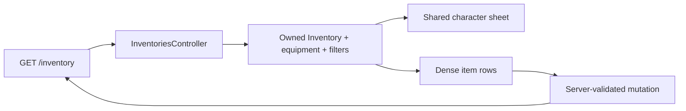

# frozen_string_literal: true
---
title: Player Inventory Feature
description: Implementation handbook for the Neverlands-based carried inventory, equipment paper doll, capacity, filters, item rows, and item actions.
status: Fully Implemented
updated: 2026-09-11
owners: Player Inventory
template: feature-v1
---

# Player Inventory

This document is the shipped implementation contract for the bounded launch
Inventory feature: authoritative carried/equipped state and the authenticated
equipment-family surface. That surface is visually matched to the fresh
Neverlands capture. Production-family mechanics and uncaptured auxiliary
visual states remain outside this handbook's completed boundary and are tracked
in the launch parity matrix.

## 1. Design authority and related documents

Domain navigation: `doc/domains/inventory.md`.

Neverlands is the sole UI, UX, and game-design authority. Direct evidence lives
in `doc/design/reference/shell/observations/2026-07-28_game_shell_and_mvp_surfaces.md` and
`doc/design/reference/inventory/observations/2026-06-01_inventory_items_and_shop_rows.md`. MVP completion is
tracked in `doc/design/launch_mvp_plan.md`.

### 1.1 Cross-feature relationships

| Related feature | Relationship | Ownership and handoff |
|---|---|---|
| `doc/features/game_shell.md` | Inventory replaces only the main gameplay surface and reports request failures through the shared flash target. | Shell owns header/chat/presence and stable flash presentation; Inventory owns its page, mutation result, and error copy. |
| `doc/features/character_progression.md` | The shared sheet reads effective character values. | Progression owns saved values; Inventory owns display and equip requirements. |
| `doc/features/shop_economy.md` | Shop buys/sells carried stacks and separately grants licenses. | Shop owns exchange and timed permissions; Inventory owns stack, mass, durability, and equipment state. Licenses create no inventory item. |
| `doc/features/world.md` | Outdoor Inventory navigation may be interrupted by an NPC and is unavailable during accepted travel or Look work. | World owns interruption/return context and persisted work availability; Inventory owns the destination page and item transitions. |
| `doc/features/arena_combat.md` | Active fights render current equipment, may apply server-resolved wear, and may award NPC item loot into carried inventory. | Inventory owns equipped/carried state, durability, capacity, and item-award validation; Arena Combat owns exact result-based wear (including Careful Fighter's half chance), typed loot resolution, and item-found feedback after a successful award. NV loot does not create an `InventoryItem`; Shop and Economy own its wallet/ledger persistence. |

## 2. Feature summary

The signed-in player opens a dense two-column page. A 463px left column shows
the shared paper doll and character parameters. After a 5px gap, the right
column begins at 467px minimum width and shows measured CSS/text control rows,
current/max mass, then flat item rows with actions, properties, and
requirements. Item mutations remain Inventory-authoritative; NV remains
authoritative in the user's Economy wallet and ledger.

## 3. MVP goals and non-goals

### Goals

- Match the captured equipment-family information hierarchy and geometry.
- Keep equipped slots, carried stacks, capacity, durability, and requirements
  authoritative on the server.
- Support equip, use, transfer, gift, discard, sorting, equipment
  sets, and money transfer only through existing Rails actions.
- Reuse one character-sheet partial across Profile and Inventory.

### Non-goals

- Inventing item categories, actions, repair rules, or confirmation UX not
  captured from Neverlands. Original item illustrations follow the captured
  subject and the project-owned artwork standard in `doc/ARTWORK.md`.
- Copying source images, sprites, icons, portraits, branding, administration
  text, or project/service prose into runtime UI.
- Treating displayed requirements or client category state as authority.
- Claiming uncaptured production-family and auxiliary interaction states are
  1:1 merely because the main equipment page is matched.

## 4. Player experience

### 4.1 Entry conditions

Authentication and a current character are required. The controller resolves
or creates that character's inventory and builds the selected category,
subcategory, information mode, equipment map, mass, and action availability.

Accepted outdoor travel or Look work blocks direct Inventory navigation and
every Inventory mutation, including the separate item-discard endpoint and
item/money transfer forms. The shared `OutdoorActionAvailability` concern
reconciles due work, then checks availability under the character row lock and
holds that lock through the request. Busy requests redirect to World with
`303 See Other` and preserve equipment, stacks, currency, and saved context.
The captured navigation lock is recorded in
`doc/design/reference/world/observations/2026-09-07_forpost_grid_and_action_audit.md`.
Existing Inventory access during an active fight is unchanged by this guard.

### 4.2 Primary surface

At the parity viewport the page uses a 463/5/467 grid. The shared left sheet is
258/5/200, with a 115 × 255 CSS character silhouette. The right side renders
the measured 41 × 53 control order with project-owned text/glyph labels, a
centered mass strip, and vertically stacked item rows.

At tablet width the two page columns remain visible while the right column may
shrink and its control strip scrolls internally. At `<=800px` the page
stacks into one column. At `<=520px` the 258px paper doll remains centered and
the parameter/item regions take the full available width. Desktop measurements
are not changed by the adaptation layer.

### 4.3 Player actions and feedback

The player can filter families/information mode and submit eligible item or
money actions. Requirement errors remain visible in red. Mutations redirect or
Turbo-refresh with server validation and flash feedback.

### 4.4 Exit and integration behavior

On a full Inventory page, the header disables Inventory and keeps Your character plus Return. Returning
uses the World-owned allowlisted context. Inventory never decides outdoor
position, combat interruption, wallet balance, or Shop availability.

Opening Inventory through Shop's shared shell control targets `main_content`
and retains the Shop parent URL. Reload restores that Shop; login also resumes
its saved accessible Shop context. This frame handoff does not make Inventory
the persistent location, and it does not alter standalone or outdoor Inventory
navigation. [Shop and Economy](shop_economy.md#44-exit-and-integration-behavior)
owns this parent-surface behavior.

## 5. Feature topology and authored content

The captured icon order is all/things, elixirs, alchemy, fishing, hunting,
resources, wood, quests, followed by equipment/information/reset controls.
Equipment items use the detailed row renderer; other families may expose a
captured empty state until their mechanics exist.

### 5.1 Coordinate, key, or identity terminology

- **Inventory item ID** — owned stack identity, never a client capability.
- **Template key** — stable item-content identity.
- **Equipment slot** — normalized server slot from `EquipmentSlots`.
- **Family/subcategory** — allowlisted presentation filter.
- **Information mode** — allowlisted full/short row presentation.

## 6. Feature surfaces and contained behavior

### 6.1 Implementation status

| Surface or behavior | Entry point | MVP status | Owning implementation |
|---|---|---|---|
| Current equipment-family page | `GET /inventory` | 1:1 baseline Done | Inventory view/helper/domain CSS |
| Equip/use/unequip/discard | Inventory member actions | Interactive | Controller plus inventory services/models |
| Transfer/gift/money transfer | Inventory collection actions | Interactive | Controller plus service/model validation |
| Player sale | Inventory collection action | Unavailable pending buyer confirmation | `TransferService` rejects without moving items or NV |
| Sort and equipment sets | Inventory actions | Interactive | Controller and persisted character metadata |
| Other-family/auxiliary visual states | Category/action transitions | Outside bounded launch feature | Capture before adding to this contract |

### 6.2 Equipment and capacity

Equipped stacks are resolved by normalized slot. Capacity and current mass come
from authoritative Inventory/Character state. The page does not recalculate
carry rules from CSS or submitted values.

`Game::Inventory::Manager#add_item!` locks the Inventory and uses a nested
transaction/savepoint for the complete requested quantity. This lets Shop,
Combat loot, and future authoritative callers rescue a capacity error without
retaining an earlier stack fill or mass increment.

Wear moves the same owned item from its carried row to its normalized equipment
slot and refreshes the shared character sheet with effective equipment bonuses.
Removing that slot returns the item to the carried list and removes its bonus;
it does not create another item. For the Shop Penknife, the visible confirmation
is the Weapon slot's item illustration/name and Armor pierce increasing by one
percentage point. Reloading and reopening Inventory reads the saved equipment
state. The slot's existing Remove button reverses the transition.

Durability loss and reset lock/reload the owned row before merging its JSON
properties. A source catalog correction snapshots previously acquired maximum
and current durability under the same row lock, so later wear/reset retains that
snapshot rather than replacing it from a stale Ruby instance. Template changes
therefore do not rewrite the durability of goods already acquired.

### 6.3 Item rows and actions

Each row renders action buttons, durability, properties, and requirement rows.
`RequirementChecker` determines current availability; the controller resolves
the item only through the current inventory before mutation.

The 79 authored ordinary Shop goods share original item illustrations across
Shop Buy/Sell and carried Inventory. Equippable goods also
reuse the same image in filled paper-doll slots.
`InventoriesHelper::ITEM_ARTWORK_PATHS` explicitly maps stable item keys to
`app/assets/images/items/` assets; translated names and submitted paths do not
select images. Carried rows fit the complete image inside 60 × 60 pixels;
equipped images fit the existing `EquipmentSlots` geometry. Names remain in
row details, slot tooltips and accessible labels. Unmapped goods retain their
existing type/name fallbacks. The character silhouette is unchanged by equipment.
Exact generation prompts and selected outputs belong to [ARTWORK.md](../ARTWORK.md).

Player-to-player selling remains unavailable even with an active Trading
license: the legacy immediate debit of another player's wallet was removed.
A source-backed offer and buyer-acceptance transition must exist before this
action can settle. Neither a permanent metadata flag, a license-named item nor
a valid permission can bypass that missing consent flow. Ordinary transfers
and gifts keep their existing independent behavior and require no license.

Purchased Trading/Doctor licenses are separate `CharacterLicense` permissions
shown under Abilities → Your licenses. Local acquisition does not create a
carried stack, occupy a slot, or add mass. The live cards' mass `1` is retained
as source display evidence; no source acquisition/mass transition was observed.
Shop and Character Progression own the bounded storage/activation adaptation,
not Inventory.

### 6.4 Deferred behavior boundary

Repair is confirmed as a workshop/profession transaction with skill,
kit/material, listing, maximum-durability, and owner-retrieval states; it is not
a one-click `InventoryItem#reset_durability!` action. One authenticated
request/payment/failure/retrieval flow is still missing, so no player repair
route is shipped. Additional belt/pocket layering, complete family-specific
pages, and popup/confirmation layouts remain deferred. Source bitmaps remain
reference evidence only; the bounded original item illustrations above do not
establish artwork parity for the full assortment. Existing mutation
routes do not prove visual parity for those states.

## 7. Authoritative data and presentation model

| Record/component | Responsibility | Important contract |
|---|---|---|
| `Inventory` | Capacity, current weight, and item owner | One per character; it does not own NV balance |
| `InventoryItem` | Owned stack, quantity, durability, equipped state | Always scoped through current inventory |
| `ItemTemplate` | Stable properties, slot, requirements, modifiers | Server-authored content |
| `Character` | Effective requirement/carry values | Progression/equipment source of truth |
| `Game::Inventory::Manager` | Stack and carried-mass mutation | Multi-unit additions persist every unit or none under one Inventory lock/savepoint |
| Helpers/views/CSS | Presentation and action forms | Never authority |

### 7.1 Source of truth

Database records and server services are authoritative. Category, information
mode, row labels, and icon state are presentation inputs only.

### 7.2 Validation and state lifecycle

Actions recheck ownership, equipped/protected state, requirements, quantity,
capacity, recipient, and relevant currency before persistence. Multi-record
transitions use their existing transactional service/model boundaries. Item
addition serializes on the Inventory row; a failed multi-stack request rolls
back all stack and mass writes even when an outer loot transition records the
capacity failure and continues.

`Game::Inventory::TransferService` also uses a savepoint for each transfer.
A rescued capacity or ownership failure rolls back
its item, mass, and wallet writes even while the controller holds the outer
character transaction. The same nesting rule protects Shop purchases through
the Shop-owned purchase service.

Item transfers lock the item template, both sender/recipient inventories in
ascending id, then reload and lock the source item. Ownership, protected state,
durability snapshot, available slots/mass and both mass updates share that
transaction. Ordered inventory locks prevent reciprocal gifts from deadlocking
and serialize incoming gifts against Shop purchases, including different item
templates competing for the recipient's last capacity.

### 7.3 Presentation versus authority

The browser may select a family, open a compact form, or submit intent. It may
not decide an item's owner, price, requirement success, capacity, or resulting
equipment state.

## 8. Runtime architecture

### 8.1 Load and render

The controller resolves current-character inventory state, bounded filtered
items, equipment, wallet values, and action availability, then renders the
authenticated game layout.

### 8.2 Accept or execute action

Each POST/PATCH/DELETE resolves submitted identity within the current owner and
delegates to the existing inventory/economy transition.

### 8.3 Complete, redirect, or hand off

Success returns to the normalized category/information state with feedback.
World owns combat interruption before Inventory entry; Shop owns trade handoff.
The September 9 regular-goods Shop path persists one purchased item through Inventory Manager
in the same transaction as NV payment, one-unit stock reduction and consumed
Shop capability. For the captured Penknife, the saved instance has 10/10
durability and adds 5 carried mass. Inventory owns the resulting item, capacity
and later equip/use behavior; Shop owns the quote/replay boundary. The browser
purchase-to-Inventory/reload/login path is covered by
`spec/system/shop_purchase_spec.rb`, with atomicity/concurrency covered by
`spec/services/game/shop/trades_spec.rb`. Licensed selling returns one unit to
the same Shop's bounded `ShopStock`, removes the owned unit and its carried
mass, and credits the wallet while deducting Shop funds in one transaction.
Shop rejects missing/expired trading permission, full stock, and insufficient
Shop NV before any value changes. [Shop and Economy](shop_economy.md) owns sale
pricing, quote validity, and the remaining source-transaction gaps.

### 8.4 Concurrency behavior

Shared inventory/economy services lock or transact where their value transfer
requires it. A stale row cannot bypass current ownership/protection checks.
Player-issued requests hold the character row from the outdoor availability
check through mutation, so a new accepted movement cannot race between those
steps. Transfer savepoints preserve their existing failure rollback inside
that outer transaction.

## 9. HTTP and Turbo contract

`GET /inventory` renders HTML. Existing collection/member actions handle
equip, unequip, use, transfer, gift, sale, discard, sort, equipment-set, and
money operations. Forms retain CSRF protection and normal Rails/Turbo response
behavior. Failed Turbo equip/unequip requests return `422 Unprocessable
Content` and replace the shared `flash` target; they do not address a removed
toast/notification container. No public JSON inventory API is part of this
feature.

The outdoor busy guard runs before inventory lookup and mutation for HTML and
Turbo requests. Its `303` World redirect applies to active travel/Look; the
normal item-validation responses above apply once the request is available.

## 10. Client-side and CSS ownership

`inventory_controller.js` owns selection-only presentation. Shared controls,
the detail table, and the panel/empty-state surfaces come from `tokens.css` and
`primitives.css`. `character_sheet.css` owns the paper doll and the 200px
parameter column shared with Profile; `inventory.css` owns the icon strip, mass
line, item rows, family sections, and equipment sets. The shared
character-sheet partial owns repeated markup.

Slot pixel geometry is not duplicated in CSS: `EquipmentSlots` is the single
source of truth and each cell receives its measured size as the `--nl-slot-w`
and `--nl-slot-h` custom properties. There is no Tailwind dependency and no
`nl/` stylesheet folder; this is SRP by UI domain rather than utility-class
sprawl. `inventory.css` also owns the `780/520px` adaptations: measured control
geometry remains stable, dense controls scroll inside their own bands when
required, and the whole page does not overflow.

## 11. Persistence and login resume

Inventory, stacks, equipment state, durability, capacity metadata, and saved
sets persist in the database. Inventory does not own login destination; World
resume/context returns to it through an allowlisted logical destination.

## 12. Authorization, trust boundaries, and concurrency

Devise authentication and current-character scoping are mandatory. Submitted
item, recipient, quantity, price, category, or mode values are untrusted.
Foreign item IDs, invalid categories, unavailable actions, insufficient funds,
capacity overflow, and protected stacks are rejected by server boundaries. The
Inventory lock serializes concurrent additions against the same capacity state.

## 13. Failure and boundary behavior

| Condition | Required behavior |
|---|---|
| Missing/foreign item | Reject without mutation |
| Accepted outdoor travel or Look | Redirect direct page/action requests to World with 303; preserve carried/equipped state, money, and resume context |
| Unmet equip/use requirements | Show the reason on the shared flash surface; preserve state; equip/unequip Turbo failures return 422 |
| Full mass/slots, including a quantity that only partly fits | Roll back the complete addition, including any earlier stack and mass increment |
| Equipped/bound/protected item | Reject forbidden transfer/sale/discard |
| Invalid family/mode | Normalize to an allowlisted default |
| Empty family | Render a captured dense empty state |

## 14. Acceptance criteria

- The current equipment-family page matches the measured 463/5/467 and
  258/5/200 composition.
- Native source icon dimensions/order, mass strip, paper doll, and item-row
  density remain stable.
- At 820px the source columns remain usable, and at 390px they stack without
  whole-page horizontal overflow or a scaled-down desktop canvas.
- Every mutation resolves current ownership and revalidates its preconditions.
- A multi-unit addition that cannot fit completely preserves the exact prior
  stack quantities and current mass.
- The page remains inside the persistent shell and preserves public semantics.
- Uncaptured states remain marked Not Done in the launch matrix.

## 15. Test strategy and required coverage

Request specs cover authentication, filters, ownership, mutations, and
failures. Model/service specs cover inventory invariants and requirements.
System/view specs cover the player-visible page and allocation/equipment
integration. Full verification is required because Inventory crosses
Progression, Shop, World, Fight, and Shell.

`spec/requests/outdoor_action_availability_spec.rb` covers direct busy-page
requests, Turbo equip, item discard, due-work completion, and unchanged
active-fight access. `spec/requests/inventories_spec.rb` verifies that even an
actively licensed seller cannot move an item or debit another player's wallet
through the unavailable player-sale endpoint.

`spec/system/responsive_neverlands_ui_spec.rb` protects the 820px two-column
state, 390px stacked state, internal icon-strip scrolling, and page overflow
boundary.

## 16. Responsible for Implementation Files

### Requirements and design evidence

- `doc/design/features/items_inventory_equipment.md`
- `doc/design/reference/shell/observations/2026-07-28_game_shell_and_mvp_surfaces.md`
- `doc/design/reference/inventory/observations/2026-06-01_inventory_items_and_shop_rows.md`
- `doc/design/launch_mvp_plan.md`

### Routes and controllers

- `config/routes.rb`
- `app/controllers/inventories_controller.rb`
- `app/controllers/inventory_items_controller.rb`

### Models and policies

- `app/models/inventory.rb`
- `app/models/inventory_item.rb`
- `app/models/item_template.rb`

### Services

- `app/services/game/inventory/manager.rb`
- `app/services/game/inventory/requirement_checker.rb`
- `app/services/game/inventory/transfer_service.rb`
- `app/services/game/shop/license_rules.rb`

### Views, helpers, client behavior, styling, and assets

- `app/views/inventories/**`
- `app/views/shared/_neverlands_character_sheet.html.erb`
- `app/views/shared/_equipment_paperdoll.html.erb`
- `app/views/shared/_equipment_paperdoll_slot.html.erb`
- `app/models/equipment_slots.rb`
- `app/helpers/inventories_helper.rb`
- `app/javascript/controllers/inventory_controller.js`
- `app/assets/stylesheets/character_sheet.css`
- `app/assets/stylesheets/inventory.css`
- `app/assets/images/items/`

### Content, configuration, seeds, and schema

- `db/seeds.rb`
- `db/structure.sql`

### Integrated feature entry points

- `app/controllers/world_context_actions_controller.rb`
- `app/services/game/world/interrupt_action.rb`
- `app/controllers/concerns/outdoor_action_availability.rb`
- `app/controllers/shop_controller.rb`

### Factories

- `spec/factories/inventories.rb`
- `spec/factories/inventory_items.rb`
- `spec/factories/item_templates.rb`

### Specs

- `spec/requests/inventories_spec.rb`
- `spec/requests/outdoor_action_availability_spec.rb`
- `spec/models/inventory_spec.rb`
- `spec/services/game/inventory/manager_spec.rb`
- `spec/system/inventory_progression_spec.rb`
- `spec/system/responsive_neverlands_ui_spec.rb`

## 17. Safe extension checklist

`doc/guides/managing_game_content.md` documents the future explicit
`ItemTemplate` management adapter and the separate service-backed inventory
grant/revoke pattern. Those examples are extension guidance, not currently
shipped Inventory management routes.

1. Capture the exact Neverlands state first.
2. Add stable server content/identity, never DOM-derived authority.
3. Keep the shared sheet markup reusable and domain actions separate.
4. Extend `character_sheet.css` for shared sheet geometry and `inventory.css`
   for the carried-item column; never redefine control chrome outside
   `primitives.css`, and never restate slot pixel sizes outside
   `EquipmentSlots`.
5. Cover success, failure, boundary, ownership, and concurrency as applicable.
6. Update the launch matrix and this handbook only after verification.

## 18. Version history

| Date | Change |
|---|---|
| 2026-07-28 | Created the canonical Inventory handbook after the fresh authenticated Neverlands parity pass and documented the matched baseline plus remaining state gaps. |
| 2026-07-28 | Added the local-only responsive contract: preserve desktop measured geometry, retain tablet columns, stack below 800px, center the CSS paper doll, and contain control overflow within its band. |
| 2026-07-28 | Replaced source-owned runtime images and source-specific copy with a CSS character silhouette, CSS/text controls, and game-specific copy while preserving measured geometry and hierarchy. |
| 2026-07-29 | Rebuilt the surface from a second authenticated capture: `EquipmentSlots` now carries the measured per-slot geometry, the doll renders the source column order, the two icon rows collapsed into the source's single strip plus subcategory row, and `player_inventory.css` was replaced by `character_sheet.css` and `inventory.css`. |
| 2026-07-29 | Linked the cross-feature management guide's future `ItemTemplate` adapter and service-backed inventory grant/revoke pattern without claiming those routes are shipped. |
| 2026-08-23 | Documented the successful NPC item-loot handoff to Arena's item-found feedback, distinguished Economy-owned NV loot from Inventory state, and kept inventory validation on the shared flash surface after removal of the legacy toast path; equip/unequip Turbo failures now return 422 without mutating equipment. |
| 2026-08-25 | Made the shared multi-unit item-add contract explicitly atomic: an Inventory lock plus nested savepoint rolls back partial stack and carried-mass writes before a caller records a capacity failure. |
| 2026-08-26 | Clarified the Combat-owned Careful Fighter wear handoff and recorded repair as a deferred workshop/profession transaction rather than an inventory durability reset. |
| 2026-09-13 | Equipment-set save/wear/delete success and failure alerts use `game.inventory.set_*` i18n. |
| 2026-09-13 | Direct transfer/gift/NV and deferred player-sale alerts use `game.inventory.*` i18n. |
| 2026-09-13 | Equip requirement failures (`broken` / `expired` / unmet stats) use `game.inventory.item_*` / `requirements_not_met`. |
| 2026-09-13 | Use/discard inventory alerts use `game.inventory.cannot_use` / `cannot_discard` / `item_discarded`. |
| 2026-09-13 | Equipment-set save field uses localized placeholder (`game.common.set_name`) with `data-equipment-set-name`. |
| 2026-09-13 | Transfer price field uses `game.common.nv_short` placeholder with `data-inventory-transfer-price`. |
| 2026-09-13 | Broken rows link to Pitch Forge (or show deferred hint) without inventing a repair transaction. |
| 2026-09-13 | Carried durable rows expose `data-inventory-broken`, a Broken badge, and low/broken durability bar states; workshop repair remains deferred. |
| 2026-09-13 | Junk CTA shows offer count plus estimated buyback NV (`data-inventory-junk-total`); same estimate authority as Ash Buyer. |
| 2026-09-13 | Inventory mass row exposes mass/slot capacity markers (`data-inventory-mass`, `data-inventory-slots`) plus slot copy. |
| 2026-09-13 | HUD wear chip (`Game::Inventory::EquippedWear`) links to Inventory when equipped durable gear is worn or broken (`data-wear-worn` / `data-wear-broken`); inventory mass row repeats the wear count; workshop repair remains deferred. |
| 2026-09-10 | Integrated seven original Shop-item illustrations into carried rows and shared equipment slots; extended the Shop browser flow through wear, persisted slot/stat confirmation, removal and resale. |
