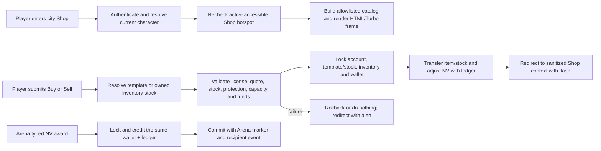

# frozen_string_literal: true
---
title: Shop and Economy Feature
description: Implementation handbook for the Neverlands-based city shop, NV wallet, catalog buying, inventory selling, and transaction ledger.
status: Partially Implemented
updated: 2026-09-11
owners: Shop and Economy
template: feature-v1
---

# Shop and Economy

This document is the implementation contract for the current Shop and Economy feature. It explains City and linked-village Shop access, catalog modes and filters, NV payments, stock and inventory mutations, resale pricing, login resume, UI ownership, security, concurrency, and test coverage.

It describes what exists now. It does not treat every captured Neverlands city counter, license rule, novice service, or generic marketplace mechanic as shipped behavior.

## 1. Design authority and related documents

Domain navigation: `doc/domains/economy.md`.

Neverlands is the sole game-design and visual reference for this feature. The local implementation adapts the observed Shop density, item rows, tabs, filters, NV prices, mass summaries, and explicit buy/sell actions to Rails and the current English client. Source runtime images, logos, project identity, and service/administration prose are evidence only; the shipped scene uses original project interior/category artwork, semantic HTML, and English game wording. Exact generation prompts and atlas packaging are recorded in `doc/ARTWORK.md`.

When behavior is uncertain or conflicts with this document:

1. Re-observe Neverlands and record the evidence under `doc/design/reference/`.
2. Update the relevant shop/economy design record.
3. Change implementation and coverage together.
4. Update this feature contract last.

Supporting documents:

- `doc/design/reference/economy/observations/2026-09-09_city_shop_purchase.md` records the confirmed one-item purchase, stock refresh, inventory handoff, disabled licenses and novice level denial.
- `doc/design/reference/economy/observations/2026-05-21_lavka_shop.md` records the live shop tabs, filters, tables, quantities, stock, prices, requirements, and status strip.
- `doc/design/reference/economy/observations/2026-09-10_shop_layout_and_entrance_scale.md` corrects the entrance sizing interpretation and records the measured control geometry and typography.
- `doc/design/reference/inventory/observations/2026-06-01_inventory_items_and_shop_rows.md` records source inventory and item presentation used by selling and capacity feedback.
- `doc/design/reference/city/observations/2026-07-28_city_movement_and_services.md` records how the city exposes building entry and exit.
- `doc/design/reference/shell/observations/2026-07-28_game_shell_and_mvp_surfaces.md` records the compact surrounding interface.
- `doc/design/reference/world/observations/2026-09-07_forpost_grid_and_action_audit.md` records village Shop entry, its separate presence label, and return to the village square.
- `doc/design/reference/world/observations/2026-09-09_starter_landmarks_and_art.md` records mine item-card previews and resource exchange section controls; no economic operation was submitted.
- `doc/design/reference/world/observations/2026-09-09_mine_exchange_wiki.md` preserves the adjacent official-wiki inputs without promoting older exchange rules to verified live behavior.
- `doc/design/reference/economy/observations/evidence_needed_mine_exchange_operations.md` owns the missing mine/exchange economic captures.
- `doc/design/reference/social/observations/2026-08-23_chat_game_event_timeline.md` records the supplied Neverlands item and `24 NV` search-result rows; the row proves the result form but not a production NPC identity or probability.
- `doc/design/features/economy_trading_shops.md` defines the local economy and shop boundary.
- `doc/design/areas/cities_and_buildings.md` owns the authored building topology.
- `doc/design/launch_mvp_plan.md` defines the MVP trading/economy boundary.
- `doc/features/world.md` owns exact position and the safe World fallback used by Shop resume validation.
- `doc/features/city.md` owns entry to the Shop building.
- `doc/features/character_progression.md` owns the stats and skills displayed as item requirements.
- `doc/features/game_shell.md` owns the persistent frame surrounding the shop.
- `doc/features/player_inventory.md` owns carried stacks and equipment after a trade.
- `doc/features/arena_combat.md` owns NPC loot eligibility and resolution before an NV wallet credit.

### 1.1 Cross-feature relationships

Airship boarding uses the same NV wallet and adjustment ledger. Shop purchase
and sale receipts have the append-only protection described below.
`doc/features/airship_travel.md` owns route/offer validation, journey creation,
the surrounding transaction, and retry protection. Its `airship_boarding`
debit references the journey, route, and boarding offer; predeparture
disembarkation does not refund the fare. While aboard, direct Shop access is
unavailable even when the flight passes over a Shop's ground cell. No Shop
stock or inventory ticket item is introduced by this handoff.

| Related feature | Relationship | Ownership and handoff |
|---|---|---|
| `doc/features/world.md` | Shop uses World-owned resume context and falls back to World when a saved Shop is no longer accessible. | World/City own exact location and safe destination selection; Shop owns only its allowlisted surface context and transactions. |
| `doc/features/city.md` | Central Square exposes and authorizes entry to the Shop. | City owns the node, hotspot offer, level/access check, and return; Shop owns behavior after the entry handoff. |
| `doc/features/character_progression.md` | Shop item rows present requirements derived from character stats/skills. | Character Progression owns the values; Shop may display them but does not decide equipment eligibility or mutate progression. |
| `doc/features/game_shell.md` | Shop can render as the central gameplay surface inside the persistent shell. | Shop owns catalog/trade responses; Game Shell owns shared framing, navigation, presence, chat, and flashes. |
| `doc/features/player_inventory.md` | Shop purchases add carried stacks and Shop sales remove eligible stacks. | Shop owns exchange value/stock transactions; Player Inventory owns the resulting stack, mass, durability, and equipment rules. |
| `doc/features/arena_combat.md` | A successful typed NPC currency award credits the same NV wallet used by Shop. | Arena Combat owns the loot roll, per-NPC retry marker, and award source metadata; Shop and Economy own wallet locking, non-negative balance, and the adjustment ledger. |

## 2. Feature summary

An authenticated player standing inside an accessible city Shop can browse server-authored item templates, filter the dense Neverlands-style table, buy explicitly authored Shop goods with NV, switch to Sell, and sell eligible non-broken inventory stacks back to the shop. The screen shows wallet balance, wiki-derived carried-mass maximum, item properties, requirements, stock, unit prices, one-item confirmation controls, and result flashes.

The server is authoritative. `CurrencyWallet` owns the account's NV balance,
`CurrencyTransaction` records each adjustment, `Inventory` owns carried
items/capacity, `ItemTemplate` owns definitions/prices, `ShopAccount` and
`ShopStock` own each building's funds and supply, `CharacterLicense` owns timed
permissions, and the current
character's city context controls Shop access. The wallet is also the authority
for source-backed NV awarded by NPC combat; the Arena transition supplies the
reason/source metadata but does not bypass wallet invariants. Catalog parameters
and browser controls never confer purchase, sale, or reward authority.

The catalog includes the 19 observed categories, with Knives as the default.
Buy, Sell and Licenses use explicit one-unit capabilities. Licenses displays
six authored cards and permits eligible purchases into Your licenses. Selling
requires an active trading license. For Beginners displays the observed denial
at level 10 or above and an empty section below that boundary; it grants no
novice benefit.
Mine previews remain a separate read-only World surface.

The Shop status strip displays its independent NV funds beside the player's
NV and carried mass. Unconfigured shops display no invented fund balance.

The MVP currently contains:

- City or exact-cell linked-village Shop access and safe login resume;
- source-shaped modes, categories, numeric filters, and dense item tables;
- transactional buy and sell operations with wallet, inventory, capacity, durability, and stock handling;
- one non-negative decimal NV wallet per user and a durable adjustment ledger
  shared by Shop transfers and typed NPC-loot credits;
- authenticated current-character scoping and safe rejection of foreign inventory item IDs.

## 3. MVP goals and non-goals

### Goals

- Reproduce the captured Neverlands shop layout and deliberate buy/sell interaction.
- Keep NV, inventory contents, capacity, and shop stock server-authoritative.
- Make each successful purchase or sale atomic across the affected records and its consumed capability; reject duplicate submissions without another trade.
- Make every NPC-loot NV credit atomic with its source resolution marker and
  player-facing projection while retaining Economy's wallet/ledger authority.
- Preserve only allowlisted catalog context when the player reloads or logs back in. Shop tabs, categories and filters advance the Turbo frame URL.
- Revalidate city Shop availability and record ownership for every request.

### Non-goals

- Inventing license effects, durations, prerequisites, or novice-only services that were not observed.
- Player-to-player markets, auctions, barter, banking, exchange rates, credit, refunds, or generic merchant reputation.
- Implementing Market listings/rent, Junk Dealer, Numismatics Exchange, Hospital Shop, Pharmacy, or Airship Station transactions here. Market participates only in the Merchant license prerequisite described below.
- Activating mine item/license purchases or Resource Exchange queries,
  listings, transactions and storage from their read-only World lobby controls.
- Treating displayed equipment requirements as purchase prohibitions; inventory/equipment owns whether an item can be equipped.
- Exposing a separately versioned public shop API, blueprint serializer, or Swagger/rswag contract.

## 4. Player experience

### 4.1 Entry conditions

The player enters through an active, level-accessible Shop hotspot in their current city node or an authored Shop feature in the linked village at their exact outdoor cell. `GET /shop` rechecks that context; direct access from an ordinary outdoor cell or an unavailable hotspot redirects to World with an alert.

An inventory and wallet are created with safe defaults if the current character/user does not yet have them. Authentication and an active playable character are required before shop state is loaded or remembered.

### 4.2 Primary surface

The Shop begins with the common `shared/building_entrance` illustration. Its
25:12 display ratio is independent of the existing PNG's 1810 × 869 encoded
resolution. The shared controller observes the shell gameplay region, takes
75% of its height, clamps the result to 300–600px, and scales width
proportionally. Width is capped to the available container. The default before
connection is 625 × 300px, subject to the same width cap. The controller reacts
to pane resizing and disconnects its observer when the surface leaves the DOM.
All future decorative building entrances use this same consumer; interactive
City/location canvases retain their separate geometry. Exact image
specifications are owned by [ARTWORK.md](../ARTWORK.md#decorative-building-entrance-image-specifications).

The source `main_top` frame contains the player/navigation strip. Therefore the
local measured region is `.nl-main-area.clientHeight` plus
`.nl-top-bar.offsetHeight`, excluding chat.
Both are observed so resizing either region updates the entrance.

The centered illustration is followed by 4px of spacing and the four compact
Shop mode tabs. The catalog remains centered at 800px. The 61px category strip
has 19 icon-only links in source order, with title tooltips and accessible names;
no persistent label is painted or displayed under each icon. The original 5 × 4
atlas supplies 41 × 53px category boxes, with 44 × 53px boxes for Knives and
Belts; its unused twentieth cell is not rendered. Level/price filters use
compact left-aligned text fields and an NV suffix.

The local Shop composition leaves 10px above the entrance, counting the shell's
existing 5px frame padding rather than adding a second full gap. This is the
local placement choice based on the source's approximate visible spacing, not
a newly measured exact Neverlands dimension.

Shared shell navigation owns Inventory and the City/Village return. The Shop
surface has no duplicate title/player/control bar before its tabs. On narrow
screens the decorative entrance fits proportionally, while category, filter
and goods regions own horizontal overflow instead of widening the page.

Buy renders dense item rows with name, properties, requirements, stock, NV
price, durability and one Buy action. Sell renders owned stacks with item
state, quantity, calculated unit return and a sell action; equipped or protected
rows remain visible with the action unavailable. Their two-line
economy strip sits below the filters: player NV and mass/max first, then Shop
funds. Slots remain an inventory capacity rule but are not a Shop status label.
Licenses has no economy strip. The surrounding header, vitals, nearby players
and chat belong to Game Shell.

### 4.3 Player actions and feedback

The player changes mode/category/filter parameters, then confirms one Buy or
Sell action. Equipment rows have no quantity selector; any submitted quantity
other than exactly one is rejected. Successful mutations redirect to a fresh
Shop GET and show `Bought: ...` or `Sold: ...`; failures show the domain message
without partial mutation. No Shop-specific chat event is emitted: the live
purchase showed catalog/wallet/mass refresh, while existing combat and world
feedback continue in the shared chat timeline.

Buying checks an explicitly offered, authored positive-priced template, current Shop/location, quote validity, finite stock, NV balance, inventory slots, carried mass, and stack limits. Selling checks current-character ownership, quantity, protected/equipped/bound state, and positive resale value. Unmet equipment requirements remain visible information and are enforced later by the inventory/equipment feature.

### 4.4 Exit and integration behavior

The player returns to the City through the shared building/city navigation. The Shop remembers sanitized mode, category, and numeric filter strings as gameplay context, so logout/login or a direct return resumes the same Shop screen while that Shop remains accessible.

The shared shell Inventory control submits `POST /world/context` with the
allowlisted `inventory` context. Only when invoked from Shop, its form targets
`main_content`: Inventory replaces that frame while the browser retains the
Shop parent URL. Reload therefore restores Shop, and login resumes the saved
accessible Shop context. This preserves the previous Shop-to-Inventory frame
behavior after removing the duplicate body link. It does not change general
shell/outdoor navigation or make Inventory the saved Shop login destination.

For the linked Frontier Village Shop, the shared Village return control uses
the active same-cell parent resolved by `Game::World::ResumeContext`, returning
to Village Square. The square's separate Leave hotspot returns outdoors. No
browser return URL controls this destination. Shop's presence projection uses
its own room context and refreshes after the saved Shop context changes.
City Shop and village Shop remain separate audiences even though both display
Shop. The shared query scopes the persisted zone/cell and room, includes only
recent open sessions and the playable character, and supplies a bounded list
with the full count. Ordinary chat uses that same partition; Shell owns its
polling and login-scoped browser history.
Direct Shop GET and trade requests also enforce the persisted outdoor
travel/Look boundary under the character lock. A rejected request preserves
the wallet, inventory, stock, and saved room. Purchase's existing transaction
uses a savepoint so its rescued failures still roll back if the request already
holds that lock.

City owns the building node before entry and after exit. Inventory owns stacking, capacity, equipment state, and later item use. Character Progression owns requirement values. Shop and Economy own only catalog eligibility, exchange mutations, wallet adjustments, stock, and shop presentation.

## 5. Feature topology and authored content

The feature uses an authored catalog/state graph rather than spatial cells.

| Runtime key | Player-facing name | Connections or actions | Implemented content |
|---|---|---|---|
| `buy` | Buy Goods | Category/filter, confirmed one-item purchase | Explicit `enhancement_rules.shop.sold` goods with valid category and finite stock |
| `licenses` | Licenses | Six cards; eligible one-license purchase | Trading I–III and Doctor I–III, typed prerequisites and timed ownership |
| `sell` | Sell Goods | Category/filter, confirmed one-item sale | Current character's inventory, filtered by category/level/base price |
| `novice` | For Beginners | Category/filter and level denial | No authored novice transaction; level 10+ denied |
| 19 category keys | Knives through Other | Explicit subcategory filter | Source category order; no generic All/Weapons/Resources replacement |

### 5.1 Coordinate, key, or identity terminology

- **Item-template ID** — server database identity submitted for purchase; it must resolve inside the explicitly authored buyable scope and match an owned live offer.
- **Inventory-item ID** — owned stack identity submitted for sale; it is resolved only through the current character's inventory.
- **Mode/category key** — allowlisted presentation/filter key; invalid values fall back to `buy` and `knives`.
- **NV** — the source-backed single currency stored in the current user's wallet.
- **Shop stock** — one `ShopStock` per account/template; current count and optional captured maximum, locked and settled with the trade. Unknown maximum does not authorize accepting returns.

Catalog order, row position, item label, CSS class, displayed price, and query parameters never establish ownership or availability.

## 6. Feature surfaces and contained behavior

### 6.1 Implementation status

| Surface or behavior | Entry point | MVP status | Owning implementation |
|---|---|---|---|
| Shop frame/catalog | `GET /shop` | Interactive | `ShopController` and `Game::Shop::Catalog` |
| Catalog purchase | `POST /shop/buy` | Interactive | `Game::Shop::Purchase` |
| Inventory sale | `POST /shop/sell` | Interactive | `Game::Shop::Sale` |
| NV wallet and ledger | Shop services and authoritative internal callers | Interactive persistence | `CurrencyWallet`, `CurrencyTransaction`, and `Economy::WalletService` |
| Licenses mode | `GET /shop?mode=licenses` | Eligible purchases | `Catalog`, `Purchase`, `LicenseRules`, `CharacterLicense` |
| Your licenses | `GET /character/licenses` | Read-only active ownership | `CharacterLicensesController`, current-character scope |
| Merchant license qualification | `POST /merchant_qualification/accept`, `/pay`, `/complete` | Location-gated steps; payment requires the accepted state | `MerchantQualificationsController`, `Game::Shop::MerchantQualification` |
| Novice mode | `GET /shop?mode=novice` | Level denial/empty section | No novice capability or purchase |
| Other captured city counters/interiors | City building routes | Read-only or deferred | City feature |
| Mine Shop / Resource Exchange lobby sections | Exact-cell linked-location pages | Read-only; economic operations deferred | World owns the shipped lobbies; Economy owns the operation gaps in §6.5 |

### 6.2 Buying and stock

Buy requires an explicit positive-priced definition and a `ShopStock` row in
the selected building's `ShopAccount`. An ordinary equipment category and the
separate licenses mode are allowlisted; query parameters cannot change the
transaction kind. SQL filters before hydrating at most 200 templates.

One goods purchase debits the player's wallet, credits that Shop's funds,
records the ledger entry, adds one inventory item/mass, reduces local stock by
one and consumes its capability atomically. Penknife means −7 NV, +1 item at
10/10 durability, +5 mass, −1 shop stock and +7 shop funds. Capacity uses
`effective Strength × 5 + effective Health × 10 + level × 10`.

A license purchase instead grants one `CharacterLicense` permission snapshot
with kind, tier, name, activation and expiry. It does not create a transferable
inventory item or consume physical slots/mass. The six card descriptions retain
the source's mass/durability text; the actual source mass effect was not captured.
Local duration starts at the committed purchase time: this is an explicit local
lifecycle choice from the user-authorized description-based implementation,
not a live-confirmed Neverlands activation sequence. Expiry is authoritative at
`starts_at <= now < expires_at`; rereading or logging in cannot extend it.
No cron or background job deletes expired grants. Permission checks reject them
at the server deadline, and the next Your licenses request omits them while
retaining their purchase records. An already-open page has no expiry polling;
its displayed row can remain until navigation or reload without authorizing a
sale. The exact read/display contract belongs to
[Character Progression](character_progression.md#66-purchased-licenses-and-abilities).

Merchant and Healer are selectable source perks #34/#35. The
[Neverlands prerequisite matrix](../design/reference/economy/observations/2026-09-09_licenses_and_shop_selling.md#license-purchase-requirements)
records the Trader/Doctor wiki rules. `Game::Shop::LicenseRules` applies these
profession-specific checks in addition to ordinary transaction eligibility:

| License | Current server check | Playable local state |
|---|---|---|
| Trading I–III | `owns_perk?(:merchant)` and `metadata.profession_unlocks.merchant == true` | Merchant qualification below unlocks purchases. No positive numeric Trading prerequisite is imposed. |
| Doctor I | `owns_perk?(:healer)` | Purchase and timed permission are implemented. This does not provide treatment or medical crafting. |
| Doctor II–III | `owns_perk?(:healer)` and `metadata.profession_unlocks.traumatologist == true` | Definitions and the completion check exist; normal-play purchase remains blocked because the Traumatologist quest is unimplemented. |

The source's 100 Doctor skill threshold governs entry to the Traumatologist
quest, with equipment contributions allowed. No numeric Doctor quest-entry
check or independent numeric license-purchase check is implemented locally.
The completion flag is server-owned; buying a license or allocating Healer does
not set it. Doctor I's purchase path follows the page's stated Healer gate;
the initial medical quest and bag/knowledge requirements concern the separately
unfinished treatment/crafting flow. They are not claimed as implemented by
license ownership.

Boolean perk ownership, numeric profession proficiency, qualification progress
and `CharacterLicense` are separate state. Existing item names or permanent
boolean license flags grant no Shop permission. The
[prerequisite specs](../../spec/services/game/shop/license_rules_spec.rb)
verify the Merchant/qualification and Healer/tier distinctions; §6.4 owns
the remaining profession gaps.

The Merchant prerequisite has a playable bounded path: select Merchant, enter
Forpost Market in the Residential District and accept qualification; return to
the Central Square Shop, pay 1,000 NV for the receipt; return to Market and
complete qualification. Only then can a trading license be purchased. The
receipt is persisted progress backed by the wallet ledger, not an invented
inventory item with guessed mass or stats. The source's temporary garment
reward remains an explicit `[IMPL]` gap because its item definition and lifetime
are not captured. This implements the license unlock portion of that quest,
not full quest/reward parity.

`Game::Shop::MerchantQualification.new(character:, clock:).call(action:)`
returns a success/message result for the allowlisted accept/pay/complete steps.
It locks the character, validates the exact Forpost building/room and busy state,
and persists `metadata.merchant_qualification` with step timestamps and receipt
transaction identity. Payment locks Shop account then wallet and atomically
debits 1,000 NV, credits Shop funds, records `shop.merchant_qualification` and
moves progress to paid. Retries cannot charge again. Market completion validates
the owned ledger receipt and sets `metadata.profession_unlocks.merchant`.

### 6.3 Selling and NV accounting

The official Trader table maps trading skill 0–99/100–224/225–349/350–474/
475–599/600+ to 20/30/40/50/60/70 percent of base price. Decimal calculation
applies current/max durability and rounds once at the end to two decimals;
there is no separate fee or minimum 1-NV floor. Healthy 7-NV Penknife returns
1.40 NV at the initial tier; a 400-NV item at 84/100 returns 67.20 NV. Source
quotes confirm those examples; exact fractional rounding remains an adopted
local money policy. Profession trading skill is explicit server-owned
`character.metadata.profession_skills.trading`, distinct from allocatable
passive skills and the Merchant perk. Missing or malformed proficiency reads as
0. Sales use this value but do not increment it. Published Shop-sale growth is
an `[IMPL]` gap; its exact gain/probability remains `[EVIDENCE]`, as separated in
the [source record](../design/reference/economy/observations/2026-09-09_licenses_and_shop_selling.md#profession-use-and-growth).

Buy and Sell lock character/offer → Shop account → template/stock → inventory
(and the sold item) → wallet. A sale rechecks active trading permission, quote,
ownership, durability/protection, local stock headroom and Shop funds. It
removes one unit/mass, credits the player, debits Shop funds, increments stock
by exactly one, appends a ledger row and consumes the offer together. Full
stock is rejected rather than silently discarding the returned unit. Missing
stock, unknown return capacity, or insufficient Shop funds also reject unchanged.
After locking the wallet, Sale also rejects a payout that cannot fit its
existing `decimal(12,2)` storage before removing any item. The exact maximum
9,999,999,999.99 NV remains storable. `CurrencyWallet::NV_STORAGE_LIMIT` names
this technical boundary; it is not a newly inferred Neverlands balance cap.
Equipped, bound, protected, locked, broken or impossible-durability items
cannot be sold.

Wallet balances and ledger amounts are decimal values. Every adjustment is
non-zero, records a reason and resulting balance, and cannot leave the wallet
negative. Model validations and database constraints reject non-finite values,
zero adjustments, negative balances and values outside decimal storage bounds.
`Economy::WalletService#adjust!(amount:, reason:, metadata:)` locks the wallet,
updates its balance and writes the ledger row inside its own savepoint. A ledger
failure therefore rolls back the balance even when an outer caller rescues the
failure and continues its transaction. It returns the updated wallet.

### Settlement receipts and retention

Each Buy/Sell writes one `CurrencyTransaction` with reason `shop.purchase` or
`shop.sale`. New receipts use `metadata.receipt_version = 1` and record:

- the character, offer, Shop account and stock identities;
- item-template id/key/name, quantity, fixed-two-decimal unit price and acquired
  inventory-item or character-license identity;
- player and Shop balances before/after, stock before/after, and inventory
  mass before/after;
- ordinary goods' owned quantity before/after; sales also record base price,
  Trading proficiency and current/maximum durability used in the quote.

These snapshots are written from the locked records in the settlement
transaction. The ledger amount is the player's signed NV change; the metadata
also captures the corresponding Shop balance change. This extends the existing
adjustment ledger rather than introducing a separate accounting subsystem.

For these two reasons, PostgreSQL rejects receipt updates/deletes (including
changing the reason to evade retention). Generated foreign-key columns derive
the offer/account references from metadata; a unique offer index prevents a
second receipt, and insertion verifies wallet ownership plus matching offer
action/account. Purchase amounts must be negative and sale amounts positive.
The model also reports `ActiveRecord::ReadOnlyRecord` for ordinary edit/delete
attempts. Other adjustment reasons retain their existing lifecycle.

Historical receipts remain unchanged: the five local receipts present before
this migration have valid references but no v1 snapshots. Absence of
`receipt_version` identifies that older, less detailed record. Migration
preflight rejects invalid history with aggregate counts instead of rewriting
money or inventing snapshots.

Receipt retention also prevents hard deletion of a referenced wallet, offer or
Shop account, including parent deletion that reaches those records. Expiring or
cancelling an offer updates its status and remains supported. Operational
corrections must preserve the original receipt and use a separately reasoned
adjustment; no reversal/admin correction UI is implemented here. Deactivation
is preferred to deleting accounts with retained trade history.

Sample-account bootstrap grants initial NV once per wallet through
`Seeds::StarterWalletGrant.call(user:, amount:, metadata:)`. It holds the
wallet row lock while checking for the stable `seed.initial_nv` ledger reason
and calling the existing wallet adjustment service. New grants also record
`seed_grant_key: starter_initial_nv_v1`. Repeated or concurrent seed calls
create no second credit. Historical entries without that metadata marker
still count as completion, preserving current balances and old ledger rows;
this does not repair historical duplicate grants or reset spent balances.

NPC currency loot uses the same boundary with reason `combat.npc_loot` and
source metadata for match, character, NPC participation/template, loot-entry
index, and stable event key. Arena persists the wallet adjustment inside the
same outer transaction as its per-NPC `loot_resolution` marker and recipient
event. A retry sees that marker and does not create a second credit or ledger
row. Item loot never enters the wallet; Inventory remains its authority.

### 6.4 Deferred behavior boundary

Licenses grant their explicitly typed timed permissions. Doctor ownership does
not implement injury treatment and cannot authorize trading. Doctor qualification
quests, renewal/stacking policy and expiry cleanup must not be inferred from a
card title. Merchant qualification implements the published license-unlock steps
above; its garment reward and original dialogue/receipt presentation remain
incomplete. Doctor II/III require the Traumatologist quest, whose playable flow
is not implemented. An active license blocks another purchase of the same kind,
including another tier, until source renewal/upgrade behavior is established.
Novice low-price heuristics and name-inferred license
rights have been removed. There is no bargain, refund, repair, player order or
remote-shop flow.

Trading-license descriptions include player trading, but Inventory's old
unilateral player-sale settlement has been removed. An active license cannot
debit another player's wallet without a source-backed offer/acceptance flow;
that player-to-player capability remains an explicit `[IMPL]` gap. This does
not block the licensed sale-to-Shop transaction above.

`Game::Shop::TradeOffers` reuses durable `WorldActionOffer` records, bound to
character, exact physical location, accessible building revision, action,
target and quoted item state. Unchanged reads reuse live offers without
extending the existing ten-minute deadline; changed sections cancel obsolete
Shop offers. Accepted trades complete the offer in the same transaction.
Replayed, expired, foreign, changed-item and wrong-location actions cannot
spend NV or change stock/inventory. The ten-minute expiry is an existing local
technical policy, not an observed Neverlands timeout.

Remaining [IMPL] scope includes the full assortment and its additional artwork,
additional shops' authored opening balances/supply and profession quest/effect
workflows. Only Forpost has an authored starting account; an unconfigured
village remains reachable but cannot trade using another shop's economy.
[EVIDENCE] remains for replenishment, successful source sale/license feedback,
activation timing, renewal, expiry cleanup and eligible novice operations.
The live unlicensed sale was rejected with unchanged money/item/stock; local
licensed settlement is verified against documented rules and the user's stock
contract, not claimed as a newly observed successful source sale.

### 6.5 Mine Shop and Resource Exchange gap ownership

World ships the mine and exchange's cell entry, read-only sections, Nature
return and lobby resume. Mine previews contain captured item/license details
with disabled purchase controls; exchange tabs contain selectors and a disabled
Choose control. They do not grant ordinary Shop access or run an economic
query. [The World handbook](world.md) remains their runtime owner.

| Remaining Economy work | Known runtime gap | Evidence needed before implementation |
|---|---|---|
| Mine item/license acquisition | `[IMPL]` Purchases, stock changes, NV debit and item/license receipt are absent for this lobby. Main Shop's Licenses mode does not provide them. | `[EVIDENCE]` Capture confirmation, successful acquisition, quantity/stock/funds/capacity/eligibility denials and repeat handling. Displayed prices/durations are already recorded; sampled stock is not a fixed rule. |
| Exchange queries and listings | `[IMPL]` Choose, populated/empty listing results and listing refresh are absent. Switching a read-only section is not a resource query. | `[EVIDENCE]` Submit the observed selectors and capture actual results, row identities, filtering, refresh and stale state. |
| Exchange transactions and settlement | `[IMPL]` Orders/trades, settlement and their wallet/resource mutations are absent. | `[EVIDENCE]` Confirm the live operation model, requirements, timing, fees if present, cancellation/expiry, failure and retry outcomes. Older wiki descriptions do not establish current settlement rules. |
| Exchange storage operations | `[IMPL]` Resource deposit, withdrawal or claiming is absent; the exact operation model is not inferred from the tab name. | `[EVIDENCE]` Observe ownership, quantity/capacity if applicable, success, failure, persistence and repeated requests. |

The canonical [capture backlog](../design/reference/economy/observations/evidence_needed_mine_exchange_operations.md)
links the preserved live/wiki observations. These are later operation tasks,
not unfinished starter-map entry/return work. Recording them here does not
change the launch plan's delivery boundary.

After acquisition, mining-license use/effects, tools, digging/extraction,
yields and proficiency belong to [Professions](../domains/professions.md).
The separate descent/underground-cell travel backlog belongs to
[Dungeons](../domains/dungeons.md). Economy must not grant those capabilities
because an item card or a lobby is visible.

## 7. Authoritative data and presentation model

| Record or component | Responsibility | Important contract |
|---|---|---|
| `CurrencyWallet` | One user's NV balance | Unique per user and non-negative |
| `CurrencyTransaction` | Audit one wallet adjustment | Non-zero amount, reason, metadata, and non-negative `balance_after` |
| `ItemTemplate` | Catalog identity, price, requirements, stack/durability and typed license definitions | Explicit authored assortment; stock JSON is bootstrap content only |
| `ShopAccount` | One authored building's NV funds | Unique location and nonnegative balance; no invented default for unobserved shops |
| `ShopStock` | One account's quantity and optional captured capacity per template | Independent stock cannot underflow or exceed a known maximum |
| `CharacterLicense` | Owned timed professional permission | Purchase provenance, explicit kind/tier, and server-clock expiry |
| `Inventory` and `InventoryItem` | Current character's derived mass capacity and owned stacks | Sale scope, broken/protected state, and `Character#carrying_capacity` authority |
| `Game::Shop::Catalog` | Authored modes, categories, filters, and resale formula | Presentation eligibility only; does not transfer value |
| `Game::World::ResumeContext` | Current Shop availability, parent interior, and safe resume | Rechecks the active City hotspot or exact outdoor linked-village Shop feature; browser URLs never choose the parent |
| `Economy::WalletService` | Atomic positive/negative NV adjustment | Locks the wallet, rejects negative result, and records one ledger row |

### 7.1 Source of truth

Wallet, ledger, Shop accounts/stocks, Character licenses, item definitions, inventory, position and authored building records are authoritative. Catalog arrays define valid presentation modes/categories. Missing inventory or wallet records are bootstrapped for the current owner with empty/zero state.

The browser receives calculated rows and submits target IDs, a server-issued action key, and catalog context. Quantity is fixed to one. Services reload/lock the affected records and apply authoritative price, stock, capacity, protected-state, and balance rules.

### 7.2 Validation and state lifecycle

- A user has at most one wallet and its balance cannot be negative.
- A transaction amount cannot be zero and `balance_after` cannot be negative.
- Buy and Sell accept exactly one unit; malformed, zero, negative or multi-unit quantities are rejected.
- Sale quantity cannot exceed the current stack and cannot target a foreign/missing stack.
- Local stock and Shop funds are rechecked under account/stock locks; full stock cannot silently absorb a sold item.
- Invalid mode/category keys fall back to Buy/Knives; only six filter keys are retained for the redirect/resume context.
- Decimal wallet storage is forward-only at the precision migration because reverting to integer would lose fractional sale values.
- NPC-loot credits require a positive integer NV amount at the Arena boundary;
  the wallet retains decimal storage for all economy ingress/egress.

### 7.3 Presentation versus authority

Displayed prices, totals, stock, requirements, mass, hidden IDs, confirmation text, filter fields, and saved gameplay-context parameters are presentation/input only. The server recalculates prices and rechecks all mutation invariants, including inventory slot capacity even though it is not displayed in the Shop status strip.

Numeric filters accept bounded nonnegative digit strings. Malformed filter
values use the corresponding displayed default; they never change price, ownership, stock or wallet state.
Category and numeric filters apply to both Buy and Sell.

## 8. Runtime architecture



### 8.1 Load and render

`ShopController` authenticates, resolves the active character, calls `ResumeContext#shop_available?`, creates missing inventory/wallet records, and builds `Game::Shop::Catalog` from request parameters. The view renders buy-like or sell rows and the controller remembers sanitized context only after successful access.

The request first reconciles due outdoor travel/Look under the character lock
and rejects active work before reading or changing the Shop. After successful
entry, context and local-chat room are saved together, then presence is rebuilt
for that Shop. The parent Village control is derived from the same persisted
entrance cell rather than retained request parameters.

### 8.2 Accept or execute action

Buy resolves the submitted template inside the explicit authored buyable scope. Sell resolves the submitted stack through the current inventory. The controller passes the action key and one-unit intent to the service; domain services validate, start a database transaction, take row locks, recalculate authoritative values, update inventory/stock, and call the wallet service.

`Game::Shop::Purchase.new(character:, item_template:, action_key:, quantity: 1).call`
and `Game::Shop::Sale.new(character:, inventory_item:, action_key:, quantity: 1).call`
return a `Result` with `success`, `message`, and `item`. Purchase's `item` is the
catalog template; Sale's is the submitted owned row, which may have been
destroyed when its last unit was sold. Neither result replaces a fresh read of
wallet, inventory or stock. Expected unavailable/capacity failures return an
unsuccessful result; unexpected persistence failures propagate after rollback.

`TradeOffers.new(character:).issue(buy_items:, sell_items:)` returns separate
buy/sell maps keyed by the visible template/owned-item ids, persisting new or
cancelled offers as needed. Its `perform(action_key:, action:, target:)` entry
point yields the locked offer and Shop account to the settlement block, then
accepts/completes the offer in the same savepoint. It raises `Unavailable` for
invalid context or offers; it is not a read-only catalog helper.

### 8.3 Complete, redirect, or hand off

Both mutations use an HTML redirect to the Shop with a notice or alert. Submitted mode/category/filter values are allowlisted into the return URL. Sell forces `mode=sell`. The next GET rebuilds all displayed state from persisted records.

### 8.4 Concurrency behavior

The character and capability serialize repeated actions; template locks
serialize different customers against shared stock. Buy and Sell use a common
lock order. Inventory, wallet/ledger, stock and completed offer commit together.
A replay cannot repeat the trade; a new explicit purchase needs a freshly
rendered offer. Failed transactions leave the offer and valuable state unchanged.
Concurrent last-stock purchases permit only one success.

The same Shop-account lock serializes different item trades against shared
funds. Competing sellers cannot spend the same remaining funds or fill the same
last stock space. Gift/item transfers lock both inventories in ascending id
after their template lock, so incoming goods also participate in the capacity
boundary used by Shop. A settlement error, including receipt or final offer
failure, rolls back all money, stock, inventory and offer changes. The database
guards protect receipt identity and retention even when model validation is
bypassed; they do not replace service authorization and quote checks.

NPC-loot ingress is not a Shop request. Arena locks its participant records,
calls the same wallet adjustment boundary under its transaction, and persists a
per-NPC resolution marker. That producer-owned marker, not the timeline event,
is the idempotency authority for the credit.

## 9. HTTP and Turbo contract

| Method and path | Purpose | Success | Failure |
|---|---|---|---|
| `GET /shop` | Render selected shop mode/category/filters | HTML or `main_content` Turbo-frame-compatible shop surface | Login redirect or World redirect when Shop is unavailable |
| `POST /shop/buy` | Buy a catalog template | Atomic purchase; redirect with notice | No/rolled-back mutation; redirect with alert |
| `POST /shop/sell` | Sell an owned inventory stack | Atomic sale; redirect to Sell with notice | No/rolled-back mutation; redirect to Sell with alert |

The feature is authenticated HTML/Turbo navigation with ordinary form redirects. It has no separately versioned public JSON API, so blueprint and Swagger/rswag coverage are not applicable.

## 10. Client-side and CSS ownership

The Shop uses server-rendered forms and links; it has no Shop transaction
controller in JavaScript. Browser behavior consists of compact text inputs,
native confirmation prompts, Turbo navigation and the shared shell. The shared
`nl-scene-size` Stimulus controller observes only main-pane, player/navigation
top-bar and container sizes; it does not read or decide gameplay state. City
also uses this shared sizing calculation for its complete interactive canvas;
Shop retains the decorative `shared/building_entrance` partial and its existing
display contract.

Its canonical image profile is
[`ART-SCENE-001`](../ARTWORK.md#shared-scene-image-standard), shared with City;
Shop rows, filters and controls also follow the
[adaptive UI requirements](../design/areas/game_client_layout.md#adaptive-ui-requirements).
The recorded desktop/820px/390px checks below establish their stated scope.
They do not certify the newly expanded minimum-width, short-landscape,
coarse-pointer or zoom acceptance cases, whose cross-feature audit remains
open under `RESPONSIVE-001`.

It must not:

- calculate an authoritative price or balance;
- decide ownership, stock, protected state, or capacity;
- grant a license or novice privilege;
- persist a trade without server validation.

`app/assets/stylesheets/primitives.css` owns the shared decorative entrance
ratio, width containment and 4px bottom spacing. `app/assets/stylesheets/shop.css`
owns category-atlas presentation, the centered 800px catalog, compact tabs,
61px category strip, filters, status strip, locally scrollable item tables,
property/requirement cells and one-item controls. Shared framing and navigation
remain owned by Game Shell.

All 79 authored ordinary goods and six license definitions have original PNG illustrations
under `app/assets/images/items/`. `InventoriesHelper::ITEM_ARTWORK_PATHS` maps
their explicit stable keys to assets. Buy and Sell reuse those files in a
62 × 91px box with `object-fit: contain`, preserving the original square art.
Inventory retains its 60 × 60px image box, and the shared equipment slot fits
the same file to its existing dimensions. Category controls retain the original
category atlas, and unknown goods retain the existing fallback.

The six professional license cards use 60 × 60px original illustrations in
three borderless columns. Titles are bold; permission and duration text is bold
green. Durability and mass precede the illustration; cost, stock and the
quantity/Buy controls follow. The September 10 source pass confirms license
illustrations at this size; original replacements preserve the user's artwork
requirement without copying source identity. A completed Merchant qualification
does not add a banner. The pending local qualification action, when applicable,
is below the cards and remains an explicit MVP extension. Exact prompts,
selected outputs, packaging and visual inputs are recorded in
[ARTWORK.md](../ARTWORK.md).

Goods panels use lowercase centered beige headings and pale detail cells.
Values are bold; requirements are vertically centered and only unmet values
receive the failure color. Source measured typography, borders and control
dimensions are recorded in the [layout observation](../design/reference/economy/observations/2026-09-10_shop_layout_and_entrance_scale.md).
Visible license quantities remain constrained to one; the server still rejects
any other quantity. Unavailable license quantity/Buy controls remain visible
and disabled, with the reason available through their title and accessible
description.

Accessibility behavior:

- mode/category controls are real links and mutations are real forms;
- icon-only category links retain accessible names, title tooltips and visible keyboard focus;
- filter fields and license purchase buttons retain associated labels;
- confirmation prompts precede value-changing submissions;
- server flashes provide textual success/failure feedback without color-only meaning.

## 11. Persistence and login resume

Wallet balances, ledger entries (including `combat.npc_loot` credits), inventory
stacks, carried weight, independent Shop funds/stock, license permissions and
character gameplay context persist in
the database. The Shop context stores only `mode`, `category`, `min_level`,
`max_level`, `min_price`, and `max_price`; mode/category are normalized before
storage.

On login or return:

- a valid saved Shop context resumes the same allowlisted catalog view;
- Shop access is rechecked against the active accessible City hotspot or the
  exact outdoor cell's active supported village and Shop feature;
- invalid mode/category values fall back to Buy/Knives;
- an unavailable/removed Shop falls back to World without changing the authoritative location;
- arbitrary return URLs or templates are neither stored nor followed.

City/World own exact location persistence. Shop owns the safe interior surface
context after either entry path. Village return restores Village Square and
its separate Leave action returns outdoors, preserving the region and cell.
Relocation clears stale Shop context with the position transition.

## 12. Authorization, trust boundaries, and concurrency

- Devise authentication protects every Shop route.
- `CurrentCharacterContext` scopes behavior to the signed-in user's active playable character.
- `ResumeContext#shop_available?` revalidates the City hotspot's level/access
  rules or the supported active linked-village feature at the exact cell.
- Purchase resolves only explicitly authored positive-priced goods; Sale resolves only through the current inventory. Both require an owned live target/location-bound capability.
- Wallet, inventory, item/template row locks and transactions protect each value transfer.
- Arena may credit NV only through the wallet's public adjustment boundary;
  its participant locks and processing marker protect duplicate NPC rewards.
- Mode, category, redirect filters, and resume parameters use explicit allowlists.
- Submitted price, wallet balance, stock, requirements, weight, and item labels are never trusted.
- Inventory and City recheck their own invariants at each cross-feature handoff.
- No policy class is needed for these non-REST domain records because current-character scoping occurs before service invocation; adding cross-character/admin shop access would require an explicit policy.

## 13. Failure and boundary behavior

| Condition | Required behavior |
|---|---|
| Anonymous request | Redirect to login; do not read or update gameplay context. |
| No active character | Use the shared active-character failure path; no trade. |
| Not inside an accessible Shop | Redirect to World with an alert; preserve location. |
| Missing/foreign template or inventory item | Reject as unbuyable/not found; no value transfer. |
| Any quantity other than exactly one | Reject; offer, wallet, stock, inventory and mass remain unchanged. |
| Insufficient NV | No item/stock change; redirect with `Not enough NV.` |
| Inventory mass/slot overflow | Roll back debit and item/stock changes; show capacity error. |
| Sale payout exceeds wallet storage | Reject before item removal; preserve wallet, item/mass, Shop funds/stock, ledger and offered action. Exact remaining fractional headroom is accepted. |
| Limited stock changes after render | Recheck under account/stock locks and fail without partial mutation. |
| Sale exceeds current stack | Reject; wallet, stack, weight, and stock remain unchanged. |
| Equipped/bound/protected/locked item | Reject with `This item cannot be sold.` |
| Unequipped item at zero durability | Reject with `Broken items cannot be sold.`; preserve stack, stock, weight, and wallet. |
| Zero/non-positive price | Template is not buyable/sellable; no transaction. |
| Invalid mode/category/filter | Fall back or filter presentation only; never mutate domain state. |
| Repeated, expired, foreign, changed-item or moved-location offer | Reject without a second trade; fresh authorized GET can issue a new offer. |
| Receipt or final offer write fails | Roll back player/Shop balances, stock, item/license, carried mass and offer together, even inside a continuing outer transaction. |
| Receipt update/delete or second receipt for an offer | Database rejects the write; original settlement history remains unchanged. |
| Retried processed NPC-loot award | Preserve the existing wallet/ledger state; create no second credit. |
| NPC-loot event publication fails before commit | Roll back its wallet credit, ledger row, and Arena resolution marker together. |
| Missing or expired Trading permission at sale | Reject without transferring item, NV, stock or mass, even if an earlier page showed an available action. |
| Active license of the same kind at purchase | Reject another tier or copy; ordinary purchase becomes eligible again after expiry, subject to the same prerequisites, funds and stock checks. This is not renewal or extension of the old grant. |
| Unsupported license/novice effect | Do not grant or render an implied mechanic. |

## 14. Acceptance criteria

- A player in the authored City Shop can browse Buy, Licenses, Sell, and Novice modes in the compact source-shaped UI.
- Mode/category/filter selection changes only eligible rendered rows and safe saved context.
- A valid purchase atomically debits NV, credits Shop funds, records a ledger entry and decrements stock. Ordinary goods add inventory quantity/weight; licenses create owned timed permissions.
- A valid sale atomically removes owned quantity/weight, credits decimal NV, records a ledger entry, and restores limited stock.
- Every new Buy/Sell receipt records both balance changes and inventory/stock
  changes; Shop receipts are append-only with one receipt per offer.
- A successful NPC NV award atomically credits the same wallet, records a
  `combat.npc_loot` transaction with source metadata, and is not duplicated on
  retry; a failed outer award transaction leaves no credit.
- A zero-durability item cannot be sold, and purchase/loot capacity uses the
  same derived character mass maximum.
- Price, ownership, stock, protected state, capacity, and wallet balance are recalculated server-side.
- Logout/login resumes a valid Shop surface without trusting an arbitrary URL or changing exact city location.
- Licenses use typed permission purchases and show authoritative expiry in Your licenses; Novice remains denial/empty without a purchase capability.
- Insufficient funds, capacity, stale stock, invalid quantity, and protected/foreign item failures cause no partial transfer.
- Anonymous and out-of-Shop requests cannot trade or persist Shop context.
- The current empty-catalog shell matches the observed scene/control hierarchy at desktop and remains usable without document overflow at `820px` and `390px`.
- Decorative entrances share one aspect/size/fit owner, follow the combined
  top-bar/main-pane height, and update when those regions resize. The Shop has
  the measured 4px entrance-to-tabs gap, 800px desktop catalog, 61px icon-only
  category strip and source-shaped populated goods/license layouts.
- No Neverlands Shop illustration, icon bitmap, logo, signature, administration copy, or source asset URL is shipped.

## 15. Test strategy and required coverage

Tests are part of the feature contract. Shop changes require applicable model, request, service, factory, view/system, seed/config, and inventory integration coverage. A dedicated policy spec is not applicable until a Shop policy exists; request coverage must still prove authentication and current-character scoping. Blueprint and Swagger/rswag do not apply because no public API exists.

| Coverage category | Representative guarantees |
|---|---|
| Success | Shop render, classification, buy, sale, durability proration, Shop and NPC-loot wallet/ledger persistence, inventory/stock changes, and resume context. |
| Failure | Insufficient funds, capacity, missing item, protected item, unavailable Shop, invalid wallet adjustment, and rolled-back NPC-loot projection. |
| Edge/null/boundary | Zero/negative/decimal amounts, full/partial stacks, zero durability sale rejection, derived mass boundary, full/empty/unknown-capacity stock, absent inventory/wallet, quantity limits, and invalid filters. |
| Authorization | Anonymous access, foreign inventory item, active-character ownership, City or linked-village availability, and active outdoor travel/Look denial. |

Factories must retain edge traits for stock state, stack/protected/equipped/bound state, capacity boundaries, durability, positive/zero price, city Shop availability, and ownership when exercised.

Focused verification command:

```bash
bundle exec rspec \
  spec/models/currency_wallet_spec.rb \
  spec/models/currency_transaction_spec.rb \
  spec/services/economy/wallet_service_spec.rb \
  spec/services/arena/npc_loot_awarder_spec.rb \
  spec/requests/shop_spec.rb
```

Dedicated Catalog, Purchase, Sale and TradeOffers specs protect filtering, persistence, rollback, expiry/replay and concurrent stock changes. Run the complete suite before release because the feature mutates shared inventory, economy, city context, authentication, and shell state.

## 16. Responsible for Implementation Files

### Requirements and design evidence

- `doc/features/shop_economy.md`
- `doc/design/features/economy_trading_shops.md`
- `doc/design/areas/cities_and_buildings.md`
- `doc/design/reference/economy/observations/2026-05-21_lavka_shop.md`
- `doc/design/reference/economy/observations/evidence_needed_mine_exchange_operations.md`
- `doc/design/reference/inventory/observations/2026-06-01_inventory_items_and_shop_rows.md`
- `doc/design/reference/city/observations/2026-07-28_city_movement_and_services.md`
- `doc/design/reference/shell/observations/2026-07-28_game_shell_and_mvp_surfaces.md`
- `doc/design/reference/social/observations/2026-08-23_chat_game_event_timeline.md`
- `doc/design/launch_mvp_plan.md`

### Routes and controllers

- `config/routes.rb`
- `app/controllers/shop_controller.rb`
- `app/controllers/character_licenses_controller.rb`
- `app/controllers/merchant_qualifications_controller.rb`
- `app/controllers/concerns/current_character_context.rb`
- `app/controllers/concerns/outdoor_action_availability.rb`

### Models and policies

- `app/models/character.rb`
- `app/models/shop_account.rb`
- `app/models/shop_stock.rb`
- `app/models/character_license.rb`
- `app/models/currency_wallet.rb`
- `app/models/world_action_offer.rb`
- `app/models/currency_transaction.rb`
- `app/models/item_template.rb`
- `app/models/inventory.rb`
- `app/models/inventory_item.rb`

### Services

- `app/services/game/shop/location.rb`
- `app/services/game/shop/license_rules.rb`
- `app/services/game/shop/resale_price.rb`
- `app/services/game/shop/merchant_qualification.rb`
- `app/services/game/shop/catalog.rb`
- `app/services/game/shop/purchase.rb`
- `app/services/game/shop/sale.rb`
- `app/services/game/shop/trade_offers.rb`
- `app/services/economy/wallet_service.rb`

### Views, helpers, client behavior, styling, and assets

- `app/helpers/shop_helper.rb`
- `app/views/shop/show.html.erb`
- `app/views/shop/_buy_table.html.erb`
- `app/views/shop/_sell_table.html.erb`
- `app/views/shop/_licenses.html.erb`
- `app/views/shop/_merchant_qualification.html.erb`
- `app/views/shared/_building_entrance.html.erb`
- `app/javascript/controllers/nl_scene_size_controller.js`
- `app/assets/images/shop/interior.png`
- `app/assets/images/shop/categories.png`
- `doc/ARTWORK.md`
- `app/assets/stylesheets/shop.css`
- `app/assets/stylesheets/primitives.css`
- `app/assets/stylesheets/controls.css`

### Content, configuration, seeds, and schema

- `db/seeds.rb`
- `db/seeds/shop_inventory.rb`
- `db/seeds/data/starter_shop.json`
- `db/seeds/shop_accounts.rb`
- `db/migrate/20260909120000_create_shop_accounts_and_stocks.rb`
- `db/migrate/20260909160000_create_character_licenses.rb`
- `db/seeds/starter_wallets.rb`
- `db/seeds/starter_wallet_grant.rb`
- `db/structure.sql`
- `db/migrate/20260910170000_harden_currency_and_shop_receipts.rb`
- `db/migrate/20251121090002_create_item_templates.rb`
- `db/migrate/20251121142307_create_economy_and_trading.rb`
- `db/migrate/20260721090000_ensure_decimal_currency_columns.rb`
- `db/migrate/20251121150000_create_characters_and_privacy_settings.rb`

### Integrated feature entry points

- `app/models/city_hotspot.rb`
- `app/models/tile_building.rb`
- `app/services/game/world/resume_context.rb`
- `app/queries/game/world/presence.rb`
- `app/services/chat/local_context.rb`
- `app/services/game/world/city_catalog.rb`
- `app/views/city_buildings/_shop_shell.html.erb`
- `app/services/game/inventory/manager.rb`
- `app/services/arena/npc_loot_awarder.rb`
- `app/services/chat/event_publisher.rb`

City/World/Resume Context own building access and exact-location resume before the
Shop. Inventory Manager owns stacking and capacity during item handoff. Arena
owns NPC loot eligibility and the retry marker. Shop and Economy own exchange
eligibility plus wallet/ledger invariants, not later equipment/use behavior or
combat reward eligibility.

### Factories

- `spec/factories/users.rb`
- `spec/factories/characters.rb`
- `spec/factories/character_positions.rb`
- `spec/factories/zones.rb`
- `spec/factories/city_hotspots.rb`
- `spec/factories/item_templates.rb`
- `spec/factories/inventories.rb`
- `spec/factories/inventory_items.rb`

### Specs

- `spec/models/currency_wallet_spec.rb`
- `spec/models/starter_wallet_seed_spec.rb`
- `spec/models/currency_transaction_spec.rb`
- `spec/migrations/harden_currency_and_shop_receipts_spec.rb`
- `spec/services/economy/wallet_service_spec.rb`
- `spec/services/arena/npc_loot_awarder_spec.rb`
- `spec/requests/shop_spec.rb`
- `spec/services/game/shop/catalog_spec.rb`
- `spec/models/shop_inventory_seed_spec.rb`
- `spec/helpers/shop_helper_spec.rb`
- `spec/services/game/shop/trades_spec.rb`
- `spec/services/game/shop/sale_spec.rb`
- `spec/services/game/shop/license_rules_spec.rb`
- `spec/services/game/shop/resale_price_spec.rb`
- `spec/models/shop_account_spec.rb`
- `spec/models/shop_stock_spec.rb`
- `spec/models/character_license_spec.rb`
- `spec/services/game/shop/merchant_qualification_spec.rb`
- `spec/requests/merchant_qualifications_spec.rb`
- `spec/system/shop_purchase_spec.rb`
- `spec/requests/outdoor_action_availability_spec.rb`
- `spec/requests/world_location_presence_spec.rb`
- `spec/services/game/world/resume_context_spec.rb`
- `spec/system/world_village_resume_spec.rb`

### Content rollout

Apply the forward migrations for Shop accounts/stocks, Character licenses and
currency/receipt hardening, then refresh only authored Shop content:

```bash
bin/rails db:migrate
SHOP_CATALOG_ONLY=1 bin/rails runner 'load Rails.root.join("db/seeds/shop_inventory.rb"); load Rails.root.join("db/seeds/shop_accounts.rb")'
```

The receipt migration is
`db/migrate/20260910170000_harden_currency_and_shop_receipts.rb`. Its read-only
preflight stops before schema changes if historical numeric values or Shop
references are invalid or an offer has duplicate receipts. Resolve the reported
aggregate failure against the original records; do not reset balances or delete
history to bypass it.

Rails uses `config.active_record.schema_format = :sql` and `db/structure.sql`
because its Ruby schema cannot preserve the receipt trigger/function. Schema
dump/load requires compatible PostgreSQL `pg_dump`/`psql` tools on `PATH`.
Use migrations for an existing database; `db:schema:load` is only for an
explicitly empty or disposable target. The SQL dump preserves all application
tables, generated references, constraints, indexes and the enabled receipt
trigger. Fresh-schema verification runs against the disposable test database.

Catalog-only mode grants no sample-player items or licenses. Account seeding
locks the existing building/account and inserts missing stock rows only;
repeated seeds preserve traded counts and funds. Forpost's initial balance is
the captured 99,977,307.40 NV snapshot, not a replenishment rule. Existing
legacy template counts are bootstrap inputs only, never live global supply.
No other shop inherits those funds/counts. `db/seeds/data/starter_shop.json`
authors 79 ordinary goods (five per equipment category and four Duel Permits);
`db/seeds/shop_inventory.rb` adds six license definitions. Relics and Runes were
empty in the source; the user excluded Wood Chips, so Other is also empty.
`db/seeds.rb` already invokes the catalog and account seed owners in order.
No separate starter import path is needed. The settlement-hardening migration
listed above adds database protection for trades.

The [September 10 capture](../design/reference/economy/observations/2026-09-10_starter_shop_catalog.md)
owns exact values. Initial stock includes sold-out goods, which remain visible
without a Buy action. Repeated seeds preserve local stock, funds and owned rows.
Before a template durability correction, the updater locks and snapshots each
owned row's effective maximum/current durability; newly bought goods use the
corrected template. In particular, Subtlety Ring is now 20/20 for new goods,
while existing 30/30 or worn instances keep their acquired durability.
Shield block points and belt pocket counts are display properties; combat
block selection and inventory pocket capacity do not consume them. Fast Mana
Regeneration is a recognized equipment skill bonus whose mana-restoration
effect remains unimplemented. Duel Permit II–IV descriptions do not add use
effects. Duel permits can be bought/carried/sold under existing Shop rules,
but their use remains unsupported by the Inventory effect dispatcher.

### Local prerequisite emulation and validation

For an explicitly authorized local development check, an exact test character
may have the existing `merchant`/`healer` perk booleans and
`metadata.profession_unlocks.merchant`/`traumatologist` completion flags set to
`true`. Preserve unrelated character metadata, position, inventory and funds.
This is test setup only: it does not implement Doctor quests, award a license,
or change production purchase eligibility. Do not put these grants in ordinary
starter seeds or relax `LicenseRules` to make a demo eligible.

Buy a license through Shop after preparing those prerequisites. The existing
system path independently emulates only Merchant ownership, completes the
actual local Market → paid receipt → Market qualification flow, purchases
Trading I, verifies its persisted Abilities entry, then buys a Penknife, finds
it in Inventory, wears it, reloads its equipped state, removes it and sells it
back. The same illustration follows the item through Buy, carried Inventory,
the Weapon slot, returned Inventory and Sell. Armor pierce rises by one
percentage point while worn and returns to its original value on removal.
Checks also cover item/mass, player NV and Shop funds/stock. The system suite
covers confirmation cancellation, login restoration and desktop/mobile artwork:

```bash
bundle exec rspec spec/system/shop_purchase_spec.rb
```

Local emulation is not evidence of successful source license activation,
renewal, novice buying, profession growth or healing. Their existing gaps in
§6.4 retain the same status.

### Manual local browser verification — 2026-09-10

Verified in Chrome against `127.0.0.1:3000`, using the existing level-16 city
test character with explicitly authorized local prerequisite flags. No license
or ordinary item was granted directly; both purchases used the visible Shop
controls and confirmation dialogs. These are local results, not new Neverlands
observations or CI results.

| Visible action | Verified result |
|---|---|
| Buy Trading I for 300 NV | Player 54,600 → 54,300 NV; Shop 99,977,307.40 → 99,977,607.40 NV; license stock 9 → 8; no inventory mass/slot increase. Abilities shows Trading I and its September 13 expiry after reload. |
| Cancel Penknife confirmation | Player/Shop balances, stock, inventory mass and slots remain unchanged. |
| Buy Penknife for 7 NV | Player 54,293 NV; Shop 99,977,614.40 NV; stock 200 → 199; mass 0 → 5; slots 0 → 1. |
| Shop → Inventory → Wear | The purchased Penknife appears with its original image and 10/10 durability, then moves into the Weapon slot. Armor pierce changes 0% → 1%. Reload and reopening Inventory preserve equipment and the bonus. |
| Remove from Weapon | The same Penknife returns to carried Inventory with 10/10 durability and a Wear control; the Weapon slot is empty and Armor pierce returns to 0%. Carried mass remains 5. |
| Sell Goods → Sell for 1.40 NV | The item leaves Inventory, mass/slots return to zero, player reaches 54,294.40 NV and Shop reaches 99,977,613.00 NV. Buy Goods confirms stock 199 → 200. |
| Logout → login | Shop/Knives resumes with the settled balances, stock 200 and empty inventory. Abilities still shows the purchased Trading I license. |
| For Beginners at level 16 | Displays the captured below-level-10 restriction. No eligible novice purchase is claimed. |

Visual inspection confirmed the original interior/category atlas and all seven
individual goods in their actual Buy categories. The Penknife image also
loaded in Inventory, the equipped Weapon slot, returned Inventory and Sell.
At the 390 × 844 mobile breakpoint, all three knife images loaded and the page
width remained 390px; wide category/table content scrolls within its own
region. The temporary viewport override was reset after inspection.

Completion checks after artwork integration: `bin/verify fast` passed with
548 Ruby files linted, 2,457 non-system examples, 11 feature documents and 78
architecture documents. The focused artwork/Inventory/Shop suite, including
the three Shop system scenarios, passed 65 examples. Existing Rack status-name
deprecation warnings do not change these results.

## 17. Safe extension checklist

`doc/guides/managing_game_content.md` documents how a future explicit
`ItemTemplate` management adapter must preserve Shop catalog, price, stock, and
owned-inventory boundaries. The example does not mark that route as shipped.

Before extending Shop and Economy:

1. Capture the exact Neverlands counter, row, control, response, and currency behavior.
2. Decide whether City, Shop, Inventory, or Character Progression owns the transition.
3. Add only the catalog/model/service behavior needed for that evidence.
4. Recalculate every value and revalidate current-character ownership server-side.
5. Lock all records participating in an atomic transfer and define replay behavior.
6. Never grant a license, novice benefit, or market mechanic from labels alone.
7. Preserve the dense Neverlands table language and accessible form semantics.
8. Add success, failure, edge/null/boundary, and authorization coverage, including service specs for changed trade logic.
9. Update status, non-goals, acceptance criteria, responsible files, focused checks, and version history here.

### September 10 starter expansion — local browser verification

The expanded content was applied to `mmorpg_development` in catalog-only mode,
then applied again. An exact before/after comparison confirmed unchanged player
wallets, Shop funds, existing stock quantities, and owned item quantity,
equipment, weight and effective durability. It created 72 missing stock rows;
the seven existing goods and six licenses kept their local economic state.

Native Google Chrome verification visited all 19 categories and found 79 rows:
five in each of fifteen equipment categories, four Duel Permits, and empty
Relics, Runes and Other. The six license images loaded at 384px and displayed
at 60px. Existing Trading I remained active; reseeding did not grant or renew
any permission. All 85 catalog entries have original mapped PNGs. Category
browsing was repeated after the final artwork batch had been packaged.

A new Assassin Suit completed the whole local UI loop:

| Action | Verified result |
|---|---|
| Buy for 20 NV | Player 54,294.40 → 54,274.40 NV; Shop 99,977,613.00 → 99,977,633.00 NV; stock 101 → 100; mass/slots 0 → 1. |
| Open Inventory | One Assassin Suit, 10/10 durability, same original illustration, Wear available. |
| Wear | Body Armor shows that image; armor class 0 → 1 and dodge 0% → 10%; carried row disappears. |
| Reload and reopen Inventory | The same suit remains equipped. |
| Remove from Body Armor | Suit returns to Inventory; armor class and dodge return to zero; same image retained. |
| Sell for 4 NV | Player 54,278.40 NV; Shop 99,977,629.00 NV; mass/slots return to zero; Buy confirms stock restored to 101. |

This confirms local presentation/persistence, not a new source purchase or
successful Neverlands sale. No source account mutation was performed for the
starter capture. Automated completion results for the subsequent settlement
hardening are recorded separately below.

### September 10 settlement hardening — verification

The development migration preserved full-row fingerprints for wallets, all 32
existing ledger rows, Shop accounts/stocks, owned items, item templates and
licenses (excluding only the newly generated ledger reference columns). All
five historical Shop receipts retained their original metadata. The 19 focused
database/model/migration examples passed both after migration and after a fresh
SQL schema restore of the disposable `mmorpg_test` database. The restored
database retained its enabled receipt trigger. Another 54 focused service
examples passed, including duplicate actions, rollback while an outer
transaction continues, competing last-stock buyers, competing sellers for
funds/stock headroom, mixed buy/sell conservation and incoming gift capacity.

After migration, a second manual Chrome loop bought a 7-NV Penknife, found its
10/10 carried row, wore it in Weapon, removed it, returned through Central
Square and sold it for 1.40 NV. Buy changed player/Shop balances from
54,278.40/99,977,629.00 to 54,271.40/99,977,636.00 NV, stock 200 → 199 and
mass 0 → 5. Sale left 54,272.80/99,977,634.60 NV, stock 200 and mass/slots
zero. Read-only database inspection matched each displayed transition to its
completed offer and v1 receipt, including both balances, owned quantity and
stock/mass snapshots. Both receipts referenced the same acquired/sold item.

Final local `bin/verify full` passed: 552 Ruby files lint clean; 2,494
non-system examples and 266 system examples with zero failures; Brakeman,
Bundler Audit and Importmap audit found no warnings/vulnerabilities; feature
documentation (11 documents) and architecture (79 documents) audits passed.
The run was serialized against `mmorpg_test`. These are local results, not a
claim about CI or production. Fresh desktop catalog and desktop/mobile license
screenshots were visually reviewed after the passing browser suite.

### September 10 visual cleanup — verification

The new layout passed 41 focused request/helper/shared-entrance examples.
A subsequent focused browser/request run passed 29 examples: all three Shop
system paths, one linked-village Shop resume path and 25 Shop request examples.
The browser paths cover Merchant qualification, license purchase, goods buying,
wear/removal/resale, login restoration and resizing at 1500 × 640,
1500 × 1000, 1500 × 1200 and 390 × 844. Shop Inventory navigation retains
the Shop parent frame URL, so reload restores Shop. These are automated local
results; they do not establish source transaction behavior.

After the final top-spacing correction, all three Shop browser examples passed
again. The responsive UI, login-resume and City-navigation regression files
also passed all 15 examples. Together with the linked-village path, this covers
19 distinct browser examples. Scoped lint and the final diff whitespace check
passed; the updated desktop/catalog/mobile and license screenshots were reviewed.

Local `bin/verify fast` passed: 553 Ruby files lint clean, 2,498 non-system
examples with zero failures, 11 feature documents and 80 architecture documents.
These results are separate from the earlier settlement-hardening full suite
and are not a CI or production result.

Manual in-app browser verification completed login, Licenses, Buy Goods and
applying a maximum-price filter of 7 NV. In the 725 × 890 viewport, the
entrance measured 725 × 348px, preserving the 25:12 ratio while fitting the
available width. The license description/duration text computed to the source
green `#00a11e`.

The Penknife Buy control opened its native confirmation, but the browser
control API could not accept or dismiss that dialog while the Mac was locked.
No manual purchase was submitted. Read-only development inspection confirmed
the unchanged player balance of 54,272.80 NV, Shop funds of 99,977,634.60 NV,
Penknife stock 200, carried mass zero and no owned Penknife. The temporary
confirmation may remain open until the Mac is unlocked.

At that checkpoint, the complete manual buy/wear/remove/sell flow for the cleaned-up
layout remained pending that interaction. The September 11 acceptance below
supersedes this historical blocker. Its automated browser path passed. Earlier manual
transaction checks above belong to the earlier layout and are not a completed
manual transaction check for this cleanup.

### September 11 pre-merge manual Shop acceptance

After the passing local full verification run, the agent exercised the final
Shop in desktop Chrome at **1041 × 799 CSS px, DPR 2**, using an existing local
development player with Merchant and an active Trading License I. The actual
Central Square Shop hotspot, mode links, Inventory controls and Chrome native
confirmation buttons were used; no gameplay transition was performed by direct
request or database mutation. The browser connector stalled on native dialogs,
so their Cancel/OK buttons were operated through native Chrome accessibility.

| UI action | Observed result |
|---|---|
| Cancel Penknife purchase | Balance remained 54,265.80 NV, carried mass 0 and Shop stock 199. |
| Confirm one Penknife purchase | Balance became 54,258.80 NV, mass 5, stock 198 and Shop funds 99,977,648.60 NV. |
| Inventory → Wear → Your character → reload | One Penknife appeared in the Weapon slot with its original image and 10/10 durability; the player profile retained it after reload. |
| Inventory → remove Weapon | The Weapon slot became empty and exactly one carried Penknife returned, with Wear available and 10/10 durability retained on revisit. Rendered equipment and carried-item views were visually inspected. |
| Return → Central Square → Shop → Sell Goods → confirm | The displayed 1.4 NV quote was credited once: balance 54,260.20 NV, mass 0 and Shop funds 99,977,647.20 NV. Sell Goods became empty. |
| Buy Goods → Inventory → page reload → Inventory | Penknife stock returned to 199; Inventory remained empty with mass 0. Shop's parent frame was restored by reload. |
| Licenses / For Beginners | All six license definitions rendered; the existing trading license blocked duplicate purchase. The level-16 player received the below-level-10 beginner restriction. |

This closes the cleaned-layout purchase/equipment/resale manual gap. The sale
rate above is the observed local test player's quote, not new Neverlands
evidence or a universal percentage. This pass did not buy another license,
test a physical touch device, or establish missing player-to-player settlement
or source profession behavior. The separate login/session acceptance and final
automated completion results are recorded in
[Shell's September 11 acceptance](game_shell.md#september-11-final-local-browser-acceptance).

## 18. Version history

| Date | Change |
|---|---|
| 2026-09-13 | Shop buy desk exposes wallet/weight and any-affordable markers (`data-shop-wallet`, `data-shop-any-affordable`) plus per-row `data-shop-affordable`; sell mode adds `data-shop-any-sellable` / `data-shop-sellable`. License cards localize duration copy and expose `data-shop-license-affordable`. Sell rows drop hardcoded English quantity/durability chrome. |
| 2026-09-11 | Audited expiry, sale restrictions and transaction ownership against runtime; completed the final cleaned-layout manual purchase, equipment, removal and resale flow. |
| 2026-09-10 | Corrected the decorative entrance's frame-relative sizing; shared the entrance component and image specifications; removed duplicate Shop chrome and persistent category labels; aligned filters, economy summary, goods detail panels and license cards to fresh source measurements. Original artwork and settlement rules are preserved. |
| 2026-09-10 | Clarified license/perk/proficiency/qualification requirements, documented local prerequisite emulation, added seven individual item illustrations shared with Inventory/equipment, verified the buy/wear/remove/resell loop, and rejected sale payouts beyond wallet storage with unchanged-state and exact-boundary coverage. |
| 2026-09-09 | Captured a live single-item purchase and Inventory handoff; replaced generic categories and invented novice/license purchases, added original Shop art, explicit authored goods, one-use trade capabilities, atomic stock/payment/item changes and focused concurrency/browser coverage. |
| 2026-07-21 | Created the implementation handbook for the city Shop, catalog filters, buying, selling, NV wallet, stock, and safe resume behavior. |
| 2026-07-27 | Aligned Shop capacity with the wiki mass formula and made zero-durability sale rejection explicit in implementation, request coverage, failure rules, and file ownership. |
| 2026-07-28 | Moved current Shop access to Central Square; added the project-owned CSS scene, measured 800px control frame, four mode tabs, icon category strip, compact filters, local table overflow, responsive acceptance, and source-asset/text boundary. |
| 2026-07-29 | Linked the cross-feature management guide's future explicit `ItemTemplate` adapter while retaining Shop ownership of catalog visibility, price, stock, and transaction invariants. |
| 2026-08-23 | Documented the source-backed NPC NV ingress: Arena owns typed loot eligibility/idempotency, while the existing Economy wallet service atomically credits the user's persisted balance and immutable `combat.npc_loot` ledger row before Shell feedback. |
