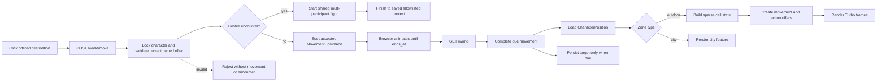

# frozen_string_literal: true
---
title: World Feature
description: Implementation handbook for the Neverlands-based open world, cells, movement, cell content, actions, and persisted player location.
status: Partially Implemented
updated: 2026-09-11
owners: Game world, movement, and world UI
template: feature-v1
---

# World

This document is the implementation contract for the current World feature. It explains the player-visible behavior, authoritative server state, sparse 1,000 × 1,000 region model, cell composition, timed travel, cell actions, UI ownership, security boundaries, seeds, and test coverage.

It describes what exists now. It does not turn deferred Neverlands mechanics into requirements by implication.

## 1. Design authority and related documents

Domain navigation: `doc/domains/world.md`.

Neverlands is the sole game-design reference for this feature. The local implementation adapts the observed behavior to Rails, Turbo, Stimulus, and the current English-only client; it must not be expanded with generic legacy-RPG conventions.

When behavior is uncertain or conflicts with this document:

1. Re-observe Neverlands and record the evidence in `doc/design/reference/`.
2. Update the relevant design note.
3. Change implementation and coverage together.
4. Update this feature contract last so it continues to describe shipped behavior.

Supporting documents:

- `doc/design/reference/world/observations/2026-09-07_forpost_grid_and_action_audit.md` — current grid, gate route, timed Look, and village audit.

- `doc/design/reference/world/observations/2026-05-09_overworld_movement.md`
- `doc/design/reference/world/observations/2026-09-08_cell_content_and_world_rules.md` — live movement observations.
- `doc/design/reference/world/observations/2026-09-09_starter_atlas.md` — bounded source topology and pool annotations.
- `doc/design/reference/world/observations/2026-09-10_forpost_gate_presentation.md` — fresh broad city-footprint comparison and both Enter returns.
- `doc/design/reference/world/observations/2026-09-09_starter_encounter_authoring.md` — captured profile reuse and the user-reported interval.
- `doc/design/reference/world/observations/2026-09-09_starter_landmarks_and_art.md` — linked landmark entry/return and starter artwork provenance.
- `doc/ARTWORK.md` — project illustration style and asset integration workflow.
- `doc/design/reference/world/observations/2026-05-20_outdoor_npc_resource.md` — observed outdoor cell, NPC, and resource behavior.
- `doc/design/reference/combat/observations/2026-08-26_wilderness_two_orc_group_fight.md` — current multi-NPC handoff, per-NPC search, and return evidence.
- `doc/design/reference/combat/observations/2026-08-26_wilderness_passive_goblin_fight.md` — current passive same-cell bot-attack and return evidence.
- `doc/design/reference/combat/observations/2026-08-26_wilderness_shield_npc_fight.md` — current north/back movement, exact-cell return, and action-interruption evidence.
- `doc/design/reference/combat/observations/2026-09-01_wilderness_bandit_group_variation_and_magic.md` — current same-return-context variable group and passive-interval evidence.
- `doc/design/reference/combat/observations/2026-09-02_swamp_passive_rosters_search_and_timeout.md` — current large-roster, near-immediate passive-repeat, per-bot search, and timeout-anomaly evidence.
- `doc/design/reference/social/observations/2026-08-23_chat_game_event_timeline.md` — supplied item/NV search-result evidence used to bound the typed loot handoff without inventing an NPC assignment.
- `doc/design/reference/shell/observations/2026-07-28_game_shell_and_mvp_surfaces.md` — persistent game-shell observations.
- `doc/design/areas/world_map.md` — world-area design record.
- `doc/design/features/movement.md` — movement design record.
- `doc/design/features/professions.md` — explicit evidence boundary for future cell-based gathering.
- `doc/design/launch_mvp_plan.md` — MVP boundary and seeded topology.
- `doc/features/city.md` — city nodes, hotspots, and interior surfaces reached through the World context.
- `doc/features/character_progression.md` — persisted Wanderer value consumed when World authors a movement offer.
- `doc/features/game_shell.md` — persistent frame and presentation of the current World surface and same-cell presence.
- `doc/features/shop_economy.md` — Shop resume context that reuses World-owned position and safe fallback behavior.
- `doc/features/player_inventory.md` — allowlisted Inventory destination used by wilderness context actions and post-fight return.
- `doc/features/arena_combat.md` — shared match lifecycle after a World-owned hostile handoff.

### 1.1 Cross-feature relationships

| Related feature | Relationship | Ownership and handoff |
|---|---|---|
| `doc/features/city.md` | Outdoor entrances hand the character to a city node; city gates hand the character back to explicit outdoor cells. | World owns outdoor cells, entrance availability, and exact outdoor position; City owns its node graph and city hotspots after entry. |
| `doc/features/character_progression.md` | World reads the character's effective Wanderer level when it authors adjacent movement offers. | Character Progression owns saved/base/equipment-backed skill values; World owns the travel-time formula, command snapshot, timer, and completion lifecycle. |
| `doc/features/game_shell.md` | World bootstraps the game layout and supplies current location and same-cell player data. | World owns position queries and the central map/city payload; Game Shell owns the persistent frame, nearby-player presentation, and compact chat. |
| `doc/features/shop_economy.md` | World-owned resume context validates a saved Shop surface and falls back to World when it is unavailable. | World/City retain exact location authority; Shop owns allowlisted catalog context and exchange behavior after entry. |
| `doc/features/player_inventory.md` | Outdoor Inventory requests may be replaced by the current hidden hostile encounter and resumed after fight completion. | World owns interruption and allowlisted return context; Player Inventory owns carried/equipment state and destination rendering. |
| `doc/features/arena_combat.md` | A hidden same-cell hostile encounter creates the shared match and later returns through World metadata. | World owns encounter eligibility, match-creation handoff, authored NPC loot-table input, and allowlisted return context; Arena Combat owns match resolution, per-NPC typed item/NV loot persistence, logs, and Finish after creation. |

## 2. Feature summary

The MVP has one outdoor region, **Outpost Surroundings**, with local coordinates from `[0, 0]` through `[999, 999]`. A character occupies exactly one cell in exactly one `Zone`. The region is sparse: cells do not require one million database rows. An in-bounds cell without an explicit template exists as ordinary, passable outdoor terrain.

The player sees a viewport-fitted nearby-cell surface centered on the current cell, using fixed 100px tiles. The server independently validates odd visible columns (`3..39`) and rows (`3..9`), defaulting invalid or omitted values to `3 × 5`. One off-screen cell on every edge gives a buffer two columns and two rows larger than the visible surface. These bounded limits are local implementation choices; the September 10 source sample showed 17 columns and retained an older off-screen row. The server offers up to eight adjacent destinations. Clicking an offered cell starts a server-authored move; captured clean steps were `24` seconds and a captured destination-specific step was `32` seconds. The local `24..30` Wanderer fallback applies only when the destination has no exact authored duration. The map animates in the browser, but the server remains authoritative and changes the persisted coordinate only when the command becomes due and is completed. Completion applies the command's snapshotted `1..2` fatigue gain. One point recovers every three minutes; at effective fatigue `86%+`, Move, Look, and Enter are withheld and rejected until recovery.

A cell may compose several independent concerns:

- terrain, passability, and an optional source-backed `100 x 100` art override;
- one hidden materialized hostile encounter anchor whose source metadata can
  create several NPC fight participants and, for a captured sample set, remain
  eligible for later selections after victory;
- an active city or linked-location entrance;
- one or more explicitly authored local actions;
- online playable characters whose persisted position and validated room
  audience match the current cell/surface.

Every state-changing click is backed by a short-lived, character-owned server offer. Coordinates, action type, and target are revalidated when the offer is accepted. DOM data and submitted identifiers are never authority.

While the outdoor surface remains open, the game shell also performs a bounded
passive check for the persisted same-cell hostile. The first check is immediate;
the server then persists a due time fingerprinted by zone, coordinate, and NPC
anchor and returns only the remaining retry delay. The endpoint accepts no NPC,
coordinate, timer, or probability input. An anchor with captured
`passive_delay_windows` selects a complete window and a delay inside it through
server RNG; anchors without those windows use the provisional local
`10..30`-second fallback. Neither bounded sample replay nor the fallback claims
Neverlands' still-unknown probability, cooldown, distribution, or weights.

Current source evidence now confirms that one outdoor return context can yield
different selected groups (`1x3 -> 1x1 -> 1x1 -> 1x2`) with mixed identities
and levels. It also bounds two source idle intervals to approximately
`230..278` and `127..187` seconds. The mapped local `[14,15]` anchor stores those
four complete observed outputs and both elapsed-time windows. At encounter
creation the server selects one complete roster sample, resolves its persisted
NPC templates, and creates the ordered mixed/repeated participations with the
captured levels, HP, encounter XP, and fight-risk value. A later no-coordinate
swamp chain adds `1x7 -> 1x3` and `4..64`-second evidence but is not assigned to
this cell. The complete eligible pool, source weights, probability, cooldown,
and delay distribution remain unobserved.

## 3. MVP goals and non-goals

### Goals

- Represent a Neverlands-scale 1,000 × 1,000 region without materializing every cell.
- Persist the exact player zone and coordinate across logout and login.
- Offer eight-direction timed movement with a single active command.
- Preserve an exact positive `travel_seconds` authored on a destination cell;
  otherwise use the bounded `30..24` effective-Wanderer fallback.
- Persist wilderness fatigue, recover it from server time, and gate the three
  named source actions at the exact `86%` boundary.
- Render only the small local map window required by the client.
- Compose hidden NPC, entrance, local-action, cell-art, and player-presence state at a cell.
- Render a configured evidence-backed, project-owned image-cell slice before
  falling back to the coordinate-derived project-owned regional sheet slice.
- Keep outdoor NPC identity and placement absent from the map and top-context row
  until the hidden encounter interrupts an action.
- Enter the currently implemented Forpost west gate through its explicit authored destination.
- Enter and leave both reciprocal gates and the nearby village, mine lobby,
  and resource-exchange lobby through their exact current-cell offers.
- Enter the captured Frontier Village from its exact world cell without
  replacing the persisted outdoor coordinate, then use offered Shop/exit
  hotspots in its fixed `760 × 255` CSS-built scene.
- Interrupt offered entrance, local, Character, and Inventory actions with a
  same-cell fight only when Ashen Bait is present (one unit consumed). Without
  bait those actions continue. Offered wilderness movement is never interrupted
  (escape). Passive ambushes still arrive on the ~5-minute server timer without bait.
- Deliver the same source-backed hidden encounter while the character remains
  on the outdoor surface, without a manual NPC Attack control or client-supplied
  target.
- Start the shared combat flow with every authored NPC encounter member on one side.
- For an evidenced variable cell, select one complete server-authored roster
  sample and preserve its member order, identity, level, HP, encounter XP, and
  injury-risk field in the created match.
- Return from the explicit result step to the allowlisted interrupted World, Character, or Inventory destination.
- Keep all world mutation server-authoritative and authorization-covered.
- Match the compact Neverlands map language: fixed cell size, red available-cell borders, central cursor, walking indicator, and countdown.

### Non-goals

- Populating additional outdoor regions or inventing walking border mappings;
  current delivery keeps one populated region with verified region isolation.
  Configured airship progress and region handoffs are owned separately by
  `doc/features/airship_travel.md` and reuse this feature's position/cell owners.
- Rendering or downloading the entire 1,000 × 1,000 region.
- Procedural region generation, pathfinding, fog of war, or minimap discovery.
- Terrain-, encumbrance-, fatigue-, effect-, profession-, or non-Wanderer skill-based travel-time modifiers; fatigue gates actions but does not alter duration.
- Claiming to reproduce Neverlands' complete hidden travel-time formula; the live server has produced `32`- and `49`-second values under unisolated conditions.
- Automatic movement queues or click-to-path travel.
- Generic building/location types, levels, keys, item gates, or invented entrance rules.
- Underground mine travel/extraction, exchange listings or transactions, and
  other unimplemented location families. Mine/exchange lobbies support entry,
  read-only sections, return and persisted resume only.
- Successful fishing casts/catches, fishing proficiency gains, and digging.
  The captured no-bait Fish entry and Drink are implemented.
- Successful gathering, deferred by the user to later profession work;
  `Look Around` currently supports only the captured empty result and work lock.
- Generic encounter tables, claimed equal source weights, or procedural NPC
  group composition beyond explicit Neverlands-backed cell metadata. The
  shipped variable path replays complete observed samples; it is not the
  source's unknown complete pool or weighting algorithm.
- Invented building, lake, fishing, resource, or other special-location art
  without captured visual evidence and a project-owned implementation asset.
- Copying Neverlands terrain images, sprites, markers, cursors, branding,
  administration text, or project/service prose into runtime UI.
- Client-authoritative position changes.

## 4. Player experience

### 4.1 World screen

The authenticated root route opens `WorldController#show` in the persistent `game` layout. The controller dispatches by the current zone type:

- `outdoor` renders the world map and cell actions described here;
- `city` renders the city scene described in `doc/features/city.md`.

An outdoor `location` entrance redirects to its allowlisted interior route
without changing `CharacterPosition`. The captured Frontier Village is the
only such location in the current boundary. Its Shop and exit regions are
fresh short-lived server offers; Shop owns commerce after handoff, and exit
returns to the same persisted cell.

The outdoor screen keeps contextual actions in the persistent top bar and uses
three Turbo frames:

- `available-actions` — actions for the exact current cell;
- `game-map` — the nearby-cell map surface and movement state;
- `location-info` — semantic cell metadata retained for accessibility and diagnostics, visually suppressed in the faithful UI.

`available-actions` is mounted in the shell's top-context row, not as a second
body toolbar. This preserves the source hierarchy while keeping Turbo updates
scoped to the current cell.

The surrounding game shell owns navigation, character status, presence, inventory access, and chat. World partials do not recreate those systems.

### 4.2 Map presentation

- Logical cell size: `100px × 100px`.
- Visible surface: whole odd cell counts fitted to the available width and the
  gameplay frame's height including its status header. Validated visible
  columns are `3..39`, rows `3..9`; each invalid/omitted dimension falls back
  independently to columns `3` or rows `5`.
- Server render window: visible columns/rows plus two, leaving one off-screen
  cell on every edge for travel. The maximum is `41 × 11` / **451 cells**,
  including inert placeholders beyond region edges. This is a local bounded
  buffer, not a claimed source cap or hidden source caching policy.
- Incremental walking retains overlapping terrain/building DOM cells. Starting
  a step sends no terrain; for a buffer of width `W` and height `H`, completing
  a horizontal/vertical/diagonal step sends `H` / `W` / `W + H - 1` entering
  cells plus fresh server-owned movement controls. A resized viewport, content
  change or invalid presentation token rebuilds the bounded buffer.
- Starter presentation: one original 2400 × 1300 assembly, packaged as a
  2100 × 1300 main master and 300 × 1300 west scenery master, delivered as
  **312 physical 100px PNGs** (273 main plus 39 west). A missing required slice
  returns no art and the cell uses CSS terrain; the master is for authoring,
  not a runtime fallback. The bounded coordinate default also covers cells
  with no gameplay row or a retained legacy art reference. Elsewhere, valid
  explicit art renders its configured crop; absent/invalid art uses per-cell CSS.
  The same city rectangle additionally has 32 optional 200px density variants;
  every rendered cell remains 100 CSS pixels, with its 100px base required.
- Explicit cell art: a `MapTileTemplate` may select a validated catalog key and
  sheet coordinate; the configured art replaces the default slice for that
  exact cell while remaining fixed at `100 x 100`.
- Current position: a fixed 100 × 100 overlay in the center of the viewport.
- Available destination: thin dark-red 1px border, matching the observed Neverlands selection language.
- Active movement: the map layer translates toward the target while an original
  walking GIF remains centered in the cursor; reduced-motion preferences select
  its static first frame. The idle compass remains unchanged.
- Countdown: a compact red capsule one cell above the cursor.

`nl_world_map_controller.js` measures whole odd cells from the available width
and combined client heights of the local header and main rows. It observes
those rows and window resize, centers the cursor and debounces a changed
measurement for **120ms** before a normal World GET with `map_columns` and
`map_rows`. The server validates these untrusted presentation hints and includes
accepted dimensions in the signed buffer identity. A resize rebuilds the
buffer and preserves still-live unchanged cell-action keys; it does not change position,
reachability, an accepted command or its deadline. Small screens retain native
100px cells and centered internal panning without page overflow.

For the measured `1730 × 799` desktop allocation, the visible surface is
`17 × 5`, with a `19 × 7` / **133-cell** buffer. At `390 × 844`, the visible
surface is `3 × 5` (`302 × 502px` including borders), with a `5 × 7` /
**35-cell** buffer. Their horizontal/vertical/diagonal entering-cell counts are
respectively **7/19/25** and **7/5/11**. These are local geometry examples, not
new source measurements or final browser acceptance; section 15 owns checks.
Height depends on the allocation above chat, not browser dimensions alone.

World suppresses native scrollbar tracks on its map viewport, map wrapper,
and containing main pane. Native scrolling and touch/wheel panning remain
available, while classic scrollbar gutters cannot shrink the whole-cell
viewport or offset its center. This rule is scoped to the outdoor map;
other feature scrollers retain their own presentation.

Cells outside the logical zone can be present only as inert render-buffer placeholders at an edge. They never receive movement offers.

### 4.3 Actions on the current cell

The compact top-context row displays only visible actions the server offered for the current state:

- **Enter** — accessible active city or linked-location entrance on the current cell.
- **Look Around** — implemented `resource_search` local action on the current cell.
- **Drink** — authored water-cell action with immediate fatigue recovery and a
  60-second lock; no skill prerequisite.
- **Fish** — authored fishing-cell action with the captured missing-bait result
  and a 30-second lock; no skill prerequisite or successful catch.

Outdoor NPC presence, name, level, and HP are not rendered on the map or in the
top-context row. The source-backed encounter remains hidden until it interrupts a
movement, entrance, local, Character, or Inventory action.

No cell actions are available while movement is active. Deferred authored actions remain unavailable rather than displaying controls that imply working gameplay.

At effective fatigue `86%` or higher, the top-context row explains that Move,
Look, and Enter are unavailable. The current map/cell still renders. City node
navigation is not a wilderness action and is not blocked by this rule.

When heavy or combat injury is active outdoors, `MapState` returns
`locked_reason: :injured` with no destinations (same shape as fatigue). The
top-context row explains the wilderness lock and links Inventory for
bag/scroll clears; the injury chip also routes to Inventory while Infirmary is
out of district reach, and to Coal Infirmary when that hotspot is accessible.
This does not invent a walk-home exception: source evidence keeps heavy injury
as a movement block.

Before an offered wilderness entrance or local action completes, World checks the
authoritative current cell for its live hostile encounter. Forced interruption
requires Ashen Bait (`ashen_bait`): one unit is consumed and the shared fight
opens. Without bait, Look / Enter / Character / Inventory continue normally.
Offered wilderness movement away from the cell never starts a fight (escape).
The persistent shell's **Character** and **Inventory** actions pass through the
same bait-gated check. After an explicit fight result step, the player returns
to the saved allowlisted destination. Arbitrary submitted URLs are never
accepted as return targets.

The outdoor shell immediately asks the same server owner for encounter state.
When an alive hostile exists on the exact authoritative cell, the server
creates or reuses a persisted due time (~5 minutes / 300 seconds for Ashen) and
returns its remaining milliseconds.
The browser schedules only that response and asks again when due. A positive
response stops the timer and replaces the current page with the existing or
newly created shared fight; a failed check uses a bounded local retry. Reloading
cannot reroll or accelerate the persisted due time. Moving to another cell,
entering a city, or losing the live hostile invalidates the old schedule.

### 4.4 Players here

`Game::World::Presence` reads the playable character at the exact zone and
`[x, y]`, requires an active position and a recent open user session, and
separates saved village, Shop, city-building, and Arena rooms. Alternate owned
characters are not made online by the playable character's session. Multiple
open devices do not duplicate a player. The existing five-minute session
window is a technical liveness policy; Neverlands' exact expiry remains an
explicit evidence gap.

The query returns an authored location label, the full scoped count, and up to
ten sorted rows. The viewer follows the same scope/order/limit. Supported
orders are name A–Z/Z–A and level ascending/descending. `GET /world/players`
refreshes label, count, list, and total online together. Authenticated activity
refreshes the existing open session before projection; delayed heartbeats
cannot reopen a logged-out session or rewind a newer timestamp. SQL predicates
bound the audience without per-player queries.

Ordinary chat derives the same authoritative cell/room key. Its locked
transitions, authorized reads/sends, login/entry cutoffs, and mixed gameplay
event timeline are owned by `doc/features/game_shell.md`. Shared local chat
streams are not used because old subscriptions cannot establish current
location authorization.

`OutdoorActionAvailability` applies the persisted travel/Look boundary to
direct village/Shop, Inventory, owned Character progression, and owned HTML
profile requests. It reconciles expired state and holds the same character
lock through a permitted request so a concurrent move cannot cross the check.
Blocked requests return to World without inventory, currency, progression, or
room-context changes. Public profiles and existing combat Inventory behavior
retain their own access rules. Purchase and inventory-transfer workflows use
savepoints to preserve their rescued-failure rollback inside that request lock.

## 5. Feature topology and authored content

The MVP topology is one sparse `1,000 × 1,000` outdoor region. Coordinates are local to that `Zone`; missing in-bounds tile rows are ordinary passable cells, while explicit records add authored terrain/art, hidden NPC, entrance, or local-action content. Adjacency never implies a city destination or building identity—those relationships are explicit records.

### 5.1 Region and cell identity

- **Region** — an outdoor map partition containing cells with local coordinates; terrain, resources, NPCs, and entrances are content within its cells.
- **Region identity** — the existing `CharacterPosition.zone_id` and `MovementCommand.zone_id`; content owners retain their unique zone names. No competing position/region model was added.
- **Local coordinate** — stored in `CharacterPosition`, movement records, and tile records in this app.
- **Captured source coordinate** — records where the corresponding behavior was observed in Neverlands.
- **Sparse tile** — an explicit override/content row; it is not required for an ordinary in-bounds cell to exist.
- **Cell-art key** — a server-configured stable reference to a project-owned
  `100 x 100` image or one slice in a larger art sheet. Records never store an
  arbitrary asset path.
- **Cell composition** — terrain/art/passability plus independently materialized hidden NPC, entrance, local-action, and exact-cell presence layers.

Multi-region readiness is implemented through the existing `Zone` identity.
Tests place equal local coordinates in separate test regions and verify
independent composed content, passability, movement/action keys, and saved
interiors. Normal seeds still populate only **Outpost Surroundings**;
additional populated regions and walking border mappings are outside the
current delivery scope. Configured airship journeys separately persist progress
across explicit region-qualified waypoints, as documented in
`doc/features/airship_travel.md`. Their normal destination/path/schedule content
remains unavailable. Isolation tests and temporary flight fixtures establish
the local capability, not Neverlands border mappings or additional authored
geography.

Because sparse terrain/NPC/entrance records retain the unique zone name as
their key, a populated name cannot be renamed or its `Zone` destroyed through
the model. Existing `metadata.title` supplies display-only naming changes.
This prevents a surviving `zone_id` position from losing its content or a later
region from inheriting content orphaned under a reused name.

### 5.2 Forpost entrances and the bounded starter survey

| Entrance | Local coordinate | Captured source coordinate | Destination |
|---|---:|---:|---|
| Western / Central Square exit | `[6,8]` | `[1000,1000]` | Central Square (`main`) at `[0,0]` |
| Eastern / Law exit | `[11,9]` | `[1005,1001]` | Law Quarter (`forpost4`) at `[0,0]` |

`outpost_gate` and `outpost_east_gate` are the reciprocal outdoor buildings.
The eastern path is Main → Residential → Law → outdoor `[11,9]` → `[12,10]`
→ pond `[13,10]`. The western path remains `[6,8]` → `[5,7]` → village `[4,6]`.
City handoffs are immediate; outdoor steps use the existing server-owned timed
movement pipeline. Both gates are available to level-zero characters. The
September 9 live reverse entry confirms Law as the eastern return node.

For an existing development database with missing/stale gate content,
`Seeds::ForpostGateRepair` reconciles these exact gate pairs and their bounded
26-cell gate/eastern-path neighborhood without running the other seed phases.
It uses the normal cell/gate attribute builders, preserves managed cells and
rejects conflicts transactionally. The
[City handbook](city.md#521-bounded-repair-owner) owns its public contract and
verification; the [content-management guide](../guides/managing_game_content.md#bounded-forpost-gate-repair)
owns the repeatable operator command. Runtime World composition and movement
continue using their existing persisted owners.

`StarterCellCatalog` validates `config/gameplay/starter_world_cells.yml` before
its facts are imported by `db/seeds.rb`: 273 cells at local `x0..20,y2..14`,
corresponding to source `x994..1014,y994..1006`. The initial survey has 118
passable and 155 blocked cells. It supplies immutable coordinates, passability
and provenance through `.load/default`, `#cells` and `#at(x,y)`; `.reload!`
replaces the process catalog only after successful validation. It performs no
DB writes and supplies no artwork, terrain class, action outcome or NPC roster.
Runtime movement/rendering continue reading the same persisted cell records.

The atlas provides explicit per-cell activity flags, source labels, water/fish
flags, herb group IDs and NPC pool annotations. Seeds materialize herb IDs as
editable resource groups; those IDs are not quantities, yields or skill gates.
NPC annotations remain evidence metadata. A separate validated distribution
reuses compatible complete captured profiles for 40 additional starter
placements, alongside the two explicit captured anchors; the atlas supplies
neither HP nor encounter formulas. The pond has herb group 2 and no seeded hostile; its published
no-bots rule is independently documented. Look is declared on rat `[7,7]`,
eastern intermediate `[12,10]`, and pond `[13,10]`; only the pond offers Drink
and Fish. The intermediate uses the captured empty-vegetation result. Visual
terrain classification and neighboring unobserved action sets remain unknown.

The import initializes new/legacy source or placeholder-art rows. Already
atlas-backed records and unrelated independently authored source rows remain
operator-owned: reseeding preserves managed passability, actions and resources.
The starter art upgrade replaces only missing or legacy `forpost_terrain` /
`forpost_pond` references across this rectangle; independent art and already
authored `forpost_starter` references survive. A new atlas
capture does not silently overwrite managed cells; reconcile intended changes
through the content editor. Source metadata never becomes a second runtime
permission lookup. Importing content does not relocate persisted players,
including a player saved on a cell whose old sparse default is now blocked.
Obsolete gate cleanup retains surveyed cells and removes only their stale
`city_gate` metadata. Deleting such a row would incorrectly restore the sparse
passable fallback until another seed run. The seed regression covers this
ordering, retained player position, managed metadata and a second no-op run.

This source offset is a bounded local adaptation. Captured source columns
991–993 would map to negative local X and are excluded; existing local zone
edges remain the server boundary, not a claim about Neverlands geography.
The wider million-cell zone still uses sparse defaults outside the authored
rectangle. Continuous starter artwork is provided for the bounded rectangle;
full-zone population and artwork remain later work.

Seeds also synchronize both sides of the gate handoffs, retire the historical
South entrance/obsolete hotspots and cancel changed live offers. Retained City
positions and all outdoor coordinates survive; only characters stranded on
removed historical City nodes recover to Central Square. The independently
captured Bandit sample is now at `[14,15]`, consistent with source `[1008,1007]`,
rather than falsely adjacent to the western starter route.

### 5.3 Captured linked location

The local `[4, 6]` cell carries source metadata for the observed village
entrance at `[998, 998]`. This is traceability metadata, not a claimed global
coordinate conversion. Its `frontier_village_entrance` is an explicit active
`TileBuilding` with `building_type: location`. Its unique `building_key` is the
stable route key; the same persisted row owns the location scene dimensions,
presentation kind, labels, active feature definitions, and polygon points.

Entering it keeps the character at the same outdoor coordinate. The interior
uses the observed native `760 × 255` geometry, rebuilt as project-owned CSS
shapes rather than a Neverlands image. The observed Trading Post and exit
polygons are semantic buttons backed by fresh `open_location_feature` offers
from the existing `ActionOfferBuilder`.
The former hands off to Shop; the latter returns to World. Closing the browser
inside the village or linked Shop preserves `[4, 6]`; login resumes that
allowlisted surface only while the same active entrance still exists there.
The linked Shop's Village controls return to the village square; its separate
Leave hotspot returns outdoors. Direct interior URLs during movement or Look
redirect to World before issuing offers or replacing the saved context; an
active fight redirects to that fight. These checks share the character lock.

The same owner also supports the nearby mine lobby at `[4,5]` (source
`[998,997]`) and resource-exchange lobby at `[4,7]` (source `[998,999]`). Entry,
return and login resume retain the exact outdoor coordinate. Their allowlisted
sections are read-only views within the same location; switching sections does
not relocate the player. Captured extraction/descent, resource-query and
trading actions remain unavailable. No section parameter can grant a Shop
feature or an underground position. Other location families still require
their own captured contract.

### 5.4 Captured outdoor content

The explicit cell at local `[7, 7]` corresponds to captured Neverlands coordinate `[1001, 999]`. It stores a validated starter cell-art reference, supplies the authored outdoor observation/resource context, and materializes a hidden hostile Plague Rat encounter anchor from `config/gameplay/outdoor_npcs.yml` with level, health, damage, experience, respawn, loot, and `encounter_count: 2` metadata. Starting its fight creates two distinct Plague Rat participations on side B, matching the captured paired-rat ambush.

Neverlands observations confirm current-coordinate encounter availability, not
this exact persistence schema: `m_1001_999` produced the hidden paired-rat
fight, restored the same map, and produced another attack on Inventory; later
`937,1008` flows restored that coordinate around repeated bot attacks after a
north/back movement pair. `TileNpc` as one persisted encounter anchor and its
explicit composition metadata are the local server-authoritative model. Exact
Neverlands per-cell rosters, selection weights, and internal storage remain
evidence gaps.

The later `m_1008_1007` chain is mapped to local `[14,15]`. Its anchor persists
four complete observed group outputs (`3`, `1`, `1`, and `2` members), including
mixed Bandit/Robber identities and levels `7..9`, plus the two captured passive
delay windows. The runtime chooses one whole sample and one whole window through
server-owned RNG. After every selected roster is defeated and explicitly
finished, the sampled anchor remains alive so a fresh due time and roster can
be selected on the same cell. This mirrors the four completed source fights on
`m_1008_1007`. It closes the fixed-composition and permanent-exhaustion
implementation gaps for the captured outputs, not the source-evidence gap: the
complete pool, weights, probability, cooldown, and delay distribution are
still unknown. The later swamp `1x7 -> 1x3` chain has no captured coordinate
and is therefore not added to this local cell.

The config is evidence-backed seed input. `db/seeds.rb` reconciles the
persisted placement and `TileNpcService` reads that DB state only; changing YAML
alone is neither a runtime mutation nor an authorization mechanism. Local and
source coordinates must never be mixed in services or requests.

`StarterEncounterDistribution` builds `starter_npcs` from reusable profiles
and atlas annotations. All members of a complete captured roster must fit a
cell's declared NPC identities and level ranges; it never interpolates levels,
HP, rewards or group members. The fresh starter bootstrap creates 40 additional
Bandit placements. Their `300`-second passive interval is the Ashen operator
rule (bots ambush about once every five minutes). Forced same-cell fights from
Look/Enter/shell actions require Ashen Bait instead. The original `[7,7]` and
`[14,15]` anchors keep the same five-minute window.

The seed checks persisted passability, existing NPCs and entrances, and the
exact bot-free pond before creating a derived placement. Roads are not a
special safety rule: painted roads neither enable movement nor suppress a
configured encounter. Existing derived placements are not rewritten; their
`bootstrap_source_map` identity prevents duplication after an operator moves
or disables them. Section 7.4 describes source changes and cleanup.

### 5.5 Shared current-location labels

`Game::World::Presence#label` owns the authored current cell/entrance,
validated village/Shop/city room, or flight name. It resolves that one context
without loading or counting online players; `#call` uses the same label for the
player pane. Initial map descriptions reuse the prepared label; incremental
map fragments resolve it again from the persisted position. During an accepted
step the source label remains until authoritative completion moves the player.
The existing visually clipped map-description layout is preserved.

Owner and visitor profiles display zone and current cell/room beneath the
paper doll, matching the September 9 source profile observation. Coordinates
remain structured JSON/grid data, not profile prose. Public JSON's human label
uses the same current context. A wilderness NPC fight keeps that cell name and
its public fight link; only a real Arena-room fight supplies an Arena-room
sublabel. Labels are escaped presentation data and never replace the stable
zone/cell/room keys that authorize actions, chat or presence.

## 6. Feature surfaces and contained behavior

### 6.1 Implementation status

| Surface or behavior | Entry point | MVP status | Owning implementation |
|---|---|---|---|
| Outdoor map | `GET /world` in an outdoor zone | Interactive | `WorldController`, `MapState`, World views |
| Adjacent timed movement | `POST /world/move` | Interactive | `TravelTime`, `AcceptMove`, `CompleteMove` |
| Wilderness fatigue | Movement completion and World load | Interactive constraint | `Characters::FatigueService`, movement/action offer services |
| Hidden current-cell NPC attack | Interruption of a visible wilderness action | Interactive handoff | World validation, then Arena combat lifecycle |
| Passive current-cell NPC attack | `POST /world/encounter_check` while waiting outdoors | Interactive handoff | `PassiveEncounterCheck`, then shared Arena combat lifecycle |
| Current-cell city entrance | `POST /world/enter_building` | Interactive handoff | World entrance service, then City |
| Current-cell linked-location entrance | `POST /world/enter_building` | Interactive handoff | World entrance service, then allowlisted World Location |
| Frontier Village scene | `GET /world/locations/:building_key` | Interactive | `TileBuilding`, `TileStateResolver`, `WorldLocationsController`, World CSS |
| Mine/exchange lobby and sections | `GET /world/locations/:building_key`, optional allowlisted `section` | Exact-cell lobby and read-only sections; underground/trading controls unavailable | Same persisted `TileBuilding` and `WorldLocationsController` |
| Village Trading Post / exit | `POST /world/locations/:building_key/features` | Interactive handoff | Persisted building feature + shared owned offer, then Shop or unchanged World cell |
| `Look Around` | `POST /world/perform_local_action` | Immediate empty result with persisted 28-second lock, or ambush handoff | `PerformLocalAction`, `LocalActionState` |
| Character/Inventory world-shell actions | `POST /world/context` | Interactive navigation/ambush handoff | World allowlist and hostile interruption pipeline |
| Wilderness result return | `POST /arena_matches/:id/finish` after a World fight | Interactive handoff | Arena finishes the result; World resolves the saved allowlisted destination |
| `Drink` | `POST /world/perform_local_action` on an authored water cell | Immediate two-point fatigue recovery and persisted 60-second lock, or ambush handoff | `PerformLocalAction`, `LocalActionState`, `FatigueService` |
| `Fish` without bait | `POST /world/perform_local_action` on an authored fishing cell | Immediate missing-bait result and persisted 30-second lock, or ambush handoff; no catch or proficiency award | `PerformLocalAction`, `LocalActionState` |
| `dig` | Authored identifier only | Deferred | No offer or mutation is exposed |

### 6.2 Movement and map behavior

The server authors up to eight adjacent offers with opaque keys and a
snapshotted duration. An exact positive `travel_seconds` in destination
metadata wins; otherwise the current bounded Wanderer fallback produces
`24..30` seconds. Acceptance also snapshots a `1..2` fatigue gain so
reload/retry cannot reroll it. The browser marks only those cells, submits one
offer, fixes the cursor in the center, translates the buffered map underneath
it, and shows the server-derived countdown. Position remains the source cell
until `CompleteMove` finalizes a due command and applies the stored fatigue
gain.

### 6.3 Cell composition and handoffs

Cell art, hidden NPC, entrance, implemented local-action, and exact-cell player
layers can coexist. Each visible tile mutation receives its own short-lived
owned offer. World validates the current coordinate and target, then checks the
hidden hostile encounter before handing combat to Arena, city navigation to
City, or an outdoor location to its allowlisted scene. A location scene
revalidates the unchanged entrance cell and rotates separate feature offers on
every render. The fight keeps a World-authored allowlisted return context;
Arena owns resolution, participant defeat, surrender, and the result screen,
then hands the finish action back to that context.

### 6.4 Deferred behavior boundary

The client exposes no generic building, pathfinding, terrain-speed, gathering-reward, or long-distance travel framework. Only captured action slices are active: empty Look, the no-bait Fish entry, and Drink. Successful fishing/gathering and digging remain unavailable until their requirements, outcomes and interruption behavior are captured and implemented with tests.

## 7. Authoritative data and presentation model

| Record | Responsibility | Important contract |
|---|---|---|
| `Zone` | Coordinate space and location type | Positive width/height; MVP types are `outdoor` and `city`; outdoor bounds are checked server-side. |
| `CharacterPosition` | Durable location of one character | One row per character; active character only; coordinate must be inside its zone. This is the source of truth across sessions. |
| `MapTileTemplate` | Sparse explicit terrain/cell override | Stores a zone-name key, coordinate, passability, optional validated cell-art reference, and authored local actions. Missing in-bounds rows default to passable outdoor cells. |
| `MovementCommand` | Offered or active timed move | Captures source, target, direction, status, action key, offer expiry, and movement timestamps. |
| `Character` fatigue fields | Persisted fatigue and recovery anchor | Effective value is time-derived, clamped `0..100`, and gates only source-named wilderness actions. |
| `WorldActionOffer` | Capability for one cell mutation | Character-owned, short-lived action tied to exact zone, coordinate, type, and polymorphic target. |
| `TileNpc` | Persisted state of an outdoor NPC placement | Tracks exact-cell identity, composition metadata, live/defeated state, and respawn timing. A fixed anchor is defeated with its final participant; an anchor with validated complete roster samples remains eligible after each selected roster. Runtime resolution never recreates a deleted placement from config. |
| `TileBuilding` | Explicit outdoor entrance and linked-location content owner | `city` stores an authored destination zone/coordinate; `location` stores validated scene/feature metadata on the same movable/deactivatable DB row and preserves the outdoor coordinate. |

### 7.1 Sparse-cell rule

`MapTileTemplate` is an override table, not the region itself. Cell resolution follows this order:

1. Reject coordinates outside `Zone` bounds.
2. Use the explicit tile template when one exists.
3. Otherwise return an ordinary passable outdoor cell.
4. Resolve valid explicit art or the guarded starter-coordinate default;
   use per-cell CSS terrain when neither resolves.
5. Independently compose hidden active NPC state, visible entrance/local
   actions, and exact-cell players.

This rule is required for a 1,000 × 1,000 MVP region. Code must not create a tile row merely because a character viewed or traversed a coordinate.

`TileProvider` never materializes the region. `MapState` prefetches at most
eight exact neighboring cells in one query. Acceptance/completion and queue
validation read only the requested target. Sparse misses are memoized per
provider instance; out-of-bounds coordinates cause no tile query. Rendering
remains at most `41 × 11` cells with coordinate-bounded template/building reads.
These are structural limits, not production latency measurements.

### 7.2 Cell-art schema

`config/gameplay/world_cell_art.yml` maps a stable key to a project-owned asset,
fixed `100 x 100` cell dimensions, and sheet columns/rows. An explicit tile may
store only:

```yaml
source_map: m_1001_999
cell_art:
  key: forpost_terrain
  column: 7
  row: 7
```

`MapTileTemplate` requires `source_map`, a configured key, and in-range integer
sheet coordinates. `CellArtCatalog` rejects missing render files, paths outside
`app/assets/images/world`, non-100px cells, path traversal, and invalid sheet
dimensions. A dedicated future special-cell image uses a one-column/one-row
catalog definition; no schema migration or arbitrary database asset path is
needed.

Optional catalog-only `slices_directory` resolves `<column>_<row>.png` beneath
the allowed World asset directory. A present slice renders at `100 × 100`
with zero background offset; a missing required individual file returns
`nil`, and `_map_cell` uses its terrain CSS without an image background.
The authoring master is never substituted for a missing sliced asset, and a
valid physical slice resolves even when that master is not deployed. Valid
explicit catalog definitions without a slice directory retain sheet cropping.
Optional `landmarks_in_art` must
be strictly boolean and works only with explicit `painted_landmarks` entries
containing in-bounds integer `column`/`row` and a unique stable `building_key`.
`Presentation#painted_building?` compares the current art slice and the actual
`TileBuilding` key projected by `MapBuffer`; editable cell metadata cannot
spoof that identity. A flag without an exact matching anchor hides nothing.

Matching painted entrances suppress the complete decorative overlay, including
village pseudo-elements and badge backgrounds/borders, while retaining the
accessible building label and server-owned Enter offer. Moved/new/different
entrances keep their markers; unpainted mine/exchange entrances show a visible
semantic label. Catalog paths, anchors and this policy cannot be supplied
through tile metadata. Browser regression coverage includes computed styles,
not only the absence of a child icon element.

#### Add an evidence-backed, project-owned art asset

Use this workflow only after the corresponding live appearance has been
captured and a distinct project-owned asset has been created:

1. Put the project-owned image below `app/assets/images/world/`. Do not use a
   remote URL or copy a path into database metadata.
2. Add one stable key to `config/gameplay/world_cell_art.yml`. Treat that key as
   persisted identity: renaming it requires updating every stored tile reference.
3. Set `cell_width` and `cell_height` to `100`. For a sheet, set `columns` and
   `rows` to the number of 100px slices in the physical bitmap.
4. Store only the catalog key and a zero-based `column`/`row` in the sparse
   `MapTileTemplate.metadata["cell_art"]` value.
5. Keep `source_map` and `source_coordinates` beside the art reference so local
   coordinates cannot be mistaken for captured Neverlands coordinates.
6. Add or update catalog, model, seed, rendering, and player-flow coverage that
   applies to the changed content.

The shipped regional sheet demonstrates the catalog form:

```yaml
forpost_terrain:
  asset: world/forpost-terrain.png
  cell_width: 100
  cell_height: 100
  columns: 10
  rows: 10
  source_reference: neverlands_live_movement
```

Its physical size is `1000 x 1000`, so column and row values are each `0..9`.
The catalog validates configured dimensions and bounds but deliberately does
not decode the bitmap at runtime; asset specs must confirm that the physical
file still matches `columns * 100` by `rows * 100`.

#### Continuous starter landscape

`forpost_starter` selects `world/forpost-starter-landscape.png`, a
`2100 × 1300` master, and `world/cells/forpost-starter` for its 273 physical
PNG cells. Sheet `[column,row]` maps to local `[column,row+2]`.
The city rectangle also has 32 optional **200 × 200px** density variants under
`world/cells/forpost-starter-2x`, for columns `6..13` and rows `5..8`.
They are alternate rasters for the same cells, not additional world cells.
Every cell still needs its 100px base file and occupies 100 × 100 CSS pixels.
`forpost_starter_west` adds a 300 × 1300 authoring master and 39 physical PNGs
under `world/cells/forpost-starter-west`; its art `[column,row]` maps to visual
local `[column-3,row+2]`. These **312 visual cells** are separate from the
unchanged **273-cell gameplay import**. The west margin corresponds to surveyed
source x991..993, still outside the nonnegative local region. It only paints
inert buffer slots: no walkability, offers, entrance, NPC or tile records are
created. `_map_cell` retains its outside-zone class, while CSS removes the
black fallback only when an art key actually resolves. One pond is
painted at local `[13,10]`; its Look/Drink/Fish capabilities still come only
from that cell's persisted actions. Nearby city/village/mine/exchange landmarks
are painted into the continuous landscape, without pasted marker squares.
Paint does not claim exact source terrain or create passability, encounters,
entrances or resources.

`CellArtCatalog.resolve_for_tile(reference, zone:, x:, y:)` supplies this
landscape even when only a bounded gameplay route has been imported.
`world/_map_cell` passes the projected cell's existing art reference, current
Zone and integer coordinates. This pure presentation lookup returns a validated
`Presentation` or `nil`; it performs no database queries or writes and does not
modify tile metadata. Its starter default applies only to an outdoor Zone
named `Outpost Surroundings`, sized `1000 × 1000`, with
`metadata.source_map == "m_1001_999"`, and integer local coordinates
`x−3..20, y2..14`. The full region identity guard prevents equal coordinates
in another region from inheriting Forpost art.

For the original main rectangle `x0..20`, resolution precedence is:

| Existing reference | Rendering result |
|---|---|
| Missing/empty reference, including a cell without a template row | `forpost_starter`, column `x`, row `y - 2` |
| Valid legacy `forpost_terrain` or `forpost_pond` reference | The same coordinate-derived starter slice |
| Valid independently authored key or deliberately edited `forpost_starter` coordinates | Preserve that explicit presentation |
| Nonblank malformed/unknown reference | Return `nil`; retain the renderer's generic terrain recovery rather than silently treating it as an absent override |

For western `x−3..−1`, missing/empty references select `forpost_starter_west`,
column `x + 3`, row `y - 2`. Any valid explicit reference is preserved there;
nonblank invalid references remain `nil`. This art guard never changes the
region bounds checked by tile resolution, offers or movement.

Outside the guarded region/rectangle, only the explicit reference is resolved.
If the selected starter slice cannot resolve, return `nil` and use per-cell
CSS terrain; a legacy starter reference does not restore an implicit full-sheet
background. Nonsliced valid explicit presentations otherwise retain their
configured crop behavior. Painted-landmark matching still requires resolved
art and the actual persisted entrance key. Rendering creates no art/gameplay
records and does not import the authoring master as a missing-slice fallback.

The September 10 disconnected-gate-image diagnosis found that only 26
imported gate/path cells carried artwork metadata; neighboring sparse cells
fell back to tiled grass despite all 273 accepted slices already existing.
The presentation default restores their shared landscape without importing
the other gameplay cells, changing passability or generating new art. The
bounded gate repair remains a separate operation; rendering requires no seed
or database mutation.

The later 1593 × 987 repaint was rejected for its rounder, taller composition
and enlarged source pixels. Its prompt and previous checks remain historical.
The base replacement uses six native generated panels, downsampled and
joined over 80px overlaps, plus a downsampled gate correction. All production
pixels come from outputs larger than their delivery footprint. The combined
2400 × 1300 image splits into the main and western authoring masters above;
the browser loads individual slices, never those masters. The later City
detail correction adds native 2× architecture for the 32-cell rectangle and
derives its matching 1× slices from that same composition. Only the outer
8 logical pixels blend the previous 1× terrain rim after interpolation; the
architectural interior comes from newly generated native high-detail pixels.
The rest of the scene remains 1×. World cells remain 100 CSS px with
translation, not CSS zoom or blur; this is not a full-map 4K/2× asset.

`high_density_slices_directory` is an optional catalog-owned directory, allowed
only alongside `slices_directory`. `CellArtCatalog::Presentation` exposes
`high_density_asset` when that cell's optional file exists. `_map_cell` renders
the mandatory base URL followed by `image-set(... 1x, ... 2x)`, retaining a
100px background size. Browser density selection changes the raster only.
Missing 2× files at catalog resolution keep the 1× image; a missing mandatory 1× slice returns `nil`
even when 2× exists, preserving per-cell CSS recovery. Invalid directory paths
or density configuration on nonsliced entries are rejected. Tile metadata
cannot select asset paths, density or CSS dimensions. PNG dimensions are
validated by asset coverage rather than decoded on every rendering request.
This file-resolution recovery is not a browser retry guarantee when an already
selected asset URL later returns an HTTP error; deploy the packaged variants
with their matching catalog and asset manifest.

The broad low city and village are artwork across ordinary map cells. Their
entrances belong to exact `TileBuilding` cells; the current-cell Enter control
opens the corresponding city node or linked interior. There is no full-city
clickable overlay. Existing gate/landmark anchors, source correspondence,
passability, records and gameplay remain unchanged. ARTWORK.md records every
exact prompt, actual native dimensions and assembly. Section 15.9 is the dated
viewport/composition acceptance; section 15.10 owns the subsequently reopened
City detail and walker-quality correction.

`db/seeds/world_cells.rb` upgrades absent and the two legacy artwork keys
inside the bounded rectangle. It preserves custom references, already edited
starter references, unrelated metadata, gameplay layers and saved players.
Every exact generation/edit prompt, output selection and packaging step belongs
to `doc/ARTWORK.md`, alongside the reusable style/workflow. The starter brief
owns the coordinate layout; the landmark observation owns live source facts.

#### Historical September 8 pond landscape and asset provenance

The following smaller asset was the September 8 implementation. The current
starter bootstrap supersedes its 25-cell assignment with `forpost_starter`;
the legacy catalog entry remains valid for retained references.

`app/assets/images/world/forpost-pond-landscape.png` is one continuous
`500 × 500` terrain image, displayed as 25 adjacent `100 × 100` slices through
the existing `forpost_pond` catalog key. The center pond at `[13,10]` uses
slice `[2,2]`; local cells `[11..15,8..12]` use matching sheet coordinates.
This replaces the visibly pasted standalone pond square. Artwork is part of
the cell terrain, not an overlay entity or a new movement partition.

The visual-only neighborhood pass preserves existing metadata, passability,
entrances and NPCs. Only the center declares pond actions; surrounding art
slices do not infer resource availability or alter the source topology. This
bounded example is not full authored zone content, which remains Stage 2.

The source neighborhood was assembled by cutting the corresponding slices
from the existing project-owned terrain sheet. The built-in ImageGen tool
integrated the pond into that landscape on September 8, 2026; `sips` packaged
the resulting sheet at 500px. No Neverlands bitmap was copied or edited. One
shared PNG and CSS sheet offsets avoid 25 independent downloads.

The exact preserved final prompt is consolidated in
[ARTWORK.md](../ARTWORK.md#2026-09-08--preserved-pond-neighborhood-prompt).

#### Configure a dedicated 100px cell

A verified building, gate, lake, fishing place, or other special location may
use its own `100 x 100` file. Its catalog entry has `columns: 1` and `rows: 1`,
and its sparse tile reference uses `column: 0` and `row: 0`. The commented
example in `config/gameplay/world_cell_art.yml` shows the exact shape; it must
remain commented until the referenced asset and evidence exist.

The tile metadata shape is the same for a dedicated image and a sheet slice:

```yaml
source_map: m_1000_1000
source_coordinates: [1000, 1000]
cell_art:
  key: forpost_terrain
  column: 6
  row: 8
```

Ordinary in-bounds cells need no database row and use the coordinate-derived
regional slice. A missing runtime override also falls back to that slice. An
explicit `MapTileTemplate` with malformed cell-art metadata is rejected instead
of persisting an ambiguous reference.

Application code should resolve presentation through the catalog instead of
reading YAML directly:

```ruby
presentation = Game::World::CellArtCatalog.resolve_for_tile(
  tile.metadata["cell_art"], zone:, x: tile.x, y: tile.y
)
```

`resolve_for_tile` applies the bounded starter default described above.
`resolve(reference)` remains the explicit-reference validator and returns
`nil` for an unsafe or unknown reference. A successful result supplies the
allowlisted asset, background offsets, and full sheet dimensions needed by CSS.
Use `valid_reference?` at a content-validation boundary such as
`MapTileTemplate`; do not use either method to decide passability or available
actions.

#### Art does not create gameplay

Cell art is presentation only. It does not make a cell blocked, enterable,
fishable, searchable, or hostile. Author those concerns independently through
`passable`, `TileBuilding`, validated `local_actions`, or the outdoor NPC config.
The layers may coexist at one coordinate and the server remains authoritative
for which actions are offered.

Do not repurpose retained project-owned `city.png`, `gate.png`, or other large
scene art as a wilderness cell merely because its subject matches. Use it only
after the exact source appearance is verified and a distinct project-owned
asset is prepared as a 100px cell or a correctly indexed 100px sheet.
`CellArtCatalog` caches the YAML during the
process lifetime; restart the app after catalog changes, or call
`Game::World::CellArtCatalog.reload!` in a development console or isolated spec.

### 7.3 Local-action schema

Authored `local_actions` are validated structured data. Supported definitions are:

| Kind | Neverlands source id | Runtime action | Implemented |
|---|---|---|---|
| `resource_search` | `look` | `search_resources` | Yes |
| `fishing` | `fis` | `fish` | Yes: no-bait entry and 30-second lock only |
| `drinking` | `dri` | `drink` | Yes: captured sip and 60-second lock |
| `digging` | `dig` | `dig` | No |

Invalid kinds, source-id mismatches, duplicates, and malformed array/object shapes are rejected. Only implemented definitions become `WorldActionOffer` rows. `Look Around` returns the authored observation message immediately and persists a 28-second lock on its accepted offer; it grants no item or currency. Successful gathering remains deferred to later profession work; the wiki distinguishes Naturalist/Herbalist discovery from Alchemy potion making.

Drinking is cell-local: active `local_actions` data must contain `drinking`
with source id `dri`. Neither pond artwork nor a resource-group label grants
the action. The normal seed authors the observed pond at local `[13,10]`
(source `[1007,1002]`) in the existing Outpost Surroundings zone, with Look Around, Drink
and Fish. The pond Look result is “Nothing found.”; its initial source timer
was not isolated, so it uses the configured 28-second search default. Its project-owned `forpost_starter` landscape uses contiguous 100px cell slices
to integrate the water with surrounding terrain. Optional cell `presence_label` is a nonblank string of at most
120 characters. Presence resolves the exact outdoor cell after entrance/room
labels; this changes display only, preserving the same zone/cell audience.
Successful fishing remains a separate deferred profession flow.

### 7.4 Cell-content authoring and lifecycle

This is the operational source-of-truth guide for outdoor content. Design notes
describe the observed behavior; they do not introduce another catalog. Choose
the existing owner before editing data:

| Cell concern | Authored declaration | Persisted/materialized state | Runtime owner |
|---|---|---|---|
| Terrain, passability, art reference, and local resource/action definitions | `starter_world_cells.yml` and `db/seeds/world_cells.rb` | `MapTileTemplate` | movement `TileProvider` plus current-cell `TileStateResolver` |
| Authored resource-group identities | `metadata.resource_groups` on the same cell | `MapTileTemplate` | active group projection in `TileStateResolver`; no yield or inventory grant |
| City or linked-location entrance | `Game::World::CityCatalog::GATES` for the verified city pair; `db/seeds/world_locations.rb` for the persisted entrance attributes | `TileBuilding` | `TileBuildingService` and `TileStateResolver` |
| Hostile outdoor NPC placement/template input | `config/gameplay/outdoor_npcs.yml`, with atlas-filtered `StarterEncounterDistribution` for reusable starter profiles | seed-materialized `NpcTemplate` and exact-cell `TileNpc` | `db/seeds/outdoor_npcs.rb`, then DB-only `TileNpcService` and `TileStateResolver` |
| Visible current-cell capabilities | never hand-authored or seeded | short-lived `WorldActionOffer` | `ActionOfferBuilder`, `AcceptAction`, then the owning transition service |
| Hidden hostile interruption | never represented by a visible offer | current live `TileNpc` state | `InterruptAction`, `WorldEncounterChecksController`, and `StartNpcFight` |

`TileStateResolver` is the one composition point for the finalized cell.
`ActionOfferBuilder` derives capabilities from its result. Under the character
lock it reloads the position and selected persisted targets, reuses exact live
actions at that cell, and cancels obsolete offers. A viewport refresh or a
competing same-cell read therefore preserves a still-visible Enter key and its
original expiry. A stale-position invocation returns no offers without
cancelling those at the newer position. Expired/consumed keys are not revived;
changed, removed, moved, inactive or inaccessible targets are not reused.
Linked-location feature offers use this same lifecycle. `target_revision` is
part of issuance/reuse identity, not an additional acceptance permission:
`AcceptAction` and the destination action service still revalidate current
ownership, position, availability and target rules before mutation. Do not seed
`WorldActionOffer`, read seed/config files in controllers or views, or create a
`LocationCatalog`, resource catalog, or second NPC-placement service.

`db/seeds.rb` loads explicit phases for accounts, zones, cells, starter
characters, shop inventory, initial wallets, Arena rooms, linked locations,
city hotspots, per-Shop accounts/stock and outdoor NPCs. Locations precede derived encounters so newly
created entrances already participate in placement guards. Shared seed cleanup
is in `Seeds::WorldContentSupport`; runtime owners remain unchanged. Detailed
file responsibilities and preservation policies belong to
`doc/guides/managing_game_content.md`.

The guided World Cell editor exposes action toggles/labels and up to 32 resource
groups. Each group has a stable cell-local `key`, `kind`, `label` and optional
boolean `active`; keys/kinds accept lowercase letters, digits, `_` and `-`
up to 80 characters, labels up to 120. Duplicate keys and malformed values
fail before persistence. Groups describe eligible content organization; they
do not define herb quantity, a skill gate, or a harvesting result. The supplied
atlas's Herbs 7/11 labels describe groups, not quantities.

The NPC editor preserves complete observed roster samples while accepting
explicit authored alternatives: at most 64 rosters of 1–10 members, optional
integer weight 1–10,000 (default 1), and either a fixed nonnegative integer level or
`level_min`/`level_max` within 0–1000 with explicit positive HP. Range sampling
uses the injected RNG and does not guess HP/stat scaling. No new ranges or
weights are seeded from an unisolated observation. `metadata.active` disables
an anchor independently of defeat/respawn; stale starts revalidate activation
under the existing locks. Respawn retries require an actually defeated, due
placement and cannot refill an already living NPC. Mine/exchange entrances
support their captured lobby scope; underground and trade capabilities remain
unavailable even while the lobby entrance is active.

NPC templates, anchors and exact/ranged roster levels accept zero and reject
negative, fractional or missing levels. HP stays positive. A zero participant
level survives encounter selection, persistence and presentation without
falling back to the template level. The specific starter rat pool is 0–4 in
the atlas; no unknown level-dependent HP or selection formula is inferred.

See `doc/guides/managing_game_content.md` for guided field operations and
advanced metadata preservation. `Manage::WorldCellAttributes` and
`Manage::TileNpcAttributes` normalize permitted editor inputs into assignment
hashes without writes. Existing management transactions persist content,
invalidate affected offers and append the audit event together.

#### Rules shared by every authored cell change

1. Capture the Neverlands state and record its reference before adding gameplay
   content. Generic RPG expectations are not evidence.
2. Use the local `Zone` name and local `[x, y]` as runtime identity. Keep source
   map/coordinates only as traceability metadata.
3. Preserve stable keys (`building_key`, local-action `type`, and NPC `key`)
   while adjusting the same content. A replacement with different identity gets
   a new key and an explicit retirement of the old key.
4. For baseline source-backed content, change the declaration source and
   reconcile already-persisted state. For an intentional environment-local
   override, use `/manage`. Reconciled city/shared-template/captured-anchor rows
   return to baseline on reseed; imported atlas cells, linked village/mine/
   exchange entrances and derived starter encounters retain operator edits.
   Apply the owning policy explicitly.
5. Keep cleanup exact: stable key or exact zone/coordinate. Never delete every
   row absent from one partial seed list because separately authored layers may
   coexist in that zone.
6. Run the seed twice when `db/seeds.rb` changes and prove the second pass does
   not duplicate or resurrect retired content.

#### Add or adjust a building/entrance

The verified city pair is authored once in `CityCatalog::GATES`; the World seed phases
derives both its outdoor `MapTileTemplate` presentation metadata and its
`TileBuilding`. Do not add a second literal for that same gate. A linked
location such as the village is declared in `db/seeds/world_locations.rb` with a
stable key. Its current persisted shape is equivalent to:

```ruby
{
  zone: outpost_surroundings.name,
  x: 4,
  y: 6,
  building_key: "frontier_village_entrance",
  building_type: "location",
  name: "Frontier Village",
  destination_zone: nil,
  destination_x: nil,
  destination_y: nil,
  icon: nil,
  required_level: 1,
  metadata: {
    "description" => "Enter the village from this world cell.",
    "source_map" => "m_998_998",
    "source_coordinates" => [998, 998],
    "location" => {
      "short_label" => "Village",
      "presence_label" => "Village Square",
      "kind" => "village",
      "scene" => {"width" => 760, "height" => 255},
      "features" => [
        {
          "key" => "trading_post",
          "label" => "Trading Post",
          "presence_label" => "Shop",
          "action_type" => "open_feature",
          "feature" => "shop",
          "polygon" => [
            [237, 194], [205, 196], [141, 177], [86, 154], [85, 146],
            [108, 123], [189, 114], [219, 156], [221, 173], [238, 180]
          ]
        },
        {
          "key" => "exit",
          "label" => "Leave the village",
          "action_type" => "return_world",
          "polygon" => [
            [527, 235], [554, 238], [551, 245], [566, 243], [577, 239],
            [569, 227], [561, 218], [557, 224], [544, 213], [536, 210]
          ]
        }
      ]
    }
  }
}
```

The existing `find_or_initialize_by(building_key:)` lookup in `db/seeds/world_locations.rb`
creates a missing linked entrance once, provided no other entrance owns the
cell. Existing village/mine/exchange rows keep all operator state, including
records authored before the preservation policy; editing declaration coordinates
does not relocate them on reseed. Use `/manage` or an exact reviewed data change
to move/update that stable row. The CityCatalog gate pair still reconciles both
handoff ends. `TileBuilding` validates scene dimensions, feature keys,
allowlisted action types/routes, and polygons before the seed can persist it.
A building does not require a `MapTileTemplate` unless that cell also needs an
explicit terrain, passability, art, timing, or local-action override.
The outdoor village marker derives from `location.kind`; do not author the
obsolete duplicate `landmark_kind`. Optional nonblank exterior/interior/feature
`presence_label` strings name the corresponding audience. The retained
`required_level` field is validated/stored but does not gate TileBuilding
entry; active/configured content and the exact source cell are the implemented
entrance checks. CityHotspot enforces its separate level requirement.

For a temporary runtime removal, explicitly set the exact persisted building
inactive in an idempotent retirement block after the active declarations:

```ruby
TileBuilding.where(building_key: %w[retired_building_key]).update_all(
  active: false,
  updated_at: Time.current
)
```

For permanent removal, delete the declaration and explicitly `destroy_all` only
the retired stable keys after verifying that no retained content or historical
relationship requires them. Merely deleting an entry from `tile_buildings`
does not remove an existing row. Replacing one building with a different
identity on the same cell must retire the old row before the new upsert because
`[zone, x, y]` is unique. Tests must cover the stale offer and saved-interior
fallback: moved, inactive, replaced, or removed entrances issue no capability
at the old cell and never relocate the character during fallback.

#### Add, adjust, deactivate, or remove a resource/local action

Local resource interactions live in the exact cell's
`MapTileTemplate.metadata["local_actions"]`; they are not separate resource
records. The shipped `Look Around` declaration demonstrates how the action
coexists with the same tile's presentation metadata:

```ruby
outdoor_tiles << {
  zone: outpost_surroundings.name,
  x: 7,
  y: 7,
  terrain_type: "outdoor",
  passable: true,
  metadata: {
    "source_map" => "m_1001_999",
    "source_coordinates" => [1001, 999],
    "cell_art" => {
      "key" => "forpost_terrain",
      "column" => 7,
      "row" => 7
    },
    "local_actions" => [
      {
        "type" => "resource_search",
        "source_id" => "look",
        "label" => "Look Around",
        "description" => "Search this cell for herbs or local resources."
      }
    ]
  }
}
```

Adjust the declaration for future bootstrap and use the existing cell editor
or an exact reviewed data change for an already imported cell.
Set `"active" => false` to keep an observed action definition while withholding
its offer. To remove only the action, remove it from that cell's persisted
metadata; routine seeds preserve an imported cell's operator edits.
If the tile has no remaining override, add an exact cleanup such as
`MapTileTemplate.where(zone: zone_name, x: local_x, y: local_y).destroy_all`;
deleting the whole `outdoor_tiles` entry alone leaves the old row in an existing
database.

`resource_search` has a shipped empty-result/work-timer outcome; `drinking`
adds its captured sip/recovery lock, and `fishing` adds the no-bait entry lock.
None implements gathering yields or a successful fishing cast. Adding another
action or outcome requires
captured evidence plus an existing-owner change to
`MapTileTemplate::LOCAL_ACTION_DEFINITIONS`, `ActionOfferBuilder`,
`AcceptAction`, its transition service, UI, and coverage. Adding arbitrary JSON
to seeds must never make an unimplemented action interactive or invent a reward.

#### Add, move, adjust, or remove an outdoor NPC

Baseline NPC placement is declared in `config/gameplay/outdoor_npcs.yml`, not
in a new Ruby catalog. `db/seeds.rb` materializes it into the same `NpcTemplate`
and `TileNpc` records that `/manage` edits and runtime resolves. This minimal
declaration uses the current entry's required coordinate/template fields and
source-backed encounter metadata:

```yaml
outpost_surroundings:
  zone_name: "Outpost Surroundings"
  source_map: "m_1001_999"
  npcs:
    - key: plague_rat
      name: Plague Rat
      role: hostile
      level: 4
      x: 7
      y: 7
      hp: 100
      damage: 7
      xp: 35
      metadata:
        source_map: "m_1001_999"
        source_coordinates: [1001, 999]
        encounter_count: 2
      loot:
        - kind: item
          item: rat_tail
          source_name: "Rat Tail"
          # Local evidence hold, not a Neverlands probability claim.
          chance: 0.0
```

An evidenced variable cell declares reusable opponent templates separately and
stores only complete observed outputs and elapsed-time windows on its placement:

```yaml
outpost_surroundings:
  npc_templates:
    - key: wilderness_robber
      name: Robber
      role: hostile
      level: 8
      hp: 270
      xp: 0
  npcs:
    - key: wilderness_bandit
      name: Bandit
      role: hostile
      level: 7
      x: 14
      y: 15
      hp: 155
      xp: 0
      metadata:
        encounter_selection_mode: observed_sample_replay
        passive_delay_windows:
          - key: observed-interval
            min_seconds: 230
            max_seconds: 278
        encounter_rosters:
          - key: observed-mixed-side
            trauma_percent: 30
            encounter_experience_reward: 103
            members:
              - npc_key: wilderness_bandit
                level: 7
                hp: 155
              - npc_key: wilderness_robber
                level: 8
                hp: 270
```

Every roster member key must resolve to one materialized `NpcTemplate`.
`TileNpc` rejects empty/duplicate samples, sides outside `1..10`, missing member
keys, negative/non-integer level or non-positive HP overrides, invalid XP/risk values, and invalid
ordered delay bounds. `OutdoorNpcConfig` also rejects unknown template
references before seeding. Samples are complete outcomes—not independent NPC
draws—and their presence must not be described as knowledge of Neverlands'
hidden pool or weights. The ten-member capacity follows the official NPC
article captured in
`doc/design/reference/social/observations/2026-09-07_cell_chat_and_presence_boundaries.md`;
existing seeded groups remain their captured sizes. The same boundary applies
when selecting persisted data and starting the shared fight: ten members create
ten opponent slots, while eleven members fail before a partial fight exists.

Loot entries use the Arena-owned typed award contract after World hands off the
match. `kind: item` resolves `item`, `item_key`, or `key` to an existing
`ItemTemplate`; every entry must declare `chance` as a `0..1` fraction or
`0..100` percent. Missing or invalid probabilities fail configuration loading
instead of silently becoming guaranteed drops. The same item kind can award a
consumable, weapon, armor piece, or other valid Inventory template; no separate
equipment-only loot pipeline exists. The source proves a Rat Tail
can drop but not its exact probability, so the production Plague Rat entry is
explicitly `0.0` to preserve the prior no-drop behavior until new Neverlands
evidence replaces that local hold. A future
`kind: currency` entry requires a positive integer `amount` and `currency: NV`.
The supplied `24 NV` search-result row does not identify a source NPC or drop
probability, so this production World declaration remains item-only until that
evidence exists.

`OutdoorNpcConfig` is cached; restart before running seeds after changing the
file or call `Game::World::OutdoorNpcConfig.reload!` in a development console
or isolated spec. Run `bin/rails db:seed` to reconcile the exact-cell `TileNpc`
and its `NpcTemplate`. `TileNpcService` then performs a DB-only lookup; deleting
a placement in `/manage` removes it immediately and it is not recreated during
World rendering. One anchor is supported per cell by the unique
`[zone, x, y]` index. Repeated copies of the same captured opponent use the
validated `encounter_count` metadata. Mixed and variable same-context groups
use validated complete `encounter_rosters`; `EncounterRosterSelector` resolves
one sample through an injected/server RNG and `StartNpcFight` persists the
selection. The presence of validated samples also marks the anchor as a
repeatable encounter source: completing one selected side does not set the
placement's defeated state, so a later passive check can schedule a new sample
on that cell. Fixed-composition anchors keep the ordinary defeated/respawn
lifecycle. Adding uncaptured pool members or claiming source weights remains
forbidden.

Seed-owned placement rows carry `metadata.seed_source: outdoor_npcs.yml`.
The explicit captured anchors follow the reconciled baseline table below.
Derived starter placements additionally carry
`seed_scope: starter_encounter_bootstrap` and `bootstrap_source_map`.
`Seeds::StarterEncounterBootstrap#call` accepts validated definitions plus
persisted templates, creates only missing eligible placements, and returns
retained/created IDs for scoped cleanup. Existing placements at candidate
coordinates are preserved; a moved/disabled derived row keeps its original
source identity and is not recreated at its former cell. Cleanup excludes
bootstrap-scoped rows even when profiles no longer emit them. Deactivate an
unwanted derived group to retain identity; deleting it can allow a future
bootstrap to recreate that eligible source.

Changing a reusable profile affects future placements, not managed rows.
Explicit per-cell edits use `/manage`; the shared template remains reconciled
to its source-backed definition. Apply changes to the two explicit captured
anchors as follows:

| Change | Required persisted-state reconciliation |
|---|---|
| Add a new exact-cell entry | Add YAML plus config/seed coverage, then run `bin/rails db:seed`; the persisted placement is available on the next World render. |
| Move the same NPC key | Change YAML coordinates and run the seed; it upserts the new cell and deletes only stale rows marked with this seed source. |
| Change name, level, HP, damage, XP, loot, or respawn data | Change YAML and run the seed; explicit template/placement fields converge while active defeat/current-HP state is not reset unnecessarily. |
| Remove the NPC | Delete the YAML entry and run the seed; the exact stale seed-owned placement is destroyed. Keep `NpcTemplate` by default because combat history or another placement may reference it. |

An exact retirement cleanup is intentionally narrow:

```ruby
TileNpc.where(
  zone: "Outpost Surroundings",
  x: 7,
  y: 7,
  npc_key: "retired_npc_key"
).destroy_all
```

Do not use a broad `TileNpc.where.not(...)` cleanup without the seed-source
predicate: management-created placements and separately authored content may
coexist in the zone. Moving/removing an NPC must cover old/new coordinates,
config cache reload, seed reconciliation, DB-only lookup, hidden presentation,
interruption eligibility, and retained defeated state.

#### Required checks for cell-content changes

Update the declaration and its owning coverage together:

| Change | Minimum focused coverage |
|---|---|
| Tile/resource/local action | `map_tile_template_spec`, `open_world_seed_spec`, `tile_state_resolver_spec`, `action_offer_builder_spec`, relevant World request/system spec |
| Building or linked location | `tile_building_spec`, `open_world_seed_spec`, `tile_building_service_spec`, `action_offer_builder_spec`, `world_locations_spec`, resume/system coverage |
| Outdoor NPC | `outdoor_npc_config_spec`, `starter_encounter_distribution_spec`, `outdoor_npc_seed_bootstrap_spec`, `tile_npc_service_spec`, `tile_npc_spec`, resolver/interruption/combat handoff coverage |

For a seed change, run `RAILS_ENV=test bin/rails db:seed:replant`, then run it a
second time or retain the idempotency assertion in `open_world_seed_spec`.
Production content retirement must use an explicit deployment-safe data change;
the test replant command is never a production cleanup procedure.

### 7.5 Admin management surface

For task-oriented create/edit/deactivate/delete examples and the safe extension
pattern for additional management resources, use
`doc/guides/managing_game_content.md`. This handbook remains authoritative for
World runtime and content lifecycle behavior.

Administrators may manage the same persisted owners at `/manage`; this is an
authoring interface, not another world-state pipeline:

| Management route | Persisted owner | Purpose |
|---|---|---|
| `/manage/world_cells` | `MapTileTemplate` | Create/edit/delete sparse terrain, passability, cell-art metadata, and `local_actions` resource definitions. |
| `/manage/tile_buildings` | `TileBuilding` | Place, move, deactivate, edit, or remove outdoor gates and linked locations. |
| `/manage/npc_templates` | `NpcTemplate` | Maintain reusable explicit NPC identity/combat/reward metadata. |
| `/manage/tile_npcs` | `TileNpc` | Place, move, edit, or remove exact-cell NPC state. |
| `/manage/audit_events` | `ManagementAuditEvent` | Read the immutable administrator/action/record/change history. |

Forms expose typed fields plus JSON objects for extensible metadata. JSON must
parse as an object and still passes the owning model validations; the interface
cannot enable an unsupported local-action kind, unsafe art reference, invalid
linked-location polygon, or oversized encounter. Indexes are bounded to 50
rows per page and offer zone filters for cell-owned content.

Every successful create/update/delete and its audit event commit atomically.
Successful form mutations redirect with `303 See Other`, so Turbo and ordinary
HTML clients reconstruct the authoritative GET surface without replaying the
write method. Audit identity/action fields are protected by PostgreSQL null,
foreign-key, index, and action check constraints in addition to model feedback.
Updating or deleting a `MapTileTemplate` or `TileBuilding` cancels offered or
accepted `WorldActionOffer` rows targeting that record, preventing stale
browser capabilities from executing the previous definition. Failed JSON,
validation, foreign-key, or dependency changes write neither partial content
nor a false audit event. NPC templates and zones with dependent live content
must be unlinked explicitly before deletion.

Direct `/manage` changes are durable database changes and affect the next
World render. They do not edit `db/seeds.rb` or YAML. Reconciled city/template/
captured-anchor rows return to baseline on a later seed. Imported atlas cells
and linked entrances/derived starter encounter placements retain operator edits. Promote a tested management experiment into the
appropriate seed/config plus handbook coverage before treating it as baseline
game content.

## 8. Runtime architecture



The important boundary is that JavaScript animates an accepted command; it does not complete the command or write the position.

### 8.1 World load

`Game::Movement::MapState` first asks `CompleteMove` to reconcile active commands
under the character lock: a mismatched source region/cell fails immediately,
and a due valid command completes. It then:

1. returns `not_outdoor` without destinations for a city, or active movement
   state without new destinations when a command is still moving;
2. otherwise cancels stale open movement offers and reconciles the accepted Look deadline, returning `local_action` without destinations while work remains active;
3. derives effective fatigue and returns a `fatigued` locked state without destinations at `86%+`;
4. when heavy/combat injury blocks movement, returns an `injured` locked state without destinations;
5. evaluates all eight direction offsets against bounds and passability, where
   a valid coordinate delta satisfies
   `abs(target.x - current.x) <= 1`,
   `abs(target.y - current.y) <= 1`, and target differs from current;
6. persists fresh `MovementCommand` offers with random action keys and a 10-minute offer TTL;
7. returns the map state used to render the viewport.

For outdoor cells, `WorldController` separately resolves current-cell content and rotates
`WorldActionOffer` rows for visible entrances and implemented local actions.
It resolves persisted hostile NPC state for interruption without serializing
the NPC name, marker, stats, or a manual attack action into the map surface.
City rendering instead reuses exact live hotspot offers at the same persisted
position without extending their deadlines; its locked lifecycle is described
in section 8.1 of `doc/features/city.md`.

### 8.2 Travel duration

`Game::Movement::TravelTime` is a pure scalar calculation. `MapState` reads the
effective Wanderer value once for the whole neighboring-offer batch, then
snapshots each calculated duration into its offered command. Defaults are:

```text
if destination.metadata.travel_seconds is a positive integer:
  travel_seconds = destination.metadata.travel_seconds
else:
  wanderer = clamp(effective_wanderer_level, 0, 100)
  reduction_seconds = floor(wanderer * 6 / 100)
  travel_seconds = clamp(30 - reduction_seconds, 24, 30)
```

The fallback whole-second bands are `0..16 => 30`, `17..33 => 29`,
`34..49 => 28`, `50..66 => 27`, `67..83 => 26`, `84..99 => 25`, and
`100 => 24`. `passive_skill_level` is the effective value, including supported
equipment bonuses and capped at `100`.

The command keeps its offered duration even if the character's skill,
equipment, or target metadata changes afterward. Acceptance uses that
persisted value for `ends_at`, reload uses the same value/timestamps, and the
Stimulus controller presents it. Terrain labels alone do not alter timing;
only an explicit positive destination `travel_seconds` does.

This is an explicit fallback, not a claim about the complete Neverlands
formula. The 2026-07-28 route observed several `24`-second steps and one
`32`-second step; the earlier follow-up observed `32` and `49`. Those values
prove destination/state inputs exist, so exact captured values belong in cell
metadata rather than an invented client formula.

`config/gameplay/world_rules.yml` owns validated numeric movement, fatigue,
Look/Fish/Drink timing and presence parameters. `Game::World::Rules.default`
loads an immutable catalog; `new(data:)` injects a deterministic ruleset for
calculators/workflows. Restart processes or call `Rules.reload!` after an
authorized edit; an invalid reload leaves the last valid catalog intact.
Unknown keys, non-integers and out-of-range values fail clearly. There are no
evaluated formula strings or client-supplied expressions. Accepted durations,
fatigue gains, action deadlines and drinking recovery remain snapshots;
effective natural recovery and presence freshness use current server policy.
The 30-to-24-second linear Wanderer fallback and five-minute liveness window
remain labeled provisional/local policies, not exact hidden Neverlands rules.

### 8.3 Start movement

`POST /world/move` submits direction, target coordinate, and action key. `AcceptMove`:

1. completes any command already due;
2. locks the character and rejects a second active movement;
3. finds an offered command owned by the current character;
4. locks it and validates TTL, direction, source position, submitted target, bounds, and current passability;
5. rejects active Look and rechecks effective fatigue below `86`, then evaluates hostile interruption only for this validated move;
6. changes it from `offered` to `moving` and snapshots a random `fatigue_gain` of `1..2` in command metadata;
7. records `started_at` and `ends_at` using the persisted offer duration;
8. cancels sibling movement and world-action offers.

The character remains on the source cell during the server-authored interval.
Turbo responses refresh the relevant map/action frames; HTML requests redirect
to the canonical world screen.

### 8.4 Complete movement

On a subsequent world-state load, `CompleteMove` locks active commands and
their character position. It fails a command whose source region or cell no
longer matches, even before that command's deadline, so stale travel cannot
lock a relocated character out of valid new-region offers. It applies the
target only if:

- the character still occupies the command source;
- the target is still in bounds and passable;
- the command is the current due `moving` command.

Success updates `CharacterPosition`, applies the stored fatigue gain at the authoritative `ends_at`, advances the command to `completed`, and increments the position turn marker. A moved source or newly invalid target produces a failed command without changing position or fatigue.

Arrival clears any saved interior to the `world` gameplay context and
synchronizes `Chat::LocalContext` within the same character transaction.
Actual city gate/node transitions also clear the previous surface before
commit, so closing the browser before the redirected page loads cannot resume
an old room in a new region. First-position creation and saved gameplay rooms
use that same chat owner; duplicate completion or a
reload of the same room preserves its persisted entry timestamp. If context
persistence fails, the enclosing position/room transition rolls back.

### 8.5 Accept a cell action

Visible entrance use and local actions follow the same capability pattern:

1. The render pass creates a `WorldActionOffer` for the current character and exact current cell.
2. The form submits its opaque action key and expected target identifiers.
3. `WorldActionOfferPolicy` verifies ownership.
4. `Game::World::AcceptAction` locks the character then the offer, reloads current position/status, rejects active travel/Look/fight, and revalidates expiry, action type, and target.
5. For an outdoor Enter or Look offer, acceptance rechecks effective fatigue below `86`.
6. The domain service performs the action.
7. Immediate actions become `completed` or `failed`. Look, Fish and Drink remain `accepted` until their persisted deadlines; rendering issues fresh offers only when ready.

Changing an HTML id, reusing another character's key, replaying an expired key, or moving away invalidates the action.

`TileBuilding#enter!` additionally locks the character then the persisted
entrance and rechecks its exact outdoor region/cell against fresh records.
The lower-level entry service therefore cannot use matching coordinates in
another region, and a repeated city-gate entry preserves the arrived position.
Allowlisted `village`, `mine` and `exchange` kinds have interior renderers.
Only the village exposes its captured Shop handoff. Mine/exchange section
queries are read-only presentation; invalid sections redirect to that same
lobby, and no unavailable extraction, descent or trade action gets an offer.

### 8.5.1 Timed Look Around

`PerformLocalAction` receives an owned accepted offer and current authored
cell. Under the character/offer lock it checks hostile interruption before work
starts, otherwise snapshots a `28`-second `local_action_ends_at` and immediate
`local_action_result` in offer metadata, then cancels sibling offers. No
coordinates, inventory, or currency change. The default result is “There is no
useful vegetation in this area.”

`LocalActionState` receives the character and optional clock, returns active
work, and completes due work from server time. Service retries retain the
original deadline; repeat HTTP submissions during work are safely rejected.
Stale position or malformed deadline fails the work. A passive fight may
supersede/cancel it without adding encounter probability or timing rules.

The escaped result appears in a keyboard-accessible `360 × 150` dialog over
the gameplay frame. Flash carries only the offer ID. Under its character lock,
`WorldController#show` resolves an owned accepted/completed timed-action offer on the
current outdoor cell. The same delivery owner handles Fish and Drink.
`WorldActionOffer#consume_local_action_result!` takes an
optional delivery time, returns the saved message once under the offer lock,
and records `local_action_result_delivered_at` in metadata. It preserves the
result, deadline, and action state. Replayed cookies, foreign/malformed IDs,
and legacy flash text cannot reopen a delivered result.

Close dismisses presentation only. Terrain/cursor remain
still, and movement/Character/Inventory/Look remain locked. Refresh resumes
the deadline without reopening the one-time result. Client expiry requests
current World state; JavaScript never completes work. General search-time
modifiers and successful yields remain `[EVIDENCE]` gaps.

### 8.5.2 Pond: Drink and the empty Fish entry

Both actions require an active definition on the authoritative current cell;
there is no fishing or drinking skill gate. Drinking remains available at high
fatigue because the source's fatigue lock applies to Move, Look and Enter.
The seeded pond is local `[13,10]`, source `[1007,1002]`.

`PerformLocalAction` validates the owned offer and current cell under the
character/offer lock and checks hostile interruption before applying effects.
Drink immediately removes two effective fatigue points without Nature Child, or
four when the character owns selectable perk `nature_child` (source ID `22`),
clamped at zero, and saves the requested/actual recovery, Nature Child flag,
and application time together with its 60-second deadline and success result.
`FatigueService#recover!(amount:, at:)` returns the points removed after
natural recovery; the enclosing offer transaction owns retry safety. A failed
or interrupted start cannot grant a sip, and retries/reloads cannot apply
another recovery.

Fish currently supports only the captured no-bait entry: the immediate result
“No bait available.” and a 30-second lock. It creates no cast, inventory
change, fatigue gain or proficiency. Rod equipment, bait selection/consumption,
catch tables and successful proficiency growth remain a separate deferred
profession flow. Resource-group identifiers do not grant those outcomes.

Look, Fish and Drink share persisted deadlines, conflict checks and one-time
result delivery. Closing a dialog affects presentation only; reloading resumes
the saved lock. Source behavior at zero fatigue still needs observation; local
zero-fatigue clamping is explicitly covered.

### 8.6 Hostile interruption

`Game::World::InterruptAction` resolves the live hostile encounter from the
authoritative outdoor position and starts a fight only when the character has
Ashen Bait; one bait is consumed on a successful handoff. Without bait the
intended action proceeds. `WorldController` invokes it for entrance and
implemented local actions, and `WorldContextActionsController` invokes it for
the World shell's Character and Inventory destinations. Wilderness movement
does not call `InterruptAction` (escape). `WorldEncounterChecksController`
delegates passive delivery to `Game::World::PassiveEncounterCheck`, which
resolves the same exact-cell NPC on the five-minute timer and hands due
encounters to `StartNpcFight` without consuming bait. City positions and
already-active combat do not start another encounter.

On interruption, `StartNpcFight` locks the character and encounter anchor,
returns an existing active match on a duplicate request, and otherwise delegates
roster choice to `EncounterRosterSelector`. A fixed anchor repeats its template
by the authored `encounter_count`; a sampled anchor selects one complete roster
through server RNG and resolves every referenced persisted template before any
match is created. It then creates one player participation plus the ordered NPC
participations with captured level/HP overrides. Match metadata records the
source cell, selected sample/member keys, encounter XP, injury-risk value,
whether the source is repeatable, the five-minute World-fight deadline, and
normalized `world`, `profile`, or `inventory` return context. The outdoor map
does not implement a separate combat engine.

Arena's shared processor lets each living NPC on the opposing side act,
performs defeat and typed loot resolution once per NPC, and ends the fight only
after an entire side is defeated. Item awards enter Inventory; any future
evidence-authored NV award enters the Economy wallet ledger. Surrender follows
the same participant rule for PvE and PvP side sizes.
`ArenaMatchesController#finish` clears the player's combat flag and resolves
World-fight return metadata through `CombatReturnContext`; invalid persisted
context falls back to the unchanged world cell.

The passive endpoint accepts an empty JSON body. It never accepts NPC identity,
coordinates, encounter count, return URL, timer, or chance from the browser.
`PassiveEncounterCheck` stores `zone_id`, `x`, `y`, `tile_npc_id`, and `due_at`
in character metadata under a bounded key. An early retry returns remaining
time; a mismatched cell/NPC or missing live hostile clears/replaces the old
schedule. Delay selection uses the anchor's `passive_delay_windows` when present and
otherwise the Ashen fallback `300..300` seconds (five minutes). The same
character/anchor locks make concurrent due checks or retry delivery reuse the
active match rather than creating another fight.

### 8.6.1 Same-cell player assault (combat trauma scroll)

`POST /world/assault` starts a player-versus-player duel against another
playable character who shares the attacker's exact Presence cell/room. The
attacker must hold and lose one `combat_trauma_scroll`. The created match is a
live Arena duel with `metadata.source = world_pvp` and
`metadata.combat_trauma = true`, so defeat applies combat trauma. Assault is
blocked in hospital, temple, shop, and arena-room contexts, and when either
side is offline, moving, aboard, or already in an active match. The presence
list exposes an Attack control for other nearby players; World owns the
mutation, Arena Combat owns the fight after start.

## 9. HTTP and Turbo contract

| Method and path | Purpose | Success | Failure |
|---|---|---|---|
| `GET /` or `GET /world` | Render the current persisted context | Outdoor map or city scene | Authentication redirect; bootstrap spawn only when position is absent. |
| `GET /world/players` | Exact-cell player list | HTML partial/Turbo-compatible response | Authentication redirect. |
| `POST /world/move` | Accept one offered adjacent move | Turbo map/action refresh or HTML redirect | No position change; error message and restored current map. |
| `POST /world/enter_building` | Enter an offered outdoor city or linked-location entrance | City changes to its explicit destination; linked location preserves the cell and redirects to its allowlisted scene | Offer fails; position remains unchanged. |
| `GET /world/locations/:key` | Render an allowlisted linked-location scene from its exact entrance cell | CSS-built native-size scene plus fresh linked-feature offers | Unknown/stale/inactive/wrong-cell location returns to World. |
| `POST /world/locations/:key/features` | Accept a linked-location hotspot | Handoff to allowlisted Shop or unchanged World cell | Expired/foreign/mismatched/stale offer is rejected. |
| `POST /world/perform_local_action` | Execute an offered implemented cell action | Observation result or hostile fight transition | Offer fails; no reward/state invention. |
| `POST /world/context` | Open Character or Inventory from the wilderness shell | Allowlisted destination or hostile fight transition with saved return context | Unsupported context returns to World; no arbitrary URL is followed. |
| `POST /world/encounter_check` | Check the persisted outdoor cell for its hidden hostile without a manual action | JSON redirect to the existing/new shared fight, or `{interrupted: false}` | Authentication failure; bounded `422` on startup error with no partial match. |
| `POST /world/assault` | Same-cell PvP assault consuming a combat trauma scroll | Redirect into the live Arena duel with `combat_trauma` metadata | Missing scroll, not co-located, safe zone, offline/busy target; no match created. |
| `POST /world/interact_hotspot` | Shared city hotspot action | See `doc/features/city.md` | See city contract. |
| `POST /arena_matches/:id/finish` | Finish a completed wilderness result | Marks the participant result viewed, exits combat, and returns to saved World/Character/Inventory context | Reject active fight or non-participant; malformed context falls back to World. |
| `GET/POST/PATCH/DELETE /manage/world_cells`, `/manage/tile_buildings`, `/manage/npc_templates`, `/manage/tile_npcs` | Admin-only persisted content CRUD | Atomically changes the existing resolver owners and records an audit event | Anonymous redirects to sign-in; non-admin is denied; invalid/dependent changes preserve state. |
| `GET /manage/audit_events` and `GET /manage/audit_events/:id` | Admin-only immutable audit history | Bounded HTML index/detail | No create/update/delete route exists. |

There is no separately versioned public World API. HTML/Turbo is the
player-facing contract. Hidden hostile encounters transition through the same
server redirect flow as the interrupted action. Same-cell player Assault is a
separate scroll-gated PvP endpoint; there is still no free outdoor NPC Attack
button. Swagger/rswag and blueprint documentation are intentionally
outside this feature.

## 10. Client-side and CSS ownership

`nl_world_map_controller.js` owns only presentation and submission behavior:

- ignores cells without `data-available="true"`;
- disables remaining offers after a click;
- submits the server-authored hidden form;
- derives remaining time from server `ends_at`;
- translates the map by a fraction of one cell;
- updates the countdown;
- submits the canonical World refresh through Turbo when the timer reaches zero;
- reconciles the signed map-buffer projection, retaining unchanged cell nodes
  and replacing server-rendered movement controls independently of terrain.

`Game::World::MapBuffer` accepts the authoritative `position:`, optional signed
`token:`, untrusted `columns:`/`rows:` hints and an injectable `verifier:`.
`#call` returns `rows`, `token`, `base_token`, `revision`, `visible_columns`
and `visible_rows`; result `width`/`height` add the two overscan cells. Each
hint must parse as an odd integer in the declared range; validation falls back
per dimension. Private methods keep content loading, fingerprint reuse, token
generation and ordered row construction in this one query owner.

The signed presentation token identifies the character, zone, center, validated
columns/rows and authored-content fingerprint, expires after 30 minutes, and
never authorizes movement. Two coordinate-bounded content queries cover at most
`42 × 12` / **504 coordinates** in the union of adjacent maximum buffers;
region size never changes this budget. Changed/deleted terrain or buildings
invalidate reuse. Missing/invalid tokens, changed dimensions, different
characters/zones, nonadjacent jumps or missing client cells recover with a full
buffer of `(columns + 2) × (rows + 2)`, at most 451 cells. The initial no-hint
projection is 35 cells; browser measurement requests its actual bounded size.
No per-client server cache, new spatial tree or gameplay record is created.
Stale responses cannot rewind the map.
Completion updates map, location and actions together, then refreshes the
existing cell chat/presence owners. A stable `world-action-result` container
receives an additional revision-guarded stream only when a new saved result
exists. Ordinary refreshes leave an open dialog intact; normal reload does not
replay a delivered message. Rejected movement returns 422 and recovers controls.
Timer GETs belong to the `game-map` Turbo Frame, so they cannot cancel a
concurrent top-level logout submission. Frame/authentication recovery promotes
the appropriate server response to normal navigation. An existing closed
`UserSession` also rejects later gameplay requests carrying an old cookie;
explicit sign-in restores access through the normal session lifecycle.

Ticks derive from the absolute deadline and server/client clock offset;
skipped callbacks do not extend travel/work. Outdoor pages disable Turbo
snapshot caching so Back obtains fresh deadlines/offers. A scoped Stimulus
event updates declared shell navigation targets. Rejected offers and failed
submissions restore controls, and movement buttons retain visible keyboard
focus. Full-page responses following Turbo redirects use HTML content type
and top-level navigation, preventing duplicate shells or stale location URLs.

It must not calculate reachable destinations, invent an action key, change coordinates, or mark a command complete. Those remain service responsibilities.

`game_layout_controller.js` owns only passive encounter delivery while the
outdoor World body supplies an encounter URL. It checks immediately, posts an
empty CSRF-protected request, prevents overlap, and schedules the next request
from the server's `retry_after_ms`. A bounded 30-second client fallback applies
only after network/server failure. It stops on disconnect or positive handoff
and follows only the server response through Turbo. It does not select an
NPC/cell, generate or reroll a due time, roll probability, or decide combat
eligibility.

`app/assets/stylesheets/world.css` owns the bounded nearby map surface
(up to `3902 × 902` including borders), viewport-sized fixed-cell buffer, project-owned terrain
slices, thin red offered-cell border, fixed center marker, walking state, timer
placement, village map landmark, and the `760 × 255` CSS-built village scene.
`Game::World::CellArtCatalog` owns allowlisted project assets and sheet
dimensions. `resolve_for_tile` applies the guarded starter-art precedence from
section 7.2, retaining valid independent art and using the existing regional
terrain recovery where no presentation resolves. Artwork never defines passability
or content. Each rendered table cell occupies 100 × 100 CSS pixels and uses
its coordinate's validated crop or physical slice. Optional 200px raster
variants use CSS `image-set` inside that same footprint; density selection is
not a map scale, cell coordinate, passability or movement input.
The browser scrolls/translates that composed table beneath the fixed marker.

The original moving decoration has eight directional
`world/traveller-walking-<direction>.gif` assets on 128 × 128px canvases,
displayed at 64 × 64 CSS px inside the existing 100px cursor. Cardinal directions
use eight 100ms frames (800ms loops); diagonals use four 140ms frames (560ms
loops). `prefers-reduced-motion: reduce` selects that direction's 128px RGBA
first frame, `traveller-walking-<direction>-still.png`.
The existing East/North/South source sheets remain; newly selected first-row
Northeast/Southeast poses replace the older diagonal loops. Western views
mirror their registered eastern counterparts, without rotating human images.

Each direction has one fixed source-cell scale. Every pose then receives an
integer whole-frame translation aligning its opaque head centroid to `[64,21]`
on the 128px canvas. Changing boot/arm bounding boxes do not recenter or resize
the body. A common 128-color palette per direction prevents frame-to-frame
palette changes. The source, scale, anchors, translations, delays, frame counts
and output checksums are recorded in `doc/artwork/traveller-walk-registration.json`.
The diagonals are stylized four-phase loops, not proof of perfectly alternating
opposite-foot anatomy. Current geometry and acceptance are recorded in 15.10.

`world/_map` derives `movement_direction` with
`Game::Movement::Directions::OFFSETS.key([target_x - from_x, target_y - from_y])`
from the active server command. It renders the cursor's `data-direction` and
the controller's movement-direction value, so in-progress reload restores the
same heading. Initial click feedback uses the offered button's rendered
direction; `setCursorMoving` then sets or clears that decoration alongside
the moving/idle class. CSS chooses the directional GIF/still, while the idle
compass remains unchanged. Submitted direction and animation never authorize
movement. GIF frames neither measure progress nor cause arrival; timer/status
text, map translation and coordinate persistence retain their current owners.
The source's eight directional sprites are recorded in the May 9 observation;
all local successful/failed generation prompts, frame packaging and alpha
details are in ARTWORK.md. The initial east-only assets were superseded.

The stylesheet supplies the responsive viewport bounds and suppresses
layout-consuming scrollbar tracks only on the outdoor map's containing main
pane, wrapper, and viewport. Native overflow and panning remain enabled.
The Stimulus
controller observes the main pane and header, fits whole odd columns/rows to
the equivalent source gameplay frame,
and centers the scroller on the rendered cursor. Resize preserves fixed cell
geometry and authoritative offers; it never selects destinations or changes
coordinates. The observer is disconnected with its controller.

Available cells remain semantic buttons with labels, while movement status is exposed as text as well as motion. The location-information frame retains semantic metadata even when visually suppressed. A reduced-motion client may minimize interpolation, but it must preserve the same server timer and completion reload.

## 11. Persistence and login resume

`CharacterPosition` is durable and is not cleared on logout. On login, `Game::World::ResumeContext` chooses a safe route while preserving that record:

- an outdoor cell resumes the world at exactly that zone and coordinate;
- a city node resumes that exact city-zone record;
- an accessible shop or captured city building may resume its interior route;
- the Frontier Village may resume only while the same active allowlisted
  location entrance remains at the exact persisted outdoor coordinate;
- its linked Shop may resume under the same entrance-cell check;
- an authorized selected Arena room resumes only with current city/hotspot and
  room access, without requiring a previous login's entry cookie;
- an invalid saved interior context falls back to the world without relocating the character.

The only location bootstrap is for a playable character with no position row: Central Square in Forpost at `[0, 0]`. A normal login never respawns or recenters an existing character.

A wilderness fight does not move `CharacterPosition`. Its match metadata stores only an allowlisted logical return context. Finishing an interrupted move, entrance, or local action returns to World; an interrupted Character or Inventory shell action returns to that requested surface. Logout cannot erase the outdoor cell, and an invalid return value cannot redirect away from the application.

## 12. Authorization, trust boundaries, and concurrency

- Devise authentication protects every World route.
- `CurrentCharacterContext` selects only the signed-in user's playable active character.
- `WorldActionOfferPolicy` authorizes action-offer ownership.
- Services revalidate exact zone, coordinate, action type, target, status, and expiry under locks.
- Movement serializes acceptance and completion on the character lock, then locks the command/position records, so sibling retries cannot create concurrent active moves or duplicate fatigue.
- Fatigue gain is snapshotted on acceptance and applied only by successful
  completion; Move/Look/Enter recheck the time-derived value server-side.
- Database state, not DOM geometry, hidden labels, or JavaScript state, decides availability.
- Cell records store a configured art key and sheet coordinate, never an
  arbitrary asset path, URL, CSS size, or client-provided image value.
- Building destinations come from active authored `TileBuilding` records,
  never arbitrary request URLs or coordinates. Linked-location scene geometry
  and features are validated metadata on that same record; feature navigation
  reuses the existing `CityHotspot` feature-route allowlist.
- NPC interruption requires a current, live, hostile, same-cell materialization;
  no NPC identity or attack capability is accepted from the browser.
- Passive encounter requests accept no gameplay parameters and reuse the same
  current-character, current-position, live-anchor, and active-match checks as
  action interruption.
- Encounter size is source metadata constrained to `1..10`; the captured paired-rat cell uses `2`.
- `StartNpcFight` locks the character before the encounter anchor and reuses an existing active fight, preventing double-clicked or concurrent starts from creating overlapping combat.
- Repeated NPC templates use participation ids for targeting and broadcasts; a template id is not unique inside a multi-NPC fight.
- Post-fight destinations are logical allowlisted contexts, never request-provided or persisted URLs.
- Missing/invalid offers do not leak another character's capability.
- `/manage` requires the explicit `admin` role through `ManagePolicy`;
  moderator, GM, player, anonymous, CSS, and submitted role values grant no
  access.
- Management fields use controller allowlists. JSON metadata is parsed
  server-side, mutations/audits share one transaction, and targeted stale
  capabilities are cancelled before commit. Successful writes use `303` HTML
  redirects; the audit table independently constrains actor, record identity,
  and the create/update/destroy action vocabulary.

## 13. Failure and boundary behavior

| Condition | Required behavior |
|---|---|
| Coordinate below zero or at/above zone width/height | No offer; direct submissions are rejected. |
| Missing in-bounds tile template | Ordinary passable outdoor cell. |
| Missing cell-art override | Render the coordinate-derived Forpost terrain slice. |
| Unknown, malformed, null-coordinate, or out-of-range cell-art override | Reject persisted content; runtime resolution safely uses the terrain fallback. |
| Missing out-of-bounds render-buffer cell | Inert visual placeholder only. |
| Impassable explicit tile | No destination offer; revalidated on acceptance and completion. |
| Active movement | No new movement or cell-action offers. |
| Effective fatigue below `86` | Move/Look/Enter can be offered when every other rule passes. |
| Effective fatigue `86..100` | Render the current cell and explanation, but issue/accept no wilderness Move, Look, or Enter. |
| Three minutes elapse | Effective fatigue recovers by one; the next state can offer actions again at `85`. |
| Movement fails before position update | Do not apply its snapshotted fatigue gain. |
| Expired, cancelled, failed, or consumed key | Reject without state mutation. |
| Foreign character key | Reject without revealing or applying the action. |
| Character moved since offer creation | Reject as wrong source/current cell. |
| Unknown linked-location key | Do not expose a scene or feature offer; return to the persisted World cell. |
| Inactive/removed linked-location entrance | Existing resume context and feature offers become unavailable; return to World without moving the character. |
| Linked-location feature does not match its offer | Fail the offer and preserve the outdoor coordinate. |
| Submitted direction/target differs from offer | Reject as mismatch. |
| Target becomes impassable before completion | Fail command; do not update position. |
| Deferred local action definition | Do not create an offer. |
| Local-action / location-feature boundary failures | Player-facing alerts use `game.world.*` / `game.flashes.*` i18n keys (ru/en); English copy preserves the prior rejection vocabulary for specs. |
| AcceptMove boundary failures | Movement violations use the same i18n keys; English substrings stay stable for existing service specs. |
| Passive ambush flash | Successful passive encounter redirect message uses `game.world.passive_ambush`. |
| City hotspot / gate entry messages | `CityHotspotService`, `TileBuildingService`, and `TileBuilding#entry_blocked_reason` use `game.world.*` / `game.flashes.location_not_found`; English copy matches prior strings for request/system specs. |
| AcceptAction / hotspot level gates | Remaining AcceptAction offer violations and `CityHotspot#interaction_blocked_reason` use the same i18n surface. |
| `Look Around` with no hostile interruption | Return authored message; grant no invented reward. |
| Valid wilderness action with a live hostile encounter | Do not complete its intended domain transition; start or reuse the shared fight and preserve its allowlisted destination. |
| Passive check with a live hostile encounter | Start or reuse the same shared fight and return only its application-local redirect path. |
| Passive check without an eligible hostile, from City, or after fixed-anchor defeat | Return a negative result; do not create a match or alter position. |
| Passive check repeated while startup is active | Reuse the character's existing fight; do not duplicate match/participations. |
| First NPC defeated in a multi-NPC fight | Resolve/mark/log that participant's typed loot check once; keep the encounter anchor and fight live while another opposing participant survives. |
| Outdoor NPC loot entry omits or invalidates `chance` | Reject the developer-authored configuration at load; do not infer a probability or grant value. |
| Final NPC defeated for a fixed anchor | Mark the encounter anchor defeated and complete the fight-level result. |
| Final NPC defeated for a sampled anchor | Complete the fight-level result but keep the anchor eligible; after explicit Finish, a later passive check schedules and selects a new captured roster. |
| Player surrenders | Defeat only that participant; finish only when the participant's entire side is defeated. |
| Duplicate fight start | Return the character's existing active match; do not create another match or participant set. |
| Invalid/foreign post-fight context | Fall back to the unchanged World cell; never follow the submitted value as a URL. |
| No persisted position | Bootstrap once to Forpost Central Square. |
| Invalid management JSON or model value | Render the form with errors and HTTP 422; persist no content or audit event. |
| Managed content has dependents | Refuse deletion with a visible error; preserve the record, dependents, and audit history. |
| Admin edits/deletes offered target content | Cancel its live targeted offers atomically; the next World render resolves fresh DB state. |

## 14. Acceptance criteria

- A character can traverse any offered in-bounds adjacent cell, including diagonals.
- A move lasts its exact positive destination duration when authored, otherwise
  the bounded `24..30` Wanderer fallback; only one move may be active.
- A completed move adds its snapshotted `1..2` fatigue once; time recovers one per three minutes and the `86%` action gate is enforced on render and acceptance.
- Fallback Wanderer `0`, `20`, and `100` produce `30`, `29`, and `24` seconds
  respectively; missing or malformed-negative skill data cannot exceed the
  30-second base.
- The UI animates the accepted move and reloads authoritative state at completion.
- The region supports local coordinates through `[999, 999]` without precreating every cell.
- Explicit impassable cells and all logical edges are enforced server-side.
- Source-backed `100 x 100` cell-art overrides render their configured
  presentation; cells without resolved art use per-cell CSS terrain.
- The bounded starter landscape renders required physical 100px slices, with
  CSS recovery for missing files and no duplicate decorative city/village marker. Independent
  artwork, gameplay metadata and persisted positions survive its seed upgrade.
- Exact-cell hidden NPC state, visible entrance/local action, and player-presence composition resolves correctly without revealing the NPC on the outdoor map.
- The verified Central Square gate round-trips through the explicit `[6, 8]`
  outdoor cell; stale or uncaptured gate rows do not become available.
- The captured village cell exposes Enter, preserves its exact coordinate,
  renders the `760 × 255` responsive/pannable CSS scene, and accepts only its
  fresh Trading Post and exit offers.
- Logout/login from the village or its linked Shop preserves the same entrance
  cell and resumes only while that entrance remains accessible.
- Mine/exchange lobbies preserve their exact outdoor cell on entry/return and
  revalidate the same entrance on resume. Read-only section requests cannot
  enable underground, extraction or resource-trading actions.
- Hostile same-cell interaction starts the shared NPC fight implementation.
- Movement, entrance, local, Character, and Inventory wilderness actions can be replaced by the same hostile encounter check.
- Remaining on the outdoor surface can trigger the same source-backed
  same-cell encounter through a targetless passive check; the server persists
  the due time across early checks/reload, invalidates it when authoritative
  cell/NPC state changes, and overlapping/retried due checks reuse one active
  match.
- The captured Plague Rat encounter remains invisible on the map, then the fight renders and resolves two independently targetable NPCs; both living NPCs can act, the first defeat does not end the fight, and each defeated NPC receives one retry-safe typed-loot resolution. Only a successful explicit roll can add Inventory value; the unknown production Rat Tail probability remains disabled.
- The mapped `[14,15]` encounter selects exactly one complete captured roster,
  preserves its mixed/repeated member order, level, HP, XP, and risk metadata,
  and chooses a due time only inside one captured window; forged browser
  roster, coordinate, size, level, and delay values have no effect.
- Defeating and finishing a sampled `[14,15]` roster leaves that cell's encounter
  source eligible; a later passive schedule can start another independently
  selected roster. Fixed anchors retain their explicit defeated/respawn state.
- A World-created live fight reaches its timeout result at the persisted
  `300`-second fight deadline; a late action cannot extend it.
- The shared fight surface renders complete 1x1, 1xMany, and ManyxMany side rosters for PvE/PvP and applies surrender to one participant at a time.
- Finishing a wilderness result returns to World, Character, or Inventory according to validated match metadata; invalid metadata falls back to World.
- Logout/login preserves exact outdoor coordinates.
- The visible viewport fits whole odd columns/rows within the equivalent
  header-plus-main gameplay frame, validated to odd `3..39` columns and `3..9` rows, over a buffer with one
  off-screen cell on every edge. Narrow panes preserve 100px cells and centered internal panning
  without whole-page horizontal overflow.
- Anonymous, expired, stale, mismatched, remote, and foreign-character actions cannot mutate state.
- Admin CRUD changes the same `MapTileTemplate`, `TileBuilding`, `NpcTemplate`,
  and `TileNpc` records used by `TileStateResolver`; mutations are audited,
  dependency-safe, responsive, and do not create a parallel catalog.

## 15. Test strategy and required coverage

Tests are part of the feature contract. Changes must cover the applicable model, request, policy, service, factory, view/system, and seed layers. Blueprint and Swagger/rswag coverage are intentionally not applicable because this is not a JSON API.

| Coverage category | Representative guarantees |
|---|---|
| Success | Map load, configured cell-art slice/fallback, hidden NPC presentation, eight-direction offer, exact/fallback timed completion, one-time fatigue gain/recovery, cell composition, gate/village/local/context/passive handoff, captured-window and complete-roster selection, post-victory sampled-source re-scheduling, village Shop/exit offers, multi-NPC fight, participant surrender, context return, persisted resume, management CRUD/audit. |
| Failure | Unknown/malformed cell art or location key, invalid key/context, expired/mismatched feature offer, wrong direction/target, impassable destination, concurrent movement, fatigue-locked action, stale source, inactive entrance/NPC, passive City/defeated/no-hostile result, missing roster template, startup rollback, missing/invalid loot chance, surrender after completion, invalid JSON/dependent management deletion. |
| Edge/null/boundary | Cell-art key/source/column/row null, negative, zero, and sheet edge; authored travel `24/32`, fallback Wanderer `nil`/negative/`0`/`20`/`100`; fatigue `0/85/86/100`, three-minute recovery, and `1/2` gain; linked-location exact/wrong cell; encounter count and roster size `nil`/`0`/`1`/`2`/`10`/`11`; captured delay lower/upper bounds; repeated/mixed NPC template ids and per-member level/HP; first/final participant defeat; fixed-anchor defeat versus sampled-anchor repeatability; 1x1/1xMany/ManyxMany sides; invalid saved return context; map edges; management pagination and 390px overflow. |
| Authorization | Anonymous request including passive encounter check, foreign movement/action offer, current-character scoping, World-offer policy ownership, combat participant policy, admin versus moderator/player management access. |
| Retry/concurrency | Duplicate movement completion, overlapping passive checks, existing-fight reuse, repeated NPC turn/Finish, sampled-source re-scheduling only after terminal Finish, per-NPC loot marker, and management mutation conflict. |

Factories must retain edge traits for status, expiry, coordinates, passability, action types, and active/inactive content when those states are exercised.

Focused verification command:

```bash
bundle exec rspec \
  spec/helpers/world_helper_spec.rb \
  spec/models/character_gameplay_context_spec.rb \
  spec/models/character_position_spec.rb \
  spec/models/zone_spec.rb \
  spec/models/map_tile_template_spec.rb \
  spec/models/movement_command_spec.rb \
  spec/models/world_action_offer_spec.rb \
  spec/models/tile_building_spec.rb \
  spec/models/tile_npc_spec.rb \
  spec/models/open_world_seed_spec.rb \
  spec/policies/world_action_offer_policy_spec.rb \
  spec/services/game/movement \
  spec/services/characters/fatigue_service_spec.rb \
  spec/services/game/world/accept_action_spec.rb \
  spec/services/game/world/action_offer_builder_spec.rb \
  spec/services/game/world/cell_art_catalog_spec.rb \
  spec/services/game/world/tile_state_resolver_spec.rb \
  spec/services/game/world/resume_context_spec.rb \
  spec/services/game/world/city_hotspot_service_spec.rb \
  spec/services/chat/local_context_transition_spec.rb \
  spec/services/game/world/perform_local_action_spec.rb \
  spec/services/game/world/local_action_state_spec.rb \
  spec/services/game/world/interrupt_action_spec.rb \
  spec/services/game/world/passive_encounter_check_spec.rb \
  spec/services/game/world/combat_return_context_spec.rb \
  spec/services/game/world/start_npc_fight_spec.rb \
  spec/services/game/world/tile_building_service_spec.rb \
  spec/services/game/world/tile_npc_service_spec.rb \
  spec/services/game/world/outdoor_npc_config_spec.rb \
  spec/services/game/loot_entry_spec.rb \
  spec/requests/world_spec.rb \
  spec/requests/world_locations_spec.rb \
  spec/requests/world_location_presence_spec.rb \
  spec/requests/world_map_landmarks_spec.rb \
  spec/requests/arena_room_context_spec.rb \
  spec/requests/outdoor_action_availability_spec.rb \
  spec/queries/game/world/presence_spec.rb \
  spec/requests/open_world_regions_spec.rb \
  spec/requests/world_context_actions_spec.rb \
  spec/requests/world_encounter_checks_spec.rb \
  spec/requests/world_npc_combat_lifecycle_spec.rb \
  spec/requests/arena_matches_spec.rb \
  spec/requests/login_resume_spec.rb \
  spec/routing/world_routing_spec.rb \
  spec/views/world \
  spec/views/layouts/game_spec.rb \
  spec/views/shared/_nl_players_list_spec.rb \
  spec/system/world_map_spec.rb \
  spec/system/world_interactions_spec.rb \
  spec/system/world_village_resume_spec.rb \
  spec/system/world_npc_encounter_spec.rb \
  spec/system/login_resume_spec.rb \
  spec/system/responsive_neverlands_ui_spec.rb \
  spec/assets/city_image_assets_spec.rb \
  spec/assets/world_cell_art_assets_spec.rb
```

Management-specific focused coverage:

```bash
bundle exec rspec \
  spec/models/management_audit_event_spec.rb \
  spec/policies/manage_policy_spec.rb \
  spec/queries/manage/paginated_relation_spec.rb \
  spec/services/manage/content_mutation_spec.rb \
  spec/requests/manage/content_management_spec.rb \
  spec/routing/manage_routing_spec.rb \
  spec/system/manage_content_spec.rb
```

`spec/system/responsive_neverlands_ui_spec.rb` protects fixed 100px cells, the
bounded scrollable viewport, current-cursor centering, the native village scene,
and page-overflow separation at narrow widths. Its classic-scrollbar regression
forces and verifies a 15px gutter on a separate probe, then checks whole-cell
geometry and centering at 390px, 1150px, and 1326px, native horizontal wheel
panning, chat-resize sizing, and unchanged movement offers/position.

The seeded village resume system spec waits up to ten seconds for the actual
sign-out redirect before checking shell removal, then verifies the persisted
session is closed and a fresh World request requires authentication. This
keeps the core-loop check valid when logout takes longer than Capybara's
default two-second DOM wait; explicit login must still restore the village cell.

Run the complete suite before
release because the world hands off to combat, city, shop, inventory, shell,
presence, and login-resume behavior.

### 15.1 Manual Chrome verification (2026-09-07)

This earlier pass precedes the session-aware presence/chat follow-up in 15.2.
Its position-only audience result is superseded by the current session scope.

The local Rails application was exercised at `http://127.0.0.1:3100` using
the isolated `mmorpg_world_review_20260907` database and seeded characters
`max_kerby`, `balance`, and `max_kerby_dark`. Redis and Sidekiq used separate
local review instances. The ordinary development database was not changed.
Temporary exact-cell/NPC fixtures below were review setup, not new seed content
or Neverlands evidence.

| Exercised case | Verified result |
|---|---|
| Main character's city exit and nearby entrance | Central Square's left exit reached `[6,8]` immediately with five offers. Two northwest moves reached `[4,6]`; the intervening ordinary cell had no Enter action. The village landmark and gate castle marker were visible. |
| Travel, reload, and direct URL attempts | Accepted travel kept the source position until completion, resumed its countdown after reload, and refreshed destination offers on arrival. Inventory, Shop, and village URLs during travel returned to the locked World surface without resetting its deadline. |
| Village, Shop, and saved location | Enter opened the village scene; Shop returned through Village to the square, then Leave restored the exact outdoor cell. Logout/login restored both a saved village interior and a saved village Shop on the relevant seeded accounts. |
| Resource action | With the local rat anchor temporarily defeated, Look immediately displayed the empty vegetation result and a 28-second work timer. Closing the dialog and reloading preserved the remaining lock; expiry completed the saved action without movement or an item award. |
| Hostile cell and combat return | With the rat anchor restored, Look entered the paired-rat fight. Return was blocked during the fight; defeating the first rat did not finish the pair. Winning and Finish restored `[7,7]`. Waiting on `[8,7]` triggered the authored passive Bandit encounter; surrender and Finish restored that same cell. |
| Player audiences and account isolation | Three seeded characters on `[4,6]` in exterior, square, and Shop contexts produced the corresponding separate counts/lists, including the viewer. An adjacent character was excluded. Switching accounts restored the second character's Shop, and the first character's personal combat events were absent. |
| Region edges and city return | Review placements at `[0,0]` and `[999,999]` offered only their three in-bounds neighbors. Enter at `[6,8]` reached Central Square with no wilderness destinations; leaving restored the gate and its West Gate label. |
| Realtime and layout | A review-only personal game event arrived through the running worker/Cable connection without reload. At 1150px and 390px widths, cells remained 100px, page width matched the viewport, and the gate marker and Enter control remained visible. |

The final `bin/verify full` run passed read-only RuboCop, 1,903 non-system
examples, 221 system examples, and Brakeman (zero warnings). It then stopped
on the existing `rubyzip 3.2.2` dependency advisory `CVE-2026-85396`
(`GHSA-47m2-wp7j-p9vc`, fixed in `3.4.0`). Importmap and documentation audits
were run separately. Broader parity gaps remain explicit in section 19.

### 15.2 Follow-up manual Chrome verification (2026-09-07)

The same isolated review database/app was used with two independent Chrome
cookie origins (`localhost:3100` and `127.0.0.1:3100`), the seeded main and dark
accounts, and the inactive balance character as a presence regression case.
The authenticated Neverlands session was reused and returned to the village
entrance; no second source login was made.

| Case | Observed local outcome |
|---|---|
| Two accounts at the gate | Both directions of ordinary chat delivered. The first manual second-account post exposed a channel-reuse uniqueness error; the fixed router and regression coverage now allow both accounts to post. |
| Movement and return | The main player moved `[6,8] → [5,7] → [6,8]` with server timers. Already delivered rows stayed visible. A gate message sent after departure was absent in the other cell and remained absent after return; fresh gate messages then delivered. |
| City and Arena | Gate Enter reached Central Square. City Shop had a separate key/label. Selecting an accessible Arena room persisted its actual id. Logout/login restored that room, cleared ordinary chat, and retained only the main player's two personal gameplay events. |
| Village/Shop | The second account followed `[6,8] → [5,7] → [4,6]`, received Enter at the visible village landmark, and entered the square. Keyboard activation of Trading Post reached Shop. Exterior and square did not receive Shop messages; two accounts in the same Shop received a fresh message. Shop's Village link returned to the square, with a separate Leave action for outdoors. |
| Session and presence | A fresh second-account login restored the village Shop and cleared its ordinary rows. Village Square showed only the dark character; the balance alternate was excluded despite the main account being online elsewhere. |
| Private-addressed input | The private prefix produced an explicit unavailable error and no public message. |
| Clear chat | Clearing kept the timeline owner intact. New posts still arrived, and Refresh did not restore cleared ordinary rows. |
| Responsive map | Manual native browser images confirmed 11 × 5 at 1150 × 799 and centered 3 × 5 at 390 × 844, and the 13 × 7 cap at 1326 × 1010. The last mobile pass removed legacy width/height overrides that exposed partial columns. Fixed 100px cells, Enter, and nearby players remained visible. Browser sizing was restored afterwards. |

The earlier NPC/resource/fight/cooldown manual cases in section 15.1 remain
applicable. Successful gathering is deliberately deferred, not a passed yield
case. Detailed session expiry, stale room, foreign region, retry, concurrency,
and authorization cases are covered at narrower automated boundaries.

Follow-up `bin/verify full`: **1,999 non-system examples and 230 system
examples passed**, with 456-file read-only RuboCop and Brakeman (zero warnings).
The command stopped at the same pre-existing `rubyzip 3.2.2` advisory listed
in 15.1. Importmap audit passed separately. Final viewport-only changes passed the 10-example focused responsive suite
and a fresh complete **230-example system suite**, both with zero failures.
Final documentation audits passed 10 feature handbooks and 65 architecture
documents; `git diff --check` passed.

### 15.3 City/Arena room-entry follow-up (2026-09-07)

The City first-response presence gap and both Arena Enter-link gaps were
reproduced before the fixes. A further deterministic request regression
reproduced relocation between City-building access validation and context
persistence. Entry now holds the character lock through fresh validation,
context save, presence preparation, and rendering; a relocation that wins
first rejects the old building and preserves the newer position/chat context.
Arena room Enter links refresh the full shell instead of only `main_content`.

Focused verification passed **13 examples**: 11 requests in
`spec/requests/city_buildings_spec.rb` and two browser cases in
`spec/system/arena_room_presence_spec.rb`, with zero failures. The browser
cases exercise both summary and Room Map entry with automatic presence
refresh disabled, checking immediate label/count/list replacement, saved room
context, unchanged coordinates, a single chat timeline, and reload stability.
Read-only RuboCop passed for the four changed runtime/spec files.

Two seeded accounts in the isolated review application also verified immediate
Hospital, Market, and Airship presence and City-return audience exclusion.
The original Hospital response retained Central Square's label/count; the
fixed response showed Hospital with both current-room players immediately.
With automatic presence refresh disabled, the Arena summary link changed
Training Hall's one-player audience to Trial Hall's two-player audience; the
Room Map link returned to Training Hall's one-player audience immediately.
Fresh login restored Training Hall, and the final locked Hospital path was
rechecked with both accounts. Temporary review levels and both original
World positions at `[4,6]` were restored afterwards.
These are local regression checks, not new Neverlands service evidence.

Final `bin/verify fast` passed read-only RuboCop for **457 files**, **2,005
non-system examples** with zero failures, and documentation audits for 10
feature handbooks and 65 architecture documents. The focused browser suite
(`city_navigation`, `arena_room_presence`, `local_chat`, `world_village_resume`,
and `world_interactions`) passed **24 examples** with zero failures. These
follow-up checks supplement the historical full-suite results in section 15.2.

### 15.4 PR 119 CI remediation (2026-09-08)

Classic scrollbar gutters exposed a platform-dependent sizing defect: nested
main-pane and World-wrapper gutters reduced a 1326px frame to 1296px, fitting
eleven columns instead of thirteen; the mobile map was also offset from the
frame center. The World-scoped CSS rule described in sections 4.2 and 10
preserves whole-cell client geometry while retaining native panning. The
focused `responsive_neverlands_ui_spec` and `world_interactions_spec` run
passed **24 examples with zero failures**, including the explicit classic-gutter
regression and the `1302 × 702` outer / `1300 × 700` inner capped viewport.

Manual local Chrome verification with the seeded main account confirmed a
centered `302 × 502` map with 300px inner width at `390 × 844`, and a centered
`1302 × 702` map with `1300 × 700` inner dimensions at `1326 × 1010`. Page and
cursor offsets were zero, and the gate marker and Enter control remained
visible. These are local regression checks, not new Neverlands evidence.

City rendering previously cancelled the action keys still visible in another
page. A deterministic additional same-session `GET /world` between the
Central Square render and Shop click reproduced the unavailable-offer failure
seen in CI. The original CI run's additional-read trigger remains unconfirmed.
`CityActionOfferBuilder` now preserves exact live keys and deadlines under the
character lock, replacing expired/consumed/changed actions and cancelling
obsolete offers without letting a stale-position read cancel newer offers.
The focused builder, City request, and City browser suite passed **22 examples
with zero failures** (9 service, 11 request, and 2 browser examples).
Manual local Chrome verification also completed City → Business Quarter →
Central Square → Shop → City → City Exit, including a second-tab World read
before submitting the first tab's still-visible Shop action.

The initial full verification attempt also exposed an existing Arena draft
loss: a delayed same-round full-AP snapshot cleared unfinished selections.
The client now preserves that draft while actual round/status/waiting changes
still reload server state; combat rules are unchanged. A real Action Cable
Refresh regression verifies an 80-AP package and selected opponent survive
until a successful Turn submission. The focused Arena run passed **39 examples
with zero failures**. Manual local Refresh also retained Simple Torso plus
Head Block and the displayed 80-AP cost; Turn then showed waiting, with the
exact selected actions and `total_ap: 80` verified in the persisted pending turn.

`Gemfile.lock` now resolves `rubyzip 3.6.0`, and the Bundler dependency security
audit passes. This resolves the advisory that stopped the historical full
runs in sections 15.1 and 15.2; those earlier outcomes remain recorded above.

Final `bin/verify full` completed successfully against an isolated test
database: **457 Ruby files** passed read-only lint, **2,013 non-system examples**
and **234 system examples** passed with zero failures, Brakeman reported zero
warnings, and Bundler/Importmap security audits found no vulnerable dependencies.
Documentation audits passed all 10 handbooks and 65 architecture documents.
`git diff --check` passed. The temporary manual combat fixture was removed,
the seeded characters' prior combat flags were restored, and the main review
character returned to its initial World cell `[5,7]`.

### 15.5 Incremental cells, content editors and pond verification (2026-09-08)

Manual Chrome verification used the running Rails application on port `3102`
with an isolated development database populated from `db/seeds.rb`. The normal
local application/database was not used for fixture mutations. Tests use a
separate database.

| Exercised local flow | Observed result |
|---|---|
| First seeded account: login → city exit → two northwest steps | Server timers completed at `[5,7]`, then village `[4,6]`; map, offered directions, entrance and presence updated. The cell editor was changed during travel, exercising content-change recovery. |
| Village → Trading Post → Shop → Village → outdoor exit | Shop and square labels changed correctly; keyboard activation of the polygon exit returned to `[4,6]` with Enter available again. |
| Resource-group editor | Added and saved a review-only herb group on the village cell; the guided field and metadata agreed. This fixture does not claim a captured herb assignment. |
| NPC editor | Disabled the seeded Bandit anchor, confirmed inactive state with its complete rosters/HP retained, and re-enabled it. |
| Pond `[13,10]` | Verified 25 contiguous landscape slices with center background offset `-200px -200px`; Drink and Fish were available, with the Pond label in the location-scoped player pane. A direct isolated-database fixture positioned the player here rather than claiming a captured local eastern-gate route. |
| Drink from effective fatigue 20 | Database showed 18 immediately, unchanged coordinates, one accepted offer with a 60-second deadline and recorded two-point effect. Closing/reloading retained the lock and did not replay the result or recovery. |
| Walking across the pond landscape | Timed east step arrived at `[14,10]` with pond actions absent; timed west step restored `[13,10]` and Look/Drink/Fish. The joined terrain remained coherent across cell movement. |
| Pond Look | The second seeded player received “Nothing found.” with the configured 28-second lock; all three authored actions remained visible and disabled while work was active. |
| Fish without bait | Immediate no-bait dialog, 30-second deadline, disabled actions and no catch; closing/reloading preserved the timer without a repeated dialog. |
| Timer/logout overlap | Held the second player’s logout confirmation open past the Look deadline, then confirmed. Sign-in appeared; a fresh World request remained unauthorized and the database showed zero open sessions for that account. Explicit login restored the saved pond location. |
| Logout/login | The first seeded account restored the same pond coordinate and label. The second seeded account independently restored its fixture pond position and saw its own actions/presence, with the signed-out first account absent. |

Manual review caught presentation defects before completion: sibling
cell-action buttons disappearing during timed work, and a timed map GET
competing with logout navigation. Result recovery was then corrected to update
one dialog container without re-fetching away its consumed message. Regression
coverage accompanies these corrections. Detailed invalid metadata, cross-zone isolation, atomic retries,
concurrent NPC-reference writes and time boundaries are tested at narrower
service/model/request boundaries; manual UI checks do not substitute for them.

Final completion check: `bin/verify full` passed on the isolated test database:
**491 Ruby files lint-clean, 2,197 non-system examples and 256 Chrome system
examples, zero failures**. Brakeman reported zero warnings; Bundler Audit and
Importmap reported no vulnerable dependencies. Feature documentation (11
handbooks) and architecture (67 documents) audits passed. Existing Rack
`unprocessable_entity` deprecation notices do not represent failed examples.
The later documentation-only check and `git diff --check` also passed.

### 15.6 Starter routes, surveyed cells and location labels (2026-09-09)

Live evidence is preserved in the September 9 starter-route, atlas and wiki
observations under `doc/design/reference/world/observations/`. Local manual
Chrome checks used Rails on `http://127.0.0.1:3102` and the isolated seeded
development database `mmorpg_world_cells_manual_20260908`; automated checks used
the separate `mmorpg_ci_logout_20260909` test database. Real local travel timers
were used during manual checks. No source assets were imported or new artwork
generated. These checks accept the bounded route/import behavior, not complete
zone artwork, unobserved action sets or profession outcomes.

| Exercised local flow | Observed result |
|---|---|
| Pond → eastern intermediate → east gate → Enter | Timed `[13,10] → [12,10] → [11,9]` travel changed cell-specific offers and labels; Enter returned to Law. The gate/pond neighbor directions matched the captured route, including the unavailable pond-east cell. |
| Law → Residential → Central Square | Actual pointer activation followed the district arrow. Review exposed an overlapping east-exit hit area; district arrows now stack above it. A native hit-test/pointer regression reproduces the old failure and passes with the correction. |
| Central Square → west gate → village entrance | The city exit reached `[6,8]`; northwest steps reached `[5,7]` and `[4,6]`. Reload during a step retained its remaining timer, source location and disabled controls; completion updated the authoritative cell. |
| Village → Shop → village → outdoors | Actual pointer activation entered the Shop, returned to the square, and used its separate exit. The outdoor position remained `[4,6]`; Enter and the Frontier Village label returned. |
| Eastern intermediate Look | Only Look was offered at `[12,10]`. It immediately showed “There is no useful vegetation in this area.”, disabled Character/Inventory/Look and movement during its lock, and restored the six movement offers after completion without changing coordinates. |
| Map description, nearby pane and owner profile | Village and pond labels agreed across these surfaces. Profiles displayed the zone and distinct current location beneath the character image, without raw coordinates. Moving off the pond removed the Pond label and its Drink/Fish actions. |
| Two seeded accounts and public profile | Logout/login restored the first account's village cell and the second account's pond cell independently. Viewing the first account's public profile as the second showed the target's village location while the viewer's nearby pane correctly remained scoped to the pond. |

Catalog/seed specs verify all 273 declarations, malformed content, the exact
route neighbor sets, managed-edit preservation, retained saved positions and
repeat-seed convergence. The stale-gate regression also proves cleanup cannot
delete a surveyed blocked cell and reopen its sparse fallback. NPC model,
authoring, selection and fight-start coverage proves level zero is retained
without accepting negative/fractional levels or invalid HP. Source NPC pools
remain annotations; the separate captured Bandit anchor is `[14,15]`.

Final stable `bin/verify full` passed: **495 Ruby files lint-clean, 2,240
non-system examples and 258 Chrome system examples, zero failures**. Brakeman
reported zero warnings; Bundler Audit and Importmap found no vulnerable
dependencies. The feature audit passed for 11 handbooks and the architecture
audit for 70 documents. The post-verification documentation audit and
`git diff --check` also passed. The previously captured Drink and no-bait Fish
flows were retained; this pass did not claim new successful profession outcomes.

The next artwork discussion uses the unexecuted proposal in
`doc/design/reference/world/starter_map_art_prompt.md`. The longer western-lake
route, complete neighboring action sets, uncaptured interiors and full-zone
population remain outside this bounded acceptance.

### 15.7 Continuous starter artwork, editable content and lobbies (2026-09-09)

The follow-up uses the same isolated review/test databases as section 15.6. Source
mine/exchange entry, labels, tabs and exact-cell returns are recorded in
`doc/design/reference/world/observations/2026-09-09_starter_landmarks_and_art.md`.
All exact image prompts, including discarded edits and the preserved older
pond prompt, are centralized in `doc/ARTWORK.md`. Earlier dated statements that
artwork was pending describe their historical acceptance, not current status.

The selected 2100×1300 landscape contains 273 physical 100×100 cells. Reassembling
every slice in coordinate order and comparing it to the master produced zero
differing pixels. The mine, village, exchange, west/east openings and pond dock
were inspected in their actual native crops. Missing physical slices retain
the matching master crop. Art does not make a road safe or change passability.

Manual Chrome checks on the running Rails app verified:

- Village → mine: normal 30-second travel, changed outdoor label, Enter,
  original 760×255 lobby scene, Shop/Entrance sections and disabled descent.
  Reload preserved the lobby; logout/login restored it; Nature returned to
  the exact[4,5] cell with Enter and the exterior label restored.
- Village → exchange: normal travel to[4,7], immediate lobby entry, all three
  sections with two resource selectors and unavailable Choose, and Nature
  returning to [4,7]. At 390×844 the native scene panned horizontally and its
  controls remained available.
- The old CSS village ellipse/huts initially overlaid the new art. The fix
  removes every decorative pseudo-element for an exact painted anchor.
  Chrome computed styles confirmed transparent background and no pseudo content.
  Separate browser regression coverage verifies moved/new entrances retain
  visible fallback markers, including mine/exchange labels.
- Exchange →[5,7]→[6,8]→Forpost: the intermediate had its village label without
  Enter; the west gate returned to Central Square. Main→Residential→Law→east
  gate and Enter→Law confirmed both reciprocal city handoffs against the new art.
- The mobile map retained native 100px cells in three visible columns, a centered
  cursor and working movement. Desktop movement retained the continuous terrain
  and showed the gate opening at the authoritative entry cell.
- East gate → intermediate → pond: the intermediate's empty Look result was
  retained, followed by normal travel to [13,10]. The pond restored Look,
  Drink and Fish, omitted movement into its blocked eastern neighbor, and
  matched the owner's profile and nearby-player location labels. Drink showed
  its successful result, persisted fatigue from10% to8%, and retained the
  existing action/movement lock on the new art. Fish retained its no-bait
  result; after completion and dismissal the same cell's offers returned.
- The second seeded account walked from the pond to road cell [12,11]. Its NPC
  stayed hidden and a reload retained the same server deadline. After about
  327 seconds, an automatic fight selected captured sample 2026-09-01-2345:
  one level-7 Bandit with 155/155 HP. The persisted position and combat return
  context remained [12,11]. No clock, probability or combat turn was changed
  for this check; the review account was left in that test fight.

Seed regressions reproduced and fixed resets of moved/disabled linked entrances,
stale offers caused by reseeding, and collisions with independently authored
entrances. Existing linked locations now remain managed; intentional CityCatalog
gate reconciliation remains explicit. The initial NV grant is seed-scoped and
retry/concurrency-safe, without rewriting historical balances. NPC bootstrap
preserves managed placements and samples complete captured rosters at eligible
atlas cells. Detailed failure/authorization/retry coverage remains at narrow
public boundaries; browser tests protect the real Turbo/Stimulus paths.

Final `bin/verify full` passed: **517 Ruby files lint-clean, 2,300 non-system
examples and 261 Chrome system examples, zero failures**. Brakeman reported
zero warnings; Bundler Audit and Importmap reported no vulnerable dependencies.
Documentation audits passed 11 handbooks and 73 architecture documents.
Rack's existing status-name deprecation notices were warnings, not failures.

This acceptance covers the bounded map and location loop. It does not complete
the zone's remaining content, unknown formulas/pools, successful professions,
mine underground/extraction/purchases or exchange transactions. Lobbies expose
read-only previews; unavailable operations are disabled rather than simulated.

### 15.8 Gate repair, continuous sharp landscape and directional walker (2026-09-10)

The checks in this subsection describe the earlier completed correction.
The later September 10 user comparison reopened the city's original artwork
composition and fixed map-width limit; see the
[tile-loading and city-scale observation](../design/reference/world/observations/2026-09-10_world_tile_loading_and_city_scale.md).
The replacement and its fresh acceptance are recorded in section 15.9. These
historical checks do not themselves accept the new artwork or viewport, and
the rejected composition is not made source-equivalent by passing movement tests.

This correction combines the bounded Forpost gate repair, coordinate-derived
starter-art recovery for sparse cells, the sharper original landscape and the
eight-direction original walking GIFs/stills. City owns the related route-arrow
visibility/reflow contract. Source gates and directional walking remain grounded
in the preserved source observations; neither artwork changes gameplay rules.

Final automated checks on the integrated runtime passed:

- `bin/verify fast`: **2,545 non-system examples, zero failures**, **559 Ruby
  files** without lint offenses, **11 feature handbooks** and **82 architecture
  documents** passing their audits.
- The combined **eight system spec files passed 66 examples, zero failures**.
  This includes quarter/navigation/hover regressions, the eastern gate handoff,
  sparse-map presentation, responsive/coarse-pointer controls and directional
  walking/reduced-motion behavior.
- The earlier focused walker/map checks passed **90 examples, zero failures**:
  `spec/assets/world_walker_assets_spec.rb`, `spec/views/world/_map_spec.rb`
  and `spec/system/world_interactions_spec.rb`. They verify all directional
  GIF/still assets, matching reduced-motion selection, persisted movement
  resume, unchanged deadline/coordinates and idle restoration.

The final local run logs are `tmp/city-artwork-final-fast.log` and
`tmp/city-artwork-final-system.log`. These are local checks, not CI results.
The intentional Partially Implemented handbook notices remain scope warnings,
not audit failures. Exact image prompts, rejected outputs, source dimensions,
landmark alignment and frame packaging are recorded in ARTWORK.md.

After those automated checks passed, agent-operated **native Chrome at the
existing desktop dimensions** completed the final local acceptance:

- Central Square → Residential Quarter → Law Quarter; Law City Exit reached
  `[11,9]`, and Enter returned to Law. A second exit restored the same cell.
- A real **30-second Southeast** step moved `[11,9] → [12,10]`. Two screenshots
  showed different walking-GIF poses over the continuous sharper landscape.
  A real **30-second Northwest** step returned to `[11,9]` with the visibly
  different back-facing artwork. Arrival restored the idle compass, then
  Enter returned to Law.
- Law → Residential → Central Square; Central City Exit reached the western
  `[6,8]` gate. Its screenshot showed the continuous landscape, and Enter
  returned to Central Square.
- The Inventory view was restored with the character at Central Square.
  Money and carried mass remained unchanged; walking consumed normal fatigue,
  with **4% visible at the end**. No combat, chat or economy mutation was
  performed. The source session had been restored to Central earlier and was
  not used for these local gameplay checks.

The extension debugger connection dropped, so the final pass used native
Chrome control. The attempted phone override did not establish phone
dimensions, and the later reset command failed against a detached source tab;
no successful final viewport reset is claimed. **This final manual pass is
desktop-only.** Earlier phone checks remain separate evidence. Manual walking
visually sampled Southeast and Northwest; all eight directional assets and
matching reduced-motion selection are covered by the automated checks, not
claimed as eight manual walks. Final phone/touch, reduced-motion and zoom
browser acceptance remain unperformed. This bounded pass does not complete
the broader World-content or adaptive-input scope.

### 15.9 Viewport fit and revised city composition (2026-09-10)

**Historical acceptance:** the user subsequently reopened architectural
clarity and walking-frame stability. Section 15.10 records that new correction
and its own checks; the results below are not acceptance of the later assets.

The later [source tile inspection](../design/reference/world/observations/2026-09-10_world_tile_loading_and_city_scale.md)
reopened the fixed local viewport cap and the original city composition.
The dynamic buffer contract in sections 4.2 and 10 is implemented. Final
automated checks and subsequent agent-operated Chrome browser acceptance
passed for this bounded viewport/artwork correction.
The six-panel landscape and final gate edit are integrated as 273 main and
39 scenery-only western PNGs; no generated production output was enlarged.
Reassembling each set and comparing it against its corresponding master with
ImageMagick's absolute-error metric returned **zero differing pixels for both**.
Focused integration checks passed **124 examples**, with **three additional
focused request/browser examples** covering the outside-margin rendering.

Final `bin/verify fast` passed **2,559 non-system examples, zero failures**,
**559 Ruby files** without lint offenses, and audits for **11 feature handbooks**
and **83 architecture documents**. The local run log is
`tmp/world-map-final-fast.log`; this is local verification, not CI.
After that completion profile passed, the active local **Chrome** session
exercised the final code and newly loaded assets through actual controls:

| Manual flow | Observed result |
|---|---|
| Desktop reload and visual inspection | The map viewport measured **1702 × 502px**, exposing **17 × 5** cells over a **133-cell** buffer. Every inspected art background used an individual 100px PNG; no master background URL appeared. Western x−3..−1 scenery displayed at 100px with `filter: none`. The flatter city, readable gates and joined countryside were visually inspected. |
| Southwest `[7,7] → [6,8]` | The directional walking GIF was visible. Before/after buffers each contained 133 cells: **108 unchanged coordinate/image pairs**, **25 added**, **25 removed**. The same fingerprinted `6_6.png` on tile `[6,8]` shifted approximately 100px on both axes as terrain moved beneath the cursor; this measures coordinate/image reuse, not JavaScript object identity. |
| Western and eastern City handoffs | West Enter opened Central Square; its City Exit returned to `[6,8]`. Enter → Central → Residential → Law → City Exit reached eastern `[11,9]`. Desktop eastern scenery showed the city and pond with all images loaded. |
| Mid-travel phone resize | A South move from `[11,9]` toward `[11,10]` remained active with its origin unchanged while resizing Chrome to **390 × 844**. The map adapted to **3 × 5** visible cells and **35 buffered cells**. Completion reached `[11,10]`, where Enter was absent. |
| North return in phone viewport | Actual North returned `[11,10] → [11,9]`: **30 retained cell coordinates**, **5 new**, **5 removed** in the 35-cell buffer. Enter became available and returned to Law. Body client width and scroll width were both 390px, with no horizontal page overflow. |
| Restore and reload | After restoring normal desktop dimensions, Law → Residential → Central → City Exit reached West Gate `[6,8]`. A final reload retained that coordinate, the 1702 × 502px/133-cell map and enabled Enter. No Chrome console errors were observed. |

Desktop West/East and phone screenshots were inspected through the browser
tools; no repository screenshot file is claimed. The final local session was
left **at West Gate `[6,8]` for review**. The source session was not changed
by these local checks and remained in its earlier returned state; no new
restoration to source Central is claimed. No economy, chat or combat action
was performed in this acceptance pass.

Phone evidence is a resized Chrome viewport; this pass does not claim physical
touch-device or additional zoom acceptance. Section 15.8 remains separate
historical evidence. These local buffer counts and eviction are deliberate
bounded implementation choices: the source sample demonstrates retained tiles,
but its hidden culling/cache/index policy remains unproven. This correction
does not complete full-zone content or other deferred World mechanics.

### 15.10 City raster detail and walking-frame stability (2026-09-10)

The user reported soft city buildings and a shaking walking figure after the
section 15.9 acceptance. A local Chrome inspection found device-pixel ratio 2
with 100px bitmap cells displayed at 100 CSS pixels and no CSS blur filter.
The correction preserves that logical footprint and supplies native detail
for the City rectangle instead of changing zoom, geography or movement rules.

The accepted City detail output is 1774 × 887px, downsampled to 1600 × 800px
for 32 optional 200px tiles. Matching 100px base tiles come from the same
finished patch. The surrounding 273 main and 39 western mandatory slices,
source gate anchors, gameplay records and 273-cell import boundary remain
unchanged in extent. Exact prompt, guide, native identity and the terrain-only
rim blend are recorded in [ARTWORK.md](../ARTWORK.md#2026-09-10--city-detail-at-two-raster-densities).

The density slice passed 132 focused non-system examples. A browser regression
in `spec/system/world_map_incremental_spec.rb`
checked actual selected image resources at DPR 1 and DPR 2 and movement with
100px cell geometry; the other 11 incremental browser examples passed in the
preceding combined run. These are local automated checks, not source evidence.

Mechanical reassembly of all 273 base slices matched the updated 2100 × 1300
master with ImageMagick absolute error **0**. The 32 density slices likewise
matched the 1600 × 800 correction with absolute error **0**. An intermediate
Chrome DPR 2 static view was inspected with the new assets loaded and no image
holes. That was a preliminary City check; the final integrated manual result
is recorded below.

The registered 128px walking assets passed 31 focused examples: 24 asset examples
cover the eight GIF/still pairs and decoded silhouette geometry; seven decoder
examples cover the test reader. Three changed Ruby files passed read-only lint.
Across actual decoded GIF frames, maximum head drift measured 0.4626 CSS px
horizontally and 0.47435 CSS px vertically at 64px display; maximum upper-body
horizontal centroid change was 1.949 CSS px. Complete figures remain inside the
canvas. Lifted/bent legs may change the silhouette's bottom edge, so identical
foot bounding boxes are not an acceptance requirement.

A timed 64 CSS px gallery review showed all eight directions with steady heads
and without the previous sideways whole-body jump. The cardinal loops retain
eight 100ms frames; the accepted diagonals use four 140ms wide/down/pass/reach
poses. This is a bounded display-quality check, not verification of perfect
opposite-foot anatomical alternation. All ten new generation attempts,
including failed transparency/pose outputs, are preserved in
[the exact prompt record](../artwork/traveller-walk-repair-generation.md).

The final `bin/verify fast` run passed: 561 Ruby files clean under read-only
lint, 2,582 non-system examples with zero failures, 11 feature handbooks and
83 documentation architecture checks.

After that run, integrated local Chrome verification passed at these limits:

- At desktop DPR 2, all eight GIFs loaded with 128px natural dimensions and
  64 CSS px display. Timed gallery playback showed steady heads and distinct
  phases, with no blank artwork. Actual South travel completed from `[11,9]`
  to `[11,10]`, North returned to `[11,9]`, Southeast reached `[12,10]`, and
  Northwest returned to `[11,9]`. The four corresponding GIFs were observed
  during real travel. City density tiles remained joined and visibly sharp
  as the map shifted beneath the cursor.
- Native Chrome DevTools responsive mode at **390 × 844** showed the idle map,
  header, chat and Enter control without apparent horizontal overflow. Enter
  successfully opened Law Quarter at that size. This was visual inspection,
  not a measured document-width assertion.
- After disabling device emulation, closing DevTools and restoring normal
  desktop Chrome, clicking the visible Law Quarter gate polygon returned to
  East Gate `[11,9]`. Reload retained that location and the new City artwork.
  The browser was left at the normal desktop East Gate view. The temporary
  gallery tab and files were removed.

The browser-debugger connection detached during an attempted viewport override;
verification continued through native Chrome UI. That unsuccessful override
does not establish a new resize-during-travel result. The phone-sized check
covers idle layout and city entry; the city exit was checked after returning
to desktop. No application JavaScript errors were observed; existing CSS
preload warnings remained visible in the native console. These current checks
complete the stated visual correction without claiming perfect opposite-foot
anatomy or reusing older animation acceptance. No new Neverlands gameplay rule
is inferred from raster or animation quality work.

### 15.11 Pre-merge offer and browser acceptance (2026-09-11)

Viewport refresh previously replaced a still-valid Enter capability, so a
resize could reject an otherwise valid click. `ActionOfferBuilder` now reuses
the current unconsumed offer when its action, target and authored metadata are
unchanged, without extending its expiry. Changed targets retire old offers;
stale-position builders cannot cancel the new position's offers. Acceptance
continues to revalidate current authoritative gameplay state. Focused request
and service examples cover those boundaries, including expired, consumed and
changed-target offers.

After a passing local full verification run, actual Chrome UI acceptance used
the final assets at **1041 × 799 CSS px, DPR 2** and **390 × 844 CSS px**:

- The desktop East Gate map reported a ready viewport and equal document and
  viewport widths of 1041px. Its city detail, tile joins and Enter control were
  visually inspected.
- Resizing to phone width and immediately clicking Enter opened Law Quarter.
  Clicking its City Exit hotspot at the same phone width returned to East Gate
  `[11,9]`, with Enter available again. This adds phone-sized exit evidence to
  section 15.10's earlier phone entry and desktop exit checks.
- After restoring the browser viewport, Enter → Law Quarter → Residential
  Quarter → Central Square → Shop completed through actual route controls and
  the Shop hotspot. The complete purchase/equipment/resale acceptance is
  recorded in [Shop's September 11 evidence](shop_economy.md#september-11-pre-merge-manual-shop-acceptance).

These are agent-performed local pointer checks with screenshots inspected, not
physical-device touch testing, CI results or fresh Neverlands evidence. The
previous walking-direction acceptance remains section 15.10's evidence; this
pass did not reclassify the diagonal anatomy limitation. The final whole-suite
results and repeated login acceptance after the session correction are recorded
in [Shell's September 11 acceptance](game_shell.md#september-11-final-local-browser-acceptance).

The subsequent CI correction changes only verification: the CellArtCatalog
SQL probes measure the synchronous lookup's thread, retaining every SQL event
from that thread while excluding unrelated connection-pool maintenance. The
eastern-gate browser test waits for viewport readiness and freezes the server
clock only while asserting accepted movement and the unchanged origin, then
restores real time for normal browser-driven completion. Its one-second test
travel duration remains short without racing the moving-state assertion.
Application code, assets and the manual acceptance above are unchanged by
these test corrections.

### 15.12 Post-merge stale-offer system-spec correction (2026-09-11)

[CI run 34591651881](https://github.com/lukin-io/mmorpg/actions/runs/34591651881)
on documentation-only commit `8c61048` passed lint, non-system specs, security
and documentation, but failed one of 293 system examples. The stale-movement
recovery example cancelled an offer before initial viewport negotiation
finished. An idle map refresh creates new movement offers, so the subsequent
coordinate-selected button could submit a fresh valid key and correctly start
movement instead of exercising rejection.

The spec now waits for viewport readiness, cancels the exact offer displayed
on the east button and clicks that same key. It checks the stale error,
unlocked shell controls, unchanged position, no moving command and retained
cancelled status. It then clicks the newly offered key and verifies that exact
command starts, proving recovery beyond the presence of enabled controls.
No sleeps, fetch stubs or gameplay changes were introduced. This correction
affects verification only; the earlier local browser acceptance still refers
to unchanged application code/assets. Current check results are recorded in
the [consolidated session changelog](../../changelogs/2026-09-11-city-shop-world-art-session.md#post-push-ci-recovery).

## 16. Responsible for Implementation Files

### Requirements and design evidence

- `doc/features/world.md`
- `doc/design/areas/world_map.md`
- `doc/design/features/movement.md`
- `doc/design/features/professions.md`
- `doc/design/launch_mvp_plan.md`
- `doc/design/reference/world/observations/2026-05-09_overworld_movement.md`
- `doc/design/reference/world/observations/2026-09-08_cell_content_and_world_rules.md`
- `doc/design/reference/world/observations/2026-05-20_outdoor_npc_resource.md`
- `doc/design/reference/combat/observations/2026-08-26_wilderness_two_orc_group_fight.md`
- `doc/design/reference/combat/observations/2026-08-26_wilderness_passive_goblin_fight.md`
- `doc/design/reference/combat/observations/2026-08-26_wilderness_shield_npc_fight.md`
- `doc/design/reference/combat/observations/2026-09-01_wilderness_bandit_group_variation_and_magic.md`
- `doc/design/reference/combat/observations/2026-09-02_swamp_passive_rosters_search_and_timeout.md`
- `doc/design/reference/shell/observations/2026-07-28_game_shell_and_mvp_surfaces.md`
- `doc/design/reference/social/observations/2026-08-23_chat_game_event_timeline.md`

### Routes and controllers

- `config/routes.rb`
- `app/controllers/application_controller.rb`
- `app/controllers/concerns/current_character_context.rb`
- `app/controllers/world_controller.rb`
- `app/controllers/world_context_actions_controller.rb`
- `app/controllers/world_encounter_checks_controller.rb`
- `app/controllers/world_locations_controller.rb`

### Models and policy

- `app/models/character.rb`
- `app/models/zone.rb`
- `app/models/spawn_point.rb`
- `app/models/character_position.rb`
- `app/models/map_tile_template.rb`
- `app/models/movement_command.rb`
- `app/models/world_action_offer.rb`
- `app/models/tile_building.rb`
- `app/models/tile_npc.rb`
- `app/models/npc_template.rb`
- `app/policies/world_action_offer_policy.rb`

### Movement services

- `app/services/game/movement/directions.rb`
- `app/services/game/movement/travel_time.rb`
- `app/services/game/movement/tile_provider.rb`
- `app/services/game/movement/movement_validator.rb`
- `app/services/game/movement/movement_violation_error.rb`
- `app/services/game/movement/command_queue.rb`
- `app/services/game/movement/map_state.rb`
- `app/services/game/movement/accept_move.rb`
- `app/services/game/movement/complete_move.rb`
- `app/services/game/movement/respawn_service.rb`
- `app/services/characters/fatigue_service.rb`

### World-content services

- `app/controllers/concerns/outdoor_action_availability.rb`
- `app/queries/game/world/presence.rb`
- `app/queries/game/world/map_buffer.rb`
- `app/services/game/world/rules.rb`
- `app/services/game/world/action_offer_builder.rb`
- `app/services/game/world/accept_action.rb`
- `app/services/game/world/cell_art_catalog.rb`
- `app/services/game/world/starter_encounter_distribution.rb`
- `app/services/game/world/starter_cell_catalog.rb`
- `app/services/game/world/tile_state_resolver.rb`
- `app/services/game/world/tile_building_service.rb`
- `app/services/game/world/outdoor_npc_config.rb`
- `app/services/game/loot_entry.rb`
- `app/services/game/world/tile_npc_service.rb`
- `app/services/game/world/perform_local_action.rb`
- `app/services/game/world/local_action_state.rb`
- `app/services/game/world/interrupt_action.rb`
- `app/services/game/world/passive_encounter_check.rb`
- `app/services/game/world/encounter_roster_selector.rb`
- `app/services/game/world/combat_return_context.rb`
- `app/services/game/world/start_npc_fight.rb`
- `app/services/game/world/resume_context.rb`
- `app/services/chat/local_context.rb` — shared owner invoked inside position/room transactions; full chat behavior belongs to `doc/features/game_shell.md`.

### Management authoring and audit

- `app/controllers/manage/application_controller.rb`
- `app/controllers/manage/dashboard_controller.rb`
- `app/controllers/manage/world_cells_controller.rb`
- `app/controllers/manage/tile_buildings_controller.rb`
- `app/controllers/manage/npc_templates_controller.rb`
- `app/controllers/manage/tile_npcs_controller.rb`
- `app/controllers/manage/audit_events_controller.rb`
- `app/policies/manage_policy.rb`
- `app/models/management_audit_event.rb`
- `app/services/manage/content_mutation.rb`
- `app/services/manage/world_cell_attributes.rb`
- `app/services/manage/tile_npc_attributes.rb`
- `app/javascript/controllers/manage_collection_controller.js`
- `app/queries/manage/paginated_relation.rb`
- `app/helpers/manage_helper.rb`
- `app/views/layouts/manage.html.erb`
- `app/views/manage/`
- `app/assets/stylesheets/manage.css`

### Views, client behavior, styling, and assets

- `app/helpers/world_helper.rb`
- `app/views/layouts/game.html.erb`
- `app/views/shared/_nl_players_list.html.erb`
- `app/views/world/show.html.erb`
- `app/views/world/_map.html.erb`
- `app/views/world/_map_cell.html.erb`
- `app/views/world/_map_control.html.erb`
- `app/views/world/_actions.html.erb`
- `app/views/world/_location_info.html.erb`
- `app/views/world_locations/show.html.erb`
- `app/javascript/controllers/game_layout_controller.js`
- `app/javascript/controllers/nl_world_map_controller.js`
- `app/javascript/controllers/world_result_controller.js`
- `app/views/world/_action_result.html.erb`
- `app/javascript/controllers/nl_location_scene_controller.js`
- `app/assets/stylesheets/world.css`
- `app/assets/stylesheets/shell.css`
- `app/assets/stylesheets/chat_presence.css`
- `app/assets/images/world/forpost-terrain.png`
- `app/assets/images/world/forpost-pond-landscape.png`
- `app/assets/images/world/forpost-starter-landscape.png`
- `app/assets/images/world/forpost-starter-west-landscape.png`
- `app/assets/images/world/cells/forpost-starter/`
- `app/assets/images/world/cells/forpost-starter-west/`
- `app/assets/images/world/cells/forpost-starter-2x/`
- `app/assets/images/world/` — eight directional traveller GIFs and matching stills
- `doc/artwork/forpost-city-detail-source.png` — unchanged generated city-detail
  source; its guide, exact prompt and density packaging belong to `doc/ARTWORK.md`
- `doc/artwork/traveller-walk-registration.json` — source/output hashes and
  registered frame geometry; production-only inputs, not gameplay state
- `app/assets/images/gate.png`

### Integrated NPC-combat entry

- `app/models/arena_match.rb`
- `app/models/arena_participation.rb`
- `app/controllers/arena_matches_controller.rb`
- `app/helpers/arena_helper.rb`
- `app/services/arena/combat_processor.rb`
- `app/services/arena/npc_loot_awarder.rb`
- `app/services/arena/combat_broadcaster.rb`
- `app/services/arena/npc_combat_ai.rb`
- `app/views/arena_matches/show.html.erb`
- `app/views/arena_matches/_fighter_card.html.erb`
- `app/javascript/controllers/arena_match_controller.js`
- `app/assets/stylesheets/arena.css`

World owns same-cell hostile validation and match creation. Arena owns the combat lifecycle after `StartNpcFight` hands off the created match.

### Integrated City and Shop entry

- `app/models/city_hotspot.rb`
- `app/services/game/world/city_catalog.rb`

`CityCatalog::GATES` owns the verified reciprocal city/outdoor gate definition
used by World seeds. `CityHotspot.feature_route` owns the allowlist used to
validate and route a linked-location `open_feature`; City or Shop takes
ownership after the World capability is accepted.

### Content, seeds, and schema

- `config/gameplay/world_cell_art.yml`
- `config/gameplay/world_rules.yml`
- `config/gameplay/starter_world_cells.yml`
- `config/gameplay/outdoor_npcs.yml`
- `db/seeds.rb`
- `db/seeds/world_zones.rb`
- `db/seeds/world_cells.rb`
- `db/seeds/world_locations.rb`
- `db/seeds/city_hotspots.rb`
- `db/seeds/outdoor_npcs.rb`
- `db/seeds/starter_encounter_bootstrap.rb`
- `db/seeds/world_content_support.rb`
- `db/structure.sql`
- `db/migrate/20251121090004_create_map_tile_templates.rb`
- `db/migrate/20251121150000_create_characters_and_privacy_settings.rb`
- `db/migrate/20251122120000_create_world_navigation_systems.rb`
- `db/migrate/20251124130000_create_movement_commands.rb`
- `db/migrate/20251128075552_create_tile_npcs.rb`
- `db/migrate/20251216091841_create_tile_buildings.rb`
- `db/migrate/20260509211000_create_world_action_offers.rb`
- `db/migrate/20260729120000_create_management_audit_events.rb`

### September 8 focused regression coverage

- `spec/queries/game/world/map_buffer_spec.rb`
- `spec/queries/game/world/presence_spec.rb`
- `spec/requests/world_map_updates_spec.rb`
- `spec/system/world_map_incremental_spec.rb`
- `spec/services/game/world/rules_spec.rb`
- `spec/requests/world_drinking_spec.rb`
- `spec/system/world_drinking_spec.rb`
- `spec/system/world_fishing_spec.rb`
- `spec/models/cell_content_authoring_spec.rb`
- `spec/services/game/world/starter_cell_catalog_spec.rb`
- `spec/system/world_eastern_gate_spec.rb`
- `spec/models/open_world_seed_spec.rb`
- `spec/models/starter_art_seed_spec.rb`
- `spec/models/outdoor_npc_seed_bootstrap_spec.rb`
- `spec/models/world_location_seed_preservation_spec.rb`
- `spec/services/game/world/starter_encounter_distribution_spec.rb`
- `spec/requests/world_location_lobbies_spec.rb`
- `spec/system/world_location_lobbies_spec.rb`
- `spec/system/world_painted_landmarks_spec.rb`
- `spec/services/manage/cell_editor_attributes_spec.rb`
- `spec/jobs/tile_npc_respawn_job_spec.rb`

### Factories

- `spec/factories/characters.rb`
- `spec/factories/spawn_points.rb`
- `spec/factories/zones.rb`
- `spec/factories/character_positions.rb`
- `spec/factories/map_tile_templates.rb`
- `spec/factories/movement_commands.rb`
- `spec/factories/world_action_offers.rb`
- `spec/factories/tile_buildings.rb`
- `spec/factories/tile_npcs.rb`
- `spec/factories/arena_matches.rb`
- `spec/factories/arena_participations.rb`
- `spec/factories/management_audit_events.rb`

### Specs

- `spec/helpers/world_helper_spec.rb`
- `spec/models/character_gameplay_context_spec.rb`
- `spec/models/character_position_spec.rb`
- `spec/models/zone_spec.rb`
- `spec/models/map_tile_template_spec.rb`
- `spec/models/movement_command_spec.rb`
- `spec/models/world_action_offer_spec.rb`
- `spec/models/tile_building_spec.rb`
- `spec/models/tile_npc_spec.rb`
- `spec/models/open_world_seed_spec.rb`
- `spec/policies/world_action_offer_policy_spec.rb`
- `spec/services/game/movement/`
- `spec/services/characters/fatigue_service_spec.rb`
- `spec/services/game/world/accept_action_spec.rb`
- `spec/services/game/world/action_offer_builder_spec.rb`
- `spec/services/game/world/cell_art_catalog_spec.rb`
- `spec/services/game/world/tile_state_resolver_spec.rb`
- `spec/services/game/world/resume_context_spec.rb`
- `spec/services/game/world/city_hotspot_service_spec.rb`
- `spec/services/chat/local_context_transition_spec.rb`
- `spec/services/game/world/tile_building_service_spec.rb`
- `spec/services/game/world/outdoor_npc_config_spec.rb`
- `spec/services/game/loot_entry_spec.rb`
- `spec/services/game/world/tile_npc_service_spec.rb`
- `spec/services/game/world/perform_local_action_spec.rb`
- `spec/services/game/world/local_action_state_spec.rb`
- `spec/services/game/world/interrupt_action_spec.rb`
- `spec/services/game/world/passive_encounter_check_spec.rb`
- `spec/services/game/world/encounter_roster_selector_spec.rb`
- `spec/services/game/world/combat_return_context_spec.rb`
- `spec/services/game/world/start_npc_fight_spec.rb`
- `spec/requests/world_spec.rb`
- `spec/requests/world_locations_spec.rb`
- `spec/requests/world_location_presence_spec.rb`
- `spec/requests/world_map_landmarks_spec.rb`
- `spec/requests/outdoor_action_availability_spec.rb`
- `spec/requests/arena_room_context_spec.rb`
- `spec/queries/game/world/presence_spec.rb`
- `spec/requests/open_world_regions_spec.rb`
- `spec/requests/world_context_actions_spec.rb`
- `spec/requests/world_encounter_checks_spec.rb`
- `spec/requests/world_npc_combat_lifecycle_spec.rb`
- `spec/requests/arena_matches_spec.rb`
- `spec/services/arena/combat_processor_spec.rb`
- `spec/services/arena/npc_loot_awarder_spec.rb`
- `spec/services/arena/npc_combat_ai_spec.rb`
- `spec/models/arena_match_auto_end_spec.rb`
- `spec/policies/arena_match_policy_spec.rb`
- `spec/system/arena_match_ui_layout_spec.rb`
- `spec/system/responsive_neverlands_ui_spec.rb`
- `spec/requests/login_resume_spec.rb`
- `spec/routing/world_routing_spec.rb`
- `spec/views/world/`
- `spec/views/layouts/game_spec.rb`
- `spec/views/shared/_nl_players_list_spec.rb`
- `spec/system/world_map_spec.rb`
- `spec/system/world_interactions_spec.rb`
- `spec/system/world_npc_encounter_spec.rb`
- `spec/system/login_resume_spec.rb`
- `spec/system/world_village_resume_spec.rb`
- `spec/views/world/_action_result_spec.rb`
- `spec/assets/city_image_assets_spec.rb`
- `spec/assets/world_cell_art_assets_spec.rb`
- `spec/assets/world_walker_assets_spec.rb`
- `spec/models/management_audit_event_spec.rb`
- `spec/policies/manage_policy_spec.rb`
- `spec/queries/manage/paginated_relation_spec.rb`
- `spec/services/manage/content_mutation_spec.rb`
- `spec/requests/manage/content_management_spec.rb`
- `spec/routing/manage_routing_spec.rb`
- `spec/system/manage_content_spec.rb`

## 17. Safe extension checklist

Before extending the World feature:

1. Capture the corresponding Neverlands behavior and UI.
2. State whether the change affects sparse cell resolution, movement, cell composition, or another feature reached from the cell.
3. Use section 7.4 to identify the declaration, persisted record, resolver, and
   transition owner. Extend that owner; do not create a parallel catalog,
   registry, resolver, or offer pipeline for the same cell concern.
4. Keep server offers and exact-position revalidation for every new mutation.
5. Do not place game authority in CSS geometry, Stimulus state, or submitted labels.
6. Add a new model/service only after recording why `MapTileTemplate`,
   `TileBuilding`, `TileNpc`, `TileStateResolver`, `ActionOfferBuilder`, and
   their existing transition services cannot own the captured responsibility.
7. Update seeds/config only for explicit authored content; use the cell-art
   workflow in section 7.2 and the complete content lifecycle in section 7.4.
8. Reconcile exact stale persisted rows for moved, deactivated, replaced, or
   removed content; deleting a declaration is not assumed to delete state.
9. Add success, failure, edge/null/boundary, authorization, seed/config, and
   idempotency coverage where applicable.
10. Update this document's non-goals, acceptance criteria, responsible files, and version history.
11. Use `/manage` for scoped DB authoring/inspection, not as a substitute for
    source evidence or baseline seed/config updates. Add a conventional
    namespaced controller and allowlisted form when another content owner is
    admitted; do not add reflection-based arbitrary-model CRUD.

## 18. Version history

| Date | Change |
|---|---|
| 2026-07-21 | Created the implementation handbook for the shipped MVP open world, sparse cells, movement lifecycle, outdoor interactions, persistence, and coverage. |
| 2026-07-21 | Added reciprocal ownership and handoff references for City, Game Shell, and Shop resume integration. |
| 2026-07-21 | Added the bounded effective-Wanderer travel formula, live variable-duration/resume evidence, reciprocal Character Progression ownership, and boundary/request coverage. |
| 2026-07-21 | Closed the observed hostile-NPC gaps: the paired-rat cell now creates two independently targetable participants, every living NPC acts, defeat/loot remains participant-level, wilderness actions share interruption, surrender works across side sizes, duplicate starts are guarded, and finish returns to an allowlisted interrupted context. |
| 2026-07-21 | Fixed the evidence-derived cell contract at `100 x 100`, added validated project-owned per-cell art slices with coordinate fallback, and removed outdoor NPC markers/names/manual Attack controls while preserving hidden encounter interruption. |
| 2026-07-21 | Added the operational cell-art authoring guide for catalog entries, sheet and dedicated-image references, sparse tile metadata, cache reloads, fallback behavior, evidence, and independent gameplay layers. |
| 2026-07-21 | Closed cell-art coverage gaps for invalid catalog definitions, physical sheet geometry, exact sheet boundaries, seed references, and HTTP render/fallback integration. |
| 2026-07-27 | Added the wiki-backed wilderness fatigue lifecycle: retry-safe `1..2` gain per completed step, one-point/three-minute recovery, the `86%` Move/Look/Enter gate, city exclusion, UI feedback, factories, and layered coverage. |
| 2026-07-28 | Historical intermediate pass: replaced the former fixed 5 × 5 presentation with a 9 × 7, 902 × 702 measurement; the later 13 × 7 capture below supersedes it. |
| 2026-07-28 | Added responsive internal panning below 940px and cursor centering on connect/resize while preserving fixed cells and server-authored movement offers. |
| 2026-07-28 | Removed copied source terrain, destination, and cursor images; replaced them with project-owned terrain art plus CSS/text controls while retaining the measured geometry and movement states. |
| 2026-07-28 | Superseded the earlier narrow measurement with the fresh 13 × 7 visible / 15 × 9 buffered desktop world, thin offered-cell borders, top-context actions, and captured `24`/`32`-second timing behavior. |
| 2026-07-28 | Added the captured Frontier Village entrance, CSS-built `760 × 255` interior, server-offered Trading Post/exit hotspots, exact-cell persistence, linked-Shop resume, responsive panning, and an explicit Not-Done boundary for uncaptured location families. |
| 2026-07-28 | Removed the parallel linked-location catalog. The existing DB-backed cell pipeline now owns the entire village: `TileBuilding` persists and validates scene/features, `TileStateResolver` composes it at the exact cell, and `ActionOfferBuilder` issues entrance/interior capabilities. Moving, replacing, or deactivating the row changes runtime availability immediately. |
| 2026-07-28 | Added the complete cell-content ownership and lifecycle guide: seed/config sources, persisted/materialized records, add/adjust/move/deactivate/remove examples for buildings, local resources/actions, and NPCs, scoped stale-data reconciliation, idempotency requirements, exhaustive schema migrations, and an explicit prohibition on parallel catalogs. Corrected the World contract to the one currently verified city gate. |
| 2026-07-29 | Hardened the existing City/World seed pipeline so historical nine-node databases converge to the verified West Gate pair without stale South/East entrances, live obsolete offers, or stranded City positions. |
| 2026-07-29 | Added admin-only responsive CRUD over the existing persisted World/City owners, atomic immutable mutation auditing, bounded pagination, validated JSON metadata, dependent-delete protection, stale-offer cancellation, and the task-oriented cross-feature management-guide link. Outdoor NPC config now materializes through the idempotent seed pipeline while runtime `TileNpcService` reads only managed DB state, so deletes and moves take effect without a parallel catalog or lazy respawn. |
| 2026-08-23 | Normalized the authored Plague Rat reward to the shared typed `kind: item` contract and documented the Arena-owned persistence/idempotency handoff. The observed standalone `24 NV` result remains unassigned until its NPC and probability are evidenced. |
| 2026-08-25 | Required explicit validated loot probabilities, preserved the pre-existing Plague Rat no-drop behavior as a documented `0.0` evidence hold, and corrected the World acceptance contract so a per-NPC resolution is not misreported as a guaranteed Inventory award. |
| 2026-08-26 | Added targetless passive delivery for the persisted source-backed same-cell hostile through the existing start pipeline: an immediate browser check follows a server-persisted coordinate/NPC-fingerprinted random due time, reload/early checks cannot accelerate it, cell/NPC changes invalidate it, overlapping due checks reuse one fight, and focused request/service/system coverage protects the boundary. The local `10..30` range does not claim Neverlands timing/probability. |
| 2026-09-02 | Added validated exact-cell roster samples and captured delay windows through one server-owned selector/start pipeline, including mixed/repeated templates, per-member level/HP, encounter XP/risk persistence, malformed-reference failure, and seeded config convergence. Sampled anchors now remain eligible after full victory and Finish, matching the completed four-fight `m_1008_1007` chain; request coverage proves a second schedule/start on the same anchor. Seeded Chrome verified normal City exit, a mixed `[8,7]` round, five-minute timeout/Finish/return, and automatic re-entry after a server-persisted `137s` captured-window delay. Complete source pools, weights, probability, cooldown, and delay distribution remain evidence gaps. |
| 2026-09-13 | Same-cell player Assault via combat trauma scroll (`POST /world/assault`): Presence Attack control, safe-zone denials, combat-trauma match metadata, and focused service/request coverage. |
| 2026-09-13 | Presence/profile Assault CTA only when colocated and legal; disabled state when trauma scroll is missing. |
| 2026-09-13 | Outdoor HUD bait count chip; Library/Tavern handbook copy for quest spine, injuries, Assault, and T5 junk. |
| 2026-09-13 | Look/Enter without bait appends a hostile-cell hint while passive ambush timer remains authoritative. |
| 2026-09-13 | City Obelisk bind/recall for 15 NV via `Game::World::ObeliskRecall` and `POST /city/buildings/:building_key/obelisk`. |
| 2026-09-13 | Outdoor Obelisk recall chip (`POST /world/obelisk`); Tavern table also clears fatigue. |
| 2026-09-13 | HUD heal-scroll chip (`combat_heal_scroll` count) beside Assault trauma-scroll chip; Infirmary link when colocated. |
| 2026-09-13 | Law Abode alignment pledge/change via `Game::World::LawAlignmentPledge`. |
| 2026-09-13 | Movement complete/queue fail reasons and local-action cell/deadline fails use `game.world.*` i18n. |
| 2026-09-13 | Default Look/Fish/Drink labels and empty-result messages use `game.world.local_action.*` i18n (seeded English defaults still resolve). |
| 2026-09-13 | Seeded Look Around `Nothing found.` result copy resolves through `game.world.local_action.resource_search.nothing_found`. |
| 2026-09-13 | World-location lobby resource filter/quantity aria and presence list unknown fallback use `game.locations.*` / `game.profile.unknown_location` i18n. |
| 2026-09-14 | Players-here Info link title uses `nav.your_character`. |
| 2026-09-14 | Movement/airship isolation closed-failure specs assert via `game.world.*` / `game.flashes.*` i18n (RU-safe). |
| 2026-09-14 | Accept-action closed-failure specs assert via `game.world.action_*` / `finish_active_fight` i18n (RU-safe). |
| 2026-09-14 | Consumed Look/Drink/Fish result dialogs translate known English defaults via `MapTileTemplate.player_local_action_message`. |
| 2026-09-14 | City/shop/inventory/licenses/world request specs assert closed failures via RU-default `I18n.t` keys. |
| 2026-09-14 | World move/entry closed-failure request specs assert via `game.flashes.move_started` / `building_not_found` / `game.world.*` (RU-safe). |
| 2026-09-14 | Fatigue actions-unavailable title and city enter flash request specs assert via `game.world.actions_unavailable_title` / `entered` (RU-safe). |
| 2026-09-14 | Movement-offer and empty players-here specs assert via `game.flashes.movement_offer_unavailable` / `game.world.no_players` (RU-safe). |
| 2026-09-14 | Owned Nature Child perk recovers four fatigue on Drink; without it, recovery remains two points. |
| 2026-09-14 | Mine/exchange lobbies show explicit deferred reasons on disabled Descend/Choose/Buy controls. |
| 2026-09-15 | Wrong-cell World location GETs redirect to World with `location_denied=1` recovery chrome (`data-location-denied`). |
| 2026-09-14 | Exchange buy-deferred note recovers via Shop plus Bank/Junk when those desks are accessible (`data-location-recovery`). |
| 2026-09-14 | Outdoor injury/fatigue/enter-blocked notes recover via Inventory/Hospital/Tavern/City (`data-world-recovery`). |
| 2026-09-14 | Shell injury/wear chips expose `data-injury-recovery` / `data-wear-recovery` when those chips render. |
| 2026-09-14 | Coarse-pointer mine/exchange lobby tabs and Descend/Choose/Buy controls target ~44×44 CSS px (`UI-ADAPT-005`). |
| 2026-09-14 | Coarse-pointer outdoor Look/Drink/Fish action buttons also target ~44×44 CSS px. |
| 2026-09-14 | Deferred mine Descend recovers to City beside the disabled control. |
| 2026-09-14 | Deferred mine Choose/Buy recover to City/Shop beside their disabled controls. |
| 2026-09-14 | Outdoor injury lock recovers via Inventory plus Infirmary/City; blocked Enter recovers to City; empty world state retries World. |
| 2026-09-14 | Mine/exchange “you are here” nav recovers to City when no deferred action list is shown. |
| 2026-09-14 | Outdoor heavy/combat injury clears map destinations (`locked_reason: :injured`), shows recovery copy + Inventory CTA, and routes the injury chip to Inventory when Infirmary is out of district. |
| 2026-09-14 | Outdoor fatigue lock links to Tavern when colocated (else City); blocked Enter shows visible reason (`data-world-enter-blocked`). |


## 19. Open-world parity audit (updated 2026-09-09)

The feature status is Partially Implemented for the broader requested world.
The following distinction prevents a passing sample from implying full zone
or AOI parity.

### Remaining gaps by owning domain

This table is the cross-domain overview. Detailed gaps belong to the linked
domain/design/feature owners; a cell exposing an action does not transfer
profession, progression or commerce ownership to World. A documented gap is
not automatically an after-MVP commitment.

| Remaining topic | Owning documentation | Delivery boundary |
|---|---|---|
| Full-zone terrain, artwork, passability, labels, entrances and cell content | [World map design](../design/areas/world_map.md), this handbook and [content management](../guides/managing_game_content.md) | Stage 2 beyond the bounded 273-cell starter catalog; atlas annotations do not establish every cell's complete live action set. |
| Movement and local-action formulas | [Movement](../design/features/movement.md#travel-time) and this handbook's configurable rules/local-action sections | Refine the captured durations and provisional fallback with isolated evidence; do not invent terrain/equipment/effect coefficients. |
| Nature Child and skill/perk handoffs | [Character Progression, section 6.5](character_progression.md#65-world-related-skill-and-perk-gaps) | Four-point sip ships when `nature_child` is owned; Wanderer/outdoor HP coefficients and zero-fatigue variants still need evidence. |
| Inactive-player expiry | [Social domain](../domains/social.md#evidence-and-implementation-gaps) and [Game Shell presence](game_shell.md#63-presence-and-layout-preferences) | Five-minute freshness is a local policy; exact source expiry needs evidence. |
| NPC statistics, pools, compositions, weights and encounter timing/probability | [NPC gap record](../design/reference/npcs_quests/observations/evidence_needed_world_npc_content_and_formulas.md#remaining-npc-gaps) and [NPC design](../design/features/npcs_quests.md) | Captured starter groups work; broader content and formulas require evidence. Level-zero support does not supply unknown rat statistics. |
| Successful fishing/proficiency, gathering and digging | [Professions](professions.md) | Deferred profession work, with explicit user eligibility decisions and remaining evidence/implementation gaps. |
| Mine underground topology/movement and extraction | [Dungeons](dungeons.md) for descent/underground travel; [Professions](professions.md) for extraction | World lobby entry/return/resume is complete; underground gameplay is separate unfinished work. |
| Mine item/license purchases and resource exchange operations | [Shop and Economy](shop_economy.md#65-mine-shop-and-resource-exchange-gap-ownership) | Current mine/exchange previews are read-only; acquisition, queries, trading and storage remain unfinished. |
| Additional zones and walking crossings | [Movement](../design/features/movement.md#persistence-contract) and [Airship gaps](airship_travel.md#8-gaps-and-version-history) | Explicitly after the one-zone MVP; destination content and walking boundary evidence/implementation are absent. |
| Airship incremental network responses | [Airship gaps](airship_travel.md#8-gaps-and-version-history) | Later technical improvement; flight still sends bounded 21/55-cell snapshots while walking already sends deltas. |

| Classification | Finding and current disposition |
|---|---|
| Resolved `[IMPL]` | Whole-region tile hydration replaced by eight-cell prefetch/exact-target reads; rendering stays bounded. |
| Resolved `[IMPL]` | Fresh offer validation precedes interruption; character locking/status reload protects stale and duplicate actions, travel/work exclusions, and retry-safe completion. |
| Resolved `[IMPL]` | Countdown sleep/Back recovery, failed-submission navigation, keyboard focus, full-page Turbo ownership, and header/list presence refresh are covered. |
| Resolved `[IMPL]` | Look persists its 28-second empty-result lock; Drink applies two fatigue points immediately with a 60-second lock; Fish reproduces the no-bait entry with a 30-second lock. All use owned offers, atomic persisted work and one-time dialog delivery. |
| Resolved `[IMPL]` | Walking reuses overlapping cells and transmits only entering terrain (0 on acceptance; buffer height/width/width + height − 1 on horizontal/vertical/diagonal completion), with full-snapshot recovery. Airship reuses overlapping DOM cells but still transmits its bounded 21/55-cell snapshots. |
| Resolved `[IMPL]` | Guided cell actions/resource groups, NPC activation, weighted complete rosters, explicit level ranges, passability and entrance editors validate content. Referenced NPC templates cannot be retired or renamed even through roster-only references. |
| Resolved `[IMPL]` | Validated configurable movement, fatigue, action and presence parameters replace scattered constants; accepted work retains its saved duration/effect. Unknown formula inputs remain evidence gaps. |
| Resolved `[IMPL]` | Authored NPC groups support the documented maximum of ten with validated member slots and rejection above ten. Captured seed rosters are unchanged; no unknown group-selection formula is inferred. |
| Resolved `[IMPL]` / `[DOC]` | Both Forpost gates use their source coordinates and reciprocal city nodes. The west/village and east/intermediate/pond routes use surveyed neighbors; the eastern intermediate now offers its captured empty Look. |
| Resolved `[IMPL]` | Village exterior, square, and Shop use distinct saved-location presence projections and authored labels; the viewer participates in the list scope. Shop returns to the square before the separate outdoor exit. |
| Resolved `[IMPL]` | Same coordinates in different regions remain isolated across terrain, NPC, entrance, offer, action, and resume boundaries. Populated content keys cannot be renamed or deleted; display titles remain editable. Stale active moves fail when their source region/cell changes. |
| Resolved `[IMPL]` / `[DOC]` | The viewport fits whole odd columns/rows to the equivalent header-plus-main gameplay frame, keeping 100px cells and the fixed cursor. Village landmarks derive from canonical location kind without duplicate marker metadata. |
| Resolved `[IMPL]` | Level-zero NPC authoring, roster selection and persisted participant display work; positive HP remains required. |
| Resolved starter `[IMPL]` | The starter scene has 312 required 100px physical PNGs: 273 main gameplay-area images plus 39 inert western scenery images, with per-cell CSS recovery for missing files. The city adds 32 optional 200px density variants for those same cells. The gameplay import remains 273 cells; section 15.9 is historical acceptance and section 15.10 owns the later user-reopened quality correction. Painted landmarks suppress duplicate decorative markers, retaining accessible labels and server-owned entrance controls. Gameplay passability remains atlas/DB-backed, including roads. |
| Resolved starter `[IMPL]` | Forty additional atlas-eligible placements reuse complete captured Bandit profiles with the user's 300–360-second interval. Initial bootstrap checks managed cells/entrances and the bot-free pond; moved/disabled existing placements survive reseed. This does not establish the source's complete pools, HP formulas or selection weights. |
| Resolved scoped `[IMPL]` | Mine `[4,5]` and exchange `[4,7]` have exact-cell lobby entry, read-only sections, return and login resume. Underground movement/extraction and resource trading remain unavailable. |
| Stage 2 `[EVIDENCE]` / deferred content | The million-cell zone remains sparse outside the 273-cell starter rectangle, using fallback art/default passability for unauthored cells. Full-zone art, roads, blocked cells, terrain classification, labels, settlements and broader NPC/resource population remain incomplete. Some starter annotations also lack a live-confirmed complete action set. The separate captured Bandit anchor stays at `[14,15]`; source columns requiring negative local X remain outside the bounded import. |
| Resolved `[IMPL]` / `[EVIDENCE]` | Ordinary chat is confined to the authoritative current cell or room, as confirmed by the Neverlands Chat article and the user. Each bounded poll/send reauthorizes the current session and context; ordinary local/global broadcasts are suppressed. Already delivered rows persist through movement within one login; old-login and earlier-visit rows are not fetched. Personal/world gameplay events retain their durable shared timeline. |
| Resolved `[IMPL]` | Nearby rows/counts use recent open sessions and the playable character only, excluding logged-out users and inactive alternate characters. Session heartbeats preserve logout and monotonic last-seen state; the total refreshes with the list. |
| Resolved `[IMPL]` | Selected Arena rooms and city building/Shop rooms use distinct saved audiences. Room access, restoration, and application boundaries reject foreign region-bound rooms; actual world-position transitions clear the previous room atomically. |
| Resolved `[IMPL]` | City-building entry validates, saves the room, and renders presence under the character lock; a concurrent relocation cannot save stale room context. First Hospital/Market/Airship entry renders the current label/count/list immediately. Both Arena Enter links refresh the full shell, so surrounding presence changes with the selected room without waiting for automatic refresh. Request/browser coverage belongs to `doc/features/game_shell.md`, `doc/features/city.md`, and `doc/features/arena_combat.md`. |
| Remaining `[EVIDENCE]` | Exact Neverlands disconnect/logout expiry remains unpublished and unobserved. The confirmed audience is one cell or room; the existing five-minute open-session window is a local technical liveness policy, not a claimed Neverlands interval. |
| Deferred by user | Successful gathering remains deferred to later profession work, originally grouped by the user with alchemy. Wiki evidence distinguishes Naturalist/Herbalist discovery from Alchemy potion making. The current empty Look result remains supported; yields, eligibility, and profession progression are not invented. |
| Current delivery boundary | Release one zone; full authored population is Stage 2. Configured airship journeys now use persisted region-qualified paths and bounded map cells, with atomic payment, explicit landing, resume, and flight audience isolation; see `doc/features/airship_travel.md`. Default routes await destination/path/schedule content. Additional populated zones, normal airship route activation and walking border mappings are TODO after the one-zone MVP. |
| Remaining `[EVIDENCE]` / deferred `[IMPL]` | General movement/search coefficients and exact encounter pools/weights/probability/timing need evidence. Nature Child's four-point drinking recovery ships with owned `nature_child`; Wanderer/outdoor HP variants remain evidence gaps. Successful professions, underground mine gameplay and exchange operations are unfinished. The domain owners above separate known requirements from unknown rules. Lobby support/configurability does not complete those mechanics. |

The September 8 walking follow-up now reuses overlapping DOM terrain and sends
only entering cells, with bounded full-snapshot recovery. Configurable numeric
rules and guided cell resource/NPC authoring close the corresponding local
maintainability gaps without filling unknown content or formulas. Full zone
population is Stage 2. Additional-zone route activation and walking border
mappings are TODO after the one-zone MVP. The starter landscape paints its
landmarks once; catalog-backed presentation suppresses duplicate city/village
decorations while accessible names and Enter offers remain server-owned.
Moved/new entrances and older fallback art retain visible markers; suppression
requires both the exact painted slice and the actual building key. No Neverlands
assets or invented combat formulas belong to this audit.

The current starter survey is documented in
`doc/design/reference/world/observations/2026-09-09_starter_routes.md`,
`doc/design/reference/world/observations/2026-09-09_starter_atlas.md`, and
`doc/design/reference/world/observations/2026-09-09_wiki_skills_and_cell_actions.md`.
Earlier September 8 manual travel to `[14,10]` exercised a placeholder default;
the atlas now explicitly blocks that cell. The verified pond return uses
`[12,10]` and the eastern gate, rather than retaining that old permissive path.
